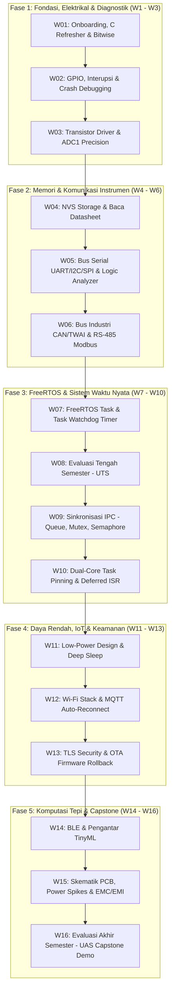

# ⚡ EE-304: Sistem Tertanam (Embedded Systems)
### Program Studi Sarjana (S1) Teknik Elektro

Selamat datang di repositori resmi perkuliahan **Sistem Tertanam (Embedded Systems)** berbasis **SoC ESP32 (Xtensa Dual-Core 32-bit)**. Repositori ini berfungsi sebagai pusat distribusi materi, panduan praktikum (jobsheet), starter code, serta dokumentasi teknis perkuliahan.

---

## 📌 Navigasi Cepat
* 📖 **[Silabus & Rencana Pembelajaran Semester (RPS) Lengkap](SILABUS_EMBEDDED_SYSTEM_ESP32.md)**
* 🛠️ **Platform:** ESP32-WROOM-32D / ESP32-S3
* 💻 **Toolchain:** Visual Studio Code + PlatformIO (C/C++ & ESP-IDF Native)
* 🎯 **Pendekatan:** *Hardware-Software Co-Design* & *Scaffolding* (Ramah Pemula $\to$ Standar Industri)

---

## 🗺️ Peta Jalur Pembelajaran (16 Minggu)



---

## 📂 Rencana Struktur Direktori Repositori

```text
├── docs/                               # Materi kuliah, slide, & lembar saku pin
│   └── esp32_pin_gotchas.md            # Panduan pin aman & pin terlarang
├── labs/                               # Panduan praktikum terpandu mingguan
│   ├── week-01-bitwise-c/              # Starter code & jobsheet W01
│   ├── week-02-gpio-debugging/         # Starter code & jobsheet W02
│   └── ...
├── projects/                           # Template & referensi Capstone Project
├── SILABUS_EMBEDDED_SYSTEM_ESP32.md    # Dokumen resmi RPS kurikulum
└── README.md                           # Beranda portal perkuliahan
```

---

## ⚠️ Pedoman Penting Mahasiswa (Golden Rules)
1. **Aturan Pin Analog:** Sensor analog **HANYA boleh dihubungkan ke ADC1 (GPIO 32–39)**. Sirkuit ADC2 nonaktif saat Wi-Fi menyala.
2. **Pin Terlarang:** GPIO 6 sampai 11 terhubung internal ke chip Flash SPI. Jangan dihubungkan ke kabel apa pun.
3. **Hardware Sanity Check:** Selalu ukur rel tegangan 3.3V dengan multimeter digital sebelum menyalahkan kode program.

---

## 👨‍🏫 Dosen Pengampu & Pengelola
* **Dosen Pengampu:** Anton Prafanto
* **Repositori Resmi:** [github.com/antonprafanto/embeddedsystem](https://github.com/antonprafanto/embeddedsystem)
