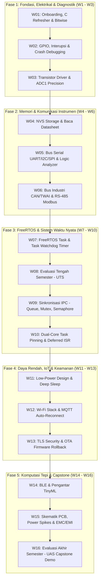

# ⚡ Sistem Tertanam (Embedded Systems)
### Program Studi Sarjana (S1) Teknik Elektro

Selamat datang di repositori resmi perkuliahan **Sistem Tertanam (Embedded Systems)** berbasis **SoC ESP32 (Xtensa Dual-Core 32-bit)**. Repositori ini berfungsi sebagai portal distribusi materi, panduan praktikum (jobsheet), starter code, serta dokumentasi teknis perkuliahan.

---

## 📌 Navigasi Cepat
* 📖 **[Silabus & Rencana Pembelajaran Semester (RPS) Lengkap](SILABUS_EMBEDDED_SYSTEM_ESP32.md)**
* 📌 **[Lembar Saku Pinout & Hardware Gotchas ESP32](docs/esp32_pin_gotchas.md)**
* 🛠️ **[Minggu 0: Panduan Onboarding & Driver Clinic](labs/week-00-onboarding/README.md)**
* 📝 **[Minggu 1: Fondasi Bahasa C & Manipulasi Bitwise](labs/week-01-bitwise-c/README.md)**
* 📝 **[Minggu 2: Elektrikal Pin, Interrupt & Crash Debugging](labs/week-02-gpio-interrupts/README.md)**
* 📝 **[Minggu 3: Interfacing Beban Daya (Transistor Driver) & Periferal Analog (ADC1 & PWM)](labs/week-03-transistor-adc-pwm/README.md)**
* 📝 **[Minggu 4: Penyimpanan Persisten (NVS & LittleFS) & Literasi Datasheet Komponen](labs/week-04-nvs-littlefs-datasheet/README.md)**
* 📝 **[Minggu 5: Protokol Komunikasi Serial (UART, I2C, SPI) & 8-Channel USB Logic Analyzer](labs/week-05-serial-protocols-logic-analyzer/README.md)**
* 📝 **[Minggu 6: Komunikasi Industri Jarak Jauh (CAN Bus / TWAI & RS-485 Modbus RTU)](labs/week-06-industrial-bus-can-rs485/README.md)**
* 📝 **[Minggu 7: Real-Time Operating Systems (FreeRTOS) Task Scheduling & Watchdog Timer (TWDT)](labs/week-07-freertos-task-watchdog/README.md)**
* 📝 **[Minggu 9: Komunikasi Antar-Task (IPC) & Sinkronisasi Aman (Queue, Mutex & Semaphore)](labs/week-09-freertos-ipc-queue-mutex/README.md)**
* 📝 **[Minggu 10: Pemrograman Dual-Core ESP32 & Deferred Interrupt Processing](labs/week-10-freertos-dualcore-isr/README.md)**
* 📝 **[Minggu 11: Desain Sistem Bertenaga Baterai (Low-Power Optimization & Deep Sleep)](labs/week-11-low-power-deep-sleep/README.md)**
* 💻 **Platform:** ESP32-WROOM-32D / ESP32-S3
* ⚙️ **Toolchain:** Visual Studio Code + PlatformIO (Hybrid: Arduino Core → Native FreeRTOS/ESP-IDF)

---

## 🗺️ Peta Jalur Pembelajaran (16 Minggu)



---

## 📂 Struktur Direktori Repositori

```text
├── docs/                                   # Dokumentasi pendukung & lembar saku
│   └── esp32_pin_gotchas.md                # Panduan pin aman & pin terlarang ESP32
├── labs/                                   # Panduan praktikum terpandu mingguan
│   ├── week-00-onboarding/                 # Panduan instalasi toolchain & driver USB
│   ├── week-01-bitwise-c/                  # Jobsheet & Starter code praktikum W01
│   │   ├── platformio.ini                  # Konfigurasi project PlatformIO
│   │   ├── README.md                       # Jobsheet modul lab
│   │   └── src/main.cpp                    # Template kode berjenjang (Level 1-3)
│   ├── week-02-gpio-interrupts/            # Jobsheet & Starter code praktikum W02
│   │   ├── platformio.ini                  # Konfigurasi exception decoder
│   │   ├── README.md                       # Jobsheet modul lab
│   │   └── src/main.cpp                    # Template kode interrupt & crash debugging
│   ├── week-03-transistor-adc-pwm/         # Jobsheet & Starter code praktikum W03
│   │   ├── platformio.ini                  # Konfigurasi project PlatformIO
│   │   ├── README.md                       # Jobsheet modul lab
│   │   ├── images/                         # Diagram rangkaian & visualisasi gelombang
│   │   └── src/main.cpp                    # Driver transistor, ADC1 multisampling & LEDC PWM
│   ├── week-04-nvs-littlefs-datasheet/     # Jobsheet & Starter code praktikum W04
│   │   ├── platformio.ini                  # Konfigurasi custom partitions & LittleFS
│   │   ├── partitions.csv                  # Skema tabel partisi flash 4MB
│   │   ├── README.md                       # Jobsheet modul lab
│   │   ├── data/config.json                # Aset statis berkas LittleFS
│   │   ├── images/                         # Peta partisi flash, hierarki memori & bedah datasheet
│   │   └── src/main.cpp                    # NVS Preferences, LittleFS file I/O & Interactive CLI
│   ├── week-05-serial-protocols-logic-analyzer/ # Jobsheet & Starter code praktikum W05
│   │   ├── platformio.ini                  # Konfigurasi project PlatformIO
│   │   ├── README.md                       # Jobsheet modul lab & panduan PulseView
│   │   ├── images/                         # Diagram perbandingan protokol, open-drain, SPI & wiring
│   │   └── src/main.cpp                    # I2C scanner, UART framed packets, SPI transaction & burst generator
│   ├── week-06-industrial-bus-can-rs485/       # Jobsheet & Starter code praktikum W06
│   │   ├── platformio.ini                  # Konfigurasi project PlatformIO
│   │   ├── README.md                       # Jobsheet modul lab & panduan PulseView CAN/Modbus
│   │   ├── images/                         # Diagram pensinyalan diferensial, TWAI, Modbus & wiring
│   │   └── src/main.cpp                    # Driver TWAI CAN, RS-485 Modbus RTU & Interactive CLI
│   ├── week-07-freertos-task-watchdog/         # Jobsheet & Starter code praktikum W07
│   │   ├── platformio.ini                  # Konfigurasi exception decoder & monitor
│   │   ├── README.md                       # Jobsheet modul lab & panduan FreeRTOS
│   │   ├── images/                         # Diagram Superloop vs RTOS, Lifecycle, TWDT, Stack & Dual-Core
│   │   └── src/main.cpp                    # Multi-tasking scheduler, High Water Mark & Watchdog CLI
│   ├── week-09-freertos-ipc-queue-mutex/       # Jobsheet & Starter code praktikum W09
│   │   ├── platformio.ini                  # Konfigurasi exception decoder & monitor
│   │   ├── README.md                       # Jobsheet modul lab & panduan FreeRTOS IPC
│   │   ├── images/                         # Diagram Race Condition, Queue FIFO, Mutex, Priority Inversion & Deadlock
│   ├── week-10-freertos-dualcore-isr/          # Jobsheet & Starter code praktikum W10
│   │   ├── platformio.ini                  # Konfigurasi exception decoder & monitor
│   │   ├── README.md                       # Jobsheet modul lab & panduan Dual-Core SMP
│   │   ├── images/                         # Diagram Arsitektur SMP, Task Pinning, Deferred ISR & Wiring
│   │   └── src/main.cpp                    # Dual-Core Task Pinning, Direct Task Notification & CLI
│   ├── week-11-low-power-deep-sleep/          # Jobsheet & Starter code praktikum W11
│   │   ├── platformio.ini                  # Konfigurasi exception decoder & monitor
│   │   ├── README.md                       # Jobsheet modul lab & optimasi daya baterai
│   │   ├── images/                         # Diagram profil daya, RTC memory, wake-up flow, math & wiring
│   │   └── src/main.cpp                    # 4 Power modes, RTC_DATA_ATTR, EXT0/Timer wake-up & CLI
│   └── ...
├── projects/                               # Template & spesifikasi Capstone Project
├── SILABUS_EMBEDDED_SYSTEM_ESP32.md        # Dokumen resmi RPS kurikulum (OBE)
└── README.md                               # Beranda portal perkuliahan
```

---

## ⚠️ Pedoman Penting Mahasiswa (Golden Rules)
1. **Aturan Pin Analog:** Sensor analog **HANYA boleh dihubungkan ke ADC1 (GPIO 32–39)**. Sirkuit ADC2 nonaktif saat radio Wi-Fi menyala.
2. **Pin Terlarang:** GPIO 6 sampai 11 terhubung internal ke chip Flash SPI. Jangan pernah dihubungkan ke kabel apa pun!
3. **Hardware Sanity Check:** Selalu ukur rel tegangan 3.3V dengan multimeter digital sebelum menyalahkan kode program Anda.

---

## 👨‍🏫 Dosen Pengampu & Pengelola
* **Dosen Pengampu:** Anton Prafanto
* **Repositori Resmi:** [github.com/antonprafanto/embeddedsystem](https://github.com/antonprafanto/embeddedsystem)
