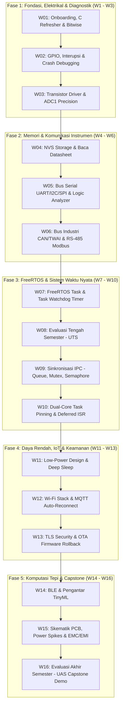

# ⚡ Sistem Tertanam (Embedded Systems)
### Program Studi Sarjana (S1) Teknik Elektro

Selamat datang di repositori resmi perkuliahan **Sistem Tertanam (Embedded Systems)** berbasis **SoC ESP32 (Xtensa Dual-Core 32-bit)**. Repositori ini berfungsi sebagai portal distribusi materi, panduan praktikum (jobsheet), starter code, serta dokumentasi teknis perkuliahan.

---

## 📌 Navigasi Cepat
* 📖 **[Silabus & Rencana Pembelajaran Semester (RPS) Lengkap](SILABUS_EMBEDDED_SYSTEM_ESP32.md)**
* 📌 **[Lembar Saku Pinout & Hardware Gotchas ESP32](docs/esp32_pin_gotchas.md)**
* 🛠️ **[Minggu 0: Panduan Onboarding & Driver Clinic](labs/week-00-onboarding/README.md)**
* 📝 **[Minggu 1: Fondasi Bahasa C & Manipulasi Bitwise](labs/week-01-bitwise-c/README.md)**
* 💻 **Platform:** ESP32-WROOM-32D / ESP32-S3
* ⚙️ **Toolchain:** Visual Studio Code + PlatformIO (Hybrid: Arduino Core → Native FreeRTOS/ESP-IDF)

---

## 🗺️ Peta Jalur Pembelajaran (16 Minggu)



---

## 📂 Struktur Direktori Repositori

```text
├── docs/                                   # Dokumentasi pendukung & lembar saku
│   └── esp32_pin_gotchas.md                # Panduan pin aman & pin terlarang ESP32
├── labs/                                   # Panduan praktikum terpandu mingguan
│   ├── week-00-onboarding/                 # Panduan instalasi toolchain & driver USB
│   ├── week-01-bitwise-c/                  # Jobsheet & Starter code praktikum W01
│   │   ├── platformio.ini                  # Konfigurasi project PlatformIO
│   │   ├── README.md                       # Jobsheet modul lab
│   │   └── src/main.cpp                    # Template kode berjenjang (Level 1-3)
│   └── ...
├── projects/                               # Template & spesifikasi Capstone Project
├── SILABUS_EMBEDDED_SYSTEM_ESP32.md        # Dokumen resmi RPS kurikulum (OBE)
└── README.md                               # Beranda portal perkuliahan
```

---

## ⚠️ Pedoman Penting Mahasiswa (Golden Rules)
1. **Aturan Pin Analog:** Sensor analog **HANYA boleh dihubungkan ke ADC1 (GPIO 32–39)**. Sirkuit ADC2 nonaktif saat radio Wi-Fi menyala.
2. **Pin Terlarang:** GPIO 6 sampai 11 terhubung internal ke chip Flash SPI. Jangan pernah dihubungkan ke kabel apa pun!
3. **Hardware Sanity Check:** Selalu ukur rel tegangan 3.3V dengan multimeter digital sebelum menyalahkan kode program Anda.

---

## 👨‍🏫 Dosen Pengampu & Pengelola
* **Dosen Pengampu:** Anton Prafanto
* **Repositori Resmi:** [github.com/antonprafanto/embeddedsystem](https://github.com/antonprafanto/embeddedsystem)
