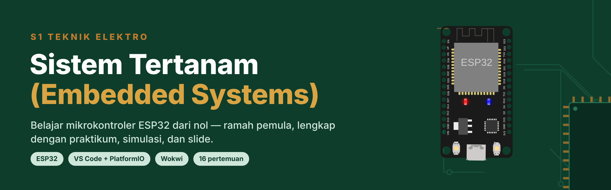
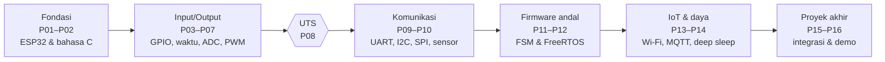

<p align="center"></p>

# Sistem Tertanam (Embedded Systems)

Selamat datang di materi kuliah **Sistem Tertanam** untuk mahasiswa **S1 Teknik Elektro**. Di sini kamu akan belajar memprogram mikrokontroler **ESP32** dari nol: menyalakan LED, membaca tombol dan sensor, berkomunikasi dengan modul lain, menjalankan beberapa tugas sekaligus, sampai mengirim data ke internet. Semua materi ditulis untuk pemula, lengkap dengan gambar, kode siap pakai, simulasi, dan slide yang bisa diunduh.

| | |
| --- | --- |
| 👨‍🏫 **Dosen pengampu** | Anton Prafanto |
| 🔌 **Board** | ESP32 DevKit V1 (30 pin) — board 38 pin juga bisa |
| 🛠️ **Alat** | Visual Studio Code + PlatformIO (Arduino-ESP32 versi 3.3) |
| 🖥️ **Simulator** | [Wokwi](https://wokwi.com) — gratis, di peramban |
| 📅 **Jumlah pertemuan** | 16 (14 materi + UTS + UAS) |

---

## 🚀 Mulai dari Sini

Baru pertama kali? Ikuti urutan ini:

1. 📖 [**Mulai di Sini**](panduan/01-mulai-di-sini.md) — cara memakai repositori ini (5 menit).
2. 🛠️ [**Instalasi Alat**](panduan/02-instalasi-alat.md) — pasang VS Code, PlatformIO, Git, dan *driver* USB. **Kerjakan sebelum Pertemuan 1.**
3. 🖥️ [**Simulasi dengan Wokwi**](panduan/03-simulasi-wokwi.md) — praktik tanpa board.
4. 🧪 [**Pertemuan 1**](pertemuan-01-pengenalan/README.md) — program pertamamu.

Panduan pendukung: [Daftar Komponen](panduan/04-daftar-komponen.md) · [Lembar Saku Pinout ESP32](panduan/05-pinout-esp32.md) · [Mengatasi Masalah](panduan/06-mengatasi-masalah.md) · [Glosarium](panduan/07-glosarium.md) · [Rencana Pembelajaran Semester](RPS.md) · [Proyek Akhir](proyek-akhir/README.md)

---

## 🗺️ Peta 16 Pertemuan

| No | Topik | Modul | Modul PDF | Slide | Slide PDF | Slide PPTX |
| :---: | --- | :---: | :---: | :---: | :---: | :---: |
| 01 | Mengenal Sistem Tertanam, ESP32, dan Alat Kerja | [Baca](pertemuan-01-pengenalan/README.md) | [Unduh](https://raw.githubusercontent.com/antonprafanto/embeddedsystem/main/modul-pdf/Modul-P01-Pengenalan-Sistem-Tertanam.pdf) | [Lihat](https://view.officeapps.live.com/op/view.aspx?src=https%3A%2F%2Fraw.githubusercontent.com%2Fantonprafanto%2Fembeddedsystem%2Fmain%2Fslide%2Fpptx%2FP01-Pengenalan-Sistem-Tertanam.pptx) | [Unduh](https://raw.githubusercontent.com/antonprafanto/embeddedsystem/main/slide/pdf/P01-Pengenalan-Sistem-Tertanam.pdf) | [Unduh](https://raw.githubusercontent.com/antonprafanto/embeddedsystem/main/slide/pptx/P01-Pengenalan-Sistem-Tertanam.pptx) |
| 02 | Dasar Pemrograman C/C++ untuk Mikrokontroler | [Baca](pertemuan-02-dasar-pemrograman/README.md) | [Unduh](https://raw.githubusercontent.com/antonprafanto/embeddedsystem/main/modul-pdf/Modul-P02-Dasar-Pemrograman-C.pdf) | [Lihat](https://view.officeapps.live.com/op/view.aspx?src=https%3A%2F%2Fraw.githubusercontent.com%2Fantonprafanto%2Fembeddedsystem%2Fmain%2Fslide%2Fpptx%2FP02-Dasar-Pemrograman-C.pptx) | [Unduh](https://raw.githubusercontent.com/antonprafanto/embeddedsystem/main/slide/pdf/P02-Dasar-Pemrograman-C.pdf) | [Unduh](https://raw.githubusercontent.com/antonprafanto/embeddedsystem/main/slide/pptx/P02-Dasar-Pemrograman-C.pptx) |
| 03 | GPIO Output: Mengendalikan LED | [Baca](pertemuan-03-gpio-output/README.md) | [Unduh](https://raw.githubusercontent.com/antonprafanto/embeddedsystem/main/modul-pdf/Modul-P03-GPIO-Output.pdf) | [Lihat](https://view.officeapps.live.com/op/view.aspx?src=https%3A%2F%2Fraw.githubusercontent.com%2Fantonprafanto%2Fembeddedsystem%2Fmain%2Fslide%2Fpptx%2FP03-GPIO-Output.pptx) | [Unduh](https://raw.githubusercontent.com/antonprafanto/embeddedsystem/main/slide/pdf/P03-GPIO-Output.pdf) | [Unduh](https://raw.githubusercontent.com/antonprafanto/embeddedsystem/main/slide/pptx/P03-GPIO-Output.pptx) |
| 04 | GPIO Input: Membaca Tombol | [Baca](pertemuan-04-gpio-input/README.md) | [Unduh](https://raw.githubusercontent.com/antonprafanto/embeddedsystem/main/modul-pdf/Modul-P04-GPIO-Input.pdf) | [Lihat](https://view.officeapps.live.com/op/view.aspx?src=https%3A%2F%2Fraw.githubusercontent.com%2Fantonprafanto%2Fembeddedsystem%2Fmain%2Fslide%2Fpptx%2FP04-GPIO-Input.pptx) | [Unduh](https://raw.githubusercontent.com/antonprafanto/embeddedsystem/main/slide/pdf/P04-GPIO-Input.pdf) | [Unduh](https://raw.githubusercontent.com/antonprafanto/embeddedsystem/main/slide/pptx/P04-GPIO-Input.pptx) |
| 05 | Waktu dan Interupsi | [Baca](pertemuan-05-waktu-interupsi/README.md) | [Unduh](https://raw.githubusercontent.com/antonprafanto/embeddedsystem/main/modul-pdf/Modul-P05-Waktu-dan-Interupsi.pdf) | [Lihat](https://view.officeapps.live.com/op/view.aspx?src=https%3A%2F%2Fraw.githubusercontent.com%2Fantonprafanto%2Fembeddedsystem%2Fmain%2Fslide%2Fpptx%2FP05-Waktu-dan-Interupsi.pptx) | [Unduh](https://raw.githubusercontent.com/antonprafanto/embeddedsystem/main/slide/pdf/P05-Waktu-dan-Interupsi.pdf) | [Unduh](https://raw.githubusercontent.com/antonprafanto/embeddedsystem/main/slide/pptx/P05-Waktu-dan-Interupsi.pptx) |
| 06 | Input Analog: ADC | [Baca](pertemuan-06-adc/README.md) | [Unduh](https://raw.githubusercontent.com/antonprafanto/embeddedsystem/main/modul-pdf/Modul-P06-Input-Analog-ADC.pdf) | [Lihat](https://view.officeapps.live.com/op/view.aspx?src=https%3A%2F%2Fraw.githubusercontent.com%2Fantonprafanto%2Fembeddedsystem%2Fmain%2Fslide%2Fpptx%2FP06-Input-Analog-ADC.pptx) | [Unduh](https://raw.githubusercontent.com/antonprafanto/embeddedsystem/main/slide/pdf/P06-Input-Analog-ADC.pdf) | [Unduh](https://raw.githubusercontent.com/antonprafanto/embeddedsystem/main/slide/pptx/P06-Input-Analog-ADC.pptx) |
| 07 | PWM dan Mengendalikan Beban | [Baca](pertemuan-07-pwm-beban/README.md) | [Unduh](https://raw.githubusercontent.com/antonprafanto/embeddedsystem/main/modul-pdf/Modul-P07-PWM-dan-Beban.pdf) | [Lihat](https://view.officeapps.live.com/op/view.aspx?src=https%3A%2F%2Fraw.githubusercontent.com%2Fantonprafanto%2Fembeddedsystem%2Fmain%2Fslide%2Fpptx%2FP07-PWM-dan-Beban.pptx) | [Unduh](https://raw.githubusercontent.com/antonprafanto/embeddedsystem/main/slide/pdf/P07-PWM-dan-Beban.pdf) | [Unduh](https://raw.githubusercontent.com/antonprafanto/embeddedsystem/main/slide/pptx/P07-PWM-dan-Beban.pptx) |
| 08 | **Ujian Tengah Semester (UTS)** | [Baca](pertemuan-08-uts/README.md) | [Unduh](https://raw.githubusercontent.com/antonprafanto/embeddedsystem/main/modul-pdf/Modul-P08-UTS.pdf) | [Lihat](https://view.officeapps.live.com/op/view.aspx?src=https%3A%2F%2Fraw.githubusercontent.com%2Fantonprafanto%2Fembeddedsystem%2Fmain%2Fslide%2Fpptx%2FP08-UTS.pptx) | [Unduh](https://raw.githubusercontent.com/antonprafanto/embeddedsystem/main/slide/pdf/P08-UTS.pdf) | [Unduh](https://raw.githubusercontent.com/antonprafanto/embeddedsystem/main/slide/pptx/P08-UTS.pptx) |
| 09 | Komunikasi Serial: UART, I2C, dan SPI | [Baca](pertemuan-09-komunikasi-serial/README.md) | [Unduh](https://raw.githubusercontent.com/antonprafanto/embeddedsystem/main/modul-pdf/Modul-P09-Komunikasi-Serial.pdf) | [Lihat](https://view.officeapps.live.com/op/view.aspx?src=https%3A%2F%2Fraw.githubusercontent.com%2Fantonprafanto%2Fembeddedsystem%2Fmain%2Fslide%2Fpptx%2FP09-Komunikasi-Serial.pptx) | [Unduh](https://raw.githubusercontent.com/antonprafanto/embeddedsystem/main/slide/pdf/P09-Komunikasi-Serial.pdf) | [Unduh](https://raw.githubusercontent.com/antonprafanto/embeddedsystem/main/slide/pptx/P09-Komunikasi-Serial.pptx) |
| 10 | Sensor, Aktuator, *Library*, dan *Datasheet* | [Baca](pertemuan-10-sensor-aktuator/README.md) | [Unduh](https://raw.githubusercontent.com/antonprafanto/embeddedsystem/main/modul-pdf/Modul-P10-Sensor-Aktuator-Datasheet.pdf) | [Lihat](https://view.officeapps.live.com/op/view.aspx?src=https%3A%2F%2Fraw.githubusercontent.com%2Fantonprafanto%2Fembeddedsystem%2Fmain%2Fslide%2Fpptx%2FP10-Sensor-Aktuator-Datasheet.pptx) | [Unduh](https://raw.githubusercontent.com/antonprafanto/embeddedsystem/main/slide/pdf/P10-Sensor-Aktuator-Datasheet.pdf) | [Unduh](https://raw.githubusercontent.com/antonprafanto/embeddedsystem/main/slide/pptx/P10-Sensor-Aktuator-Datasheet.pptx) |
| 11 | Merancang *Firmware* Rapi: FSM dan *Debugging* | [Baca](pertemuan-11-fsm-debugging/README.md) | [Unduh](https://raw.githubusercontent.com/antonprafanto/embeddedsystem/main/modul-pdf/Modul-P11-FSM-dan-Debugging.pdf) | [Lihat](https://view.officeapps.live.com/op/view.aspx?src=https%3A%2F%2Fraw.githubusercontent.com%2Fantonprafanto%2Fembeddedsystem%2Fmain%2Fslide%2Fpptx%2FP11-FSM-dan-Debugging.pptx) | [Unduh](https://raw.githubusercontent.com/antonprafanto/embeddedsystem/main/slide/pdf/P11-FSM-dan-Debugging.pdf) | [Unduh](https://raw.githubusercontent.com/antonprafanto/embeddedsystem/main/slide/pptx/P11-FSM-dan-Debugging.pptx) |
| 12 | *Multitasking* dengan FreeRTOS | [Baca](pertemuan-12-freertos/README.md) | [Unduh](https://raw.githubusercontent.com/antonprafanto/embeddedsystem/main/modul-pdf/Modul-P12-FreeRTOS.pdf) | [Lihat](https://view.officeapps.live.com/op/view.aspx?src=https%3A%2F%2Fraw.githubusercontent.com%2Fantonprafanto%2Fembeddedsystem%2Fmain%2Fslide%2Fpptx%2FP12-FreeRTOS.pptx) | [Unduh](https://raw.githubusercontent.com/antonprafanto/embeddedsystem/main/slide/pdf/P12-FreeRTOS.pdf) | [Unduh](https://raw.githubusercontent.com/antonprafanto/embeddedsystem/main/slide/pptx/P12-FreeRTOS.pptx) |
| 13 | IoT: Wi-Fi dan MQTT | [Baca](pertemuan-13-wifi-mqtt/README.md) | [Unduh](https://raw.githubusercontent.com/antonprafanto/embeddedsystem/main/modul-pdf/Modul-P13-WiFi-dan-MQTT.pdf) | [Lihat](https://view.officeapps.live.com/op/view.aspx?src=https%3A%2F%2Fraw.githubusercontent.com%2Fantonprafanto%2Fembeddedsystem%2Fmain%2Fslide%2Fpptx%2FP13-WiFi-dan-MQTT.pptx) | [Unduh](https://raw.githubusercontent.com/antonprafanto/embeddedsystem/main/slide/pdf/P13-WiFi-dan-MQTT.pdf) | [Unduh](https://raw.githubusercontent.com/antonprafanto/embeddedsystem/main/slide/pptx/P13-WiFi-dan-MQTT.pptx) |
| 14 | Hemat Daya dan Keandalan Sistem | [Baca](pertemuan-14-daya-keandalan/README.md) | [Unduh](https://raw.githubusercontent.com/antonprafanto/embeddedsystem/main/modul-pdf/Modul-P14-Hemat-Daya-Keandalan.pdf) | [Lihat](https://view.officeapps.live.com/op/view.aspx?src=https%3A%2F%2Fraw.githubusercontent.com%2Fantonprafanto%2Fembeddedsystem%2Fmain%2Fslide%2Fpptx%2FP14-Hemat-Daya-Keandalan.pptx) | [Unduh](https://raw.githubusercontent.com/antonprafanto/embeddedsystem/main/slide/pdf/P14-Hemat-Daya-Keandalan.pdf) | [Unduh](https://raw.githubusercontent.com/antonprafanto/embeddedsystem/main/slide/pptx/P14-Hemat-Daya-Keandalan.pptx) |
| 15 | Integrasi Sistem dan Persiapan Proyek Akhir | [Baca](pertemuan-15-integrasi-sistem/README.md) | [Unduh](https://raw.githubusercontent.com/antonprafanto/embeddedsystem/main/modul-pdf/Modul-P15-Integrasi-Sistem.pdf) | [Lihat](https://view.officeapps.live.com/op/view.aspx?src=https%3A%2F%2Fraw.githubusercontent.com%2Fantonprafanto%2Fembeddedsystem%2Fmain%2Fslide%2Fpptx%2FP15-Integrasi-Sistem.pptx) | [Unduh](https://raw.githubusercontent.com/antonprafanto/embeddedsystem/main/slide/pdf/P15-Integrasi-Sistem.pdf) | [Unduh](https://raw.githubusercontent.com/antonprafanto/embeddedsystem/main/slide/pptx/P15-Integrasi-Sistem.pptx) |
| 16 | **Ujian Akhir Semester (UAS)**: Demo dan Presentasi Proyek | [Baca](pertemuan-16-uas/README.md) | [Unduh](https://raw.githubusercontent.com/antonprafanto/embeddedsystem/main/modul-pdf/Modul-P16-UAS-Proyek-Akhir.pdf) | [Lihat](https://view.officeapps.live.com/op/view.aspx?src=https%3A%2F%2Fraw.githubusercontent.com%2Fantonprafanto%2Fembeddedsystem%2Fmain%2Fslide%2Fpptx%2FP16-UAS-Proyek-Akhir.pptx) | [Unduh](https://raw.githubusercontent.com/antonprafanto/embeddedsystem/main/slide/pdf/P16-UAS-Proyek-Akhir.pdf) | [Unduh](https://raw.githubusercontent.com/antonprafanto/embeddedsystem/main/slide/pptx/P16-UAS-Proyek-Akhir.pptx) |

> [!TIP]
> **Cara memakai tabel:** **Baca** membuka modul langsung di GitHub. **Lihat** membuka slide di peramban (PowerPoint Online) tanpa mengunduh. Semua tautan **Unduh** langsung menyimpan berkas ke perangkatmu; modul versi PDF cocok untuk dibaca luring atau dicetak. Untuk mengunduh **semua materi sekaligus**, klik tombol hijau **Code** → **Download ZIP** di halaman utama repositori ini.

---

## 🧭 Alur Belajar Semester Ini


```mermaid
flowchart LR
    A["Fondasi<br/>P01–P02<br/>ESP32 & bahasa C"] --> B["Input/Output<br/>P03–P07<br/>GPIO, waktu, ADC, PWM"]
    B --> C{{"UTS<br/>P08"}}
    C --> D["Komunikasi<br/>P09–P10<br/>UART, I2C, SPI, sensor"]
    D --> E["Firmware andal<br/>P11–P12<br/>FSM & FreeRTOS"]
    E --> F["IoT & daya<br/>P13–P14<br/>Wi-Fi, MQTT, deep sleep"]
    F --> G["Proyek akhir<br/>P15–P16<br/>integrasi & demo"]
```

---

## 📂 Isi Repositori

```text
├── panduan/            ← instalasi, Wokwi, komponen, pinout, mengatasi masalah, glosarium
├── pertemuan-NN-.../   ← modul (README.md), gambar/, dan kode/ praktikum per pertemuan
├── proyek-akhir/       ← ketentuan, ide, dan rubrik proyek akhir
├── slide/pdf/          ← slide PDF untuk diunduh
├── slide/pptx/         ← slide PowerPoint
├── modul-pdf/          ← versi PDF setiap modul (untuk dibaca luring/dicetak)
├── RPS.md              ← rencana pembelajaran semester
└── KREDIT-GAMBAR.md    ← sumber dan lisensi gambar dari pihak lain
```

Setiap *folder* di dalam `kode/` adalah satu proyek PlatformIO yang bisa langsung dibuka di VS Code, dan juga berisi `diagram.json` untuk simulator Wokwi.

---

## 🤝 Aturan Main

- **Pahami, bukan sekadar menyalin.** Saat praktikum kamu bisa diminta mengubah kode dan menjelaskan alasannya.
- **Catat galat dan solusinya.** Kebiasaan ini membuatmu cepat mahir.
- Menemukan salah ketik atau tautan rusak? Laporkan ke dosen/asisten atau buka *Issue* di repositori ini.

## 🖼️ Kredit

Sebagian gambar memakai karya pihak lain berlisensi terbuka (Espressif, Arduino, Wokwi, dan lainnya). Daftar lengkapnya ada di [KREDIT-GAMBAR.md](KREDIT-GAMBAR.md).
