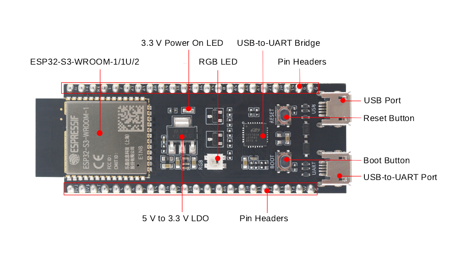
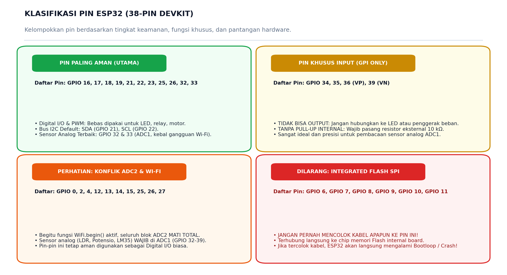
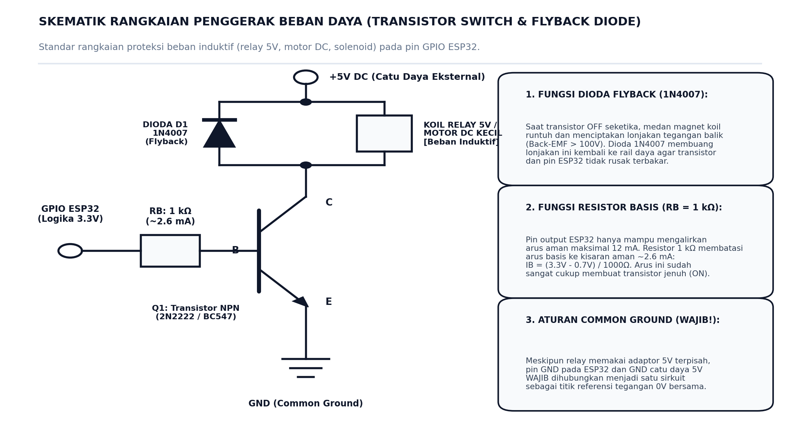

# 📌 LEMBAR SAKU PIN ESP32 (PINOUT & HARDWARE GOTCHAS)
### Panduan Praktis & Keselamatan Hardware untuk Mahasiswa S1 Teknik Elektro

> **Target Pengguna:** Mahasiswa S1 Teknik Elektro (Tingkat Pemula / Awam)  
> **Tujuan Modul:** Mencegah kerusakan mikrokontroler, menghindari kebingungan saat coding, dan memahami batasan elektrikal chip ESP32.  
> **Status:** Wajib Disimpan & Dijadikan Rujukan Selama Praktikum / Pengerjaan Proyek

---

Halo rekan-rekan mahasiswa! 👋  
Di dunia nyata teknik elektro, mikrokontroler bukanlah komponen yang "kebal segalanya". ESP32 adalah *System on Chip* (SoC) 32-bit yang sangat bertenaga, namun memiliki sejumlah **aturan elektrikal dan keunikan internal (*hardware quirks/gotchas*)** yang wajib dipahami.

> [!CAUTION]
> **Fakta Lapangan:** Sekitar 80% mikrokontroler yang rusak terbakar atau program yang mendadak *restart/bootloop* di laboratorium disebabkan oleh salah memilih pin fisik atau menghubungkan beban daya tanpa proteksi. 

Simak panduan saku ini agar eksperimen Anda selalu aman, lancar, dan bebas dari kepanikan!

---

## 🔍 1. TATA LETAK FISIK & ANATOMI BOARD RESMI ESPRESSIF

Berikut adalah referensi tata letak komponen resmi dan header pin ESP32 DevKit langsung dari dokumentasi pabrikan Espressif:

  
*Gambar 1: Tata letak fisik, port pemrograman USB, tombol BOOT/RESET, dan header pin pada board DevKit resmi. Sumber gambar: [Espressif Systems Official Documentation](https://docs.espressif.com/projects/esp-dev-kits/en/latest/esp32s3/esp32-s3-devkitc-1/index.html).*

---

## 🗺️ 2. PETA KLASIFIKASI PIN ESP32 (ATURAN EMAS)

Sebelum mencolokkan kabel *jumper* ke *breadboard*, perhatikan peta pembagian 4 kelompok pin berikut:



---

## 📊 3. TABEL DIAGNOSTIK PIN SECARA LENGKAP (38-PIN DEVKIT)

Gunakan tabel ini sebagai kamus rujukan cepat setiap kali Anda merancang rangkaian:

| Nomor GPIO | Fungsi Khusus | Status Keamanan | Rekomendasi Penggunaan & Solusi Enjiniring |
| :---: | :---: | :---: | :--- |
| **GPIO 0** | Strapping (BOOT) | ⚠️ Perlu Hati-Hati | Terhubung ke tombol fisik BOOT. Wajib bernilai *HIGH* saat boot normal. Jangan ditarik permanen ke *GND*. |
| **GPIO 1** | UART0 TXD | ⚠️ Khusus Pemrograman | Jalur transmisi serial ke laptop. Jangan dihubungkan ke sensor/aktuator agar proses *upload* tidak macet. |
| **GPIO 2** | Strapping / LED Biru | ⚠️ Perlu Hati-Hati | Terhubung ke LED *onboard*. Harus bernilai *LOW* saat proses flashing firmware baru. |
| **GPIO 3** | UART0 RXD | ⚠️ Khusus Pemrograman | Jalur penerima serial dari laptop. Jangan gunakan untuk pin I/O umum. |
| **GPIO 4** | ADC2_CH0 / Touch 0 | ⚠️ Konflik Wi-Fi | Aman untuk Digital I/O. **Hindari untuk sensor analog jika fitur Wi-Fi aktif!** |
| **GPIO 5** | VSPI CS / Strapping | 🟢 **Aman Digunakan** | Pin *Chip Select* default untuk jalur komunikasi SPI (misal: Display TFT atau SD Card). |
| **GPIO 6 – 11** | Integrated SPI Flash | ⛔ **TABU / DILARANG** | **JANGAN PERNAH MENCOLOK KABEL KE PIN INI!** Terhubung langsung ke chip Flash internal. ESP32 akan langsung *bootloop/crash*. |
| **GPIO 12** | MTDI / Strapping | ⚠️ Perlu Hati-Hati | Menentukan tegangan Flash internal ($1.8\text{V}$ vs $3.3\text{V}$). Jika ditarik *HIGH* saat booting, ESP32 gagal menyala. |
| **GPIO 13** | ADC2_CH4 / HSPI ID | ⚠️ Konflik Wi-Fi | Aman untuk Digital I/O. Jangan gunakan untuk ADC saat Wi-Fi menyala. |
| **GPIO 14** | ADC2_CH6 / HSPI CLK | ⚠️ Konflik Wi-Fi | Aman untuk Digital I/O / Clock SPI. Jangan gunakan untuk ADC saat Wi-Fi menyala. |
| **GPIO 15** | Strapping / HSPI CMD| ⚠️ Perlu Hati-Hati | Mengeluarkan sinyal debug saat booting. Biarkan mengambang (*floating*) atau tarik *HIGH*. |
| **GPIO 16 – 17**| UART2 (TX2 / RX2) | 🟢 **Sangat Direkomendasikan** | Pin ideal untuk komunikasi serial eksternal (Modbus RS-485 industri, GPS, atau Bluetooth eksternal). |
| **GPIO 18** | VSPI SCK | 🟢 **Sangat Direkomendasikan** | Pin Clock default untuk bus komunikasi SPI berkecepatan tinggi. |
| **GPIO 19** | VSPI MISO | 🟢 **Sangat Direkomendasikan** | Jalur input data SPI (Master In Slave Out). |
| **GPIO 21** | I2C SDA | 🟢 **Sangat Direkomendasikan** | Jalur Data default bus I2C (Sensor suhu BME280, MPU6050, Display OLED). |
| **GPIO 22** | I2C SCL | 🟢 **Sangat Direkomendasikan** | Jalur Clock default bus I2C. |
| **GPIO 23** | VSPI MOSI | 🟢 **Sangat Direkomendasikan** | Jalur output data SPI (Master Out Slave In). |
| **GPIO 25 – 26**| DAC1 & DAC2 | 🟢 **Sangat Direkomendasikan** | *Digital-to-Analog Converter* murni 8-bit. Mampu menghasilkan gelombang sinus/audio analog asli. |
| **GPIO 27** | ADC2_CH7 / Touch 7 | ⚠️ Konflik Wi-Fi | Aman untuk Digital I/O. Jangan gunakan untuk sensor analog saat Wi-Fi menyala. |
| **GPIO 32 – 33**| **ADC1_CH4 & CH5** | 🟢 **Pin Sensor Terbaik** | **Pilihan Utama Sensor Analog.** Sirkuit ADC1 mandiri dan kebal dari gangguan radio Wi-Fi. |
| **GPIO 34 – 35**| **ADC1_CH6 & CH7** | 🟡 **Khusus Input Saja** | **HANYA BISA INPUT.** Tidak punya sirkuit output, tidak ada *pull-up* internal. Sangat bagus untuk sensor analog. |
| **GPIO 36 (VP)**| **ADC1_CH0** | 🟡 **Khusus Input Saja** | Pin input analog presisi tinggi dengan derau (*noise*) paling rendah (*Low Noise Amplifier*). |
| **GPIO 39 (VN)**| **ADC1_CH3** | 🟡 **Khusus Input Saja** | Pin input analog presisi tinggi pendamping GPIO 36. |

---

## ⚡ 4. DUA JEBAKAN HARDWARE PALING SERING MEMBINGUNGKAN MAHASISWA

### 🛑 Jebakan #1: Mengapa ADC2 Mati Saat Wi-Fi Menyala?

Di dalam silikon chip ESP32 terdapat dua blok konverter analog-ke-digital:
* **Blok ADC1 (GPIO 32, 33, 34, 35, 36, 39):** Memiliki sirkuit pengukur mandiri.
* **Blok ADC2 (GPIO 0, 2, 4, 12, 13, 14, 15, 25, 26, 27):** Jalur internalnya digunakan bergantian (*shared bus*) dengan modul radio frekuensi Wi-Fi.

> [!WARNING]
> Begitu perintah `WiFi.begin()` dijalankan, kontrol hardware atas sirkuit ADC2 diambil alih penuh oleh driver radio Wi-Fi. Jika Anda mencoba membaca sensor analog di pin ADC2 saat Wi-Fi aktif, fungsi `analogRead()` akan mengembalikan angka kacau atau `0`!  
> **Kaidah Tetap:** Seluruh sensor analog (LDR, sensor suhu analog, potensiometer, sensor arus) **WAJIB dipasang pada ADC1 (GPIO 32–39)**.

---

### 🛑 Jebakan #2: Pin Input-Only (GPI) Tanpa Resistor Pull-Up

GPIO 34, 35, 36, dan 39 adalah pin **General Purpose Input (GPI)**, bukan **GPIO**.
1. **Tidak Bisa Mengeluarkan Tegangan (No Output):** Jika Anda memanggil `digitalWrite(34, HIGH);`, tidak akan terjadi apa-apa karena tidak ada transistor penggerak output di pin ini.
2. **Tidak Memiliki Resistor Pull-Up/Down Internal:** Perintah `pinMode(34, INPUT_PULLUP);` tidak akan berfungsi. Nilai pin akan mengambang bebas (*floating*) dan menangkap derau listrik acak jika tombol tidak ditekan.
3. **Solusi:** Wajib memasang **resistor fisik eksternal $10\text{ k}\Omega$** di breadboard ke jalur $3.3\text{V}$ (Pull-Up) atau ke *GND* (Pull-Down).

---

## 🔌 5. BATASAN ELEKTRIKAL & RANGKAIAN PROTEKSI BEBAN INDUKTIF

Mahasiswa Teknik Elektro wajib memahami batasan fisik semikonduktor:
* **Tegangan Operasional:** $3.3\text{ Volt}$. Jangan pernah menghubungkan output sensor $5\text{V}$ secara langsung ke pin ESP32 tanpa *Logic Level Shifter* atau rangkaian pembagi tegangan (*voltage divider*).
* **Arus Maksimum per Pin:** $12\text{ mA}$ (batas aman). Pin ESP32 **TIDAK MAMPU** menyalakan koil relay, motor DC, atau solenoid secara langsung!

Untuk menyalakan beban induktif dengan aman, gunakan standar skematik berikut:



### 💡 Mengapa Butuh Dioda Flyback (1N4007)?
Ketika saklar transistor dimatikan seketika, medan magnet yang tersimpan pada koil relay runtuh secara mendadak. Peristiwa ini memicu lonjakan tegangan induksi balik (*Back-Electromotive Force / Back-EMF*) yang bisa melonjak hingga **di atas $100\text{ Volt}$**! Dioda 1N4007 yang dipasang antiparalel akan mengalirkan lonjakan tegangan ini kembali ke sumber daya, sehingga transistor dan chip ESP32 Anda terlindungi 100%.

---

## 🛠️ 6. PRAKTIK MANDIRI: CARA MENGUJI PIN SECARA AMAN DENGAN PLATFORMIO

Bagaimana cara mahasiswa awam menguji dan membuktikan aturan pin di atas secara mandiri? Ikuti langkah praktikum cepat berikut:

### Alat yang Perlu Dibuka:
1. Buka aplikasi **Visual Studio Code**.
2. Pastikan ekstensi **PlatformIO IDE** sudah aktif (ikon kepala semut di bilah sisi kiri).
3. Buat proyek baru atau buka proyek `labs/week-01-bitwise-c`.

---

### Eksperimen 1: Uji Pembacaan Analog yang Aman pada ADC1 (GPIO 32)
Ganti file `src/main.cpp` dengan kode verifikasi berikut:

```cpp
/**
 * UJI MANDIRI PIN: Membaca Tegangan Analog pada ADC1 (GPIO 32)
 * Hubungkan kaki tengah potensiometer ke GPIO 32,
 * kaki kiri ke GND, dan kaki kanan ke 3V3.
 */

#include <Arduino.h>

const int POT_PIN = 32; // Menggunakan ADC1_CH4 (Kebal dari gangguan Wi-Fi)

void setup() {
  Serial.begin(115200);
  delay(1000);
  Serial.println("--- PENGUJIAN ADC1 PRESISI (GPIO 32) DIMULAI ---");
}

void loop() {
  // Membaca nilai ADC mentah (resolusi 12-bit: 0 hingga 4095)
  int raw_adc = analogRead(POT_PIN);

  // Mengonversi nilai biner mentah ke estimasi tegangan fisik (0.0V - 3.3V)
  float voltage = (raw_adc / 4095.0) * 3.3;

  Serial.print("[Sensor ADC1 - GPIO 32] Nilai Biner: ");
  Serial.print(raw_adc);
  Serial.print(" | Estimasi Tegangan: ");
  Serial.print(voltage, 2);
  Serial.println(" Volt");

  delay(500);
}
```

#### Cara Menjalankan & Memverifikasi:
1. Hubungkan ESP32 ke laptop.
2. Di bilah status bawah VS Code: Klik tombol **Upload (`→`)**.
3. Setelah sukses, klik tombol **Serial Monitor (`🔌`)**.
4. Putar potensiometer Anda: Nilai biner akan berubah mulus dari `0` hingga `4095`, dan tegangan akan terbaca dari `0.00V` hingga `3.30V`.

---

## ✅ 7. CHECKLIST 5 DETIK SEBELUM MENCOLOKKAN KABEL

Sebelum menyalakan sumber daya listrik pada rangkaian Anda, lakukan pengecekan cepat ini:
* [ ] **Apakah sensor analog terpasang di ADC1 (GPIO 32–39)?** (Bukan di ADC2!).
* [ ] **Apakah pin GPIO 6–11 benar-benar kosong tanpa kabel apa pun?**
* [ ] **Jika menggunakan tombol di GPIO 34–39, apakah sudah dipasang resistor pull-up eksternal $10\text{ k}\Omega$?**
* [ ] **Apakah GND catu daya eksternal sudah dihubungkan ke GND ESP32 (*Common Ground*)?**
* [ ] **Jika mengendalikan relay/motor, apakah dioda 1N4007 sudah terpasang terbalik (katoda garis putih ke kutub positif $+5\text{V}$)?**

Jika kelima kotak di atas sudah tercentang, rangkaian Anda **100% aman dinyalakan!** Selamat bereksplorasi! 🚀
