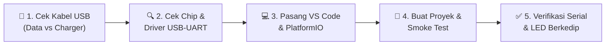

# 🛠️ MINGGU 0: ONBOARDING & DRIVER CLINIC
### Panduan Praktis Menyiapkan Lingkungan Belajar ESP32 dari Nol

> **Status Modul:** Wajib Selesai Sebelum Pertemuan Pertama  
> **Target Pengguna:** Mahasiswa S1 Teknik Elektro (Pemula / Awam)  
> **Estimasi Waktu Pengerjaan:** 20 – 30 Menit  

---

Halo rekan-rekan mahasiswa! 👋  
Selamat datang di mata kuliah **Sistem Tertanam (*Embedded Systems*)**. 

Sebelum kita masuk ke ruang laboratorium dan memprogram mikrokontroler canggih 32-bit ESP32, langkah pertama yang paling penting adalah **menyiapkan laptop Anda agar bisa berkomunikasi lancar dengan board ESP32**. Modul ini dibuat khusus dengan bahasa yang santai, terstruktur, dan ramah pemula agar Anda tidak mengalami kendala teknis saat praktikum perdana dimulai.

Yuk, kita ikuti alur persiapannya langkah demi langkah!

---

## 🗺️ Alur Persiapan Mandiri (Workflow)



---

## 🔌 LANGKAH 1: UJI KABEL USB ANDA (JEBAKAN TERBESAR PEMULA)

Sebelum menyalahkan software atau mencurigai board rusak, periksa kabel USB Anda terlebih dahulu.

### ⚠️ Masalah Klasik:
Banyak kabel di pasaran (terutama kabel charger hadiah powerbank atau kabel murah) adalah **kabel *charge-only*** yang **hanya memiliki 2 kawat internal** (kutub positif $+5\text{V}$ dan *Ground*). Kabel jenis ini **tidak memiliki jalur transfer data ($D+$ dan $D-$)**, sehingga komputer tidak akan pernah mendeteksi keberadaan ESP32!

  
*Gambar 1: Struktur internal kabel data USB standar yang memiliki 4 kawat (Merah: $+5\text{V}$, Hitam: *GND*, Putih: $D-$, Hijau: $D+$). Sumber gambar: [Wikimedia Commons (CC BY-SA 3.0)](https://commons.wikimedia.org/wiki/File:Braid_and_foil_shielded_usb_cable.jpg).*

---

### 🧪 Cara Cepat Menguji Kabel (Tanpa Alat Ukur):
1. Ambil kabel USB yang akan Anda pakai, lalu hubungkan ponsel cerdas (*smartphone*) Anda ke laptop.
2. Perhatikan layar ponsel dan laptop:
   * **Kabel DATA (Bagus):** Muncul notifikasi opsi transfer file (MTP) atau laptop membuka jendela penyimpanan file ponsel.
   * **Kabel CHARGER SAJA (Ditolak):** Ponsel hanya mengisi baterai dan laptop diam saja tanpa respon apa pun.
3. Jika kabel Anda hanya mengisi daya, **segera ganti dengan kabel data lain** (disarankan menggunakan kabel bawaan smartphone original).

---

## 🔍 LANGKAH 2: ANATOMI BOARD ESP32 & IDENTIFIKASI CHIP USB-TO-UART

Sekarang, ambil board ESP32 Anda dan perhatikan komponen-komponen utamanya.

  
*Gambar 2: Board ESP32-WROOM-32D dengan tombol BOOT, tombol EN, dan chip konverter USB-to-UART di dekat port micro-USB. Sumber gambar: [Wikimedia Commons (CC0 Public Domain)](https://commons.wikimedia.org/wiki/File:ESP32_Espressif_ESP-WROOM-32_Dev_Board_(2).jpg).*

---

### Bagian Penting yang Wajib Anda Kenali:
1. **Port Micro-USB / Type-C:** Gerbang daya sekaligus jalur pemrograman.
2. **Chip Converter USB-to-UART (IC Hitam Kecil di Dekat Port USB):** Chip jembatan yang menerjemahkan protokol USB laptop menjadi sinyal serial UART mikrokontroler.
3. **Tombol BOOT (GPIO 0):** Tombol manual untuk memaksa ESP32 masuk ke *Download/Flashing Mode*.
4. **Tombol EN / RST:** Tombol *Reset* untuk memulai ulang program dari awal.
5. **LED Indikator Merah (PWR):** Menandakan board menerima pasokan daya $5\text{V}$ atau $3.3\text{V}$.
6. **LED Indikator Biru (GPIO 2):** LED internal yang bisa diprogram melalui kode program (*built-in user LED*).

---

### Cara Mengetahui Chip & Menginstal Driver:

Lihat tulisan kecil pada chip IC hitam persegi di dekat port USB:

| Jenis Chip | Ciri Fisik | Link Download Driver Resmi |
| :--- | :--- | :--- |
| **Silicon Labs CP2102** | Bentuk bujursangkar, ada logo *SiLabs CP2102* | 📥 [Unduh CP210x VCP Driver (Windows/Mac)](https://www.silabs.com/developers/usb-to-uart-bridge-vcp-drivers) |
| **WCH CH340 / CH340G** | Bentuk persegi panjang dengan kaki di dua sisi | 📥 [Unduh CH341SER Driver (Windows/Mac)](https://www.wch-ic.com/downloads/CH341SER_EXE.html) |
| **WCH CH9102F** | Bentuk bujursangkar kecil, tulisan *CH9102* | 📥 [Unduh CH9102 Driver](https://www.wch-ic.com/downloads/CH343SER_EXE.html) |

---

### 🖥️ Cara Memeriksa Apakah Driver Sudah Terpasang:

#### Untuk Pengguna Windows:
1. Hubungkan ESP32 ke laptop menggunakan kabel data.
2. Tekan tombol kombinasi `Windows + X`, lalu klik **Device Manager**.
3. Buka kategori **Ports (COM & LPT)**:
   * Jika berhasil, akan muncul perangkat seperti:  
     `Silicon Labs CP210x USB to UART Bridge (COM3)` atau `USB-SERIAL CH340 (COM4)`.
   * Catat nomor port tersebut (misalnya **COM3** atau **COM4**).
   * Jika muncul tanda seru kuning (`⚠️`) atau berada di kategori *Unknown Device*, berarti driver belum terinstal dengan benar. Jalankan installer driver yang sudah diunduh di atas.

#### Untuk Pengguna macOS / Linux:
Buka aplikasi **Terminal**, lalu ketikkan perintah:
```bash
ls /dev/tty*
```
Cari baris yang memuat nama `/dev/ttyUSB0` (Linux) atau `/dev/tty.usbserial-xxxx` / `/dev/tty.SLAB_USBtoUART` (macOS).

---

## 💻 LANGKAH 3: INSTALASI VISUAL STUDIO CODE & PLATFORMIO IDE

Mengapa kita tidak memakai Arduino IDE lama?  
Di dunia industri teknik elektro modern, proyek sistem tertanam dikembangkan menggunakan IDE profesional dengan fitur manajemen dependensi otomatis, *autocomplete*, pelacak bug (*code linter*), dan struktur file standar Git. Oleh karena itu, kita menggunakan **VS Code + PlatformIO**.

```
┌────────────────────────────────────────────────────────┐
│                   Visual Studio Code                   │
│   ┌────────────────────────────────────────────────┐   │
│   │         PlatformIO IDE Extension               │   │
│   │   [ Toolchain Xtensa GCC + SDK ESP-IDF/Core ]   │   │
│   └────────────────────────────────────────────────┘   │
└────────────────────────────────────────────────────────┘
```

### Langkah Pemasangan:
1. Unduh dan pasang aplikasi [Visual Studio Code](https://code.visualstudio.com/) untuk sistem operasi Anda.
2. Buka VS Code.
3. Di bilah menu paling kiri, klik ikon **Extensions** (atau tekan tombol pintas `Ctrl + Shift + X` di Windows/Linux atau `Cmd + Shift + X` di macOS).
4. Pada kotak pencarian di bagian atas, ketik: `PlatformIO IDE`.
5. Klik tombol **Install** pada ekstensi buatan *PlatformIO*.
6. ⏳ **Tunggu sejenak:** PlatformIO akan mengunduh komponen internal inti (*Core CLI* dan *Python environment*). Ini membutuhkan waktu sekitar 2–5 menit tergantung kecepatan internet Anda.
7. Setelah selesai, muncul notifikasi bahwa PlatformIO siap digunakan. **Tutup dan buka kembali (restart) VS Code Anda.**
8. Jika berhasil, Anda akan melihat ikon kepala semut/alien PlatformIO di bilah sisi kiri VS Code.

---

## 🚀 LANGKAH 4: MEMBUAT PROYEK PERTAMA & UJI ASAP (*SMOKE TEST*)

Mari kita uji apakah laptop Anda sudah bisa mengompilasi kode dan mengunggahnya ke dalam chip ESP32!

### 1. Membuat Proyek Baru:
1. Klik ikon semut **PlatformIO** di bilah menu kiri VS Code.
2. Pada menu **Quick Access**, pilih **PIO Home** $\rightarrow$ klik **Open**.
3. Di halaman beranda PlatformIO yang muncul, klik tombol besar **+ New Project**.
4. Isi formulir pembuatan proyek seperti berikut:
   * **Name:** `smoke_test_esp32`
   * **Board:** Ketik dan pilih `Espressif ESP32 Dev Module`
   * **Framework:** Pilih `Arduino`
   * **Location:** Biarkan tercentang *Use default location* (atau arahkan ke folder belajar Anda).
5. Klik **Finish**. Tunggu PlatformIO menyiapkan pustaka dan membuat struktur direktori proyek Anda.

---

### 2. Memasukkan Kode Uji Coba:
Buka file explorer proyek di sisi kiri: buka folder `src` $\rightarrow$ klik file `main.cpp`.  
Hapus seluruh isi file tersebut, lalu ganti dengan kode pengujian resmi di bawah ini:

```cpp
/**
 * EE-304: Program Uji Asap (Smoke Test) ESP32
 * Tujuan: Menguji jalur komunikasi USB Serial & LED Onboard
 */

#include <Arduino.h>

// Pada sebagian besar board ESP32 DevKit, LED biru internal terpasang di GPIO 2
#define BUILTIN_LED 2

void setup() {
  // Inisialisasi komunikasi serial dengan baud rate 115200 bps
  Serial.begin(115200);

  // Konfigurasi pin LED sebagai output
  pinMode(BUILTIN_LED, OUTPUT);

  // Beri jeda 1 detik agar komunikasi serial komputer stabil
  delay(1000);

  Serial.println("\n==================================================");
  Serial.println("🎉 SELAMAT! SISTEM ESP32 ANDA SUDAH SIAP TEMPUR! ");
  Serial.println("   Mata Kuliah: Sistem Tertanam (EE-304)           ");
  Serial.println("==================================================");
}

void loop() {
  // Nyalakan LED dan kirim pesan ke serial monitor
  digitalWrite(BUILTIN_LED, HIGH);
  Serial.println("[STATUS] LED Menyala (HIGH) - ESP32 Normal");
  delay(1000);

  // Matikan LED dan kirim pesan ke serial monitor
  digitalWrite(BUILTIN_LED, LOW);
  Serial.println("[STATUS] LED Padam   (LOW)  - ESP32 Normal");
  delay(1000);
}
```

---

### 3. Mengatur Kecepatan Serial Monitor:
Buka file `platformio.ini` di direktori utama proyek, lalu tambahkan baris `monitor_speed = 115200` sehingga isinya menjadi seperti ini:

```ini
[env:esp32dev]
platform = espressif32
board = esp32dev
framework = arduino
monitor_speed = 115200
```
> [!NOTE]
> Menentukan `monitor_speed = 115200` sangat penting agar pesan di serial monitor tidak keluar dalam bentuk karakter aneh/rusak (*gibberish*). Simpan file dengan menekan `Ctrl + S`.

---

### 4. Menjalankan Kode (Build, Upload & Monitor):
Perhatikan bilah status berwarna biru di bagian bawah layar VS Code Anda:

```
[ PlatformIO Toolbar di Bawah Layar ]
┌───────┬───────┬───────┬───────┬─────────────────┐
│   ✓   │   →   │   🗑   │   ⭐  │       🔌        │
│ Build │Upload │ Clean │ Test  │ Serial Monitor  │
└───────┴───────┴───────┴───────┴─────────────────┘
```

1. **Build (Kompilasi):** Klik ikon centang (`✓`). VS Code akan mengompilasi kode C++ menjadi file biner `.bin`. Pastikan di terminal muncul tulisan hijau `[SUCCESS]`.
2. **Upload (Mengunggah):** Hubungkan ESP32 ke laptop, lalu klik ikon tanda panah kanan (`→`). PlatformIO akan mendeteksi port COM secara otomatis dan menyuntikkan firmware ke chip Flash ESP32.
3. **Serial Monitor:** Setelah upload selesai dengan pesan `[SUCCESS]`, klik ikon colokan steker/monitor (`🔌`) untuk membuka terminal serial monitor.
4. **Hasil Akhir:** 
   * LED biru kecil di board ESP32 akan berkedip setiap 1 detik.
   * Di terminal serial monitor akan muncul teks status:  
     `[STATUS] LED Menyala (HIGH) - ESP32 Normal`.

---

## ❓ PERTOLONGAN PERTAMA PADA KENDALA TEKNIS (FAQ)

### 🔴 Masalah 1: Muncul Pesan *"A fatal error occurred: Failed to connect to ESP32: Timed out waiting for packet header"*
* **Gejala:** Saat proses upload, terminal menampilkan titik-titik berturutan: `Connecting........_____.....` lalu diakhiri pesan *error timeout*.
* **Penyebab:** Sirkuit *auto-reset* pada board ESP32 Anda memiliki kapasitor penahan yang lambat merespons sinyal dari komputer.
* **Solusi Mudah:**
  1. Klik tombol **Upload** (`→`) kembali.
  2. Saat terminal mulai menampilkan tulisan `Connecting........`, **tekan dan tahan tombol fisik BOOT** pada board ESP32 Anda selama 2 detik, lalu lepaskan.
  3. Proses penulisan memori flash (*Writing at 0x00010000...*) akan langsung berjalan sukses.

---

### 🔴 Masalah 2: Serial Monitor Menampilkan Huruf Asing / Karakter Kotak Aneh
* **Penyebab:** Ketidakcocokan kecepatan komunikasi (*Baud Rate Mismatch*) antara instruksi di kode program (`Serial.begin(115200)`) dengan pengaturan terminal.
* **Solusi:** Pastikan parameter `monitor_speed = 115200` sudah tertulis di dalam file `platformio.ini` Anda, lalu tutup dan buka kembali jendela Serial Monitor.

---

### 🔴 Masalah 3: Pengguna Linux Mengalami *"Permission Denied /dev/ttyUSB0"*
* **Penyebab:** Akun login Linux Anda belum terdaftar dalam grup sistem yang diizinkan mengakses port serial hardware.
* **Solusi:** Buka terminal Linux Anda dan masukkan akun Anda ke dalam grup `dialout`:
  ```bash
  sudo usermod -a -G dialout $USER
  ```
  Setelah menjalankan perintah tersebut, **keluar (*log out*) lalu masuk kembali (*log in*)** ke akun Linux Anda agar perubahan izin diterapkan.

---

## 🎯 APA LANGKAH SELANJUTNYA?

Selamat! Jika lampu LED biru Anda sudah berkedip dan teks status sudah terbaca jelas di Serial Monitor, berarti laptop dan board ESP32 Anda sudah **100% siap mengikuti perkuliahan!**

Silakan lanjutkan membaca:
* 📌 **[Lembar Saku Pin ESP32 (Aturan Pin Aman & Pantangan)](../../docs/esp32_pin_gotchas.md)**
* 📝 **[Jobsheet Praktikum Minggu 1: Fondasi Embedded C & Bitwise](../week-01-bitwise-c/README.md)**
