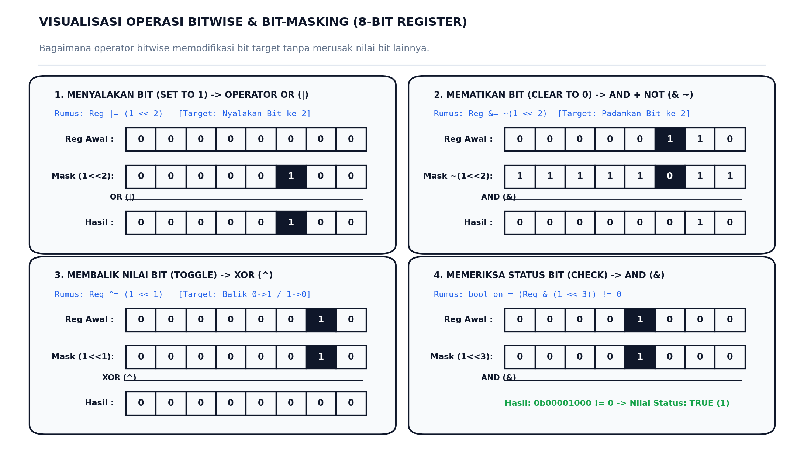
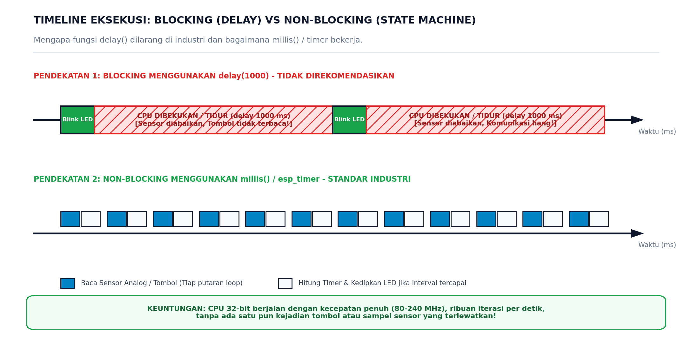

# 📝 JOBSHEET PRAKTIKUM MINGGU 1: FONDASI BAHASA C & MANIPULASI BITWISE
### Pemrograman Tingkat Register dan Eksekusi *Non-Blocking* pada ESP32

> **Mata Kuliah:** Sistem Tertanam (*Embedded Systems*) - EE-304  
> **Target Pengguna:** Mahasiswa S1 Teknik Elektro (Tingkat Pemula / Awam)  
> **Prasyarat:** Telah menyelesaikan [Modul Minggu 0: Onboarding & Driver Clinic](../week-00-onboarding/README.md)  
> **Alokasi Waktu:** 170 Menit (Sesi Lab Terpandu / Mandiri)  
> **Target Board:** ESP32 Development Board (ESP32-WROOM-32 / ESP32-S3)  

---

Halo rekan-rekan mahasiswa! 👋  
Selamat datang di sesi praktikum inti pertama. Pada modul Minggu 0, Anda telah memastikan laptop berhasil mengenali board ESP32 dan melakukan uji coba sederhana (*smoke test*). Sekarang, kita akan melangkah ke keterampilan paling fundamental seorang insinyur sistem tertanam: **bagaimana mikrokontroler berkomunikasi dan mengolah data pada tingkat paling mendasar, yaitu bit dan biner**.

Banyak pemula sering bertanya:  
> *"Pak / Kak, mengapa kita harus repot belajar logika biner, geser bit (`<<`), dan operasi logika (`&`, `|`, `^`), padahal di Arduino kita bisa tinggal mengetik `digitalWrite(LED, HIGH)`?"*

Jawabannya ada pada **efisiensi perangkat keras dan kecepatan kontrol langsung**:
1. **Satu Bit Sangat Berharga:** Di dalam mikrokontroler, memori SRAM sangat terbatas. Jika Anda menyimpan status 8 buah sensor menggunakan 8 variabel `int` biasa (yang di ESP32 berukuran 32-bit), Anda memboroskan 256 bit memori untuk data yang sejatinya cukup ditampung dalam 1 byte (8 bit)!
2. **Register Perangkat Keras (*Special Function Registers* / SFR):** ESP32 mengontrol pin fisik, timer, dan radio nirkabel melalui register memori. Satu byte register sering kali memuat 8 status berbeda sekaligus (misalnya bit 0 untuk alarm, bit 1 untuk arah motor, bit 2 untuk status sensor). Kita wajib bisa menyalakan alarm **tanpa merusak atau mengubah** pengaturan arah motor di sebelahnya.
3. **Standar Industri Bebas Macet (*Non-Blocking*):** Di industri otomotif (seperti rem ABS), inverter daya, atau drone penerbangan, program **DILARANG KERAS** menggunakan perintah jeda `delay()`. Fungsi `delay()` membekukan prosesor sehingga sistem buta terhadap sensor bahaya. Kita akan mempelajari arsitektur profesional *non-blocking state machine* menggunakan pencatat waktu internal `millis()`.

---

## 🗺️ Alur Praktikum Minggu Ini (Workflow)


---

## 📚 1. FONDASI TEORI: ANATOMI REGISTER & 4 RUMUS EMAS BIT-MASKING

### A. Anatomi Register 8-Bit
Bayangkan satu register 8-bit (*byte*) seperti kotak yang berisi **8 buah sakelar lampu fisik berjejer**, dinomori dari kanan ke kiri:

$$\text{Bit 7 (MSB)} \quad \text{Bit 6} \quad \text{Bit 5} \quad \text{Bit 4} \quad \text{Bit 3} \quad \text{Bit 2} \quad \text{Bit 1} \quad \text{Bit 0 (LSB)}$$

* **LSB (*Least Significant Bit*):** Bit paling kanan (bobot $2^0 = 1$).
* **MSB (*Most Significant Bit*):** Bit paling kiri (bobot $2^7 = 128$).

Untuk memilih bit mana yang ingin kita ubah tanpa mengganggu bit lainnya, kita menggunakan konsep **Bit-Mask** (topeng bit). Di bahasa C, topeng bit dibuat menggunakan operator pergeseran bit ke kiri (*left shift* / `<<`):

$$\text{Mask} = (1 \ll n)$$

Artinya: ambil angka `1` (biner: `0000 0001`), lalu geser ke kiri sebanyak $n$ langkah.  
* Jika $n = 0 \implies (1 \ll 0) = \text{0b00000001}$ (memilih Bit 0)
* Jika $n = 1 \implies (1 \ll 1) = \text{0b00000010}$ (memilih Bit 1)
* Jika $n = 2 \implies (1 \ll 2) = \text{0b00000100}$ (memilih Bit 2)
* Jika $n = 3 \implies (1 \ll 3) = \text{0b00001000}$ (memilih Bit 3)

---

### B. Visualisasi 4 Rumus Emas Bit-Masking
Perhatikan diagram teknis berikut untuk melihat bagaimana setiap operator matematika biner bekerja:



*Sumber ilustrasi: Diagram orisinal laboratorium Sistem Tertanam EE-304.*

Berikut penjelasan logikanya secara mendalam:

#### 1. Menyalakan Bit Tertentu (Set to 1) $\to$ Gunakan Operator OR (`|`)
* **Rumus:**  
  $$\text{Reg} \mid= (1 \ll n)$$
* **Cara Kerja:** Sifat operasi logika OR adalah: apa pun nilainya, jika di-OR-kan dengan `1`, hasilnya pasti `1`. Jika di-OR-kan dengan `0`, nilainya tidak berubah.
* **Contoh Praktis:**  
  Menyalakan Bit 2 pada register `0b00000000`:  
  `reg |= (1 << 2);` $\to$ Register menjadi `0b00000100`.

#### 2. Mematikan Bit Tertentu (Clear to 0) $\to$ Gunakan Operator AND (`&`) dan NOT (`~`)
* **Rumus:**  
  $$\text{Reg} \ \&= \sim(1 \ll n)$$
* **Cara Kerja:** Operator `~` (NOT / inversi) membalik nilai topeng. Misal `(1 << 2)` bernilai `0000 0100`, saat di-NOT-kan berubah menjadi `1111 1011`. Ketika di-AND-kan dengan register, hanya Bit 2 yang dikalikan dengan `0` (sehingga otomatis mati menjadi `0`), sedangkan 7 bit lainnya dikalikan dengan `1` (nilainya tetap terjaga aman).
* **Contoh Praktis:**  
  Mematikan Bit 2 pada register `0b00000110`:  
  `reg &= ~(1 << 2);` $\to$ Register menjadi `0b00000010`.

#### 3. Membalik Status Bit (Toggle 0 $\to$ 1 atau 1 $\to$ 0) $\to$ Gunakan Operator XOR (`^`)
* **Rumus:**  
  $$\text{Reg} \ \text{^}= (1 \ll n)$$
* **Cara Kerja:** Sifat operasi XOR (*Exclusive OR*) adalah membalik bit jika pasangannya bernilai `1`. Jika bit asal `0` di-XOR dengan `1` menjadi `1`. Jika bit asal `1` di-XOR dengan `1` menjadi `0`.
* **Contoh Praktis:**  
  Membalik status Bit 1 pada register `0b00000010`:  
  `reg ^= (1 << 1);` $\to$ Register menjadi `0b00000000`.

#### 4. Memeriksa Status Bit (Check Bit Status) $\to$ Gunakan Operator AND (`&`)
* **Rumus:**  
  $$\text{bool status} = (\text{Reg} \ \& \ (1 \ll n)) \neq 0$$
* **Cara Kerja:** Kita mengisolasi bit yang ingin dibaca. Jika bit target bernilai `1`, hasil perkalian biner bukan nol (`true`). Jika bit target bernilai `0`, hasilnya tepat nol (`false`).
* **Contoh Praktis:**  
  `if (reg & (1 << 3)) { Serial.println("Komunikasi OK!"); }`

---

### C. Catatan Khusus C Embedded: Mengapa Ada `volatile` dan Pointer (`*`)?
Jika Anda memeriksa kode di `src/main.cpp`, Anda akan menemukan baris berikut:
```c
volatile uint8_t virtual_register = 0b00000000;
void set_register_bit(volatile uint8_t *reg, uint8_t bit_pos);
```
Dua hal ini sangat krusial dalam dunia mikrokontroler:
1. **Kata Kunci `volatile`:** Kompiler C modern memiliki sistem optimasi yang sangat agresif. Jika sebuah variabel tidak diberi kata kunci `volatile`, kompiler bisa mengira nilai variabel tersebut tidak pernah berubah dari luar, sehingga kompiler menyimpan nilainya di cache prosesor. Kata kunci `volatile` memaksa CPU untuk **selalu membaca nilai fisik langsung dari alamat RAM aslinya setiap saat**, karena nilainya bisa berubah sewaktu-waktu akibat interupsi atau perangkat keras.
2. **Tanda Bintang Pointer (`*reg`):** Fungsi menerima pointer (alamat memori), bukan sekadar nilai. Dengan meneruskan alamat memori menggunakan tanda `&` (`&virtual_register`), fungsi dapat **langsung mengubah isi register fisik aslinya** (*pass-by-reference*), bukan sekadar mengutak-atik salinan sementaranya.

---

## ⏱️ 2. TRAGEDI `delay()` VS ARSITEKTUR *NON-BLOCKING*

Salah satu kesalahan paling umum mahasiswa tingkat awal adalah menggunakan fungsi `delay(1000)` untuk membuat jeda waktu.

Perhatikan perbandingan garis waktu eksekusi CPU di bawah ini:



*Sumber ilustrasi: Diagram orisinal laboratorium Sistem Tertanam EE-304.*

### 🔍 Analogi Dapur Koki:
* **Pendekatan `delay()` (*Blocking*):**  
  Seorang koki merebus mi instan, lalu menyetel waktu 3 menit. Selama 3 menit itu, sang koki **berdiri mematung, menutup mata, dan tidak melakukan apa pun**. Ketika telepon berdering, air panci meluap, atau ada pesanan baru masuk, koki tidak merespons sama sekali hingga menit ke-3 selesai.
* **Pendekatan `millis()` (*Non-Blocking*):**  
  Koki melirik jam dinding (`current_millis`), mencatat waktu mulai, lalu **tetap sibuk memotong sayur, menyiapkan bumbu, dan menjawab telepon**. Setiap beberapa detik, koki melirik jam dinding kembali. Begitu selisih waktu sudah mencapai 3 menit, ia langsung mengangkat panci mi.

> [!IMPORTANT]
> Prosesor ESP32 berdetak dengan frekuensi **160 MHz hingga 240 MHz** (mengeksekusi hingga 240.000.000 instruksi per detik). Menggunakan `delay(1000)` berarti menyia-nyiakan 240 juta siklus instruksi berharga yang semestinya bisa dipakai untuk membaca sensor analog, memproses sinyal, atau melayani koneksi Wi-Fi.

---

## 🛠️ 3. PANDUAN PENGUJIAN & PENGGUNAAN TOOLS (LANGKAH DEMI LANGKAH)

Untuk menjalankan dan menguji materi minggu ini, ikuti langkah-langkah praktis berikut secara berurutan:

### Langkah 1: Buka Proyek di Visual Studio Code
1. Jalankan aplikasi **Visual Studio Code** di laptop Anda.
2. Klik menu **File** $\to$ **Open Folder...** (atau tekan `Ctrl + K`, lalu `Ctrl + O`).
3. Arahkan dan pilih folder:
   `EmbeddedSystem/labs/week-01-bitwise-c`
4. Tunggu beberapa detik hingga ekstensi PlatformIO selesai memuat konfigurasi proyek. Anda akan melihat struktur folder berikut pada panel Explorer:
   ```text
   week-01-bitwise-c/
   ├── images/              <- Diagram ilustrasi visual
   ├── src/
   │   └── main.cpp         <- Kode program utama C/C++
   ├── platformio.ini       <- Konfigurasi board dan baud rate
   └── README.md            <- Panduan jobsheet ini
   ```

---

### Langkah 2: Mengenal Tombol Aksi PlatformIO
Perhatikan bilah status (*Status Bar*) berwarna biru di pojok kiri bawah VS Code:

| Ikon | Tombol Aksi | Fungsi & Cara Pakai | Shortcut Keyboard |
| :---: | :--- | :--- | :---: |
| `✓` | **PlatformIO: Build** | Mengompilasi kode program menjadi file binary (`.bin`). Gunakan untuk mengecek apakah ada sintaks yang salah tanpa harus mencolok board. | `Ctrl + Alt + B` |
| `→` | **PlatformIO: Upload** | Mengirimkan dan men-flash file binary yang telah dikompilasi ke dalam chip memori flash ESP32. | `Ctrl + Alt + U` |
| `🔌` | **PlatformIO: Serial Monitor** | Membuka jendela komunikasi serial untuk melihat output teks diagnostik dari ESP32. | `Ctrl + Alt + S` |
| `🗑️` | **PlatformIO: Clean** | Menghapus file kompilasi sementara jika Anda mendapati error aneh saat proses *build*. | - |

*(Catatan: Anda juga bisa menggunakan antarmuka terminal bawaan PlatformIO dengan mengetik perintah CLI: `pio run`, `pio run -t upload`, dan `pio device monitor`).*

---

### Langkah 3: Menghubungkan Perangkat Keras
1. Tancapkan kabel data USB ke port USB micro/type-C pada board ESP32 Anda.
2. Tancapkan ujung kabel lainnya ke port USB laptop Anda.
3. Pastikan lampu indikator daya berwarna merah (*Power LED*) pada board ESP32 menyala terang dan stabil.

---

### Langkah 4: Melakukan Kompilasi Kode (*Build*)
1. Buka file `src/main.cpp`.
2. Klik tombol centang `✓` (**Build**) pada status bar bawah.
3. Amati terminal di bagian bawah layar. Jika berhasil, akan muncul pesan berwarna hijau:
   ```text
   ========================= [SUCCESS] Took 4.12 seconds =========================
   ```

---

### Langkah 5: Mengunggah Program (*Upload*)
1. Klik tombol panah ke kanan `→` (**Upload**) pada status bar bawah.
2. PlatformIO akan mendeteksi port COM secara otomatis dan mulai mengunggah file biner.

> [!TIP]
> **Jika muncul pesan menunggu:** `Connecting........_____.....`  
> Segera tekan dan tahan tombol fisik **BOOT** pada board ESP32 Anda selama 1–2 detik saat titik-titik tersebut muncul, lalu lepaskan. Board akan langsung merespons dan proses penulisan flash akan berjalan hingga 100%.

---

### Langkah 6: Membuka Serial Monitor & Mengamati Hasil
1. Klik tombol colokan listrik `🔌` (**Serial Monitor**) di status bar bawah.
2. Terminal Serial Monitor akan terbuka dengan kecepatan komunikasi **115200 baud** (sesuai setting `platformio.ini`).
3. Tekan tombol fisik **EN** (atau **RST**) sekali pada board ESP32 Anda untuk me-restart mikrokontroler dari baris pertama.
4. Anda akan melihat log diagnostik biner yang rapi seperti contoh di bawah ini!

```text
==================================================
  EE-304: PRAKTIKUM SISTEM TERTANAM - MINGGU 01   
  Uji Operasi Bitwise & Non-Blocking State Machine
==================================================
Status Register Awal          : 0b0000 0000
-> Menyalakan BIT_SENSOR_READY (Bit 2)...
   Hasil: 0b0000 0100
-> Menyalakan BIT_MOTOR_RUN (Bit 1)...
   Hasil: 0b0000 0110
-> Mematikan BIT_SENSOR_READY (Bit 2)...
   Hasil: 0b0000 0010
==================================================
Memulai Loop Utama (Non-Blocking State Machine)...
[Tick: 500 ms] Status Register: 0b0000 1010 | LED State: ON
[Tick: 1000 ms] Status Register: 0b0000 0010 | LED State: OFF
[Tick: 1500 ms] Status Register: 0b0000 1010 | LED State: ON
[Tick: 2000 ms] Status Register: 0b0000 0010 | LED State: OFF
```

---

## 🎯 4. TUGAS PRAKTIKUM BERJENJANG (*TIERED ASSIGNMENTS*)

Praktikum ini menggunakan sistem nilai bertingkat. Selesaikan level demi level sesuai target capaian Anda!

### 🟢 Level 1: Penguasaan Operator Bitwise (Wajib - Skor: 70)
1. Buka file `src/main.cpp`.
2. Pelajari dan pahami implementasi 4 fungsi bitwise dasar:
   * `set_register_bit()` $\to$ menggunakan operator `|=`
   * `clear_register_bit()` $\to$ menggunakan operator `&= ~`
   * `toggle_register_bit()` $\to$ menggunakan operator `^=`
   * `check_register_bit()` $\to$ menggunakan operator `&`
3. Tambahkan pengujian mandiri di dalam fungsi `setup()`:
   * Nyalakan bit `BIT_ALARM` (Bit 0).
   * Lakukan pengecekan menggunakan `check_register_bit(virtual_register, BIT_ALARM)`.
   * Jika bernilai `true`, cetak pesan `"SISTEM PERINGATAN: ALARM AKTIF!"` ke Serial Monitor.
4. Upload program ke ESP32 dan tunjukkan log Serial Monitor kepada asisten lab.

---

### 🟡 Level 2: Eksperimen Loop Non-Blocking (Wajib - Skor: 85)
1. Buka file `src/main.cpp`, lalu cari baris deklarasi interval:
   ```cpp
   const unsigned long BLINK_INTERVAL_MS = 500;
   ```
2. Lakukan eksperimen perubahan ritme waktu:
   * Ubah nilai interval menjadi `100` ms (amati frekuensi kedip LED dan ritme cetak Serial Monitor).
   * Ubah nilai interval menjadi `1000` ms (amati perbedaannya).
3. **Analisis Pertanyaan Mandiri:**
   Tuliskan jawaban singkat pada lembar laporan Anda:
   * *Pertanyaan 1:* Mengapa variabel `previous_millis` harus diperbarui dengan `current_millis` di dalam blok `if`, bukan di luar blok `if`?
   * *Pertanyaan 2:* Jika kita mengganti baris `if (current_millis - previous_millis >= BLINK_INTERVAL_MS)` dengan perintah klasik `delay(BLINK_INTERVAL_MS)`, apa dampaknya terhadap kemampuan prosesor ESP32 dalam mendeteksi tombol darurat yang ditekan secara sekilas (selama 50 ms)?

---

### 🔴 Level 3: Tantangan Biner (*Binary Counter 4-Bit*) (Tantangan Ekstra - Skor: 100)
1. Buatlah fungsi baru di `src/main.cpp` bernama:
   ```cpp
   void run_4bit_binary_counter();
   ```
2. Fungsi ini memiliki spesifikasi kerja:
   * Menghitung nilai biner dari `0b0000` hingga `0b1111` (nilai desimal 0 sampai 15).
   * Nilai counter bertambah 1 angka setiap **1000 ms** (1 detik).
   * Cetak nilai counter ke Serial Monitor dalam format biner 4-bit dan nilai desimalnya.
   * Saat nilai mencapai 15 (`0b1111`), pada detik berikutnya nilai kembali berputar ke 0 (`0b0000`).
   * **Syarat Mutlak:** Sistem counter ini harus berjalan secara *non-blocking* berdampingan dengan fungsi `run_non_blocking_led_state_machine()`, sehingga LED tetap berkedip dengan periode 500 ms tanpa terhenti sedikit pun oleh counter 1 detik!

> [!TIP]
> **Petunjuk Pengerjaan Level 3:**  
> Buat variabel waktu tersendiri untuk counter, misalnya `unsigned long prev_counter_millis = 0;` dan konstanta `COUNTER_INTERVAL_MS = 1000;`. Dengan begitu, LED dan counter memiliki jadwal pewaktuan independen masing-masing!

---

## ❓ 5. PANDUAN PEMECAHAN MASALAH (*TROUBLESHOOTING*)

| Gejala Masalah | Kemungkinan Penyebab | Solusi Praktis |
| :--- | :--- | :--- |
| **Serial Monitor menampilkan karakter aneh / kotak-kotak / tanda tanya.** | Perbedaan kecepatan komunikasi (*baud rate* mismatch). | Pastikan setting di `platformio.ini` tertulis `monitor_speed = 115200`. Jika monitor sudah terbuka di kecepatan lain, tutup monitor lalu buka kembali. |
| **Gagal Upload: `Timed out waiting for packet header` atau `A fatal error occurred`.** | Chip ESP32 tidak otomatis masuk ke mode *flashing/download*. | Tekan dan tahan tombol fisik **BOOT** saat terminal menampilkan teks `Connecting........_____.....`, tahan selama 1–2 detik lalu lepaskan. |
| **Port COM tidak muncul sama sekali di PlatformIO.** | Kabel yang digunakan hanya kabel charger daya (2 kawat), atau driver belum terinstal. | Gunakan kabel data berkualitas (4 kawat). Periksa Device Manager di Windows untuk memastikan driver CP210x atau CH340 sudah terpasang (lihat modul Minggu 0). |
| **Lampu LED onboard tidak menyala sama sekali.** | Variasi layout pin hardware antar varian board. | Board klasik ESP32 DevKit V1 menggunakan **GPIO 2** untuk LED biru bawaan. Namun, board ESP32-S3 atau board klon tertentu tidak memiliki LED sederhana di GPIO 2 (sering kali memakai LED WS2812 pada GPIO 48). Mahasiswa tetap bisa mengamati pergantian status LED melalui Serial Monitor, atau memasang LED eksternal pada breadboard di GPIO 18 dengan resistor pembatas 220 $\Omega$. |

---

## 📋 6. METODE ASESMEN DI LAB (*LIVE CODE MUTATION*)

Untuk menjamin keaslian kompetensi mahasiswa dan mencegah plagiarisme kode, penilaian praktikum dilakukan dengan metode **Live Code Mutation** di hadapan Dosen atau Asisten Lab:

1. **Uji Demonstrasi:** Mahasiswa menunjukkan program yang sedang berjalan lancar di Serial Monitor.
2. **Mutasi Kode Dadakan:** Asisten akan memberikan skenario perubahan mendadak, misalnya:
   * *"Coba ubah bit ke-5 menjadi 1 dalam satu baris instruksi!"*
   * *"Coba ubah register agar Bit 1 dan Bit 3 mati bersamaan secara atomik!"*
   * *"Coba percepat kedipan LED menjadi 50 ms dan jelaskan apa yang terjadi pada Serial Monitor!"*
3. Mahasiswa yang mampu memodifikasi kode, mengompilasi ulang, dan menjelaskan logikanya dalam waktu **< 2 menit** berhak mendapatkan nilai penuh (A / 100).

---

## 📤 7. PANDUAN PENGUMPULAN & GIT WORKFLOW

Setelah seluruh tugas praktikum selesai dan teruji:
1. Bersihkan file kompilasi sementara agar ukuran repository tetap hemat:
   ```bash
   pio run -t clean
   ```
2. Simpan dan beri keterangan perubahan kode menggunakan Git:
   ```bash
   git add .
   git commit -m "feat(week-01): menyelesaikan modul manipulasi bitwise dan tugas level 1-3"
   ```
3. Unggah (*push*) hasil pekerjaan Anda ke repository GitHub masing-masing:
   ```bash
   git push origin main
   ```
4. Lampirkan link repository GitHub dan tangkapan layar (*screenshot*) Serial Monitor pada form pengumpulan tugas di Google Classroom / LMS kampus.

---
*Modul Praktikum EE-304 Sistem Tertanam | Program Studi S1 Teknik Elektro*
