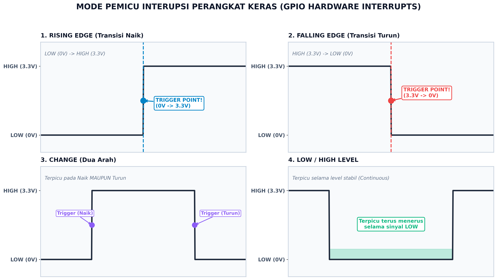
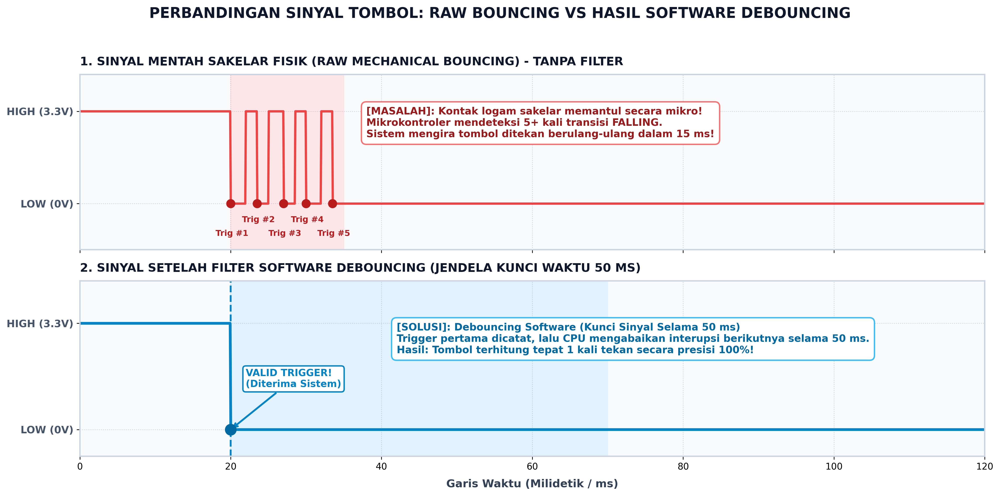
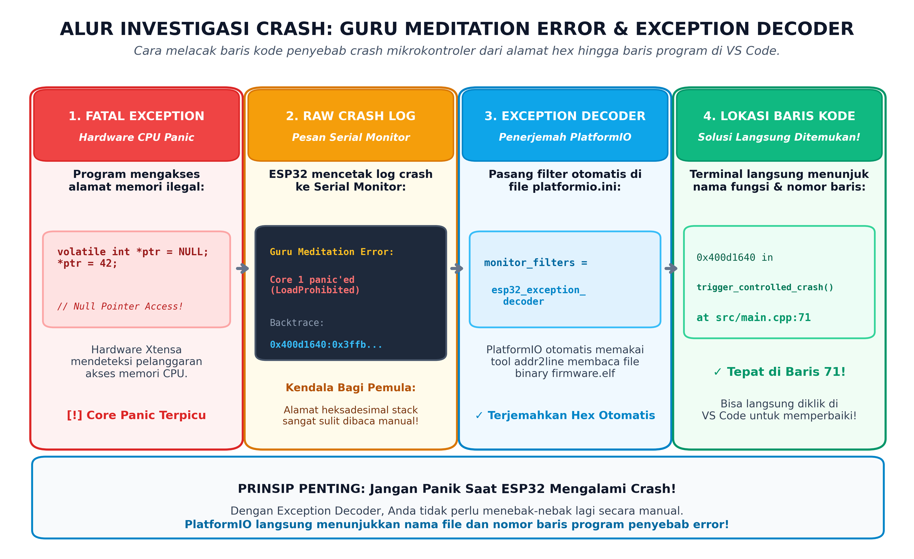
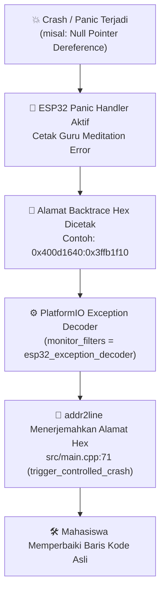
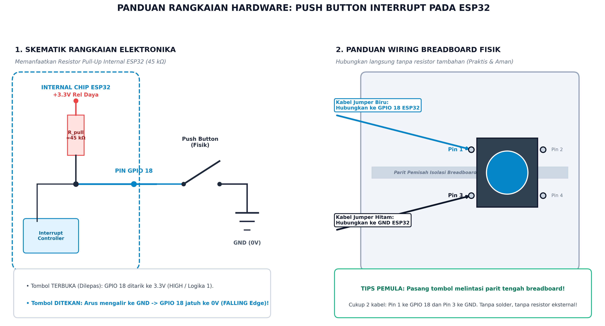
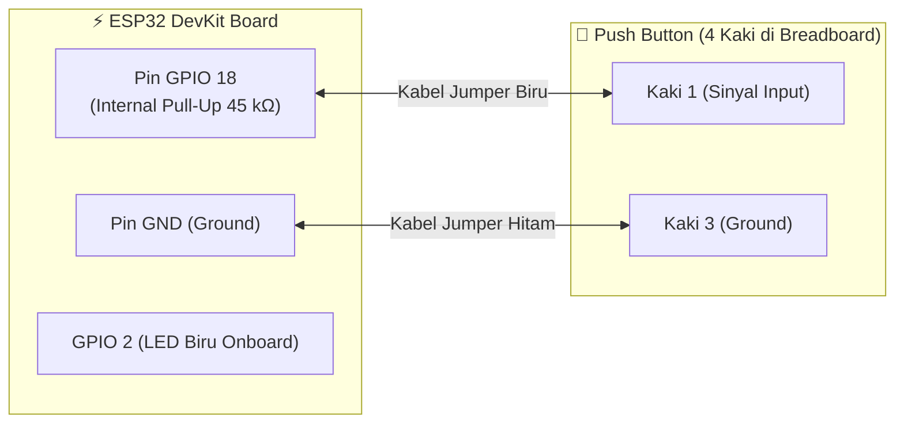

# 📝 JOBSHEET PRAKTIKUM MINGGU 2: ELEKTRIKAL PIN, HARDWARE INTERRUPT & CRASH DEBUGGING
### Respon Real-Time Perangkat Keras dan Diagnostik *Guru Meditation Error* pada ESP32

> **Mata Kuliah:** Sistem Tertanam (*Embedded Systems*)  
> **Target Pengguna:** Mahasiswa S1 Teknik Elektro (Tingkat Pemula / Awam)  
> **Prasyarat:** Telah menyelesaikan [Modul Minggu 0: Onboarding](../week-00-onboarding/README.md) & [Modul Minggu 1: Bitwise C](../week-01-bitwise-c/README.md), serta memahami [Lembar Saku Pinout ESP32](../../docs/esp32_pin_gotchas.md)  
> **Alokasi Waktu:** 170 Menit (Sesi Lab Terpandu / Mandiri)  
> **Target Board:** ESP32 Development Board (ESP32-WROOM-32 / ESP32-S3)  

---

Halo rekan-rekan mahasiswa! 👋  
Selamat datang di modul praktikum minggu kedua. Pada modul sebelumnya, Anda telah mempelajari manipulasi bitwise tingkat register dan mengeksekusi program non-blocking. Minggu ini, kita akan mempelajari dua kemampuan penting yang membedakan pemrogram pemula dari insinyur sistem tertanam profesional:
1. **Hardware Interrupt (Interupsi Perangkat Keras):** Bagaimana mikrokontroler dapat merespons kejadian fisik seketika dalam hitungan mikrodetik tanpa perlu repot memeriksa tombol berulang-ulang di dalam loop.
2. **Crash Debugging (*Guru Meditation Error*):** Kemampuan membaca pesan kegagalan sistem (*crash log*) dan melacak nomor baris program penyebab crash secara mandiri.

---

### 🌟 Mengapa Materi Ini Sangat Penting?

#### 1. Analogi Bel Pintu (Polling vs Interupsi):
* **Polling (Loop Biasa):** Bayangkan Anda sedang belajar di kamar. Untuk mengetahui apakah ada paket datang, Anda harus berjalan ke pintu depan setiap 5 detik untuk memeriksa halaman. Ini sangat melelahkan, membuang energi, dan jika kurir datang tepat di detik ke-6 lalu pergi, Anda akan kehilangan paket tersebut.
* **Interrupt (Interupsi Perangkat Keras):** Anda memasang bel listrik di pintu. Anda bisa fokus belajar atau beristirahat dengan tenang. Begitu kurir menekan bel (*ding-dong!*), bel memicu interupsi ke telinga Anda. Anda menghentikan aktivitas belajar sejenak, menerima paket, lalu kembali melanjutkan belajar.

#### 2. Jangan Takut pada Crash Sistem:
Banyak mahasiswa tingkat awal merasa panik ketika board ESP32 tiba-tiba me-restart sendiri dan memuntahkan teks aneh berwarna merah bertuliskan:  
`Guru Meditation Error: Core 1 panic'ed (LoadProhibited)`.  
Banyak yang mengira board-nya rusak atau komputernya bermasalah. Di modul ini, Anda akan mempelajari bahwa **crash log adalah sahabat terbaik seorang insinyur**. Kita akan menggunakan tool sakti bernama **ESP Exception Decoder** untuk menerjemahkan alamat heksadesimal crash langsung menjadi nomor baris kode program di VS Code!

---

## 🗺️ Alur Praktikum Minggu Ini (Workflow)


---

## 📚 1. FONDASI TEORI: ELEKTRIKAL PIN & HARDWARE INTERRUPT

### A. Karakteristik Elektrikal Pin GPIO ESP32
Sebelum menghubungkan komponen fisik apa pun ke kaki ESP32, selalu ingat 3 aturan emas elektrikal berikut:
1. **Tegangan Operasional Mutlak adalah 3.3 Volt:**  
   Pin ESP32 bekerja pada level logika CMOS 3.3 V. Menghubungkan sensor dengan tegangan logika 5 V langsung ke pin ESP32 akan merusak gerbang silikon internal GPIO secara permanen!
2. **Batas Arus Maksimum Per Pin (≤ 12 mA):**  
   Pin ESP32 hanya dirancang untuk sinyal komunikasi data, bukan penggerak daya. Dilarang menyalakan koil relay, buzzer elektromagnetik, atau motor DC langsung dari pin GPIO.
3. **Resistor Pull-Up Internal:**  
   Ketika sakelar tombol tidak ditekan, pin digital akan berada dalam kondisi melayang (*floating*), yang bisa menangkap gelombang elektromagnetik liar di udara sehingga logika pin melompat-lompat acak antara 0 dan 1. Untuk mencegahnya, ESP32 memiliki resistor penarik tegangan bawaan (*Internal Pull-Up Resistor* ≈ 45 kΩ).
   > [!WARNING]
   > Pin input-only **GPIO 34, 35, 36, dan 39 TIDAK MEMILIKI resistor pull-up internal**. Jika menggunakan pin-pin ini, Anda wajib memasang resistor fisik eksternal 10 kΩ di breadboard (lihat [docs/esp32_pin_gotchas.md](../../docs/esp32_pin_gotchas.md)).

---

### B. Mode Pemicu Interupsi Perangkat Keras (*Interrupt Edge Triggers*)
Hardware Interrupt Controller pada chip ESP32 mampu mendeteksi perubahan tegangan pada pin fisik secara mandiri tanpa membebani CPU:



*Sumber ilustrasi: Diagram orisinal laboratorium Sistem Tertanam.*

ESP32 mendukung 4 mode pemicu interupsi:
1. **RISING:** Terpicu saat sinyal beralih dari tegangan rendah ke tinggi (`LOW` → `HIGH` / 0V → 3.3V).
2. **FALLING:** Terpicu saat sinyal beralih dari tegangan tinggi ke rendah (`HIGH` → `LOW` / 3.3V → 0V). Ini adalah mode paling umum saat menggunakan tombol dengan rangkaian `INPUT_PULLUP` (saat tombol ditekan ke Ground).
3. **CHANGE:** Terpicu pada **kedua arah transisi** (baik saat sinyal naik maupun saat sinyal turun). Sangat ideal untuk membaca sensor pulsa putaran (*Rotary Encoder*).
4. **LOW / HIGH:** Interupsi berbasis level tegangan tetap. Selama pin bernilai rendah/tinggi, interupsi akan terus terpicu secara kontinu.

Fungsi pendaftaran interupsi di bahasa C/Arduino:
```c
attachInterrupt(digitalPinToInterrupt(BUTTON_PIN), isr_button_pressed, FALLING);
```

---

### C. 4 Aturan Keramat Penulisan ISR (*Interrupt Service Routine*)
Fungsi ISR adalah fungsi penanganan khusus yang dieksekusi secara darurat saat interupsi terjadi. Menulis kode di dalam ISR memiliki batasan ketat:

1. **Wajib Memiliki Atribut `IRAM_ATTR`:**  
   ```c
   void IRAM_ATTR isr_button_pressed() { ... }
   ```
   Atribut ini menginstruksikan kompilator agar menempatkan kode fungsi ISR ke dalam memori RAM instruksi cepat (IRAM), bukan di chip SPI Flash eksternal. Jika atribut ini tidak dipasang, saat SPI Flash sedang sibuk melayani Wi-Fi dan interupsi terjadi, sistem akan langsung mengalami crash fatal (*Guru Meditation Error*)!
2. **DILARANG Menggunakan `delay()`:**  
   Fungsi `delay()` membutuhkan interupsi timer CPU untuk menghitung milidetik. Menjalankan `delay()` di dalam fungsi interupsi akan mengunci prosesor (*deadlock*) dan memicu *Watchdog Timeout*.
3. **DILARANG Memanggil `Serial.print()` di dalam ISR:**  
   Komunikasi serial menggunakan buffer dan interupsi perangkat keras UART lain. Mencetak teks panjang di dalam ISR bisa menyebabkan benturan antrian interupsi.
4. **Variabel Bersama Wajib Berstatus `volatile`:**  
   Setiap variabel global yang nilainya diubah di dalam ISR dan dibaca di dalam `loop()` harus dideklarasikan sebagai `volatile`, misalnya:
   ```c
   volatile uint32_t button_press_count = 0;
   volatile bool button_event_flag = false;
   ```
5. **Prinsip *Deferred Processing* (Kerjakan Sesingkat Mungkin):**  
   ISR yang baik hanya bertugas menyalakan bendera (*flag*), misalnya `button_event_flag = true;`, lalu segera keluar. Biarkan tugas berat seperti mengolah data atau mencetak serial dikerjakan di fungsi `loop()` utama.

---

## ⚡ 2. FENOMENA BOUNCING MEKANIK & TEKNIK DEBOUNCING

Ketika Anda menekan sebuah tombol push button fisik, pelat logam di dalam tombol tidak langsung menempel sempurna. Pelat tersebut akan saling memantul (*bouncing*) selama 5 hingga 20 milidetik sebelum stabil:



*Sumber ilustrasi: Diagram orisinal laboratorium Sistem Tertanam.*

### Mengapa Ini Berbahaya Bagi Hardware Interrupt?
Hardware Interrupt ESP32 bekerja pada kecepatan nanodetik. Akibatnya, getaran mekanis 15 ms tersebut akan dianggap sebagai **belasan kali penekanan tombol yang berbeda!** Jika Anda membuat sistem penghitung barang di pabrik, menekan tombol satu kali akan menyebabkan konveyor mencatat 8 hingga 12 barang sekaligus.

### Solusi: *Software Debouncing* (Jendela Kunci Waktu)
Di dalam fungsi ISR, kita membaca jam waktu mikrokontroler menggunakan fungsi `millis()`. Begitu interupsi pertama masuk, kita mengunci pemrosesan selama 50 milidetik ke depan:
```c
void IRAM_ATTR isr_button_pressed() {
    unsigned long current_time = millis();
    // Kunci waktu: abaikan getaran mekanis selama 50 ms setelah pemicu pertama
    if (current_time - last_interrupt_time > 50) {
        button_press_count++;
        button_event_flag = true;
        last_interrupt_time = current_time;
    }
}
```
Dengan teknik sederhana ini, penekanan tombol akan terhitung tepat 1 kali secara presisi 100%!

---

## 🔍 3. CRASH DEBUGGING: MEMBEDAH *GURU MEDITATION ERROR*

### Apa Itu *Guru Meditation Error*?
Istilah unik ini berasal dari sejarah komputer Commodore Amiga di era 1980-an, yang diadopsi oleh Espressif untuk menandakan bahwa **prosesor Xtensa mengalami kesalahan fatal tingkat perangkat keras (*Panic Exception*)** dan terpaksa menghentikan eksekusi program.



*Sumber ilustrasi: Diagram orisinal laboratorium Sistem Tertanam.*



### Jenis Panic Exception yang Paling Sering Terjadi:
1. **`LoadProhibited` / `StoreProhibited`:** Program mencoba membaca atau menulis data ke alamat memori yang tidak valid (paling sering akibat *Null Pointer Dereference*, misalnya variabel pointer bernilai `NULL` / `0x00000000`).
2. **`IntegerDivideByZero`:** Operasi matematika melakukan pembagian dengan angka 0.
3. **`InterruptWatchdog` / `TaskWatchdog` (TWDT):** Ada fungsi (misalnya loop tanpa henti atau fungsi di dalam ISR) yang memakan waktu terlalu lama dan tidak pernah memberi kesempatan pada sistem operasi FreeRTOS untuk bernapas.

---

### Rahasia Investigasi: Alamat *Backtrace* & *Exception Decoder*
Saat crash terjadi, ESP32 mencetak deretan angka heksadesimal pada Serial Monitor:
```text
Guru Meditation Error: Core 1 panic'ed (LoadProhibited). Exception was unhandled.
...
Backtrace: 0x400d1640:0x3ffb1f10 0x400d182c:0x3ffb1f30 0x40089a1d:0x3ffb1f50
```
Angka `0x400d1640` adalah **alamat memori instruksi tempat eksekusi program terhenti**. 

Untuk mengubah alamat heksadesimal tersebut menjadi nama file dan nomor baris kode asli, kita cukup menambahkan satu baris sakti pada file konfigurasi `platformio.ini`:
```ini
monitor_filters = esp32_exception_decoder
```
Saat filter ini aktif, PlatformIO secara otomatis menjalankan utilitas `addr2line` di latar belakang, sehingga output di Serial Monitor langsung berubah menjadi:
```text
0x400d1640: trigger_controlled_crash() at src/main.cpp:71
```
Anda langsung mengetahui secara pasti bahwa baris 71 pada file `src/main.cpp` adalah biang keladi penyebab crash!

---

## 🛠️ 4. PANDUAN PENGUJIAN ALAT (LANGKAH DEMI LANGKAH)

### Langkah 1: Merangkai Komponen Perangkat Keras
Ambil board ESP32, breadboard, 1 buah push button 4 kaki, dan kabel jumper (male-to-male). Rangkai komponen sesuai panduan visual di bawah ini:



*Sumber ilustrasi: Diagram orisinal laboratorium Sistem Tertanam.*



#### 💡 Petunjuk Penting Bagi Pemula (Menghindari Salah Sambung):
1. **Pasang Tombol Melintasi Parit Tengah Breadboard:**  
   Tancapkan push button tepat di atas parit pemisah tengah (*center divider*) breadboard. Kaki-kaki tombol push button standar terhubung secara horizontal berpasangan (Pin 1 tersambung ke Pin 2, dan Pin 3 tersambung ke Pin 4). Dengan memasangnya melintasi parit tengah, kita memastikan kedua sisi tidak korslet sebelum tombol ditekan.
2. **Koneksi Kabel Jumper Sinyal:**  
   Hubungkan kaki tombol bagian kiri atas (**Pin 1**) ke pin **GPIO 18** pada ESP32 (gunakan kabel warna biru/cerah).
3. **Koneksi Kabel Jumper Ground:**  
   Hubungkan kaki tombol bagian kiri bawah (**Pin 3**) ke pin **GND** pada ESP32 (gunakan kabel warna hitam).
4. **Tanpa Resistor Eksternal:**  
   Anda **TIDAK memerlukan resistor fisik tambahan** di breadboard karena ESP32 sudah dilengkapi resistor *Internal Pull-Up* sebesar 45 kΩ yang diaktifkan melalui baris kode `pinMode(BUTTON_PIN, INPUT_PULLUP)`. Rangkaian menjadi sangat ringkas, rapi, dan minim risiko salah tancap!

---

### Langkah 2: Buka Folder Proyek di Visual Studio Code
1. Buka aplikasi **VS Code**.
2. Pilih menu **File** → **Open Folder...**
3. Arahkan ke folder:  
   `EmbeddedSystem/labs/week-02-gpio-interrupts`
4. Pastikan file `platformio.ini`, folder `images/`, dan `src/main.cpp` terbuka di panel Explorer.

---

### Langkah 3: Kompilasi (*Build*) & Unggah (*Upload*)
1. Hubungkan kabel data USB ESP32 ke laptop.
2. Klik tombol centang `✓` (**PlatformIO: Build**) pada status bar bawah untuk memverifikasi kode program.
3. Klik tombol panah kanan `→` (**PlatformIO: Upload**) untuk mengirim program ke ESP32.
   *(Jika muncul pesan `Connecting........_____.....`, tekan dan tahan tombol fisik **BOOT** pada ESP32 selama 1–2 detik lalu lepaskan).*

---

### Langkah 4: Membuka Serial Monitor & Uji Interaktif
1. Klik ikon steker `🔌` (**PlatformIO: Serial Monitor**) di status bar bawah (kecepatan baud: `115200`).
2. Tekan tombol **EN / RST** pada ESP32 sekali untuk me-restart program. Anda akan disambut oleh banner interaktif:

```text
========================================================
  PRAKTIKUM SISTEM TERTANAM - MINGGU 02                 
  Hardware Interrupt, Debouncing, & Crash Debugging     
========================================================
Panduan Tombol & Uji Interaktif:
 -> Tekan tombol fisik di GPIO 18 untuk memicu Hardware Interrupt.
 -> Ketik 'c' pada Serial Monitor lalu Enter untuk Uji Crash (Level 2).
 -> Ketik 'r' pada Serial Monitor untuk mereset counter tombol.
 -> Ketik 'h' pada Serial Monitor untuk memunculkan menu bantuan.
========================================================
```

---

### Langkah 5: Menguji Hardware Interrupt & Debouncing (Level 1)
1. Tekan tombol fisik di breadboard beberapa kali secara acak (cepat maupun lambat).
2. Perhatikan dua hal:
   * **Visual:** LED onboard (GPIO 2) akan berganti status (*toggle*) setiap kali tombol ditekan.
   * **Serial Monitor:** Menampilkan log interupsi presisi:
     ```text
     [INTERRUPT DETECTED] Tombol Ditekan! Total Tekanan: 1 kali | Waktu: 3420 ms
     [INTERRUPT DETECTED] Tombol Ditekan! Total Tekanan: 2 kali | Waktu: 4150 ms
     ```
3. Perhatikan bahwa nilai counter bertambah tepat 1 per tekanan tombol tanpa ada lonjakan angka liar berkat filter debouncing 50 ms!

---

### Langkah 6: Menguji Simulasi Crash Terkontrol (Level 2)
1. Pada kolom input teks Serial Monitor di bagian atas terminal, ketik huruf `c` lalu tekan tombol **Enter**.
2. ESP32 akan mengeksekusi fungsi `trigger_controlled_crash()`.
3. Amati pesan crash dump yang muncul:

```text
[PERINGATAN BAHAYA]: Memulai simulasi crash memori...
Mengakses alamat pointer kosong (Null Pointer Dereference)...
Guru Meditation Error: Core 1 panic'ed (LoadProhibited). Exception was unhandled.

Backtrace: 0x400d1640:0x3ffb1f10 0x400d182c:0x3ffb1f30 ...
  #0  0x400d1640 in trigger_controlled_crash() at src/main.cpp:71
  #1  0x400d182c in loop() at src/main.cpp:141
```
4. Perhatikan baris decoder:  
   `#0 0x400d1640 in trigger_controlled_crash() at src/main.cpp:71`  
   PlatformIO langsung menunjuk file `src/main.cpp` baris 71! Anda telah berhasil melakukan investigasi crash menggunakan Exception Decoder.

---

## 🎯 5. TUGAS PRAKTIKUM BERJENJANG (*TIERED ASSIGNMENTS*)

### 🟢 Level 1: Penguasaan Interrupt & Analisis Bouncing (Wajib - Skor: 70)
1. Jalankan kode program standar pada board ESP32.
2. Uji respon tombol fisik di GPIO 18 dan pastikan counter bertambah stabil.
3. **Eksperimen Analisis Mandiri:**
   * Di dalam file `src/main.cpp`, cari fungsi ISR `isr_button_pressed()`.
   * Matikan sementara baris pengecekan waktu debouncing:
     ```cpp
     // Ubah menjadi pemanggilan langsung tanpa pengecekan waktu:
     button_press_count++;
     button_event_flag = true;
     ```
   * Upload ulang kode ke ESP32, lalu tekan tombol fisik beberapa kali.
   * Catat hasilnya pada laporan Anda: **Berapa lonjakan counter yang terjadi untuk satu kali penekanan tombol fisik saat filter debouncing dimatikan?**
   * Kembalikan kode ke kondisi debouncing semula setelah selesai.

---

### 🟡 Level 2: Investigasi Crash Mandiri (Wajib - Skor: 85)
1. Tambahkan fungsi baru di `src/main.cpp` bernama:
   ```cpp
   void trigger_divide_by_zero();
   ```
2. Di dalam fungsi tersebut, buat operasi pembagian dengan nilai nol:
   ```cpp
   volatile int pembilang = 100;
   volatile int penyebut = 0;
   volatile int hasil = pembilang / penyebut;
   ```
3. Tambahkan pembacaan karakter `'z'` pada `Serial.read()` di dalam `loop()` untuk memicu fungsi `trigger_divide_by_zero()`.
4. Upload program ke ESP32, ketik huruf `z` pada Serial Monitor, lalu salin (*copy*) log crash yang ditampilkan decoder ke dalam lembar laporan praktikum Anda.
5. Sebutkan nama jenis Exception yang muncul dan nomor baris kode yang ditunjuk oleh Exception Decoder.

---

### 🔴 Level 3: Deteksi Klik Ganda (*Double-Click Detection*) (Tantangan Ekstra - Skor: 100)
1. Rancang algoritma deteksi klik ganda (*double click*) pada tombol GPIO 18.
2. **Kriteria Sistem:**
   * Jika tombol ditekan satu kali lalu hening selama lebih dari 400 ms, sistem mencatatnya sebagai **SINGLE CLICK**.
   * Jika tombol ditekan kembali dalam rentang waktu kurang dari 400 ms sejak tekanan pertama, sistem mencatatnya sebagai **DOUBLE CLICK**.
   * Ketika terdeteksi *Double Click*, cetak pesan khusus ke Serial Monitor:  
     `🎉 [EVENT]: DOUBLE CLICK TERDETEKSI! Mode Khusus Diaktifkan!`  
     dan buat LED berkedip cepat 3 kali berturut-turut.
3. **Syarat Mutlak:** Seluruh logika waktu wajib dibangun menggunakan arsitektur *non-blocking state machine* berbasis `millis()`. Dilarang menggunakan fungsi `delay()`.

---

## ❓ 6. PANDUAN PEMECAHAN MASALAH (*TROUBLESHOOTING*)

| Gejala Masalah | Kemungkinan Penyebab | Solusi Praktis |
| :--- | :--- | :--- |
| **Tombol ditekan sekali, tetapi counter melompat 5 s.d. 10 angka.** | Filter debouncing belum aktif atau jendela waktu lockout terlalu kecil (< 20 ms). | Pastikan nilai konstanta `DEBOUNCE_LOCKOUT_MS` disetel minimal 50 milidetik pada kode program. |
| **ESP32 terus me-restart sendiri (*bootloop*) begitu tombol dihubungkan.** | Tombol dihubungkan ke Strapping Pin sensitif bootloader. | Pastikan tombol dipasang di pin yang aman seperti **GPIO 18**. Jangan memasang tombol di GPIO 0, 2, atau 12 saat booting awal (lihat panduan [Pin Gotchas](../../docs/esp32_pin_gotchas.md)). |
| **Exception Decoder hanya menampilkan angka Hex tanpa nama file/baris.** | File biner firmware belum dikompilasi dalam mode debug atau setting filter monitor belum termuat. | 1. Pastikan baris `monitor_filters = esp32_exception_decoder` sudah tersimpan di `platformio.ini`.<br>2. Tutup jendela Serial Monitor, lalu buka kembali.<br>3. Lakukan Clean Build (`PlatformIO: Clean` lalu `PlatformIO: Build`). |
| **ESP32 mengalami Crash saat memanggil Serial.print di dalam ISR.** | Pelanggaran aturan interupsi UART / benturan resource interupsi hardware. | Jangan pernah memanggil fungsi `Serial.print()` atau `delay()` di dalam fungsi ISR! Selalu gunakan pola *deferred processing* (nyalakan flag di ISR, cetak serial di `loop()`). |

---

## 📋 7. METODE ASESMEN DI LAB (*LIVE CODE MUTATION*)

Pada sesi demonstrasi praktikum tatap muka, Asisten Lab / Dosen akan melakukan uji pemahaman:
1. **Verifikasi Hardware:** Mahasiswa mendemonstrasikan rangkaian tombol fisik pada breadboard dan membuktikan counter interupsi berjalan stabil.
2. **Tantangan Mutasi Singkat:**
   * *"Coba ubah mode interupsi dari FALLING menjadi RISING, dan jelaskan kapan LED berganti status!"*
   * *"Coba jelaskan mengapa fungsi ISR wajib memiliki kata kunci IRAM_ATTR di ESP32!"*
   * *"Jika saya memberikan alamat heksadesimal crash ini, tunjukkan di mana letak baris programnya di layar laptop Anda!"*
3. Mahasiswa yang mampu menjawab dan mendemonstrasikan mutasi dalam waktu **< 2 menit** berhak mendapatkan skor penilaian maksimal.

---

## 📤 8. PANDUAN PENGUMPULAN & GIT WORKFLOW

Setelah semua tahapan praktikum Level 1, 2, dan 3 selesai diuji:
1. Bersihkan file kompilasi cache binary:
   ```bash
   pio run -t clean
   ```
2. Simpan dan beri keterangan perubahan kode menggunakan Git:
   ```bash
   git add .
   git commit -m "feat(week-02): menyelesaikan praktikum hardware interrupt dan crash debugging"
   ```
3. Unggah (*push*) repositori Anda ke GitHub:
   ```bash
   git push origin main
   ```
4. Lampirkan URL repositori GitHub serta tangkapan layar terminal Serial Monitor saat pengujian interupsi dan crash decoding pada portal pengumpulan LMS kampus.

---
*Modul Praktikum Sistem Tertanam | Program Studi S1 Teknik Elektro*
