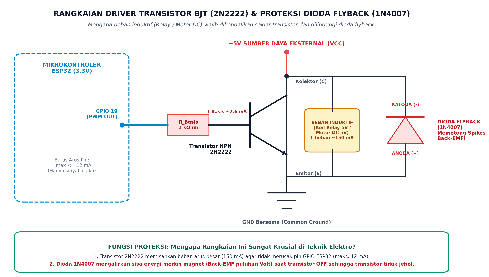
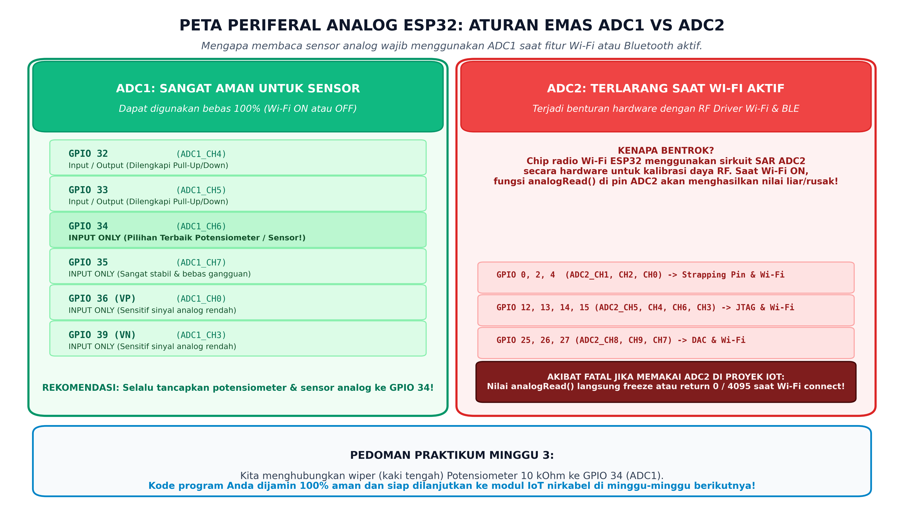
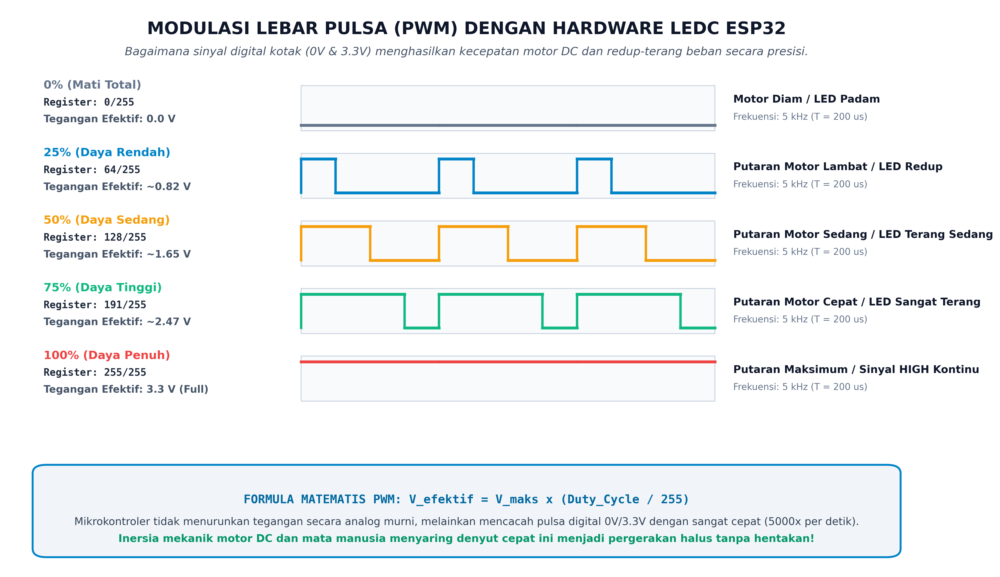
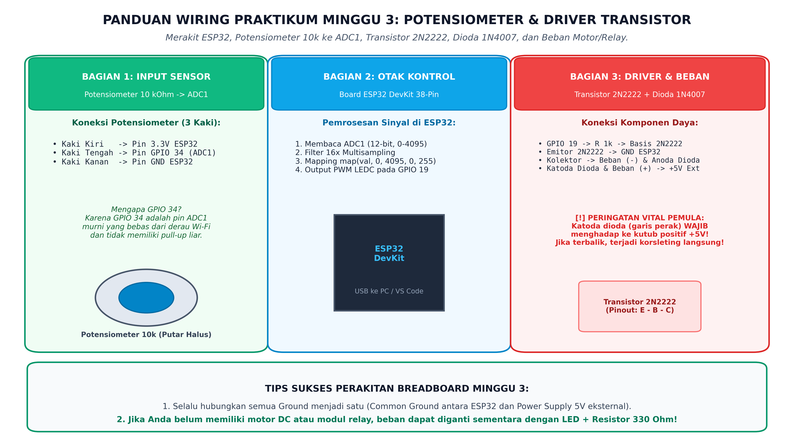

# 📝 JOBSHEET PRAKTIKUM MINGGU 3: INTERFACING BEBAN DAYA (TRANSISTOR DRIVER) & PERIFERAL ANALOG (ADC1 & PWM)
### Pengendalian Beban Arus Besar, Akurasi Sensor ADC1 Tanpa Benturan Wi-Fi, dan Modulasi Lebar Pulsa (LEDC) pada ESP32

> **Mata Kuliah:** Sistem Tertanam (*Embedded Systems*)  
> **Target Pengguna:** Mahasiswa S1 Teknik Elektro (Tingkat Pemula / Awam)  
> **Prasyarat:** Telah menyelesaikan [Modul Minggu 0: Onboarding](../week-00-onboarding/README.md), [Modul Minggu 1: Bitwise C](../week-01-bitwise-c/README.md), [Modul Minggu 2: GPIO & Interupsi](../week-02-gpio-interrupts/README.md), serta memahami [Lembar Saku Pinout ESP32](../../docs/esp32_pin_gotchas.md)  
> **Alokasi Waktu:** 170 Menit (Sesi Lab Terpandu / Mandiri)  
> **Target Board:** ESP32 Development Board (ESP32-WROOM-32 / ESP32-S3)  

---

Halo rekan-rekan mahasiswa Teknik Elektro! 👋  
Selamat datang di modul praktikum minggu ketiga. Di dua minggu pertama, kita telah menguasai manipulasi bitwise register, logika interupsi perangkat keras, dan teknik membaca crash log sistem. Sekarang, kita melangkah ke ranah yang menjadi ciri khas sejati seorang insinyur elektro: **menjembatani otak mikrokontroler digital berdaya rendah (3.3V) dengan dunia fisik perangkat keras berdaya besar (5V/12V, motor, relay, solenoid, dan sensor analog kontinu)**.

Modul ini dirancang agar sangat ramah bagi pemula, disajikan dengan bahasa santai namun tetap presisi secara kaidah teknik elektro, serta dilengkapi diagram visual beresolusi tinggi.

---

### 🌟 Mengapa Materi Minggu Ini Sangat Krusial?

Di dunia industri nyata, mikrokontroler tidak pernah bekerja sendirian di atas meja yang tenang. Mikrokontroler harus membaca sensor analog (suhu, tekanan, sudut potensiometer) dan menggerakkan aktuator bertenaga besar (pompa air, konveyor pabrik, kipas pendingin, atau saklar pemutus daya). 

Berikut 3 analogi santai untuk memahami 3 konsep inti minggu ini:

#### 1. Analogi Keran Air Hidrolik (Transistor Driver):
Bayangkan pin GPIO ESP32 seperti jari tangan anak kecil yang hanya kuat menekan tuas katup kecil (arus lemah ≤ 12 mA). Sedangkan motor DC atau koil relay adalah pintu air bendungan raksasa yang membutuhkan dorongan ribuan liter air (arus 150 mA hingga puluhan Ampere). 
Jika jari anak kecil itu dipaksa menahan air bendungan secara langsung, jarinya akan patah seketika (**pin GPIO ESP32 terbakar permanen!**).  
Solusinya? Kita memasang **Transistor BJT (2N2222) atau MOSFET (2N7000)**. Jari anak kecil cukup membuka katup kendali kecil (Basis), dan transistor yang akan mengalirkan air deras dari tandon utama (Kolektor ke Emitor) menuju motor.

#### 2. Analogi Rel Kereta Api & Sinyal Radio (Aturan Emas ADC1 vs ADC2):
ESP32 memiliki dua unit konverter analog-ke-digital: **ADC1** dan **ADC2**.
* **ADC1** diibaratkan rel kereta api jalur khusus industri yang sepenuhnya independen.
* **ADC2** diibaratkan rel kereta api yang berbagi wesel dengan stasiun radio Wi-Fi & Bluetooth!  
Ketika fitur Wi-Fi dinyalakan (untuk mengirim data ke cloud atau MQTT), chip radio ESP32 akan menyita sirkuit ADC2 secara paksa untuk kalibrasi daya antena. Jika program Anda nekat membaca sensor di pin ADC2 saat Wi-Fi aktif, pembacaan analog Anda akan langsung macet, membeku, atau menghasilkan data sampah. Oleh karena itu, aturan emas insinyur ESP32 sedunia: **HANYA gunakan pin ADC1 (GPIO 32 s.d. 39) untuk sensor analog Anda!**

#### 3. Analogi Saklar Lampu Kamar Cepat (Modulasi Lebar Pulsa / PWM):
Bagaimana cara meredupkan lampu pijar atau memperlambat laju putaran motor DC jika mikrokontroler kita hanya mengenal angka digital 0V (Mati) dan 3.3V (Hidup)?  
Mikrokontroler tidak bisa menurunkan tegangan murni menjadi 1.5V layaknya baterai yang melemah. Sebagai gantinya, mikrokontroler menyalakan dan mematikan saklar listrik dengan kecepatan luar biasa tinggi: **5.000 kali dalam satu detik (5 kHz)**.  
Karena inersia mekanik rotor motor dan keterbatasan mata manusia, motor tidak terasa tersentak-sentak hidup-mati, melainkan berputar halus pada kecepatan sedang sesuai rasio perbandingan waktu nyala (*Duty Cycle*).

---

## 🗺️ Alur Praktikum Minggu Ini (Workflow)


---

## 🧰 Alat dan Komponen yang Dibutuhkan

Sebelum memulai praktikum, pastikan komponen-komponen berikut sudah tersedia di meja lab Anda:

| No | Komponen / Perangkat | Jumlah | Keterangan Praktis |
|:--:|:---|:--:|:---|
| 1 | **ESP32 DevKit Board** | 1 unit | 30-pin atau 38-pin (ESP32-WROOM-32 / ESP32-S3) |
| 2 | **Kabel Micro-USB / Type-C** | 1-2 unit | Pastikan kabel mendukung transfer data, bukan hanya pengisian daya |
| 3 | **Breadboard 830 Titik** | 1 unit | Papan tempat merangkai komponen tanpa solder |
| 4 | **Potensiometer 10 kΩ** | 1 unit | Tipe putar putaran linier (3 kaki) sebagai input sensor |
| 5 | **Transistor NPN (2N2222 / BC547)** | 1 unit | Saklar penggerak beban daya (alternatif: MOSFET 2N7000) |
| 6 | **Dioda Flyback (1N4007 / 1N4148)** | 1 unit | Dioda penyearah silikon untuk peredam lonjakan induktif |
| 7 | **Resistor 1 kΩ (Cokelat-Hitam-Merah)** | 1 unit | Pembatas arus basis transistor (`R_B`) |
| 8 | **Modul Relay 5V atau Motor DC Kecil (3V-5V)** | 1 unit | Beban daya induktif utama |
| 9 | **LED 5mm + Resistor 330 Ω** | 1 set | (*Opsional*) Beban visual alternatif jika motor belum tersedia |
| 10 | **Sumber Daya 5V Eksternal (Power Bank / Breadboard Power Module)** | 1 unit | Untuk menyuplai motor/relay secara terpisah dari ESP32 |
| 11 | **Kabel Jumper Male-to-Male** | 10-15 buah | Untuk menghubungkan jalur di breadboard |
| 12 | **Multimeter Digital (DMM)** | 1 unit | Untuk mengukur tegangan rel dan hambatan resistor |

---

## 📚 1. FONDASI TEORI ELEKTRO: DRIVER TRANSISTOR & PROTEKSI INDUKTIF

### A. Mengapa Pin GPIO Tidak Boleh Menyetir Beban Arus Besar?
Sirkuit internal pin GPIO ESP32 dibangun dari transistor silikon mikroskopis berskala nanometer. Arus keluaran yang disarankan pabrikan Espressif adalah **maksimal 12 mA per pin** (batas absolut mutlak 20 mA sebelum silikon meleleh).

Mari kita bandingkan kebutuhan arus beban nyata:
* Satu buah LED indikator: membutuhkan arus ~5 mA s.d. 10 mA (**Aman** untuk GPIO).
* Satu koil modul relay 5V standar: membutuhkan arus ~70 mA s.d. 100 mA (**6× lipat melebihi batas aman!**).
* Satu motor DC hobi mini (3V-5V): membutuhkan arus tanpa beban ~150 mA, dan arus lonjakan start-up (*stall current*) mencapai **500 mA s.d. 1.000 mA** (**50× lipat melebihi batas aman!**).

Menghubungkan koil relay atau motor DC langsung ke pin ESP32 akan langsung membakar gerbang silikon output GPIO, memicu drop tegangan sistemik, atau menyebabkan mikrokontroler mengalami restart terus-menerus (*Brownout Reset*).

---

### B. Transistor BJT (2N2222) Sebagai Saklar Elektronik
Transistor Bipolar Junction Transistor (NPN) memiliki 3 terminal: **Basis (B)**, **Kolektor (C)**, dan **Emitor (E)**. 
Dalam elektronika digital, kita mengoperasikan transistor pada dua wilayah kerja ekstrem:
1. **Wilayah Cutoff (Saklar Terbuka / OFF):**  
   Ketika tegangan Basis-Emitor (`V_BE`) < 0.7V (GPIO bernilai `LOW` / 0V), tidak ada arus basis yang mengalir (`I_B = 0`). Jalur Kolektor-Emitor tertutup total layaknya saklar terbuka. Beban tidak mendapatkan arus listrik.
2. **Wilayah Saturasi (Saklar Tertutup Penuh / ON):**  
   Ketika pin GPIO bernilai `HIGH` (3.3V), arus kecil disuntikkan ke terminal Basis melalui resistor pembatas `R_B`. Transistor mengalami kejenuhan penuh (*saturation*), di mana resistansi antara terminal Kolektor dan Emitor turun mendekati nol (`V_CE(sat) ≈ 0.1V - 0.2V`). Arus besar dari power supply mengalir bebas melalui beban menuju Ground.

#### Menghitung Resistor Basis (`R_B`):
Agar transistor benar-benar jenuh (*fully saturated*), arus basis harus dirancang dengan rasio penguatan saturasi (`β_sat` atau `h_FE(sat) ≈ 10` sampai 20):
* Misalkan arus beban kolektor `I_C = 150 mA = 0.15 A`.
* Arus basis yang dibutuhkan: `I_B = I_C / 10 = 15 mA` (atau untuk transistor gain tinggi seperti 2N2222, `I_B ≈ 2.6 mA - 5 mA` sudah cukup membuat saturasi).
* Tegangan drop Basis-Emitor silikon: `V_BE ≈ 0.7 V`.
* Tegangan output pin ESP32: `V_GPIO = 3.3 V`.
* Nilai resistor basis:
  ```text
  R_B = (V_GPIO - V_BE) / I_B 
      = (3.3V - 0.7V) / 0.0026A 
      ≈ 1.000 Ω = 1 kΩ
  ```

Maka, memasang resistor **1 kΩ** di kaki Basis adalah pilihan yang sangat aman dan presisi!

---

### C. Fenomena Back-EMF & Kewajiban Memasang Dioda Flyback (1N4007)
Koil relay, solenoid, dan kumparan rotor motor DC adalah **beban induktif murni** (`L`). Kumparan ini menyimpan energi dalam bentuk medan magnet ketika dialiri arus listrik (`E = ½ × L × I²`).

Ketika transistor tiba-tiba diputus dari kondisi ON ke OFF dalam hitungan mikrodetik, arus listrik dipaksa berhenti seketika (`dt → 0`). Berdasarkan **Hukum Induksi Faraday dan Hukum Lenz**:
```text
V_induksi = -L × (di / dt)
```

Kumparan induktif akan mempertahankan aliran arusnya dengan cara membalik polaritas tegangannya dan memicu lonjakan tegangan balik raksasa (*Inductive Voltage Spike / Back-EMF*) yang dapat mencapai **50 Volt hingga 200 Volt**! Lonjakan tegangan tinggi ini akan langsung menembus batas isolasi transistor (*collector-emitter breakdown voltage*) dan membakar transistor dalam sekejap.


*Sumber gambar: Diagram teknis orisinal laboratorium Sistem Tertanam.*

#### Peran Sakti Dioda Flyback (Freewheeling Diode):
Kita memasang sebuah dioda silikon (tipe **1N4007**) secara **antiparalel** (terbalik) melintasi terminal beban:
* **Saat Transistor ON:** Katoda dioda terhubung ke +5V dan Anoda terhubung ke Kolektor (tegangan rendah). Dioda berada dalam kondisi *reverse biased* (mati), sehingga tidak mengganggu operasi motor/relay sama sekali.
* **Saat Transistor Tiba-tiba OFF:** Lonjakan tegangan balik dari kumparan membuat potensial di ujung kolektor melesat lebih tinggi daripada +5V. Dioda seketika menjadi *forward biased* (aktif konduktif). Energi medan magnet yang tersimpan disirkulasikan kembali ke dalam kumparan dan terbuang menjadi panas secara aman, tanpa pernah menyentuh transistor ataupun merembet ke mikrokontroler!

> [!CAUTION]
> **PERINGATAN POLARITAS DIODA:**  
> Dioda memiliki gelang perak di salah satu ujung fisiknya yang menandakan terminal **KATODA (-)**. Ujung katoda bergelang perak ini **WAJIB terhubung ke kutub positif (+5V)**. Jika Anda memasangnya terbalik, saat transistor ON akan terjadi hubungan singkat (*short circuit*) langsung antara +5V ke Ground melalui dioda, yang dapat merusak adaptor daya Anda!

---

## 🧭 2. ATURAN EMAS PERIFERAL ANALOG ESP32: ADC1 VS ADC2

Chip ESP32 memiliki konverter analog-ke-digital bertipe SAR (*Successive Approximation Register*) 12-bit, yang mampu membagi tegangan analog rentang 0 s.d. 3.3V menjadi angka biner `0 s.d. 4095` (2¹² - 1). Namun, ada jebakan arsitektur besar yang wajib Anda ketahui:


*Sumber gambar: Diagram alokasi periferal internal laboratorium Sistem Tertanam.*

### Tabel Komparasi Mutlak: ADC1 vs ADC2

| Parameter | ADC1 (Jalur Aman Terisolasi) | ADC2 (Jalur Konflik Wi-Fi) |
|:---|:---|:---|
| **Pin Fisik GPIO** | **GPIO 32, 33, 34, 35, 36 (VP), 39 (VN)** | GPIO 0, 2, 4, 12, 13, 14, 15, 25, 26, 27 |
| **Bisa Dipakai Saat Wi-Fi Aktif?** | **BISA 100% (Sangat Stabil)** | **TIDAK BISA! (Error / Nilai Beku / Garbage)** |
| **Penyebab Konflik** | Memiliki sirkuit analog independen | Sirkuit ADC digunakan driver RF Wi-Fi untuk kalibrasi daya pancar antena |
| **Rekomendasi Praktikum** | **Gunakan GPIO 34** untuk potensiometer & sensor analog | Jangan pernah pakai untuk sensor jika proyek Anda terhubung ke internet |

### Karakteristik Non-Linearitas & Deadzone ADC ESP32
ADC pada ESP32 terkenal memiliki ketidaklinearan (*non-linearity*) pada kedua ujung ekstremnya:
1. **Deadzone Bawah (0.0V s.d. ~0.15V):** Nilai ADC akan terbaca 0 meskipun tegangan fisik sudah mulai naik di kisaran 0.1V.
2. **Saturasi Atas (~3.15V s.d. 3.3V):** Nilai ADC sudah mencapai batas maksimal 4095 meskipun tegangan belum genap menyentuh 3.3V.
3. **Peredam Derau (Multisampling Filter):** Sinyal analog di breadboard rentan menangkap derau frekuensi tinggi dari komputer atau jala-jala listrik. Untuk mendapatkan pembacaan yang tenang dan presisi, kita menerapkan teknik komputasi **Multisampling (Oversampling)**: membaca nilai pin sebanyak 16 kali secara berurutan dengan jeda singkat, lalu mengambil nilai rata-ratanya:
   ```text
   Nilai_ADC = (1 / N) × Σ analogRead(pin)
   ```

---

## ⚡ 3. HARDWARE PWM DENGAN TIMER LEDC

Mikrokontroler ESP32 tidak memiliki periferal PWM berbasis software primitif seperti board mikrokontroler zaman dulu yang membuat CPU tersendat. ESP32 dilengkapi modul periferal khusus bernama **LEDC (LED Controller)** yang beroperasi secara mandiri di tingkat hardware menggunakan clock 80 MHz!


*Sumber gambar: Visualisasi gelombang modulasi lebar pulsa laboratorium Sistem Tertanam.*

### Parameter Kunci LEDC:
1. **Frekuensi PWM (`f_pwm`):**  
   Berapa kali sinyal kotak berulang dalam satu detik. Untuk motor DC dan modulasi LED, frekuensi **5.000 Hz (5 kHz)** adalah standar emas: cukup tinggi agar terbebas dari dengungan frekuensi audio yang terdengar telinga manusia (20 Hz - 20 kHz), namun tidak terlalu tinggi sehingga meminimalkan rugi daya pensaklaran (*switching loss*) pada transistor.
2. **Resolusi Bit (`n`-bit):**  
   Menentukan kehalusan tingkatan kecepatan motor. Pada praktikum ini, kita memilih resolusi **8-bit**, yang menyediakan rentang nilai duty cycle dari **0 hingga 255** (2⁸ - 1).
3. **Rumus Tegangan Efektif Rata-Rata (`V_eff`):**  
   Tegangan keluaran efektif yang diterima oleh beban adalah hasil kali tegangan sumber dengan rasio duty cycle:
   ```text
   V_eff = V_sumber × (Nilai_Register_PWM / 255)
   ```
   * Register = 0 → Duty Cycle 0% → `V_eff = 0.0 V` (Motor Mati).
   * Register = 64 → Duty Cycle 25% → `V_eff ≈ 0.82 V` (Putaran Lambat).
   * Register = 128 → Duty Cycle 50% → `V_eff ≈ 1.65 V` (Putaran Sedang).
   * Register = 191 → Duty Cycle 75% → `V_eff ≈ 2.47 V` (Putaran Cepat).
   * Register = 255 → Duty Cycle 100% → `V_eff = 3.3 V` (Putaran Penuh Maksimum).

---

## 🔌 4. PANDUAN PERAKITAN BREADBOARD (WIRING DIAGRAM)

Sebelum mencolokkan kabel USB ke komputer, susunlah komponen-komponen di atas breadboard mengikuti panduan komprehensif berikut:


*Sumber gambar: Diagram tata letak pengkabelan laboratorium Sistem Tertanam.*

### Tabel Pengkabelan Lengkap (Pin-by-Pin Wiring Matrix):

| Bagian | Kaki Komponen | Terhubung Ke Pin Board / Catu Daya | Catatan Pemasangan |
|:---|:---|:---|:---|
| **Potensiometer 10k** | Kaki Kiri (Pin 1) | **Pin 3.3V ESP32** | Catu daya referensi analog |
| | Kaki Tengah (Pin 2 - Wiper) | **GPIO 34 ESP32** | Sinyal analog input ADC1 murni |
| | Kaki Kanan (Pin 3) | **GND ESP32** | Ground referensi analog |
| **Driver Transistor 2N2222** | Basis (Kaki Tengah) | **Salah satu ujung Resistor 1 kΩ** | Jangan tancapkan langsung ke GPIO tanpa resistor! |
| | Ujung lain Resistor 1 kΩ | **GPIO 19 ESP32** | Output sinyal kendali PWM hardware |
| | Emitor (Kaki Kiri) | **GND ESP32 & GND Power Eksternal** | Jalur Ground Bersama (*Common Ground*) |
| | Kolektor (Kaki Kanan) | **Terminal Negatif Beban & Anoda Dioda** | Titik temu saklar pemutus arus |
| **Beban & Dioda Flyback** | Kutub Positif Motor/Relay (+) | **+5V Power Eksternal / Pin VIN ESP32** | Catu daya penggerak beban |
| | Katoda Dioda 1N4007 (Garis Perak) | **+5V Power Eksternal / Pin VIN ESP32** | **WAJIB:** Garis perak menghadap ke kutub positif! |
| | Anoda Dioda 1N4007 (Sisi Hitam) | **Kolektor Transistor 2N2222** | Sisi pembuang lonjakan induktif |
| **Catu Daya Eksternal** | Kutub Negatif Power Supply (GND) | **GND ESP32** | **ATURAN MUTLAK COMMON GROUND!** |

> [!IMPORTANT]
> **ATURAN MUTLAK: COMMON GROUND (TANAH BERSAMA)**  
> Jika Anda menggunakan power supply terpisah untuk menggerakkan motor (misalnya baterai 5V atau adaptor), **kutub Ground (GND) dari power supply tersebut WAJIB dihubungkan menjadi satu dengan pin GND ESP32**.  
> Tanpa jalur Common Ground, arus dari pin GPIO 19 tidak memiliki jalur pulang (*return path*) menuju mikrokontroler, sehingga transistor tidak akan pernah bisa menyala!

---

## 🛠️ 5. PANDUAN PRAKTIKUM LANGKAH-DEMI-LANGKAH (HANDS-ON)

Bagi Anda yang baru pertama kali menggunakan Visual Studio Code dan PlatformIO, ikuti langkah-langkah presisi berikut:

### Langkah 1: Membuka Proyek di Visual Studio Code
1. Jalankan aplikasi **Visual Studio Code** di komputer Anda.
2. Klik menu **File** → **Open Folder...** (atau tekan kombinasi tombol `Ctrl + K, Ctrl + O`).
3. Arahkan dan pilih folder repositori perkuliahan:  
   `labs/week-03-transistor-adc-pwm`
4. Tunggu beberapa detik hingga bilah status (*Status Bar*) berwarna biru di bagian bawah VS Code menampilkan ikon PlatformIO.

### Langkah 2: Memeriksa File Konfigurasi `platformio.ini`
Pastikan file [platformio.ini](platformio.ini) telah dikonfigurasi dengan baud rate `115200` dan filter decoder:
```ini
[env:esp32dev]
platform = espressif32
board = esp32dev
framework = arduino
monitor_speed = 115200
monitor_filters = 
    esp32_exception_decoder
    time
build_type = debug
```

### Langkah 3: Menjalankan Kompilasi & Unggah Kode
Perhatikan deretan ikon kecil di **Bilah Status Bagian Bawah VS Code**:
1. **Kompilasi Program (Build):** Klik ikon centang **`✓`** (atau tekan tombol pintas `Ctrl + Alt + B`). Pastikan terminal menampilkan pesan `[SUCCESS]`.
2. **Hubungkan Board ESP32:** Tancapkan kabel USB dari board ESP32 ke port USB laptop/PC Anda.
3. **Unggah Program (Upload):** Klik ikon panah kanan **`→`** (atau tekan tombol pintas `Ctrl + Alt + U`). Tunggu hingga persentase penulisan flash mencapai 100% dan muncul tulisan `Leaving... Hard resetting via RTS pin...`.
4. **Buka Serial Monitor:** Klik ikon steker listrik colokan **`🔌`** di bilah bawah (atau gunakan shortcut `Ctrl + Alt + S`).

---

### Langkah 4: Bedah Kode Sumber `src/main.cpp`
Mari kita telaah arsitektur kode sumber modular yang berada di file [src/main.cpp](src/main.cpp):

```cpp
// 1. Membaca Potensiometer dengan Filter 16x Multisampling
uint16_t current_adc_raw = read_adc_multisampling(POT_ADC_PIN, 16);

// 2. Mengonversi ke Estimasi Tegangan Fisik (0 - 3.3V)
float current_voltage = (current_adc_raw / 4095.0) * 3.3;

// 3. Memetakan Nilai ADC 12-bit (0-4095) ke Nilai Duty Cycle PWM 8-bit (0-255)
uint8_t target_duty = map(current_adc_raw, 0, 4095, 0, 255);

// 4. Menyalurkan Sinyal PWM ke Basis Transistor
write_pwm_duty(target_duty);
```

#### Cara Interaksi Lewat Serial Monitor:
Kode di `src/main.cpp` telah dilengkapi fitur komunikasi serial dua arah yang sangat interaktif:
* **Ganti Mode:** Ketik huruf **`m`** lalu tekan `Enter` di Serial Monitor. Sistem akan berpindah dari mode **OTOMATIS (Potensiometer)** ke mode **MANUAL (Serial Control)**.
* **Uji Kecepatan Motor di Mode Manual:**
  * Ketik angka **`0`** → Motor berhenti total (Duty 0%).
  * Ketik angka **`5`** → Motor berputar 50% kekuatan (Duty 127/255).
  * Ketik angka **`9`** → Motor berputar 90% kekuatan.
  * Ketik huruf **`f`** → Motor berputar 100% kekuatan penuh (*Full Power*).
* **Cek Status:** Ketik huruf **`s`** untuk mencetak telemetri tegangan, nilai ADC, dan duty cycle saat ini.
* **Bantuan Perintah:** Ketik huruf **`h`** untuk mencetak ulang menu bantuan perintah.

---

## 🎯 6. TANTANGAN PRAKTIKUM BERTINGKAT (ASSIGNMENTS)

Selesaikan 3 level tantangan berikut untuk membuktikan penguasaan materi Anda:

### 🟢 Level 1: Karakterisasi Respon ADC & Plotting Visual (Wajib Selesai di Kelas)
1. Buka fitur **Serial Plotter** di PlatformIO/VS Code atau Arduino IDE.
2. Putar knob potensiometer perlahan dari posisi paling kiri (0V), ke tengah (1.65V), hingga mentok ke kanan (3.3V).
3. Catat di lembar kerja Anda:
   * Pada nilai putaran knob berapa motor DC mulai mampu berputar mengatasi gesekan poros mekaniknya?
   * Apakah grafik kenaikan nilai ADC terhadap posisi putaran potensiometer terlihat mulus dan linier?

### 🟡 Level 2: Implementasi Histeresis & Deadband Filter (Nilai B)
* **Masalah Industri:** Saat potensiometer berada di dekat posisi nol, sedikit saja hembusan udara atau getaran meja dapat membuat nilai ADC melompat-lompat kecil (misal: 0, 15, 2, 8). Hal ini menyebabkan motor mendengung (*whining noise*) tanpa berputar karena arus tidak cukup kuat menggerakkan rotor, yang menyebabkan transistor cepat panas.
* **Tugas Anda:** Modifikasi fungsi pembacaan di `src/main.cpp` dengan menambahkan algoritma **Deadband (Ambang Batas Bawah)**:
  * Jika nilai ADC mentah `< 150` (sekitar ≈ 0.12 V), paksa nilai duty cycle menjadi **0** murni.
  * Terapkan ambang histeresis agar motor tidak tersentak-sentak saat berada di perbatasan nilai mati.

### 🔴 Level 3: Algoritma Soft-Start & Inrush Current Limiter (Nilai A)
* **Masalah Industri:** Ketika Anda tiba-tiba menyetel duty cycle dari 0% langsung ke 100% (misalnya dengan menekan tombol `f`), motor DC akan menarik arus lonjakan awal (*inrush current*) hingga 5 kali lipat dari arus normalnya! Hal ini sering kali memicu drop tegangan yang membuat ESP32 mengalami restart sendiri (*Brownout*).
* **Tugas Anda:** Buatlah fungsi **`soft_start_pwm(uint8_t target_duty, uint16_t ramp_duration_ms)`** yang menaikkan nilai duty cycle secara bertahap (interpolasi linear atau S-Curve) selama durasi waktu tertentu (misalnya dinaikkan setiap 10 milidetik), sehingga motor berakselerasi dengan halus tanpa lonjakan arus yang membebani rel catu daya.

---

## ❓ 7. TANYA JAWAB AWAM & PANDUAN TROUBLESHOOTING

| Masalah yang Sering Muncul | Penyebab Utama | Solusi Perbaikan Cepat |
|:---|:---|:---|
| **ESP32 tiba-tiba restart sendiri saat motor mulai berputar kencang.** | Terjadi penurunan tegangan sesaat (*voltage sag / brownout*) pada rel daya 5V/3.3V akibat motor menarik arus awal yang terlalu besar. | 1. Gunakan catu daya terpisah untuk motor.<br>2. Pasang kapasitor elektrolit (100 µF hingga 470 µF) melintasi rel daya motor sebagai penyimpan cadangan energi lokal.<br>3. Pastikan kabel USB Anda berkualitas baik. |
| **Relay berderik sangat cepat seperti suara tembakan senapan mesin.** | Anda menghubungkan modul relay ke pin sinyal PWM berfrekuensi tinggi (5 kHz). | Relay adalah saklar mekanik yang lambat (maksimal beralih beberapa kali per detik). **JANGAN beri sinyal PWM berkecepatan tinggi ke relay!** Berikan sinyal logika digital murni `HIGH` (menutup penuh) atau `LOW` (membuka penuh). |
| **Nilai ADC di Serial Monitor melompat-lompat acak padahal potensiometer diam.** | 1. Kaki wiper potensiometer longgar di breadboard.<br>2. Anda lupa menghubungkan kaki ketiga potensiometer ke GND.<br>3. Terjadi *floating input*. | Periksa kembali koneksi ketiga kaki potensiometer di breadboard. Pastikan kaki kiri terpasang kuat ke 3.3V, kaki kanan ke GND, dan kaki tengah ke GPIO 34. |
| **Dioda 1N4007 terasa sangat panas saat disentuh.** | Dioda dipasang terbalik! Katoda (garis perak) dipasang ke ground, bukan ke kutub positif. | **SEGERA CABUT KABEL USB!** Dioda terbalik akan menciptakan korsleting langsung antara +5V dan Ground saat transistor ON. Balikkan arah dioda sehingga garis perak menghadap ke +5V. |
| **Transistor tidak mau menyala meskipun pin GPIO sudah diset HIGH.** | Jalur Ground antara ESP32 dan catu daya motor belum disatukan (*Missing Common Ground*). | Sambungkan pin GND ESP32 ke pin GND sumber daya motor menggunakan seutas kabel jumper. |

---

## 🎤 8. PERTANYAAN UJI PEMAHAMAN LABORATORIUM (LIVE LAB ORAL MUTATION)

Saat sesi evaluasi praktikum, Dosen atau Asisten Laboratorium akan memberikan pertanyaan langsung untuk menguji orisinalitas dan pemahaman konseptual Anda:

1. *"Mengapa kita tidak boleh menghubungkan koil relay 5V langsung ke pin GPIO ESP32 meskipun tegangan koil relay bisa ditarik ke 3.3V?"*  
   **Kunci Jawaban:** Karena keterbatasan arus pin GPIO ESP32 (maksimal 12 mA). Koil relay membutuhkan arus minimal 70-100 mA untuk menarik kontak mekanisnya. Menghubungkannya langsung akan membakar gerbang silikon GPIO.
2. *"Apa yang akan terjadi pada transistor 2N2222 jika kita melepas dioda flyback 1N4007 saat mengendalikan motor DC?"*  
   **Kunci Jawaban:** Saat motor dimatikan tiba-tiba, energi medan magnet yang tersimpan pada kumparan motor akan memicu lonjakan tegangan balik raksasa (Back-EMF puluhan hingga ratusan Volt). Tanpa dioda flyback yang menyirkulasikan sisa energi tersebut, tegangan lonjakan akan menembus batas isolasi Vce transistor dan merusaknya secara permanen.
3. *"Di proyek tugas akhir nanti, Anda akan membuat sistem monitoring kualitas air berbasis IoT dengan sensor pH analog dan koneksi Wi-Fi ke server. Mengapa Anda dilarang keras menancapkan kabel sensor analog ke pin GPIO 2 atau GPIO 15?"*  
   **Kunci Jawaban:** Karena GPIO 2 dan 15 berada di bawah sirkuit internal ADC2. Saat modul radio Wi-Fi aktif mengirim data, hardware ADC2 akan diperebutkan dan disita oleh driver RF untuk kalibrasi daya pancar antena, sehingga pembacaan sensor pH akan macet atau bernilai acak. Sensor analog wajib dipasang ke ADC1 (misal GPIO 34).
4. *"Berapa tegangan efektif yang dirasakan oleh motor jika register PWM disetel pada nilai 128 dengan catu daya 5V?"*  
   **Kunci Jawaban:** `V_eff = 5V × (128 / 255) ≈ 2.5 Volt` (atau 50% dari tegangan penuh).

---

## 📤 9. PANDUAN COMMIT & PUSH KE GITHUB

Setelah seluruh pengujian di breadboard berhasil dan tantangan kode selesai diimplementasikan, simpan seluruh pekerjaan Anda ke repositori GitHub pribadi/tim:

1. Buka terminal terintegrasi di VS Code (**Terminal** → **New Terminal**).
2. Periksa status berkas yang telah Anda modifikasi:
   ```bash
   git status
   ```
3. Tambahkan berkas yang telah diubah ke area staging:
   ```bash
   git add labs/week-03-transistor-adc-pwm/
   ```
4. Lakukan commit dengan pesan terstruktur yang informatif:
   ```bash
   git commit -m "feat(week-03): implement transistor driver, ADC1 precision, and LEDC PWM"
   ```
5. Unggah perubahan Anda ke GitHub:
   ```bash
   git push origin main
   ```
6. Buka halaman GitHub repositori Anda di browser untuk memastikan seluruh kode dan laporan praktikum telah terunggah dengan rapi!

---

*Selamat bereksperimen, jaga keselamatan komponen Anda, dan salam mahasiswa Teknik Elektro! ⚡🔬*
