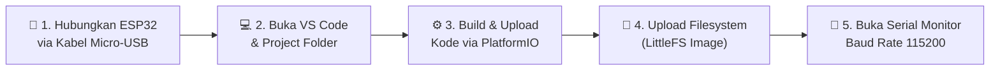
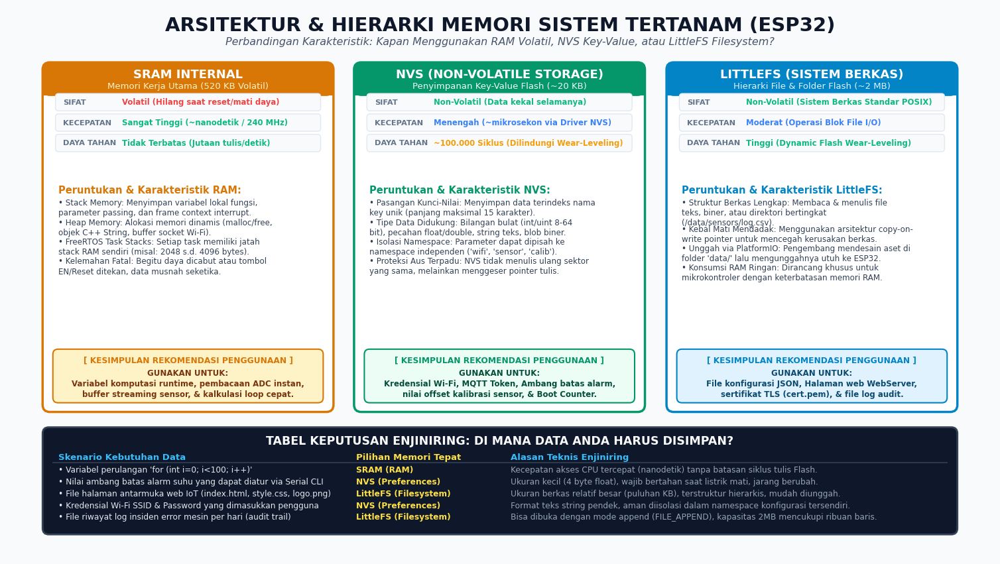
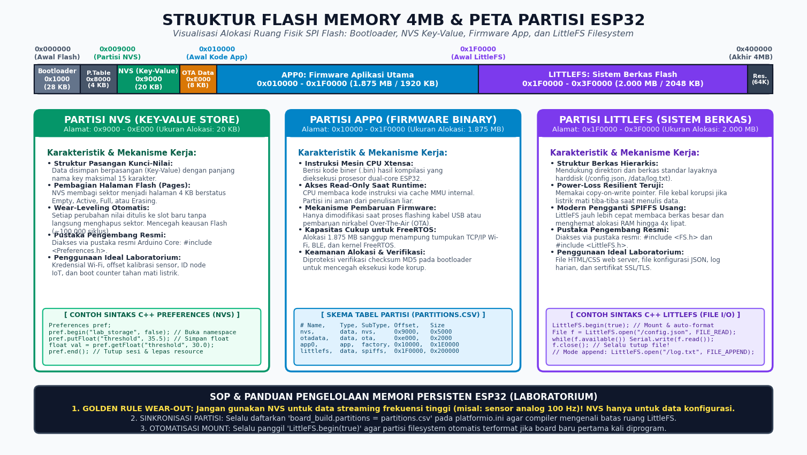
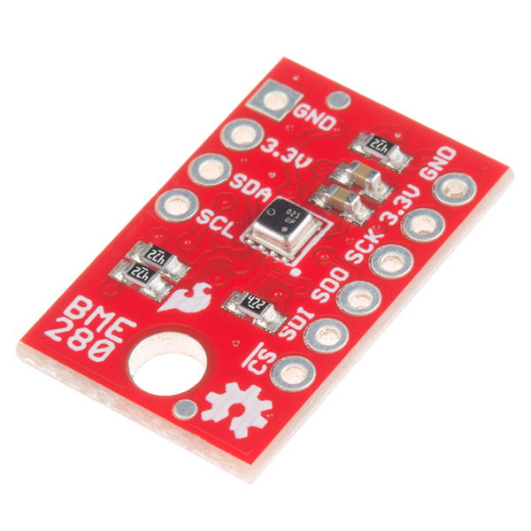
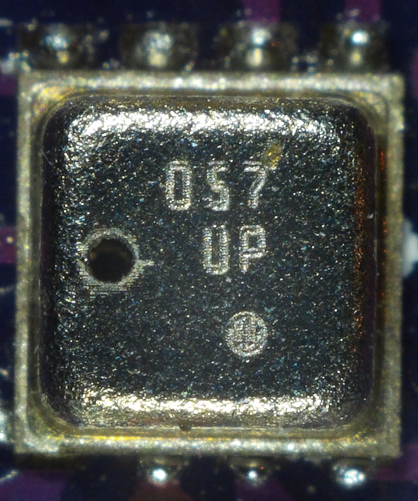
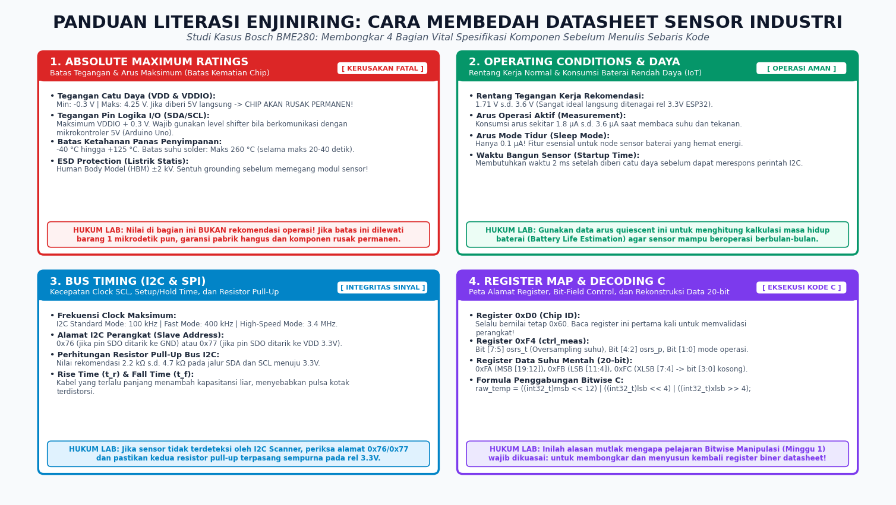

# 📂 MINGGU 04: MEMORI PERSISTEN (NVS & LITTLEFS) & CARA MEMBACA DATASHEET
### Laboratorium Sistem Tertanam (Embedded Systems) — Program Studi Sarjana (S1) Teknik Elektro

---

## 🎯 TUJUAN PEMBELAJARAN
Setelah menyelesaikan modul praktikum ini, mahasiswa diharapkan mampu:
1. **Membedakan Karakteristik Memori:** Menjelaskan perbedaan mendasar antara memori volatil (**SRAM**) dan memori non-volatil (**Flash Memory**) pada arsitektur SoC ESP32.
2. **Menguasai Key-Value Store NVS:** Mengimplementasikan pustaka `Preferences.h` untuk menyimpan parameter sistem (*boot counter*, nilai ambang batas sensor/*threshold*, kredensial) yang tidak hilang saat listrik padam.
3. **Mengelola Sistem Berkas LittleFS:** Membagi ruang flash memory melalui tabel partisi kustom (`partitions.csv`) dan membaca/menulis berkas statis (`config.json`, file log) menggunakan pustaka `LittleFS.h`.
4. **Menerapkan Proteksi Flash (Wear-Leveling):** Memahami batas ketahanan siklus tulis sel memori flash (~100.000 siklus) serta menerapkan SOP penyimpanan yang benar.
5. **Literasi Enjiniring (Bedah Datasheet):** Membaca dan menerjemahkan dokumen spesifikasi komponen industri (studi kasus: Bosch Sensortec BME280) mulai dari batas kelistrikan (*Absolute Maximum Ratings*), arus *quiescent*, hingga ekstraksi data biner antar-register menggunakan manipulasi bitwise C.

---

## 🛠️ 1. PERSIAPAN TOOLS & LINGKUNGAN PRAKTIKUM (RAMAH AWAM)

Bagi Anda yang baru pertama kali bereksperimen dengan penyimpanan persisten pada mikrokontroler, ikuti panduan persiapan di bawah ini agar tidak merasa bingung:



### A. Perangkat Keras (Hardware) yang Dibutuhkan:
* **1x Board ESP32 Development Board** (ESP32-WROOM-32 / ESP32-S3, 30 atau 38 pin).
* **1x Kabel Micro-USB Data** (Pastikan kabel mendukung transfer data, bukan kabel charger murah yang hanya memiliki jalur daya +5V dan GND).
* **Komputer / Laptop** dengan sistem operasi Windows, macOS, atau Linux.

### B. Perangkat Lunak (Software Tools) yang Harus Dibuka:
1. **Visual Studio Code:** Editor utama praktikum kita.
2. **Ekstensi PlatformIO IDE:** Terpasang di dalam VS Code (ikon semut alien di bilah kiri).
3. **Serial Monitor Terintegrasi:** Digunakan untuk mengirim perintah interaktif dan melihat respon ESP32.
   * Shortcut membuka terminal: Tekan tombol keyboard `Ctrl + ~` (Backtick).
   * Atau klik menu: **Terminal** → **New Terminal**.
   * Jalankan perintah monitor:
     ```bash
     pio device monitor -b 115200
     ```

---

## 🧠 2. FONDASI TEORI: MEMORI VOLATIL VS NON-VOLATIL

Mengapa mikrokontroler membutuhkan memori persisten? Bayangkan sebuah kulkas pintar industri atau termostat inkubator bayi: jika listrik gedung padam selama 2 detik lalu menyala kembali, apakah sistem boleh "lupa" berapa suhu target amannya? Tentu saja tidak! Sistem wajib mengingat setelan terakhir tanpa perlu diatur ulang secara manual oleh manusia.

Di dalam SoC ESP32, terdapat dua kelompok memori utama dengan karakteristik kelistrikan yang sangat berbeda:


*Sumber gambar: Diagram hierarki memori laboratorium Sistem Tertanam.*

### Perbandingan Karakteristik Memori:

| Parameter Evaluasi | SRAM Internal (RAM) | NVS Flash (`Preferences.h`) | LittleFS (`LittleFS.h`) |
|:---|:---|:---|:---|
| **Sifat Penyimpanan** | **Volatil** (Hilang saat reset/mati lampu) | **Non-Volatil** (Kekal selamanya) | **Non-Volatil** (Kekal selamanya) |
| **Kecepatan Akses** | Sangat Cepat (Nanodetik / 240 MHz) | Menengah (Mikrosekon via driver NVS) | Moderat (Operasi blok file I/O) |
| **Kapasitas Khas** | ~520 KB | ~20 KB (Dapat diatur di partisi) | ~1.5 MB s.d. 3.0 MB |
| **Struktur Data** | Variabel C/C++, Stack & Heap | Pasangan Kunci-Nilai (*Key-Value*) | Hierarki Berkas & Direktori POSIX |
| **Batas Siklus Tulis** | **Tidak Terbatas** (Jutaan/detik aman) | **~100.000 Siklus** (Ada Wear-Leveling) | **~100.000 Siklus** (Ada Wear-Leveling) |
| **Contoh Penggunaan** | Counter loop `for`, buffer ADC instan | Nilai threshold, SSID Wi-Fi, offset kalibrasi | Halaman web HTML/CSS, config.json, file log |

> [!WARNING]
> **HUKUM KEAUSAN MEMORI FLASH (FLASH WEAR-OUT RULE):**  
> Sel memori Flash fisik pada ESP32 hanya mampu bertahan sekitar **100.000 siklus penulisan/penghapusan per sektor**.  
> **JANGAN PERNAH** menulis data ke NVS atau LittleFS di dalam blok `void loop()` tanpa jeda atau pemicu kondisi! Jika Anda menulis nilai analog sensor ke NVS 100 kali per detik, memori flash ESP32 Anda akan rusak permanen (*hardware fatigue*) hanya dalam waktu kurang dari 20 menit!

---

## 🗺️ 3. PETA FLASH MEMORY & TABEL PARTISI KUSTOM (`partitions.csv`)

Secara fisik, ESP32 DevKit pada umumnya dilengkapi dengan chip eksternal SPI Flash berkapasitas **4 Megabyte (4.096 Kilobyte / 0x400000 bytes)**. Ruang 4 MB ini tidak digunakan secara acak, melainkan dibagi rapi layaknya partisi *Local Disk (C:)* dan *Local Disk (D:)* di komputer Anda:


*Sumber gambar: Peta alokasi ruang flash memory laboratorium Sistem Tertanam.*

### Tabel Partisi yang Kita Gunakan (`partitions.csv`):
Pada folder lab minggu ini, kita telah menyertakan berkas tabel partisi kustom [`partitions.csv`](file:///c:/Users/anton/vibecoding/EmbeddedSystem/labs/week-04-nvs-littlefs-datasheet/partitions.csv):

```csv
# Name,     Type, SubType, Offset,   Size,     Flags
nvs,        data, nvs,     0x9000,   0x5000,
otadata,    data, ota,     0xe000,   0x2000,
app0,       app,  factory, 0x10000,  0x1E0000,
littlefs,   data, spiffs,  0x1F0000, 0x200000,
```

### Penjelasan Baris demi Baris:
1. **`nvs` (0x9000 s.d. 0xE000, Ukuran 20 KB):**  
   Partisi khusus yang dikelola oleh driver Non-Volatile Storage bawaan ESP-IDF. Driver ini mengimplementasikan algoritma **Dynamic Wear-Leveling**. Setiap kali Anda memperbarui suatu nilai (misalnya menaikkan *boot counter*), data tidak ditimpa di tempat yang sama, melainkan ditulis ke slot berikutnya yang masih bersih (*empty*). Begitu satu halaman 4 KB penuh, data yang masih valid disalin ke halaman baru dan halaman lama dihapus secara serentak (*sector erase*).
2. **`otadata` (0xE000 s.d. 0x10000, Ukuran 8 KB):**  
   Menyimpan catatan penanda bootloader untuk menentukan partisi aplikasi mana yang aktif saat melakukan pembaruan nirkabel *Over-The-Air* (OTA).
3. **`app0` (0x10000 s.d. 0x1F0000, Ukuran 1.875 MB / 1.920 KB):**  
   Menyimpan berkas biner kode program C++ hasil kompilasi Anda (`firmware.bin`). Ruang 1.875 MB sangat lega untuk menampung program yang menggunakan stack Wi-Fi, Bluetooth LE, dan sistem operasi FreeRTOS.
4. **`littlefs` (0x1F0000 s.d. 0x3F0000, Ukuran 2.000 MB / 2.048 KB):**  
   Partisi untuk sistem berkas LittleFS. Di sinilah kita menyimpan berkas JSON konfigurasi, halaman HTML web server, maupun berkas log teks. (Perhatikan: subtype ditulis `spiffs` karena ESP-IDF mengelompokkan semua partisi sistem berkas di bawah pengenal ini).

---

## 💻 4. STRUKTUR KODE PROGRAM & PRAKTIKUM

Starter code lengkap tersedia pada berkas [`src/main.cpp`](file:///c:/Users/anton/vibecoding/EmbeddedSystem/labs/week-04-nvs-littlefs-datasheet/src/main.cpp). Mari kita bedah dua pustaka inti yang kita gunakan:

### A. Menggunakan NVS via Pustaka `Preferences.h`
Pustaka `Preferences` adalah antarmuka pembungkus (*wrapper*) resmi Arduino Core untuk driver NVS ESP-IDF yang sangat mudah dipahami:

```cpp
#include <Preferences.h>
Preferences preferences;

void contohPenggunaanNVS() {
    // 1. Buka namespace 'lab_storage'
    // Parameter kedua: false = Read/Write, true = Read-Only
    preferences.begin("lab_storage", false);

    // 2. Membaca nilai dari NVS (Parameter kedua adalah nilai DEFAULT jika key belum ada)
    uint32_t bootCount = preferences.getUInt("boot_count", 0);
    float threshold    = preferences.getFloat("threshold", 32.5f);
    String namaAlat    = preferences.getString("owner", "ESP32-Default");

    // 3. Menulis atau memperbarui nilai ke NVS
    bootCount++;
    preferences.putUInt("boot_count", bootCount);
    preferences.putFloat("threshold", 38.0f);

    // 4. Tutup sesi untuk memastikan data ter-commit dan menghemat resource RAM
    preferences.end();
}
```

> [!TIP]
> **Aturan Namespace NVS:**  
> Nama namespace (seperti `"lab_storage"`) dan nama key (seperti `"threshold"`) memiliki batas panjang **maksimal 15 karakter**. Jika melebihi 15 karakter, karakter sisanya akan terpotong secara otomatis oleh driver NVS!

---

### B. Menggunakan Sistem Berkas `LittleFS.h`
LittleFS dirancang khusus untuk mikrokontroler dengan memori terbatas, kebal terhadap kerusakan data akibat mati listrik mendadak (*power-loss resilient*), dan jauh lebih cepat membaca berkas dibanding pustaka SPIFFS model lama:

```cpp
#include <FS.h>
#include <LittleFS.h>

void contohPenggunaanLittleFS() {
    // Parameter true: Jika partisi belum terformat, otomatis lakukan format awal
    if (!LittleFS.begin(true)) {
        Serial.println("Gagal memasang sistem berkas LittleFS!");
        return;
    }

    // 1. Membaca Berkas Teks
    if (LittleFS.exists("/config.json")) {
        File configFile = LittleFS.open("/config.json", FILE_READ);
        while (configFile.available()) {
            Serial.write(configFile.read());
        }
        configFile.close(); // Selalu tutup berkas setelah selesai!
    }

    // 2. Menulis Catatan Tambahan (Mode Append / Menambah di Akhir Berkas)
    File logFile = LittleFS.open("/boot_log.txt", FILE_APPEND);
    if (logFile) {
        logFile.println("Sistem dinyalakan kembali pada: " + String(millis()) + " ms");
        logFile.close();
    }
}
```

---

## 🧪 5. PANDUAN PENGUJIAN INTERAKTIF VIA SERIAL CLI

Starter code pada modul ini telah dilengkapi dengan antarmuka baris perintah (**Interactive Serial CLI**) sehingga Anda dapat langsung berinteraksi dengan memori ESP32 tanpa perlu merangkai sirkuit rumit terlebih dahulu!

### Langkah 1: Kompilasi dan Unggah Program ke ESP32
1. Pastikan ESP32 telah tersambung ke port USB komputer Anda.
2. Buka terminal VS Code (`Ctrl + ~`) lalu masuk ke folder praktikum:
   ```bash
   cd labs/week-04-nvs-littlefs-datasheet
   ```
3. Kompilasi dan unggah firmware:
   ```bash
   & "C:\Users\anton\.platformio\penv\Scripts\pio.exe" run -t upload
   ```

### Langkah 2: Unggah Berkas Sistem Berkas (LittleFS Data Upload)
Di dalam folder praktikum terdapat subfolder [`data/config.json`](file:///c:/Users/anton/vibecoding/EmbeddedSystem/labs/week-04-nvs-littlefs-datasheet/data/config.json). Agar berkas ini tersimpan ke dalam partisi flash ESP32, kita harus mengunggah citra (*image*) filesystem:
```bash
& "C:\Users\anton\.platformio\penv\Scripts\pio.exe" run -t uploadfs
```
*(Perintah ini akan membaca isi folder `data/`, mengonversinya menjadi partisi biner LittleFS, lalu mem-flash-nya ke alamat `0x1F0000`).*

### Langkah 3: Buka Serial Monitor dan Uji Perintah CLI
Buka monitor serial dengan perintah:
```bash
& "C:\Users\anton\.platformio\penv\Scripts\pio.exe" device monitor -b 115200
```

Anda akan disambut oleh teks selamat datang:
```text
===============================================================
   PRAKTIKUM MINGGU 4: MEMORI PERSISTEN (NVS & LITTLEFS)
   Laboratorium Sistem Tertanam - S1 Teknik Elektro
===============================================================
[NVS OK] Data persisten berhasil dimuat:
  • Total Boot Count : 1 kali (Tersimpan di Flash)
  • Nilai Threshold  : 32.50 °C
  • Pemilik Board    : Mahasiswa Teknik Elektro
...
Ketik 'HELP' di Serial Monitor untuk melihat daftar perintah interaktif.
ESP32-CLI> 
```

### Tabel Perintah Interaktif yang Dapat Anda Uji:

| Perintah Masukan | Efek pada ESP32 | Penjelasan Teknis |
|:---|:---|:---|
| `HELP` | Menampilkan menu bantuan lengkap | Panduan sintaks perintah interaktif |
| `STATUS` | Menampilkan data NVS & sisa RAM | Meninjau nilai runtime saat ini |
| `SET 41.5` | Mengubah ambang batas sensor ke `41.5` | Nilai baru langsung ditulis ke partisi Flash NVS |
| `OWNER Budi-Elektro` | Menyimpan nama pemilik perangkat | Data string teks disimpan ke NVS |
| `FS_LIST` | Mendaftar semua berkas di flash | Melihat berkas `/config.json` dan `/boot_log.txt` |
| `FS_READ /config.json` | Membaca isi berkas konfigurasi | Membuka dan menampilkan konten file JSON |
| `FS_LOG` | Membaca riwayat boot sistem | Membaca catatan riwayat dari berkas log LittleFS |
| `REBOOT` | Merestart mikrokontroler | Menguji bahwa nilai `boot_count` bertambah dan threshold tidak hilang |

### ⚡ Uji Ketahanan Listrik Nyata (*Real Power-Loss Test*):
1. Ketik perintah: `SET 55.7` lalu tekan Enter.
2. Periksa dengan perintah: `STATUS` (pastikan threshold bernilai 55.70 °C).
3. **Cabut kabel USB ESP32 dari komputer Anda!** Biarkan papan mati tanpa daya selama 10 detik.
4. Tancapkan kembali kabel USB dan buka kembali Serial Monitor.
5. **Perhatikan:** Nilai ambang batas sensor Anda tetap utuh di angka **55.70 °C**, dan **Total Boot Count bertambah secara otomatis**! Inilah bukti keandalan memori persisten non-volatil.

---

## 📖 6. LITERASI ENJINIRING: CARA BEDAH DATASHEET SENSOR INDUSTRI

Sebagai insinyur elektro profesional, Anda tidak boleh hanya mengandalkan pustaka instan (*black-box library*) dari internet. Anda wajib memiliki kemampuan membaca lembar data teknis (*datasheet*) resmi dari pabrikan semikonduktor.

Mari kita pelajari cara membedah lembar data sensor lingkungan industri populer: **Bosch Sensortec BME280** (Sensor Suhu, Kelembaban, dan Tekanan Barometrik):


*Foto fisik asli modul breakout sensor Bosch Sensortec BME280 dengan resistor pull-up 4.7 kΩ terintegrasi (Sumber foto: SparkFun Electronics, lisensi Creative Commons Attribution 2.0 Generic).*


*Foto makro mikroskopis chip kemasan metal lid LGA 8-pin BME280 memperlihatkan lubang ventilasi tekanan udara dan nomor seri laser (Sumber foto: Wikimedia Commons karya Laserlicht, lisensi Creative Commons Attribution-ShareAlike 4.0 International).*

Berikut adalah panduan 4 pilar analisis lembar data komponen industri:


*Sumber gambar: Panduan bedah datasheet laboratorium Sistem Tertanam.*

---

### Pilar 1: *Absolute Maximum Ratings* (Batas Kematian Perangkat)
Bagian ini selalu berada di halaman-halaman awal datasheet. **Nilai ini adalah batas mutlak kerusakan fisik komponen:**
* **Tegangan Catu Daya (VDD):** Rentang batas mutlak BME280 adalah `-0.3 V s.d. 4.25 V`.
  * *Peringatan Lab:* Jika Anda menyambungkan pin VDD sensor ini langsung ke rel catu daya 5V Arduino Uno tanpa regulator, chip sensor akan **rusak seketika** akibat tegangan tembus (*breakdown*)!
* **Tegangan Pin I/O (SDA/SCL):** Maksimum `VDD + 0.3 V`. Jika mikrokontroler Anda bekerja pada 5V, Anda **wajib** menggunakan rangkaian *Logic Level Converter* (bi-directional level shifter).
* **Batas Suhu Solder:** Maksimal `260 °C` selama maksimal 20–40 detik. Pemanasan berlebih saat menyolder pin header dapat merusak membran diafragma sensor piezo-resistif internal.

---

### Pilar 2: *Operating Conditions & Arus Quiescent* (Desain Catu Daya Baterai)
Bagian ini menjelaskan bagaimana komponen harus dioperasikan agar menghasilkan performa terbaik dan hemat energi:
* **Rentang Tegangan Operasi Rekomendasi:** `1.71 V s.d. 3.6 V`. Tegangan 3.3V dari regulator ESP32 berada tepat di titik ideal pengoperasian.
* **Konsumsi Arus Operasi Aktif:** Hanya sekitar `1.8 µA s.d. 3.6 µA` saat membaca suhu dan tekanan pada frekuensi 1 Hz.
* **Konsumsi Arus Mode Tidur (*Sleep Mode Current*):** Hanya **`0.1 µA`**!
  * *Perhitungan Enjiniring IoT:* Jika sistem ESP32 Anda tidur pulas (*Deep Sleep*) dan sensor berada di *Sleep Mode*, sebuah baterai kancing Li-ion berkapasitas 1000 mAh secara teoritis dapat bertahan hingga lebih dari 2 tahun di lapangan!

---

### Pilar 3: *Interface Timing & Karakteristik Bus I2C*
Bagian ini menentukan bagaimana kabel dan sinyal digital harus dihubungkan:
* **Kecepatan Komunikasi Bus I2C:** Mendukung *Standard Mode* (100 kHz), *Fast Mode* (400 kHz), dan *High-Speed Mode* (hingga 3.4 MHz).
* **Alamat Bus I2C (*Slave Address*):**
  * Jika pin `SDO` dihubungkan ke `GND` (Ground), alamat I2C sensor adalah **`0x76`**.
  * Jika pin `SDO` dihubungkan ke `VDD` (3.3V), alamat I2C sensor adalah **`0x77`**.
* **Kebutuhan Resistor Pull-Up:** Bus I2C adalah tipe saluran terbuka (*open-drain*). Jalur data SDA dan jam SCL **wajib** ditarik ke rel 3.3V menggunakan sepasang resistor pull-up berukuran **`2.2 kΩ s.d. 4.7 kΩ`** agar bentuk gelombang kotak tidak mengalami distorsi akibat kapasitansi liar kabel (*rise time violation*).

---

### Pilar 4: *Register Memory Map & Rekonstruksi Biner* (Teori ke Kode C)
Di sinilah ilmu **Manipulasi Bitwise C** yang kita pelajari pada Minggu 1 menjadi sangat berharga! Sensor BME280 menyimpan data suhu mentah beresolusi 20-bit yang disebar ke dalam 3 register biner 8-bit yang berbeda:
1. Register `0xFA` (`temp_msb`): Berisi bit data `[19:12]` (8-bit tertinggi).
2. Register `0xFB` (`temp_lsb`): Berisi bit data `[11:4]` (8-bit tengah).
3. Register `0xFC` (`temp_xlsb`): Berisi bit data `[7:4]` pada 4 bit teratasnya (4-bit terendah kosong).

#### Bagaimana Cara Menggabungkannya Menjadi Satu Nilai Utuh di Bahasa C?
Perhatikan baris kode pada fungsi `demonstrateRegisterDecoding()` di dalam [`src/main.cpp`](file:///c:/Users/anton/vibecoding/EmbeddedSystem/labs/week-04-nvs-littlefs-datasheet/src/main.cpp#L190-L215):

```c
// Membaca 3 byte mentah dari bus I2C
uint8_t msb  = 0x82; // Contoh data register 0xFA
uint8_t lsb  = 0x4B; // Contoh data register 0xFB
uint8_t xlsb = 0xC0; // Contoh data register 0xFC (bit [7:4] bernilai 1100b)

// Rekonstruksi Data ADC Suhu 20-bit sesuai Datasheet Bosch:
int32_t raw_temperature = ((int32_t)msb << 12) | ((int32_t)lsb << 4) | ((int32_t)xlsb >> 4);
```

**Penjelasan Aljabar Bitwise:**
1. `(int32_t)msb << 12`: Menggeser 8-bit MSB ke posisi bit 19 sampai 12.
2. `(int32_t)lsb << 4`: Menggeser 8-bit LSB ke posisi bit 11 sampai 4.
3. `(int32_t)xlsb >> 4`: Menggeser 4-bit XLSB yang berada di posisi atas [7:4] turun ke posisi bit 3 sampai 0.
4. Operator Bitwise OR (`|`): Menggabungkan ketiga bagian bit menjadi satu variabel bilangan bulat 32-bit (`int32_t`) beresolusi 20-bit murni!

---

## 🏆 7. TANTANGAN PRAKTIKUM MAHASISWA (HANDS-ON CHALLENGES)

Untuk memperdalam pemahaman praktis Anda, selesaikan 2 tantangan mandiri di bawah ini:

### Tantangan 1: Menambahkan Fitur "First-Time Calibration Flag" ke NVS
1. Buka berkas [`src/main.cpp`](file:///c:/Users/anton/vibecoding/EmbeddedSystem/labs/week-04-nvs-littlefs-datasheet/src/main.cpp).
2. Tambahkan pemeriksaan kunci bertipe boolean: `preferences.getBool("is_calibrated", false);`.
3. Buat perintah CLI baru: `CALIBRATE <offset_float>`:
   * Perintah ini akan menyimpan nilai offset kalibrasi (`putFloat("cal_offset", val)`) dan mengubah status kalibrasi menjadi aktif (`putBool("is_calibrated", true)`).
4. Buat agar pada saat *booting*, jika perangkat belum pernah dikalibrasi, sistem menampilkan pesan peringatan di Serial Monitor:  
   `"[WARNING] Perangkat belum pernah dikalibrasi oleh teknisi! Harap jalankan perintah CALIBRATE."`

### Tantangan 2: Menulis Sensor Log Dinamis ke LittleFS
1. Modifikasi program agar setiap kali mahasiswa memasukkan nilai threshold baru lewat perintah `SET`, sistem secara otomatis mencatat riwayat perubahan tersebut ke dalam berkas LittleFS bernama `/audit_trail.txt`.
2. Format pencatatan per baris:  
   `[BOOT #12 | 45020 ms] Threshold diubah menjadi: 38.50 C`
3. Buat perintah CLI: `AUDIT` untuk menampilkan seluruh riwayat perubahan tersebut ke Serial Monitor.

---

## 📤 8. PANDUAN COMMIT & PUSH KE GITHUB

Setelah seluruh pengujian mandiri dan tantangan kode selesai diimplementasikan, simpan seluruh pekerjaan Anda ke repositori GitHub pribadi/tim:

1. Buka terminal terintegrasi di VS Code (**Terminal** → **New Terminal**).
2. Periksa status berkas yang telah Anda modifikasi:
   ```bash
   git status
   ```
3. Tambahkan berkas yang telah diubah ke area staging:
   ```bash
   git add labs/week-04-nvs-littlefs-datasheet/
   ```
4. Lakukan commit dengan pesan terstruktur yang informatif:
   ```bash
   git commit -m "feat(week-04): implement NVS key-value storage, LittleFS, and datasheet literacy"
   ```
5. Unggah perubahan Anda ke GitHub:
   ```bash
   git push origin main
   ```
6. Buka halaman repositori GitHub Anda di browser untuk memastikan seluruh modul, gambar arsitektur, dan kode program telah tampil dengan rapi!

---

*Selamat bereksperimen dengan memori persisten ESP32, asah ketajaman analisis datasheet Anda, dan salam mahasiswa Teknik Elektro! ⚡💾🔬*
