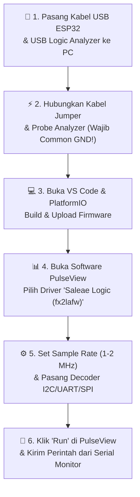
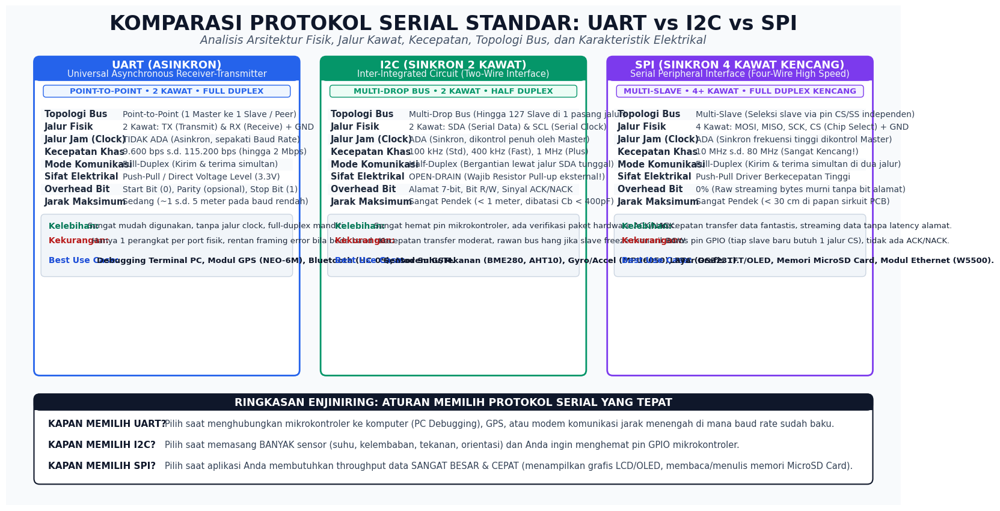
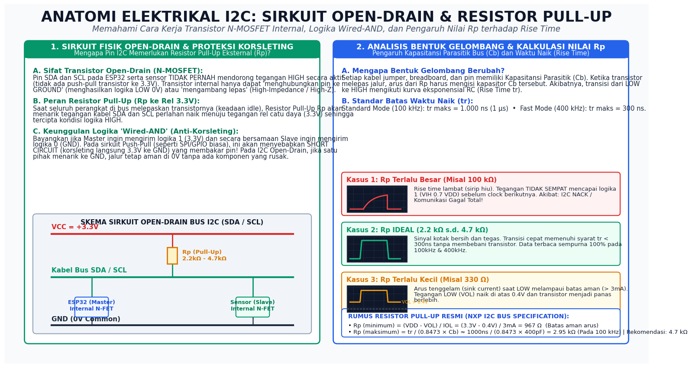
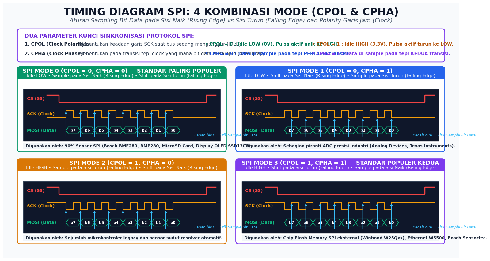
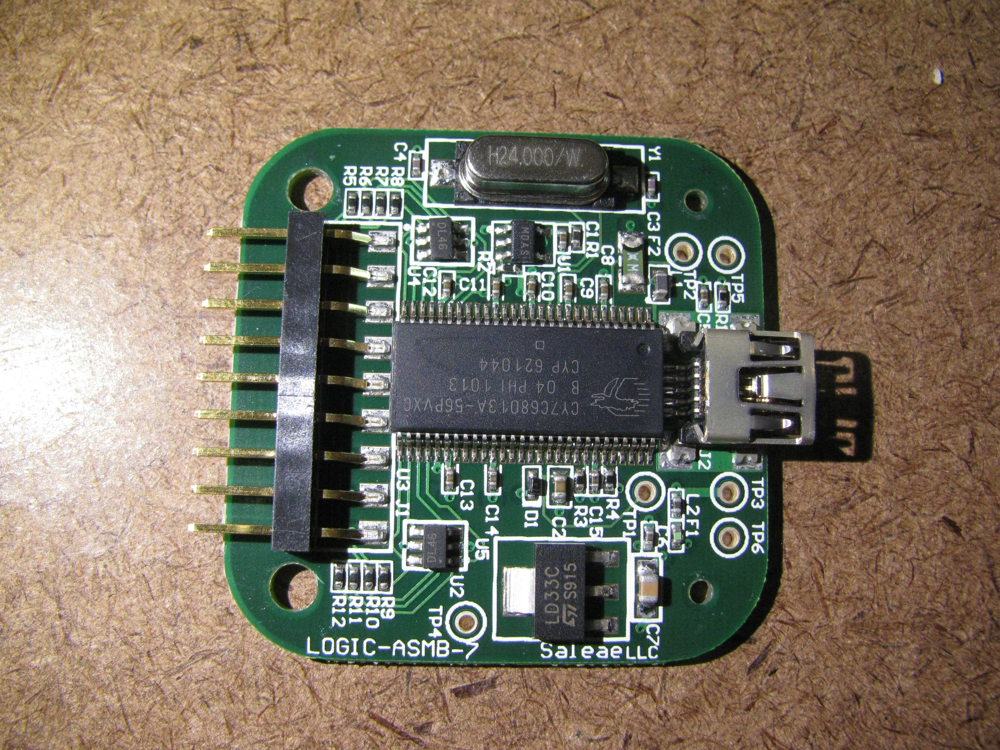
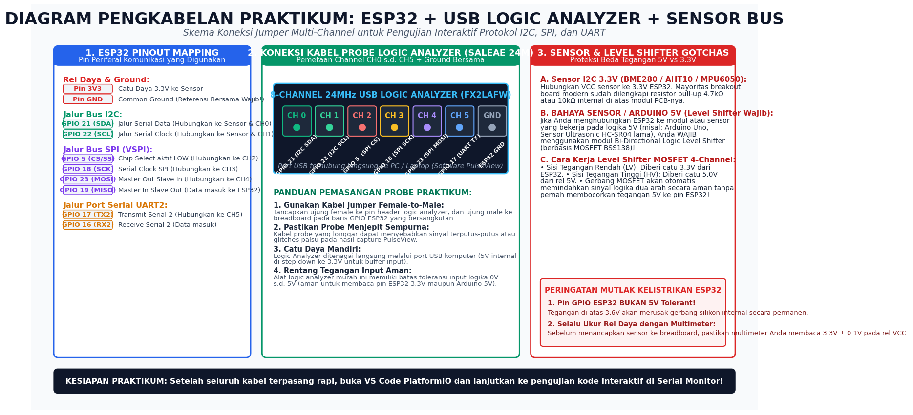
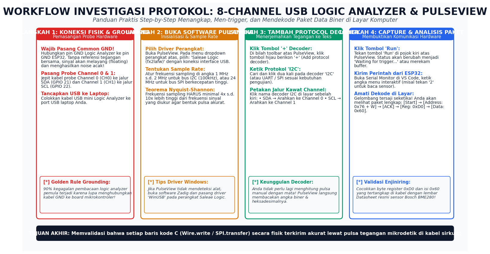
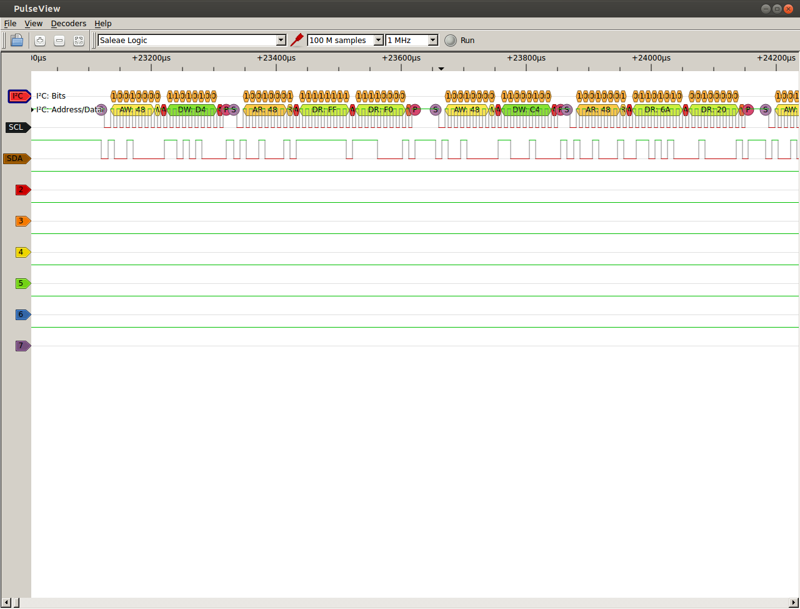

# 📂 MINGGU 05: PROTOKOL KOMUNIKASI SERIAL STANDAR (UART, I2C, SPI) & 8-CHANNEL USB LOGIC ANALYZER
### Laboratorium Sistem Tertanam (Embedded Systems) — Program Studi Sarjana (S1) Teknik Elektro

---

## 🎯 TUJUAN PEMBELAJARAN
Setelah menyelesaikan modul praktikum minggu ini, mahasiswa diharapkan mampu:
1. **Membedakan Arsitektur Protokol Serial:** Menjelaskan perbedaan mendasar karakteristik fisik, pengkabelan, dan waktu (*timing*) antara **UART** (asinkron point-to-point), **I2C** (sinkron multi-drop open-drain), dan **SPI** (sinkron multi-slave kecepatan tinggi).
2. **Menganalisis Sirkuit Elektrikal Open-Drain I2C:** Memahami mengapa pin I2C memerlukan resistor *pull-up* eksternal ($R_p$), cara kerja transistor internal N-MOSFET, proteksi anti-korsleting logika *Wired-AND*, serta pengaruh kapasitansi parasitik bus ($C_b$) terhadap waktu naik (*Rise Time* $t_r$).
3. **Menguasai 4 Mode Sinkronisasi SPI:** Menjelaskan dan mengonfigurasi parameter *Clock Polarity* (**CPOL**) dan *Clock Phase* (**CPHA**) serta peran garis *Chip Select* (**CS**) aktif LOW.
4. **Menerapkan Proteksi Beda Tegangan (Level Shifter):** Memahami mengapa pin ESP32 (3.3V) tidak boleh dihubungkan langsung ke modul/sensor 5V tanpa rangkaian *Bi-directional Logic Level Shifter*.
5. **Investigasi Sinyal Riil dengan Logic Analyzer:** Mengoperasikan **8-Channel 24MHz USB Logic Analyzer** dengan perangkat lunak open-source **PulseView (Sigrok)** untuk merekam pulsa digital fisik dan mendekode paket data biner/heksadesimal langsung di layar komputer.

---

## 🛠️ 1. PANDUAN PERSIAPAN TOOLS & LINGKUNGAN PRAKTIKUM (RAMAH AWAM)

Bagi Anda yang baru pertama kali menggunakan alat ukur instrumen digital (*Logic Analyzer*), jangan khawatir! Ikuti diagram alur di bawah ini langkah demi langkah:



### A. Perangkat Keras (Hardware) yang Dibutuhkan:
* **1x Board ESP32 Development Board** (ESP32-WROOM-32 / ESP32-S3, 30 atau 38 pin).
* **1x 8-Channel 24MHz USB Logic Analyzer** (Modul hitam populer berbasis chip Cypress FX2 CY7C68013A).
* **1x Set Kabel Probe / Jumper DuPont Female-to-Male** (Untuk menjepit pin ESP32 ke pin analyzer).
* **1x Kabel Micro-USB / Type-C Data** (Untuk memprogram dan memonitor ESP32).
* *(Opsional)* **1x Modul Sensor Lingkungan I2C** (Bosch BME280 / BMP280 / AHT10 / MPU6050 / Layar OLED 0.96").  
  *(Catatan: Jika Anda belum memiliki sensor fisik, firmware praktikum ini sudah dilengkapi **Signal Generator Mode** sehingga ESP32 dapat memproduksi paket data buatan sendiri untuk Anda rekam di PulseView!).*

### B. Perangkat Lunak (Software Tools) yang Harus Dibuka:
1. **Visual Studio Code & Ekstensi PlatformIO IDE:**  
   Digunakan untuk meng-compile kode C++ dan membuka Serial Monitor.
2. **PulseView (Sigrok):**  
   Perangkat lunak open-source resmi untuk menampilkan gelombang logika digital dan mendekode protokol komunikasi secara otomatis.
   * **Tautan Unduh Resmi:** [sigrok.org/wiki/Downloads](https://sigrok.org/wiki/Downloads) (Pilih *PulseView Windows Installer*).
3. **Zadig (Khusus Pengguna Windows):**  
   Alat bantu instalasi driver USB universal. Jika PulseView tidak mendeteksi perangkat Logic Analyzer Anda, jalankan Zadig, pilih perangkat `Saleae Logic` atau `Device with VID:04b4 PID:8613`, lalu pasang driver **WinUSB**.

---

## 🧠 2. FONDASI TEORI: ANALOGI RAMAH AWAM & KOMPARASI 3 PROTOKOL SERIAL

Mengapa dunia elektronika tidak hanya memiliki satu jenis protokol komunikasi saja? Mengapa ada **UART**, **I2C**, dan **SPI**?  
Bayangkan tiga skenario komunikasi di dunia nyata berikut ini:

1. **UART (Telepon Kabel Dua Arah):**  
   Seperti dua sahabat yang sedang mengobrol di telepon. Hanya ada dua orang yang terhubung (1-ke-1). Mereka tidak membutuhkan pengatur waktu (tanpa clock), asalkan kedua orang berbicara dengan kecepatan bahasa yang sama (**Baud Rate** yang disepakati, misal: 115200 kata/menit). Jika salah satu berbicara terlalu cepat, percakapan akan kacau (*Framing Error*).
2. **I2C (Ruang Kelas dengan Mikrofon Bersama):**  
   Seperti ruang rapat atau kelas sekolah. Hanya ada **1 kabel suara (SDA)** dan **1 lonceng giliran bicara (SCL)** yang dikendalikan oleh Guru (**Master**). Semua murid (**Slave**) mendengarkan. Guru membunyikan bel, lalu memanggil nomor absen murid tertentu (*Alamat 7-bit*). Murid yang dipanggil mengacungkan tangan tanda siap (*ACK bit*), lalu mereka bertukar informasi. Sangat rapi dan hemat kabel, meskipun harus bergantian bicara (*Half-Duplex*).
3. **SPI (Ban Berjalan Ekspres di Pabrik):**  
   Seperti ban berjalan ekspres di lini produksi pabrik berkecepatan tinggi. Ada jalur khusus untuk barang masuk (**MOSI**), jalur khusus untuk barang keluar (**MISO**), motor penggerak berkecepatan puluhan MHz (**SCK**), dan tuas saklar untuk memilih stasiun mana yang sedang bekerja (**CS/Chip Select**). Sangat cepat tanpa ada jeda panggilan nama, namun membutuhkan banyak kabel fisik.

Berikut adalah lembar komparasi enjiniring mendalam antara ketiganya:


*Sumber gambar: Laboratorium Sistem Tertanam — Analisis arsitektur fisik, jalur kabel, kecepatan, dan karakteristik elektrikal protokol serial.*

### Tabel Parameter Kunci Protokol Serial:

| Parameter Evaluasi | UART | I2C (Two-Wire Interface) | SPI (Serial Peripheral Interface) |
|:---|:---|:---|:---|
| **Kebutuhan Jalur Kabel** | 2 Kawat (TX, RX) + GND | 2 Kawat (SDA, SCL) + GND | 4+ Kawat (MOSI, MISO, SCK, CS) + GND |
| **Sifat Jam (Clocking)** | **Asinkron** (Tanpa clock fisik) | **Sinkron** (Clock SCL dari Master) | **Sinkron** (Clock SCK kecepatan tinggi) |
| **Topologi Jaringan** | Point-to-Point (1 Master, 1 Slave) | Multi-Drop Bus (s.d. 127 Slave) | Multi-Slave (1 Jalur CS per Slave) |
| **Kecepatan Khas** | 9.600 s.d. 115.200 bps | 100 kHz (Std) s.d. 400 kHz (Fast) | 10 MHz s.d. 80 MHz (Sangat Tinggi) |
| **Mode Transmisi** | **Full-Duplex** (Kirim & terima simultan) | **Half-Duplex** (Bergantian di jalur SDA) | **Full-Duplex** (Simultan di MOSI & MISO) |
| **Sifat Sirkuit Fisik** | Push-Pull / Direct Voltage (3.3V) | **Open-Drain (Wajib Pull-Up $R_p$)** | Push-Pull Driver Kecepatan Tinggi |
| **Overhead Protokol** | Start bit (0), Stop bit (1), Parity | Alamat 7-bit, Bit R/W, Sinyal ACK/NACK | **0% Overhead** (Aliran byte mentah) |
| **Jarak Transmisi Aman** | Sedang (~1 s.d. 5 meter) | Sangat Pendek (< 1 meter di PCB) | Sangat Pendek (< 30 cm di jalur PCB) |
| **Aplikasi Ideal** | Debug terminal PC, GPS, Bluetooth | Sensor Lingkungan (BME280, MPU6050) | Display OLED/TFT, MicroSD, Ethernet |

---

## ⚡ 3. ANATOMI ELEKTRIKAL I2C: SIRKUIT OPEN-DRAIN & RESISTOR PULL-UP

Banyak pemula bertanya: *"Mengapa saat saya menghubungkan sensor I2C ke ESP32, sensornya tidak terbaca jika kabel jumper terlalu panjang atau tidak ada resistor pull-up?"*  
Jawabannya terletak pada arsitektur transistor silikon di dalam pin I2C:


*Sumber gambar: Laboratorium Sistem Tertanam — Analisis sirkuit transistor internal N-MOSFET, proteksi korsleting Wired-AND, dan analisis bentuk gelombang RC rise time.*

### A. Apa itu Sirkuit Open-Drain?
Pada pin GPIO digital biasa (tipe *Push-Pull*), terdapat dua transistor: satu transistor terhubung ke 3.3V (untuk menarik ke HIGH), dan satu transistor terhubung ke GND (untuk menarik ke LOW).  
Namun, pada pin I2C (**SDA** dan **SCL**), transistor internal yang terhubung ke 3.3V **ditiadakan sama sekali**! Hanya ada satu buah transistor N-MOSFET yang terhubung ke GROUND:
* **Saat mikrokontroler ingin mengirim logika 0 (LOW):** Transistor N-MOSFET diaktifkan (ON), sehingga jalur kabel ditarik paksa ke tanah (0 Volt).
* **Saat mikrokontroler ingin mengirim logika 1 (HIGH):** Transistor dimatikan (OFF). Pin berada pada kondisi mengambang (*High-Impedance / High-Z*).  
* **Siapa yang menaikkan tegangan ke 3.3V?** Resistor eksternal yang dinamakan **Resistor Pull-Up ($R_p$)** yang terhubung ke rel catu daya 3.3V!

### B. Mengapa Arsitektur Ini Brilian? (Logika Anti-Korsleting *Wired-AND*)
Bayangkan jika menggunakan pin *Push-Pull* biasa: jika Master mencoba mengirim tegangan 3.3V sementara Slave secara tidak sengaja mencoba mengirim 0V (GND), maka rel daya 3.3V akan terhubung langsung ke GND tanpa hambatan! Ini dinamakan **hubungan singkat (short circuit / bus contention)** yang akan membakar pin mikrokontroler seketika.  
Dengan arsitektur **Open-Drain**:
* Jika Master melepas pin (menginginkan HIGH) dan Slave menarik ke GND (menginginkan LOW), tegangan kabel dengan aman tetap berada di 0V. **Tidak ada komponen yang rusak!**

### C. Analisis Bentuk Gelombang & Kapasitansi Parasitik Bus ($C_b$)
Setiap kabel jumper, jalur tembaga PCB, dan pin IC memiliki kapasitansi liar ke ground yang disebut **Bus Capacitance ($C_b$)** (biasanya 50 pF hingga 400 pF).  
Saat transistor melepaskan jalur, arus dari resistor pull-up $R_p$ harus mengisi kapasitor $C_b$ tersebut. Proses pengisian ini membutuhkan waktu yang mengikuti kurva eksponensial $RC$, yang dikenal sebagai **Waktu Naik (Rise Time, $t_r$)**:

1. **Jika $R_p$ Terlalu Besar (misalnya $100\text{ k}\Omega$):**  
   Arus pengisian terlalu kecil. Waktu naik $t_r$ menjadi sangat lambat dan melengkung seperti sirip hiu. Sebelum tegangan sempat menyentuh ambang logika 1 ($V_{IH} = 0.7 \times V_{DD} \approx 2.31\text{ V}$), pulsa clock berikutnya sudah datang. Akibatnya: **Data korup, I2C menghasilkan NACK, sensor gagal terdeteksi!**
2. **Jika $R_p$ Terlalu Kecil (misalnya $330\ \Omega$):**  
   Arus yang mengalir saat transistor menarik ke LOW menjadi terlalu besar ($I > 3\text{ mA}$). Tegangan LOW ($V_{OL}$) naik melampaui 0.4V dan transistor silikon internal mikrokontroler menjadi panas.
3. **Nilai $R_p$ Ideal (Rekomendasi Standar NXP):**  
   Gunakan nilai antara **$2.2\text{ k}\Omega$ hingga $4.7\text{ k}\Omega$** untuk komunikasi stabil pada kecepatan 100 kHz dan 400 kHz.

---

## 🔄 4. ARSITEKTUR SPI & 4 KOMBINASI MODE (CPOL & CPHA)

Protokol SPI (*Serial Peripheral Interface*) adalah raja kecepatan untuk komunikasi jarak dekat pada sistem tertanam. Tidak ada bit alamat atau verifikasi ACK yang memperlambat laju data.  
Namun, agar dua perangkat SPI dapat saling mengerti bit data yang dikirim, keduanya wajib menggunakan kombinasi **Mode SPI** yang sama:


*Sumber gambar: Laboratorium Sistem Tertanam — Aturan sampling data bit pada sisi naik (rising edge) vs sisi turun (falling edge) dan status idle garis clock.*

### Dua Parameter Kunci SPI:
1. **Clock Polarity (CPOL):** Menentukan posisi garis **SCK** saat sedang menganggur (*IDLE*):
   * $\text{CPOL} = 0$: Garis SCK diam di posisi **LOW (0V)**. Pulsa aktif bergerak naik ke HIGH.
   * $\text{CPOL} = 1$: Garis SCK diam di posisi **HIGH (3.3V)**. Pulsa aktif bergerak turun ke LOW.
2. **Clock Phase (CPHA):** Menentukan pada transisi tepi pulsa ke berapa bit data di-*sample* (ditangkap / dibaca):
   * $\text{CPHA} = 0$: Data di-sample pada **transisi tepi PERTAMA**.
   * $\text{CPHA} = 1$: Data di-sample pada **transisi tepi KEDUA**.

### Tabel 4 Mode SPI:
* **SPI Mode 0 (CPOL=0, CPHA=0):** Idle LOW, data di-sample pada *Rising Edge*. (**Paling banyak digunakan di dunia**, misal: SD Card, modul RFID RC522, layar OLED SSD1306, sensor Bosch BME280).
* **SPI Mode 1 (CPOL=0, CPHA=1):** Idle LOW, data di-sample pada *Falling Edge*.
* **SPI Mode 2 (CPOL=1, CPHA=0):** Idle HIGH, data di-sample pada *Falling Edge*.
* **SPI Mode 3 (CPOL=1, CPHA=1):** Idle HIGH, data di-sample pada *Rising Edge*. (Pilihan populer kedua, misal: chip Flash SPI Winbond W25Qxx dan Ethernet W5500).

> [!TIP]
> **ATURAN EMAS SPI:**  
> Selalu periksa lembar *Datasheet* komponen Anda pada bagian *"SPI Timing Characteristics"*. Jika datasheet menyebutkan *"Data is latched on the rising edge with clock idling low"*, maka konfigurasi mikrokontroler Anda wajib diatur ke **SPI Mode 0**.

---

## 🛡️ 5. LEVEL SHIFTER & PROTEKSI KELISTRIKAN (5V VS 3.3V)

> [!CAUTION]
> **PERINGATAN KERUSAKAN HARDWARE:**  
> Seluruh pin GPIO pada SoC ESP32 beroperasi pada batas logika **3.3 Volt**. ESP32 **TIDAK toleran terhadap tegangan 5 Volt**!  
> Jika Anda menghubungkan pin output dari sensor 5V (seperti Arduino Uno, modul sensor ultrasonik HC-SR04 lama, atau sensor industri 5V) langsung ke pin ESP32, silikon internal penerima pin akan mengalami *dielectric breakdown* dan **RUSAK PERMANEN**!

### Solusi Enjiniring: Bi-Directional Logic Level Shifter
Gunakan modul konverter level logika 4-channel berbasis MOSFET (biasanya BSS138):
* **Sisi Low Voltage (LV):** Dihubungkan ke rel **3.3V** ESP32.
* **Sisi High Voltage (HV):** Dihubungkan ke rel **5.0V** mikrokontroler/sensor eksternal.
* **Jalur GND:** Dihubungkan ke Ground bersama (*Common Ground*).
* Modul ini secara otomatis menerjemahkan sinyal bolak-balik antara 3.3V dan 5V tanpa menimbulkan distorsi waktu pada pulsa serial I2C atau UART.

---

## 🔬 6. PANDUAN PRAKTIKUM DENGAN USB LOGIC ANALYZER & PULSEVIEW

Inilah bagian inti praktikum minggu ini: kita akan melihat langsung bentuk pulsa elektrik dan isi paket data biner yang mengalir di dalam kabel sirkuit!

### A. Mengenal Alat: 8-Channel 24MHz USB Logic Analyzer
Alat praktikum kita berbentuk kotak kecil dengan konektor USB dan 10 pin header:


*Foto makro papan sirkuit USB Logic Analyzer 8-Channel memperlihatkan mikrokontroler Cypress FX2 CY7C68013A yang bertugas mengalirkan sampel logika digital kecepatan tinggi ke PC via USB (Sumber: Wikimedia Commons, karya Myself248, lisensi Creative Commons Attribution-ShareAlike 2.0 Generic).*

Alat ini mampu mengambil sampel logika digital (0 atau 1) secara simultan pada 8 channel dengan kecepatan hingga **24 juta sampel per detik (24 MHz)**!

### B. Diagram Pengkabelan Fisik (Wiring Guide)
Hubungkan pin-pin ESP32 ke probe Logic Analyzer sesuai dengan diagram skematik berikut:


*Sumber gambar: Laboratorium Sistem Tertanam — Pemetaan channel jumper ESP32 ke USB Logic Analyzer.*

#### Tabel Koneksi Pin:
| Probe Logic Analyzer | Pin Fisik ESP32 | Fungsi Protokol | Warna Jumper Rekomendasi |
|:---|:---|:---|:---|
| **GND** | **ESP32 GND** | **Common Ground (MUTLAK WAJIB!)** | Hitam |
| **Channel 0 (CH0)** | **GPIO 21** | I2C SDA (Serial Data) | Hijau |
| **Channel 1 (CH1)** | **GPIO 22** | I2C SCL (Serial Clock) | Kuning |
| **Channel 2 (CH2)** | **GPIO 5** | SPI CS (Chip Select) | Merah |
| **Channel 3 (CH3)** | **GPIO 18** | SPI SCK (Clock SPI) | Oranye |
| **Channel 4 (CH4)** | **GPIO 23** | SPI MOSI (Data Master Keluar) | Ungu |
| **Channel 5 (CH5)** | **GPIO 17** | UART2 TX (Transmit Serial 2) | Biru |

---

### C. Alur Kerja Praktikum di Software PulseView
Ikuti 4 langkah terpandu berikut untuk memulai analisis sinyal:


*Sumber gambar: Laboratorium Sistem Tertanam — Alur kerja investigasi protokol serial dengan PulseView.*

#### Langkah 1: Hubungkan Hardware & Buka Software PulseView
1. Tancapkan USB ESP32 dan USB Logic Analyzer ke komputer Anda.
2. Buka aplikasi **PulseView**.
3. Pada dropdown perangkat di bilah atas, pastikan terpilih: **`Saleae Logic (fx2lafw)`** dengan koneksi `USB`.

#### Langkah 2: Konfigurasi Frekuensi Sampling (Sample Rate)
* Untuk mengukur bus **I2C (100 kHz)** dan **UART (115200 bps)**:  
  Atur sample rate di angka **`1 MHz`** atau **`2 MHz`** dengan jumlah sampel **`1 M samples`** atau **`5 M samples`**.  
  *(Aturan Nyquist: Frekuensi sampling minimal 10x lebih tinggi dari frekuensi sinyal agar transisi pulsa tidak terlewat).*
* Untuk mengukur bus **SPI (1 MHz)**:  
  Atur sample rate di angka **`12 MHz`** atau **`24 MHz`**.

#### Langkah 3: Menambahkan Protocol Decoder
Inilah fitur ajaib dari software PulseView: Anda tidak perlu lagi menerjemahkan kotak-kotak pulsa secara manual dengan mata!
1. Di toolbar bagian atas, klik tombol hijau berikon **`+`** (*Add protocol decoder*).
2. Ketik **`I2C`** pada kotak pencarian, lalu tekan Enter. Jalur decoder I2C akan muncul di bawah channel sinyal.
3. Klik pada label nama **`I2C`** di sisi kiri layar untuk memetakan pin:
   * **SDA:** Pilih **`D0`** (Channel 0).
   * **SCL:** Pilih **`D1`** (Channel 1).
4. Ulangi langkah di atas jika ingin menambahkan decoder **`UART`** (petakan RX ke `D5`, Baud rate `115200`) atau decoder **`SPI`** (petakan CS ke `D2`, CLK ke `D3`, MOSI ke `D4`).


*Tangkapan layar software PulseView memperlihatkan pulsa gelombang fisik pada channel SDA/SCL yang berhasil didekode secara otomatis menjadi paket data [Start], [Alamat I2C], [Bit R/W], [ACK], dan byte muatan heksadesimal (Sumber: Wikimedia Commons, karya Xofc, lisensi Creative Commons Attribution-ShareAlike 3.0 Unported).*

---

## 💻 7. EKSEKUSI PROGRAM & PENGUJIAN INTERAKTIF

Starter code praktikum telah siap pada berkas [`src/main.cpp`](file:///c:/Users/anton/vibecoding/EmbeddedSystem/labs/week-05-serial-protocols-logic-analyzer/src/main.cpp).

### Cara Menguji Program:
1. Buka folder lab ini di VS Code.
2. Hubungkan board ESP32 via kabel USB.
3. Buka Terminal PlatformIO (`Ctrl + ~`) dan ketik perintah kompilasi serta upload:
   ```bash
   pio run -d labs/week-05-serial-protocols-logic-analyzer -t upload
   ```
4. Buka Serial Monitor dengan baud rate 115200:
   ```bash
   pio device monitor -b 115200
   ```
5. Layar terminal interaktif akan menyambut Anda:
   ```text
   ==================================================================
     LAB SISTEM TERTANAM: PROTOKOL SERIAL & 8-CHANNEL LOGIC ANALYZER 
     Platform: ESP32-WROOM-32 | Clock CPU: 240 MHz | Framework: Arduino 
   ==================================================================
   Pemetaan Pin Jumper ke Probe USB Logic Analyzer:
     • CH 0 -> GPIO 21 (I2C SDA  - Serial Data)
     • CH 1 -> GPIO 22 (I2C SCL  - Serial Clock)
     • CH 2 -> GPIO 5  (SPI CS   - Chip Select, Aktif LOW)
     • CH 3 -> GPIO 18 (SPI SCK  - Clock SPI)
     • CH 4 -> GPIO 23 (SPI MOSI - Master Out Slave In)
     • CH 5 -> GPIO 17 (UART TX2 - Transmit Serial 2)
     • GND  -> ESP32 GND (WAJIB: Referensi Ground Bersama!)
   ------------------------------------------------------------------
   PILIHAN MENU PENGUJIAN:
     [1] Jalankan I2C Bus Scanner (Deteksi Alamat 0x01 s.d. 0x7F)
     [2] Uji Transaksi I2C (Baca Register Chip-ID 0xD0)
     [3] Kirim Paket Data UART Terstruktur (Frame Start/Checksum/Stop)
     [4] Uji Transaksi SPI (Perbandingan Mode 0 vs Mode 3)
     [5] Aktifkan / Matikan Mode Burst Kontinu (Untuk Capture PulseView)
     [h] Tampilkan Ulang Menu Bantuan Ini
   ==================================================================
   Pilih opsi [1-5 / h]: 
   ```

---

### Skenario Pengujian Praktikum Mandiri:

#### Skenario A: Menguji Menu `[1]` (I2C Scanner)
* Tekan tombol **`1`** pada keyboard di Serial Monitor.
* ESP32 akan memindai seluruh alamat $0\text{x}01$ hingga $0\text{x}7\text{F}$.
* Jika Anda memasang sensor BME280, angka `76` akan muncul di tabel. Jika memasang layar OLED, angka `3C` akan muncul.

#### Skenario B: Menguji Menu `[3]` (Paket UART Terstruktur)
* Tekan tombol **`3`** pada Serial Monitor.
* ESP32 mengirim 6 byte data biner melalui GPIO 17 (TX2):
  $$\text{Paket} = [\text{0xAA}]\ [\text{Sequence}]\ [\text{Data Tinggi}]\ [\text{Data Rendah}]\ [\text{Checksum XOR}]\ [\text{0x55}]$$
* Buka PulseView, aktifkan decoder **UART** pada Channel 5 (Baud rate: 115200). Anda akan melihat paket heksadesimal tersebut tertera di layar komputer!

#### Skenario C: Menguji Menu `[4]` (Perbandingan SPI Mode 0 vs Mode 3)
* Tekan tombol **`4`** pada Serial Monitor.
* Perhatikan saluran **CH3 (SCK)** di PulseView sebelum pulsa CS turun:
  * Pada transaksi pertama (**Mode 0**): Tegangan SCK menganggur di **0V (LOW)**.
  * Pada transaksi kedua (**Mode 3**): Tegangan SCK menganggur di **3.3V (HIGH)**.

#### Skenario D: Menguji Menu `[5]` (Mode Latihan / Training Burst Kontinu)
* Tekan tombol **`5`** pada Serial Monitor.
* ESP32 akan terus-menerus mengirimkan paket I2C, SPI, dan UART secara sinkron setiap 600 milidetik.
* Di software PulseView, Anda cukup mengeklik tombol **Run** sekali, dan seluruh saluran akan terisi data nyata tanpa perlu terburu-buru menekan tombol keyboard!

---

## 📝 8. LEMBAR ASESMEN & TANTANGAN MAHASISWA

Kerjakan tugas mandiri berikut pada laporan praktikum Anda:

1. **Investigasi Bit ACK/NACK pada I2C:**  
   Ambil tangkapan layar (*screenshot*) dari PulseView saat melakukan pembacaan register I2C (Menu 2). Tunjukkan letak bit **START**, bit **ACK** (logika LOW pada clock ke-9), dan bit **STOP**. Jelaskan apa yang terjadi pada bentuk gelombang jika sensor sengaja dicabut kabel SDA-nya!
2. **Kalkulasi Checksum UART:**  
   Dari paket data UART yang tertangkap pada Channel 5, tuliskan kembali 6 byte heksadesimal yang terbaca. Buktikan secara manual menggunakan operasi bitwise XOR bahwa byte Checksum bernilai benar!
3. **Analisis Waktu Naik (Rise Time):**  
   Gunakan fitur *Cursor / Measurement* pada PulseView untuk mengukur durasi waktu naik ($t_r$) sinyal SDA dari 10% ke 90% tegangan catu daya. Apakah nilainya memenuhi spesifikasi I2C Fast Mode ($t_r \le 300\text{ ns}$)?

---

## 💡 9. PANDUAN TROUBLESHOOTING & GOTCHAS

| Gejala Masalah | Kemungkinan Penyebab | Solusi Tindakan Enjiniring |
|:---|:---|:---|
| **PulseView menampilkan noise acak / garis bergerigi liar** | Kabel **GND** Logic Analyzer belum terhubung ke GND ESP32. | **Wajib pasang Common Ground!** Sambungkan pin GND analyzer ke rel ground mikrokontroler. |
| **PulseView menampilkan tulisan "Device not found"** | Driver USB belum terpasang dengan benar di sistem operasi Windows. | Jalankan software **Zadig**, pilih perangkat `Saleae Logic`, lalu pasang driver `WinUSB`. |
| **I2C Scanner menampilkan "ER" (Error) di seluruh alamat** | Jalur SDA atau SCL korslet ke ground, atau bus I2C macet (*bus hang*). | Periksa kabel jumper apakah ada yang menyentuh pin lain. Tambahkan resistor pull-up 4.7kΩ ke 3.3V. |
| **Decoder UART menampilkan karakter aneh / Framing Error** | Baud rate pada decoder PulseView tidak cocok dengan kode program C++. | Klik decoder UART di PulseView, pastikan pengaturan baud rate bernilai **`115200`** (sesuai `UART2_BAUD_RATE`). |
| **Paket SPI terpotong atau pulsa clock tampak miring segitiga** | Frekuensi sampling PulseView terlalu rendah untuk mengukur sinyal clock tinggi. | Naikkan frekuensi sampling di toolbar PulseView ke angka minimal **`12 MHz`** atau **`24 MHz`**. |

---

*Selamat bereksperimen dengan protokol komunikasi serial dan perangkat instrumen logika digital!*
