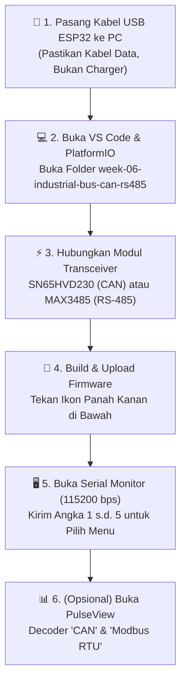
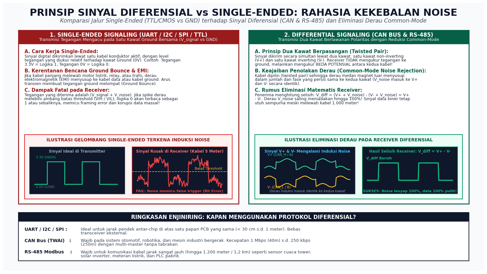
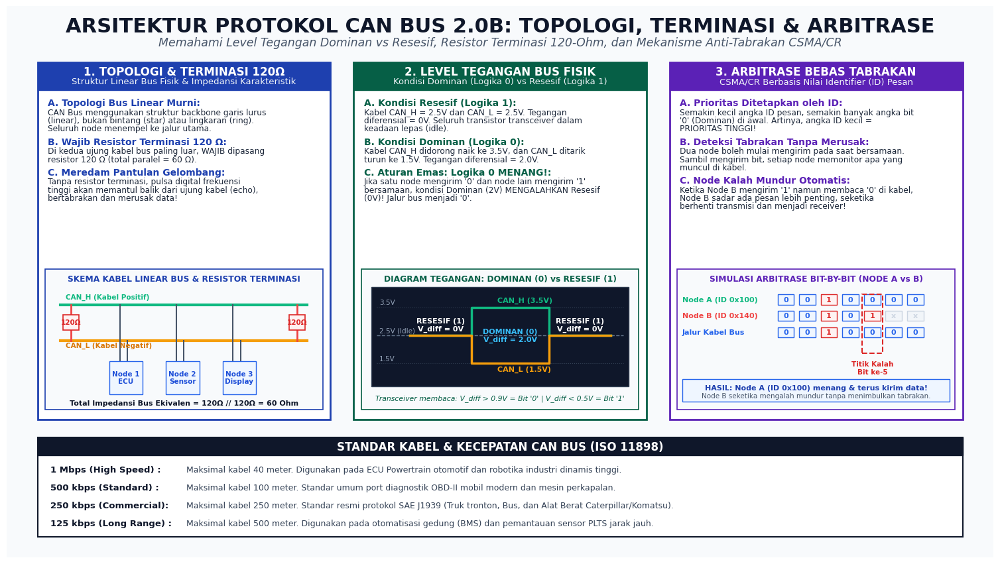
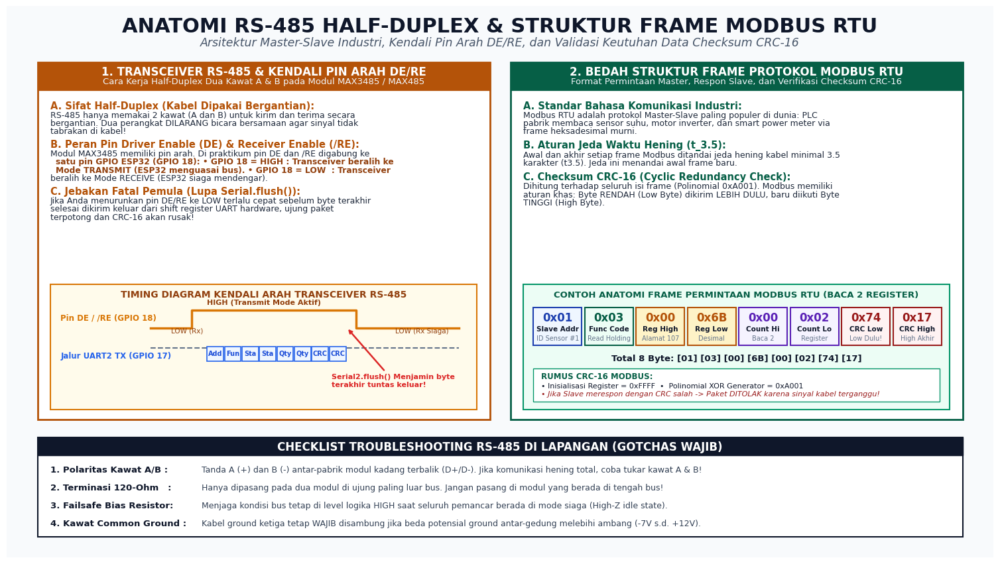
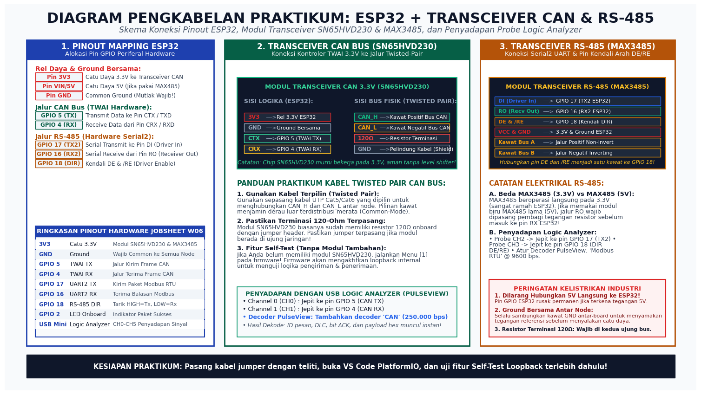

# 📂 MINGGU 06: KOMUNIKASI INDUSTRI JARAK JAUH (CAN BUS / TWAI & RS-485 MODBUS RTU)
### Laboratorium Sistem Tertanam (Embedded Systems) — Program Studi Sarjana (S1) Teknik Elektro

---

## 🎯 TUJUAN PEMBELAJARAN
Setelah menyelesaikan modul praktikum minggu ini, mahasiswa diharapkan mampu:
1. **Memahami Urgensi Komunikasi Industri:** Menjelaskan mengapa bus periferal lokal (UART, I2C, SPI) gagal total ketika ditarik kabel panjang (> 3 meter) di lingkungan industri/pabrik akibat derau motor listrik, penurunan tegangan resistif kabel, dan beda potensial *ground loop*.
2. **Menguasai Prinsip Pensinyalan Diferensial (*Differential Signaling*):** Menganalisis cara kerja sepasang kawat bertegangan terbalik ($V_+$ dan $V_-$), peran kabel pilin (*twisted-pair*), serta pembuktian matematis penolakan derau mode bersama (*Common-Mode Rejection Ratio / CMRR*).
3. **Mengoperasikan Periferal TWAI ESP32 (CAN Bus 2.0B):** Mengonfigurasi kontroler *Two-Wire Automotive Interface* (TWAI) pada ESP32, memahami level tegangan Dominan (logika 0) vs Resesif (logika 1), memasang resistor terminasi $120\ \Omega$, serta menganalisis mekanisme arbitrase pesan bebas tabrakan (*Non-destructive Bitwise Arbitration* CSMA/CR).
4. **Mengimplementasikan Transceiver RS-485 & Protokol Modbus RTU:** Mengendalikan arah aliran data *half-duplex* (pin DE dan /RE), menyusun struktur frame heksadesimal Modbus RTU (*Function Code 03: Read Holding Registers*), dan memvalidasi keutuhan data kabel menggunakan algoritma *Cyclic Redundancy Check* (CRC-16).
5. **Mendiagnosis Kesehatan Bus & Penyadapan Sinyal:** Mengoperasikan fitur diagnostik internal TWAI (*Transmit/Receive Error Counter* & *Bus-Off Recovery*), serta menyadap dan mendekode paket fisik data CAN dan Modbus menggunakan **USB Logic Analyzer** dan software open-source **PulseView**.

---

## 🛠️ 1. PANDUAN PERSIAPAN TOOLS & LINGKUNGAN PRAKTIKUM (RAMAH AWAM)

Bagi rekan-rekan mahasiswa yang baru pertama kali berkenalan dengan protokol otomotif (CAN Bus) atau protokol otomasi industri (RS-485 Modbus), jangan merasa cemas! Seluruh materi dan kode program pada modul ini telah dirancang bertahap (*step-by-step*). 

Bahkan, jika di meja praktikum Anda **belum memiliki modul transceiver fisik**, Anda tetap bisa menguji pengiriman dan penerimaan frame CAN secara nyata melalui fitur **Self-Test Loopback Internal** bawaan mikrokontroler ESP32!

Ikuti diagram alur persiapan di bawah ini:



### Checklist Kesiapan Praktikan (Cek Sebelum Mulai):
* [ ] Board ESP32 terpasang rapat ke port USB komputer via kabel data micro-USB / Type-C.
* [ ] Ekstensi **PlatformIO IDE** pada VS Code sudah terpasang dan berstatus aktif (*Ready*).
* [ ] Folder kerja `labs/week-06-industrial-bus-can-rs485` telah dibuka di VS Code.
* [ ] Terminal Serial Monitor telah diatur pada kecepatan **`115200 baud`** (sudah terkonfigurasi otomatis di `platformio.ini`).
* [ ] *(Jika menggunakan transceiver)* Jalur **Common GND** antara ESP32 dan modul transceiver sudah terhubung kuat.
* [ ] *(Jika menggunakan USB Logic Analyzer)* Software **PulseView** dan driver **WinUSB (Zadig)** sudah siap di komputer.

---

### A. Perangkat Keras (Hardware) yang Digunakan:

| No | Nama Perangkat | Jumlah | Keterangan / Alternatif |
|:---|:---|:---:|:---|
| 1 | **ESP32 Development Board** | 1 atau 2 unit | ESP32-WROOM-32 / ESP32-S3 (30 atau 38 pin). Jika ada 2 board, bisa langsung komunikasi antar-node. Jika hanya ada 1 board, gunakan Menu [1] Self-Test! |
| 2 | **Modul Transceiver CAN 3.3V** | 1 unit | Chip **SN65HVD230** atau **VP230**. *Peringatan: Chip TJA1050 / MCP2551 membutuhkan daya 5V dan level shifter!* |
| 3 | **Modul Transceiver RS-485 3.3V** | 1 unit | Chip **MAX3485**. *(Bisa juga modul MAX485 5V lama, asalkan jalur RO dipasang pembagi tegangan sebelum masuk ke RX ESP32)*. |
| 4 | **Kabel UTP (Kabel LAN Cat5/Cat6)** | 1 meter | Digunakan untuk kabel bus fisik *Twisted-Pair* antar-node. |
| 5 | **Resistor 120 $\Omega$** | 2 buah | Resistor terminasi bus (biasanya sudah ada di atas modul transceiver berupa jumper). |
| 6 | **USB Logic Analyzer 8-Channel 24MHz** | 1 unit | Instrumen penyadap sinyal fisik ke software PulseView. |
| 7 | **Kabel Jumper DuPont (F-F & F-M)** | 1 set | Untuk menyambungkan pin ESP32 ke modul transceiver dan probe analyzer. |

---

### B. Perangkat Lunak (Software Tools) yang Harus Dibuka:

1. **Visual Studio Code dengan Ekstensi PlatformIO IDE:**
   * Digunakan untuk membuka proyek praktikum, memodifikasi kode sumber di [src/main.cpp](file:///c:/Users/anton/vibecoding/EmbeddedSystem/labs/week-06-industrial-bus-can-rs485/src/main.cpp), melakukan proses kompilasi (*Build*), dan mengunggah (*Upload*) firmware ke board ESP32.
2. **Serial Monitor PlatformIO (Baud Rate 115200 bps):**
   * Antarmuka teks interaktif dua arah. Anda cukup mengetikkan angka `1`, `2`, `3`, `4`, atau `5` di kolom input terminal lalu menekan tombol `Enter` untuk menguji mode praktikum yang diinginkan.
3. **PulseView (Sigrok Logic Analyzer Suite):**
   * *(Tautan Unduh Resmi: [sigrok.org/wiki/Downloads](https://sigrok.org/wiki/Downloads))*.
   * Digunakan untuk merekam bentuk gelombang biner di kabel dan menjalankan *Protocol Decoder* bawaan (`CAN` dan `Modbus RTU`).

---

## ⚡ 2. FONDASI TEORI: MENGAPA BUS INDUSTRI BERBEDA DENGAN BUS MIKROKONTROLER BIASA?

Pada Minggu 05, kita telah membedah **UART**, **I2C**, dan **SPI**. Ketiga protokol tersebut sangat hebat untuk menghubungkan sensor suhu atau layar OLED yang menempel pada satu papan sirkuit (PCB) yang sama dengan mikrokontroler. 

Namun, bayangkan jika Anda bekerja di sebuah pabrik semen atau mobil listrik:
* Sensor suhu air pendingin berada di blok mesin yang bergetar hebat.
* Layar *dashboard* pengemudi berjarak **15 meter** dari mesin.
* Di sepanjang jalur kabel terdapat motor induksi 3-fase, inverter, dan kontaktor magnetik yang terus memercikkan lonjakan elektromagnetik (*Electro-Magnetic Interference / EMI*) ribuan Volt!

Jika Anda mencoba menarik kabel I2C atau UART sejauh 15 meter melewati motor pabrik, **sistem Anda akan mengalami kegagalan total**:
1. **Kapasitansi Kabel Menghancurkan Pulsa:** Kabel panjang memiliki kapasitansi liar yang tinggi, membuat pulsa digital melengkung dan kehilangan bentuk persegi aslinya.
2. **Derau Elektromagnetik Menghasilkan Data Palsu:** Gelombang medan magnet dari motor akan menginduksi tegangan liar ke kabel tunggal (misal kabel TX UART). Tegangan 0V bisa melonjak tiba-tiba menjadi 3V, menciptakan karakter acak (*garbage bytes*).
3. **Perbedaan Potensial Ground (*Ground Loop*):** Titik Ground di gedung A dan gedung B jarang sekali bernilai tepat 0.0 Volt yang sama. Beda potensial ground hingga beberapa Volt bisa mengalirkan arus liar di kabel ground dan membakar port mikrokontroler!

Untuk mengatasi mimpi buruk ini, para insinyur menciptakan teknologi **Pensinyalan Diferensial (*Differential Signaling*)**:


*Sumber gambar: Laboratorium Sistem Tertanam — Analisis komparasi Single-Ended Signaling vs Differential Signaling, penyerapan derau simetris pada kabel Twisted-Pair, dan kalkulasi CMRR.*

---

### A. Mengapa Pensinyalan Diferensial Begitu Tangguh?

Perhatikan tabel perbandingan fundamental berikut:

| Aspek Karakteristik | Sinyal Tunggal (*Single-Ended*) | Pensinyalan Diferensial (*Differential*) |
|:---|:---|:---|
| **Contoh Protokol** | UART (TX/RX), I2C, SPI | **CAN Bus, RS-485, RS-422, USB, Ethernet** |
| **Jumlah Kawat per Sinyal** | 1 Kawat Sinyal + 1 Kawat Ground | **2 Kawat Berpasangan ($V_+$ dan $V_-$)** |
| **Titik Acuan Tegangan** | Terhadap Ground lokal (0V) | **Selisih tegangan antar-kedua kawat ($V_{diff} = V_+ - V_-$)** |
| **Pengaruh Derau Luar (EMI)** | Derau langsung menjumlah ke data, merusak logika bit | Derau mengenai kedua kawat secara identik $\rightarrow$ **Saling meniadakan!** |
| **Kekebalan Terhadap Beda Ground** | Sangat rentan rusak jika ground melenceng | Sangat toleran (mampu bertahan pada rentang $-7\text{ V}$ s.d. $+12\text{ V}$) |
| **Jangkauan Transmisi Fisik** | Sangat pendek ($< 1$ s.d. 3 meter) | **Sangat jauh (hingga 1.000 meter / 1 kilometer!)** |

### B. Rahasia Matematika di Balik Kabel Terpilin (*Twisted-Pair*):
Mengapa kawat CAN Bus ($CAN\_H$ dan $CAN\_L$) atau RS-485 ($A$ dan $B$) selalu dipilin saling melilit seperti spiral?
1. Karena kedua kawat dipilin rapat dan berjalan berdampingan, medan interferensi magnetik luar ($V_{noise}$) akan menembus kedua kawat dengan kekuatan dan polaritas yang **persis sama** (*Common-Mode Noise*).
2. Di ujung penerima, chip *transceiver* hanya membaca **selisih tegangan ($V_{diff}$)**:
   $$V_{diff} = (V_+ + V_{noise}) - (V_- + V_{noise}) = V_+ - V_-$$
3. Komponen derau $V_{noise}$ tereliminasi secara sempurna! Sinyal data yang diterima tetap jernih dan murni tanpa ada distorsi.

---

## 🚗 3. ANATOMI PROTOKOL CAN BUS 2.0B (TWAI ESP32)

**CAN Bus (*Controller Area Network*)** diciptakan oleh Robert Bosch GmbH pada tahun 1986 khusus untuk dunia otomotif, dan kini telah distandardisasi secara internasional dalam **ISO 11898**. Pada mikrokontroler ESP32, periferal perangkat keras CAN ini dinamakan **TWAI (*Two-Wire Automotive Interface*)**, yang sepenuhnya kompatibel dengan spesifikasi **CAN 2.0B**.


*Sumber gambar: Laboratorium Sistem Tertanam — Analisis arsitektur topologi linear bus 120-Ohm, level tegangan Dominan vs Resesif, dan simulasi proses arbitrase bit-by-bit CSMA/CR.*

---

### A. Level Tegangan Bus: Dominan (0) vs Resesif (1)
Berbeda dengan logika TTL biasa di mana tegangan tinggi adalah 1 dan tegangan rendah adalah 0, pada CAN Bus berlaku aturan khusus:
* **Kondisi Resesif (Logika 1):**  
  Kedua kawat berada pada tegangan mengambang yang sama ($CAN\_H = 2.5\text{ V}$, $CAN\_L = 2.5\text{ V}$). Selisih tegangannya adalah $V_{diff} = 0\text{ V}$.
* **Kondisi Dominan (Logika 0):**  
  Chip transceiver menarik $CAN\_H$ naik ke $3.5\text{ V}$ dan menarik $CAN\_L$ turun ke $1.5\text{ V}$. Selisih tegangannya menjadi $V_{diff} = 2.0\text{ V}$.
* **Aturan Emas: Logika 0 MENANG!**  
  Jika sebuah node mencoba mengirim logika 1 (melepas kabel) sementara node lain mencoba mengirim logika 0 (menarik kabel), maka kondisi **Dominan (Logika 0) akan mengalahkan Resesif (Logika 1)**! Tegangan kabel seketika berubah menjadi 2.0V. Prinsip kelistrikan inilah yang menjadi fondasi arbitrase anti-tabrakan data.

---

### B. Mengapa Resistor Terminasi 120 $\Omega$ Mutlak Wajib?
Pada frekuensi komunikasi tinggi (misalnya 250 kbps s.d. 1 Mbps), pulsa listrik merambat di sepanjang kawat tembaga sebagai gelombang elektromagnetik.  
* Ketika pulsa listrik mencapai ujung kabel yang terbuka (*open-circuit*), energi gelombang tersebut tidak dapat diserap dan akan **memantul balik (*signal reflection / echo*)** ke arah datangnya sinyal!
* Pantulan gelombang ini bertabrakan dengan pulsa data berikutnya, merusak bentuk sinyal dan memicu *Bit Error* massal.
* Untuk menyerap energi gelombang tersebut, pada **kedua ujung bus paling luar** wajib dipasang resistor terminasi sebesar **$120\ \Omega$** (sesuai impedansi karakteristik kabel transmisi).
* Karena dua buah resistor $120\ \Omega$ terpasang paralel di ujung kiri dan ujung kanan jaringan, total resistansi yang terukur antara kabel $CAN\_H$ dan $CAN\_L$ pada bus yang sehat adalah:
  $$R_{total} = 120\ \Omega \parallel 120\ \Omega = 60\ \Omega$$

> [!TIP]
> **Trik Praktis Lapangan:**  
> Jika jaringan CAN Bus Anda bermasalah, matikan catu daya, lalu ukur resistansi antara pin $CAN\_H$ dan $CAN\_L$ menggunakan Multimeter:
> * Jika terbaca $\approx 60\ \Omega$: **Pemasangan terminasi sempurna!**
> * Jika terbaca $\approx 120\ \Omega$: Hanya ada 1 resistor terminasi yang terpasang (salah satu ujung lupa dipasang).
> * Jika terbaca $\approx \infty\ \Omega$ (Open): Tidak ada resistor terminasi sama sekali!
> * Jika terbaca $< 40\ \Omega$: Terlalu banyak resistor terminasi yang dipasang paralel di modul tengah.

---

### C. Arbitrase Bebas Tabrakan (*CSMA/CR*): Siapa Cepat & Berprioritas Tinggi yang Menang!
Pada CAN Bus, **tidak ada Master sentral**. Seluruh node (ECU mesin, modul rem ABS, sensor baterai) memiliki hak yang sama untuk memulai transmisi kapan saja (*Multi-Master*).  
Bagaimana jika dua node mulai mengirim pesan pada mikrodetik yang persis sama?

1. **Prioritas Ditentukan oleh Nilai ID Pesan (*Identifier*):**  
   Pesan penting (seperti pemicu rem ABS darurat) diberi ID angka kecil (misalnya `0x0A0` biner `00010100000`). Pesan santai (seperti suhu kabin AC) diberi ID angka besar (misalnya `0x205` biner `01000000101`).
2. **Monitoring Mandiri Bit-demi-Bit:**  
   Sambil menyemburkan bit data ke kabel, setiap node secara simultan mendengarkan kembali apa yang muncul di jalur bus fisik.
3. **Momen Mundurnya Node Kalah:**  
   Pada bit ke-2, modul AC mengirim bit `1` (Resesif), tetapi modul rem ABS mengirim bit `0` (Dominan). Karena logika 0 menang di kabel, modul AC mendeteksi bahwa kabel bernilai `0` padahal ia sendiri sedang mengirim `1`.  
   Modul AC langsung sadar: *"Ada pesan lain di jaringan yang jauh lebih penting dari saya!"*  
   Seketika itu juga, modul AC **menghentikan transmisinya tanpa merusak 1 bit pun paket milik modul rem ABS**, dan beralih fungsi menjadi penerima yang patuh. Tidak terjadi tabrakan data (*Zero collision contention*)!

---

## 🏭 4. ANATOMI RS-485 & PROTOKOL MODBUS RTU

Jika CAN Bus adalah raja di dunia otomotif, maka **RS-485 dengan protokol Modbus RTU** adalah raja di dunia otomasi pabrik, bangunan pintar (*Smart Building*), dan pembangkit listrik (PLTS / Inverter Solar).


*Sumber gambar: Laboratorium Sistem Tertanam — Analisis kendali arah DE/RE transceiver MAX3485, jebakan Serial.flush(), format paket heksadesimal Modbus RTU, dan perhitungan CRC-16.*

---

### A. Kendali Arah Transceiver RS-485 (*Pin DE & /RE*)
Berbeda dengan CAN Bus yang mengatur transceiver secara otomatis di tingkat silikon, modul transceiver RS-485 (seperti chip **MAX3485** atau **MAX485**) bekerja secara **Half-Duplex** murni dan membutuhkan kendali arah manual dari pin mikrokontroler:
* **Pin DE (*Driver Enable* - Aktif HIGH):** Ketika pin ini diberi logika `1`, pemancar (*driver*) RS-485 menyala dan siap menyemburkan data UART ke kawat bus A dan B.
* **Pin /RE (*Receiver Enable* - Aktif LOW):** Ketika pin ini diberi logika `0`, penerima (*receiver*) RS-485 aktif dan mendengarkan data dari kawat bus untuk diteruskan ke pin RX mikrokontroler.

> [!IMPORTANT]
> **Praktik Standar Industri:**  
> Pin **DE** dan pin **/RE** selalu dihubungkan menjadi **satu kawat fisik** ke sebuah pin GPIO ESP32 (pada praktikum ini kita menggunakan **GPIO 18**):
> * Tarik **GPIO 18 = HIGH (`1`)**: ESP32 menguasai jalur kabel dan bersiap melakukan **TRANSMIT**.
> * Tarik **GPIO 18 = LOW (`0`)**: ESP32 melepaskan jalur kabel dan bersiap melakukan **RECEIVE** (mendengarkan respon).

---

### B. Jebakan Fatal Pemula: Lupa Memanggil `Serial2.flush()`!
Perhatikan cuplikan kode transmisi RS-485 berikut. Ini adalah kesalahan nomor satu yang sering membuat mahasiswa bingung berjam-jam:

```cpp
// ❌ KODE KELIRU (DATA AKAN RUSAK / TERPOTONG!):
digitalWrite(RS485_DIR_PIN, HIGH);     // 1. Masuk mode kirim
Serial2.write(frame, sizeof(frame));   // 2. Tulis data ke UART buffer
digitalWrite(RS485_DIR_PIN, LOW);      // 3. Langsung kembali ke mode dengar!
```

**Mengapa kode di atas fatal?**  
Fungsi `Serial2.write()` bersifat *non-blocking*; fungsi ini langsung selesai sesaat setelah byte dimasukkan ke dalam antrean RAM software. Namun, chip UART fisik di dalam silikon ESP32 masih membutuhkan waktu beberapa milidetik untuk memompa keluar bit-bit data melalui *shift register*!  
Jika Anda langsung menarik pin DIR ke LOW pada baris berikutnya, **transceiver akan mati sebelum 2 byte terakhir (checksum CRC-16) sempat terkirim keluar**! Slave di ujung kabel tidak akan pernah merespon karena menerima paket yang buntung.

```cpp
// ✅ KODE BENAR & PROFESIONAL:
digitalWrite(RS485_DIR_PIN, HIGH);     // 1. Masuk mode kirim
delayMicroseconds(50);                 // Jeda stabilisasi driver
Serial2.write(frame, sizeof(frame));   // 2. Masukkan data ke antrean
Serial2.flush();                       // 3. WAJIB TUNGGU hingga byte fisik terakhir tuntas keluar dari pin TX!
delayMicroseconds(50);                 // Jeda propagasi kawat
digitalWrite(RS485_DIR_PIN, LOW);      // 4. Baru aman beralih ke mode dengar
```

---

### C. Format Frame Heksadesimal Modbus RTU (Fungsi 03: Baca Holding Register)
Setiap paket permintaan (*Query Frame*) dari Master ke Slave pada protokol Modbus RTU tersusun atas 8 byte heksadesimal murni:

$$\underbrace{\text{[0x01]}}_{\text{Slave ID}} \quad \underbrace{\text{[0x03]}}_{\text{Kode Fungsi}} \quad \underbrace{\text{[0x00] [0x6B]}}_{\text{Alamat Register (107)}} \quad \underbrace{\text{[0x00] [0x02]}}_{\text{Jumlah Register (2)}} \quad \underbrace{\text{[0x74] [0x17]}}_{\text{Checksum CRC-16}}$$

1. **Slave ID (`0x01`):** Alamat sensor yang dituju (rentang 1 s.d. 247).
2. **Function Code (`0x03`):** Perintah `Read Holding Registers` (membaca nilai data sensor yang tersimpan).
3. **Starting Address High & Low (`0x00`, `0x6B`):** Alamat register awal yang ingin dibaca (heksadesimal `0x006B` = desimal 107).
4. **Register Quantity High & Low (`0x00`, `0x02`):** Jumlah register 16-bit yang diminta (membaca 2 register berturutan).
5. **CRC-16 Checksum Low & High (`0x74`, `0x17`):** Kode pengaman integritas transmisi berukuran 16-bit (2 byte).

> [!NOTE]
> **Aturan Urutan Byte CRC Modbus:**  
> Perhitungan CRC menghasilkan nilai integer 16-bit `0x1774`. Namun, aturan resmi spesifikasi Modbus RTU mewajibkan **Byte RENDAH (Low Byte `0x74`) dikirim lebih dahulu**, baru disusul oleh **Byte TINGGI (High Byte `0x17`)**!

---

## 📐 5. DIAGRAM PENGKABELAN HARDWARE & PINOUT RESMI

Berikut adalah panduan penyambungan kawat antara ESP32, modul transceiver CAN (SN65HVD230), modul transceiver RS-485 (MAX3485), serta probe USB Logic Analyzer:


*Sumber gambar: Laboratorium Sistem Tertanam — Skema alokasi pinout periferal hardware ESP32, modul transceiver SN65HVD230 & MAX3485, dan titik penyadapan probe USB Logic Analyzer.*

---

### Tabel Ringkasan Pinout Hardware (Praktikum Minggu 06):

| Pin ESP32 | Periferal Hardware | Sambungkan ke Pin Modul | Fungsi & Keterangan Lapangan |
|:---|:---|:---|:---|
| **Pin 3V3** | Rel Catu Daya 3.3V | VCC Modul SN65HVD230 & MAX3485 | Catu daya logika 3.3V (Aman untuk mikrokontroler). |
| **Pin GND** | Ground Referensi | GND Modul & GND Logic Analyzer | **Wajib dihubungkan bersama (*Common Ground*)!** |
| **GPIO 5** | TWAI / CAN TX | Pin **CTX** (atau TXD) Transceiver CAN | Jalur pengiriman bit data CAN dari silikon ESP32. |
| **GPIO 4** | TWAI / CAN RX | Pin **CRX** (atau RXD) Transceiver CAN | Jalur penerimaan bit data CAN ke silikon ESP32. |
| **GPIO 17** | Hardware Serial2 TX | Pin **DI** (*Driver In*) Transceiver RS-485 | Jalur pengiriman paket Modbus UART dari ESP32. |
| **GPIO 16** | Hardware Serial2 RX | Pin **RO** (*Receiver Out*) Transceiver RS-485 | Jalur penerimaan respon Modbus UART ke ESP32. |
| **GPIO 18** | Output Digital (DIR) | Pin **DE** dan **/RE** (Digabung jadi satu) | Kendali arah: `HIGH` = Mode Kirim, `LOW` = Mode Dengar. |
| **GPIO 2** | Onboard Blue LED | LED Bawaan Board ESP32 | Berkedip cepat (*blink*) setiap kali ada aktivitas paket. |

---

## 💻 6. PANDUAN PRAKTIKUM INTERAKTIF STEP-BY-STEP

Firmware praktikum ini telah diprogram dengan antarmuka **Menu CLI Interaktif** melalui Serial Monitor. Anda dapat menguji seluruh kemampuan protokol tanpa perlu melakukan kompilasi ulang berulang kali.

### Langkah 1: Buka Proyek & Lakukan Flashing Firmware
1. Buka folder `labs/week-06-industrial-bus-can-rs485` di VS Code.
2. Pastikan file konfigurasi [platformio.ini](file:///c:/Users/anton/vibecoding/EmbeddedSystem/labs/week-06-industrial-bus-can-rs485/platformio.ini) memiliki pengaturan `monitor_speed = 115200`.
3. Klik tombol **Build (Tanda Centang)** di bilah status bawah VS Code untuk memastikan program terbebas dari kesalahan sintaks.
4. Klik tombol **Upload (Tanda Panah Kanan)** untuk mengunggah program ke ESP32.
5. Klik ikon **Serial Monitor (Tanda Steker/Layar)** untuk membuka antarmuka teks. Anda akan disambut oleh banner menu utama seperti berikut:

```text
======================================================================
   PRAKTIKUM SISTEM TERTANAM: CAN BUS (TWAI) & RS-485 MODBUS RTU
   Program Studi Teknik Elektro - Minggu 06 (Industrial Fieldbus)
======================================================================
Pilih Menu Praktikum (Ketik angka 1-5 di kolom atas lalu Enter):
 [1] Mode Self-Test Loopback TWAI (Uji Kirim-Terima pada 1 Board)
 [2] Mode Transmit Normal Telemetri (Standard ID & Extended J1939)
 [3] Mode Sniffer / Listen-Only (Menyadap Lalu Lintas Bus CAN)
 [4] Kirim Query RS-485 Modbus RTU (Baca Sensor Holding Register)
 [5] Diagnostik Bus TWAI (Cek TEC, REC, dan Status Kesehatan Bus)
======================================================================
```

---

### Langkah 2: Eksperimen Menu [1] — Self-Test Loopback TWAI Internal
* **Tujuan:** Membuktikan transmisi dan penerimaan frame CAN tanpa membutuhkan modul transceiver tambahan atau board kedua!
* **Cara Menguji:** Ketik angka `1` di kolom Serial Monitor lalu tekan `Enter`.
* **Mekanisme di Balik Layar:** Driver TWAI ESP32 diatur ke mode `TWAI_MODE_NO_ACK`. Sinyal transmit pada pin internal dialirkan langsung kembali ke logika penerima internal.
* **Hasil Terminal yang Diharapkan:**

```text
[MODE 1] Memulai Pengujian Self-Test Loopback TWAI (250 kbps)...
>> Mengirim Frame CAN Uji Coba: ID=0x123 (Standard), DLC=4, Payload=[DE AD BE EF]
[BERHASIL DITERIMA KEMBALI!]
   - ID Pesan   : 0x123 (Standard 11-bit)
   - Panjang DLC: 4 byte
   - Data Hex   : 0xDE 0xAD 0xBE 0xEF
   - Kesimpulan : Silikon Kontroler TWAI ESP32 Berfungsi 100% Sempurna!
```

---

### Langkah 3: Eksperimen Menu [2] — Normal Transmit Telemetry (Standar & Extended)
* **Tujuan:** Menghasilkan frame CAN dinamis yang menyerupai data telemetri otomotif sungguhan (ID Standard 11-bit dan ID Extended 29-bit protokol truk komersial **SAE J1939**).
* **Cara Menguji:** Ketik angka `2` lalu tekan `Enter`.
* **Hasil Terminal yang Diharapkan:**

```text
[MODE 2] Transmit Frame CAN Telemetri Otomotif...
  [TX-1] Mengirim Telemetri Suhu Mesin & Tegangan Baterai:
         ID=0x0A0 (Std), DLC=4, Data=[2E 0B D8 09] (Suhu=46°C, Vbatt=12.4V)
  [TX-2] Mengirim Telemetri Putaran Mesin (RPM) & Kecepatan:
         ID=0x205 (Std), DLC=4, Data=[D0 07 3C 00] (RPM=2000, Speed=60 km/h)
  [TX-3] Mengirim Frame SAE J1939 Extended (Engine Controller):
         ID=0x18FEE600 (Ext 29-bit), DLC=8, Data=[FF 7D 50 00 00 00 F0 01]
```

---

### Langkah 4: Eksperimen Menu [3] — Mode Sniffer / Listen-Only
* **Tujuan:** Menjadikan ESP32 sebagai alat penyadap bus yang pasif.
* **Karakteristik Mode:** Pada mode ini (`TWAI_MODE_LISTEN_ONLY`), ESP32 **dilarang mengirimkan bit ACK atau bit error** ke kabel bus. Dengan demikian, kehadiran alat sadap kita tidak akan pernah mengganggu kestabilan jaringan kendaraan nyata yang sedang beroperasi!
* **Cara Menguji:** Ketik angka `3` lalu tekan `Enter`. Firmware akan menunggu paket data yang lewat di pin RX (GPIO 4) dan mencetaknya secara instan.

---

### Langkah 5: Eksperimen Menu [4] — Generator Query RS-485 Modbus RTU & CRC-16
* **Tujuan:** Membuktikan mekanisme kendali arah pin DE/RE dan proses enkapsulasi paket heksadesimal Modbus RTU.
* **Cara Menguji:** Ketik angka `4` lalu tekan `Enter`.
* **Hasil Terminal yang Diharapkan:**

```text
[MODE 4] Membuat Paket Permintaan Modbus RTU (Function 03: Read Holding Registers)...
  Parameter Permintaan:
   - Alamat Slave Sensor : 0x01 (ID: 1)
   - Fungsi Modbus       : 0x03 (Read Holding Registers)
   - Alamat Register Awal: 0x006B (Desimal: 107)
   - Jumlah Register     : 0x0002 (2 Register = 4 Byte Data)
  Menghitung Checksum CRC-16 (Polinomial 0xA001)...
   -> CRC Dihitung: 0x1774 (Kirim Low Byte Dulu: [74] lalu High Byte: [17])
  Struktur Paket Lengkap yang Dikirim (8 Byte):
   [01] [03] [00] [6B] [00] [02] [74] [17]
  Tarik Pin DIR (GPIO 18) = HIGH (Mode Kirim Aktif)...
  Menyemburkan Data via Serial2 (9600 bps, 8N1)...
  Memanggil Serial2.flush() -> Menunggu Byte Terakhir Tuntas Keluar...
  Tarik Pin DIR (GPIO 18) = LOW (Kembali ke Mode Dengar / Siaga Respon).
```

---

### Langkah 6: Eksperimen Menu [5] — TWAI Bus Diagnostics & Health Monitor
* **Tujuan:** Memantau kesehatan fisik jaringan kabel CAN Bus secara kuantitatif.
* **Cara Menguji:** Ketik angka `5` lalu tekan `Enter`.
* **Parameter yang Diinspeksi:**
  1. **TEC (*Transmit Error Counter*):** Bertambah jika frame yang dikirim gagal diverifikasi atau tidak mendapat bit ACK.
  2. **REC (*Receive Error Counter*):** Bertambah jika frame yang diterima mengalami pelanggaran bit stuffing atau kesalahan CRC.
  3. **Status Bus:**
     * `RUNNING / ACTIVE`: Normal, bus dalam kondisi prima (TEC/REC $< 96$).
     * `ERROR_PASSIVE`: Kualitas kabel buruk, mulai terjadi gangguan transmisi (TEC/REC $\ge 128$).
     * `BUS_OFF`: Kabel korslet atau putus total! Node mengisolasi diri agar tidak membanjiri bus (TEC $\ge 256$).

---

## 🔬 7. PENYADAPAN SINYAL DENGAN USB LOGIC ANALYZER (PULSEVIEW)

Untuk melihat langsung bit-bit biner yang merambat di udara, hubungkan probe USB Logic Analyzer Anda:

```text
  Probe CH0 (Channel 0) ───> Jepit ke Pin GPIO 5 (CAN TX)
  Probe CH1 (Channel 1) ───> Jepit ke Pin GPIO 4 (CAN RX)
  Probe CH2 (Channel 2) ───> Jepit ke Pin GPIO 17 (RS-485 TX2)
  Probe CH3 (Channel 3) ───> Jepit ke Pin GPIO 18 (RS-485 DIR / DE)
  Probe GND (Ground)    ───> Jepit ke Pin GND ESP32 (Wajib!)
```

### Langkah Konfigurasi Software PulseView:
1. Buka aplikasi **PulseView**.
2. Pastikan perangkat terdeteksi sebagai **`Saleae Logic (fx2lafw)`**.
3. Atur **Sample Rate** ke **`2 MHz`** atau **`4 MHz`** (sudah lebih dari cukup untuk membaca sinyal 250 kbps). Atur jumlah sampel ke **`1 M samples`**.
4. **Menambahkan Decoder CAN Bus:**
   * Klik ikon hijau **Add protocol decoder** (atau tekan tombol `Ctrl + D`).
   * Cari dan pilih decoder **`CAN`**.
   * Klik nama decoder di daftar channel, lalu atur:
     * **CAN RX**: Sambungkan ke channel probe Anda (`CH1` atau `CH0`).
     * **Bitrate**: Ketik **`250000`** (250 kbps).
     * **Sample Point**: Biarkan default (biasanya `75%` atau `80%`).
5. **Menambahkan Decoder Modbus RTU:**
   * Klik **Add protocol decoder**, pilih **`Modbus RTU`** (atau pasang decoder dasar **`UART`** pada baud rate 9600 bps, 8 data bits, no parity, 1 stop bit).
   * Pada pengaturan UART, sambungkan jalur RX ke `CH2` (pin TX2 ESP32).
6. Klik tombol **Run** di pojok kiri atas PulseView, lalu segera kirimkan perintah `2` atau `4` dari Serial Monitor ESP32.
7. Gelombang kotak pulsa digital akan terekam, dan PulseView akan langsung memunculkan gelembung decoder berwarna-warni yang memperlihatkan **ID Pesan, DLC, Nilai CRC, dan Byte Data** secara otomatis!

---

## 🛠️ 8. PANDUAN PEMECAHAN MASALAH LAPANGAN (*TROUBLESHOOTING*)

Berikut adalah tabel *gotchas* atau kesalahan teknis yang paling sering dialami di lapangan beserta solusinya:

| Gejala Masalah | Kemungkinan Penyebab Utama | Solusi Penanganan Praktis |
|:---|:---|:---|
| **Komunikasi RS-485 Hening Total (Tidak ada respon)** | Polaritas kawat A dan B terbalik antar-pabrik modul | Label kawat A (+) dan B (-) sering kali tertukar di modul buatan pihak ketiga. Coba **tukar posisi kedua kawat A dan B**. |
| **Error `TWAI driver installation failed` saat booting** | Pin GPIO 4 atau 5 bentrok dengan periferal lain | Pastikan tidak ada library lain yang menggunakan GPIO 4/5. Periksa apakah pin tersebut mengalami korsleting ke ground. |
| **Frame CAN sering *Bus-Off* atau TEC naik terus** | Tidak ada resistor terminasi $120\ \Omega$ di ujung kawat | Pastikan jumper resistor $120\ \Omega$ pada modul transceiver CAN terpasang. Ukur resistansi bus saat mati; nilainya harus $\approx 60\ \Omega$. |
| **Paket Modbus RTU ditolak oleh sensor industri** | Urutan byte CRC-16 terbalik | Periksa kode pengiriman CRC. Modbus mewajibkan byte **Low CRC dikirim lebih dulu**, baru disusul oleh byte **High CRC**. |
| **Paket Modbus terpotong 1-2 byte di ujung akhir** | Lupa memanggil fungsi `Serial2.flush()` sebelum DIR=LOW | Tambahkan `Serial2.flush()` tepat sebelum baris kode yang menurunkan pin DE/RE ke level logika LOW. |
| **Modul ESP32 tiba-tiba mati / panas saat pasang MAX485** | Menggunakan modul 5V tanpa pembagi tegangan | Modul MAX485 biru murah membutuhkan daya 5V, sehingga pin RO mengeluarkan tegangan 5V yang membakar ESP32. Gunakan modul **MAX3485 (3.3V)** atau pasang pembagi tegangan resistor (1k + 2k) pada pin RO ke pin RX ESP32. |

---

## 📝 9. LEMBAR TUGAS PRAKTIKUM & EVALUASI MANDIRI

Kerjakan tugas mandiri berikut untuk memperdalam pemahaman enjiniring Anda:

1. **Analisis Bit Timing CAN Bus:**  
   Jika frekuensi clock sumber periferal TWAI ESP32 adalah $80\text{ MHz}$, jelaskan fungsi dari empat segmen waktu bit CAN: **Sync_Seg**, **Prop_Seg**, **Phase_Seg1**, dan **Phase_Seg2**. Mengapa *Sample Point* biasanya diletakkan pada titik $75\text{ s.d. } 87.5\%$ dari total durasi bit?
2. **Kalkulasi Resistor Terminasi Paralel:**  
   Sebuah sistem bus CAN di pabrik memiliki panjang kabel 200 meter dengan 8 buah node sensor. Mahasiswa secara keliru memasang resistor terminasi $120\ \Omega$ di setiap modul sensor (total ada 8 resistor).  
   * Hitung berapa nilai resistansi ekuivalen total bus tersebut!
   * Jelaskan mengapa kondisi tersebut dapat membebani transistor pemancar pada chip transceiver dan merusak integritas sinyal!
3. **Modifikasi Kode Mandiri (Kustomisasi Modbus):**  
   Buka file [src/main.cpp](file:///c:/Users/anton/vibecoding/EmbeddedSystem/labs/week-06-industrial-bus-can-rs485/src/main.cpp). Tambahkan fungsi CLI baru (Menu `[6]`) yang mampu mengirimkan perintah Modbus RTU **Function Code 06: Write Single Register** untuk mengubah nilai setpoint batas suhu (misal: menulis nilai integer $50\text{ }^\circ\text{C}$ / heksadesimal `0x0032` ke alamat register `0x00A0`). Lengkapi dengan perhitungan checksum CRC-16 yang valid!
