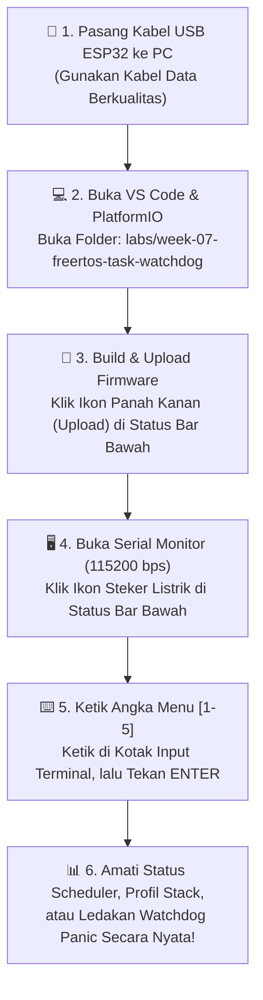
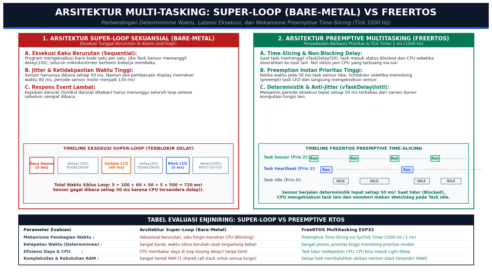
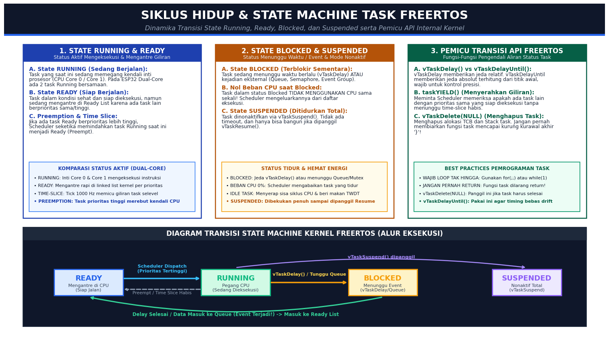
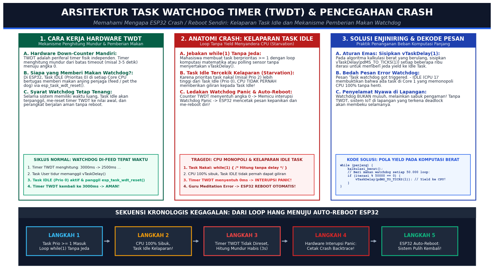
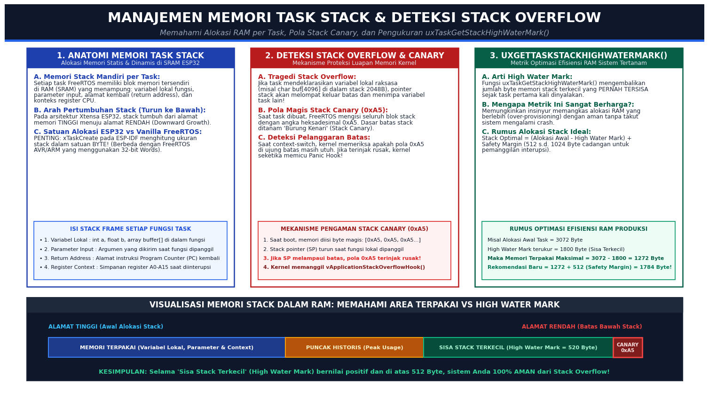
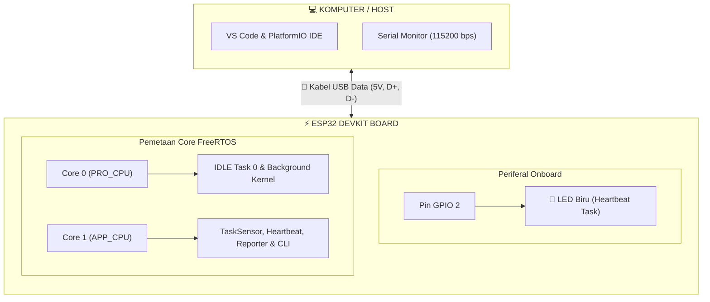
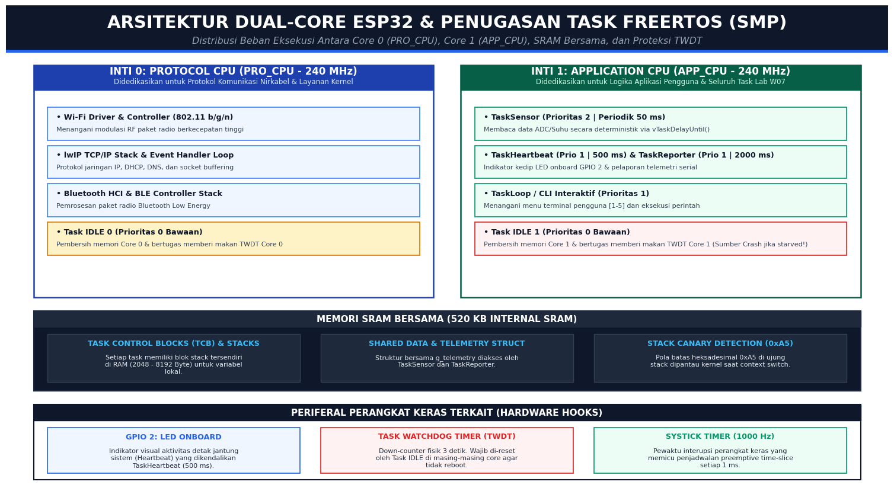

# 📂 MINGGU 07: REAL-TIME OPERATING SYSTEMS (FREERTOS) TASK SCHEDULING & WATCHDOG TIMER (TWDT)
### Laboratorium Sistem Tertanam (Embedded Systems) — Program Studi Sarjana (S1) Teknik Elektro

---

## 🎯 TUJUAN PEMBELAJARAN
Setelah menyelesaikan modul praktikum minggu ini, mahasiswa diharapkan mampu:
1. **Membedakan Paradigma Eksekusi Super-Loop vs Preemptive RTOS:** Menjelaskan secara komparatif batasan arsitektur sekuensial *bare-metal* (`void loop()`) yang rentan *blocking* delay dan *jitter*, dibandingkan arsitektur *Preemptive Multi-Tasking* FreeRTOS berbasis *Tick Timer* 1000 Hz (1 ms).
2. **Menguasai Siklus Hidup (*Lifecycle*) & State Machine Task:** Menganalisis dinamika transisi status task (*Running, Ready, Blocked, Suspended*), mengatur skala prioritas penjadwalan (*Priority Scheduling*), serta menerapkan fungsi kendali waktu deterministik (`vTaskDelayUntil()`) dan pelepasan CPU mandiri (`taskYIELD()`).
3. **Mendiagnosis & Mengoptimasi Memori Stack Task:** Mengukur konsumsi RAM per task menggunakan metrik *High Water Mark* (`uxTaskGetStackHighWaterMark()`), memahami mekanisme proteksi batas memori *Stack Canary* (`0xA5`), dan membedakan satuan alokasi memori ESP-IDF (*Bytes*) vs Vanilla FreeRTOS (*Words*).
4. **Membongkar Misteri Crash ESP32 akibat Task Watchdog Timer (TWDT):** Memahami arsitektur perangkat keras TWDT, menganalisis fenomena kelaparan (*starvation*) pada Task IDLE (Prioritas 0) akibat task nakal yang menolak melepaskan CPU, serta merekonstruksi proses *auto-reboot* sistem secara aman.
5. **Menerapkan Pola Komputasi Aman (*Safe Heavy-Computation Pattern*):** Mengimplementasikan teknik *yielding* periodik di dalam loop algoritma berat agar mikrokontroler tidak pernah mengalami *freeze*, *deadlock*, atau *watchdog panic*.

---

## 🛠️ 1. PANDUAN PERSIAPAN TOOLS & LINGKUNGAN PRAKTIKUM (RAMAH AWAM)

Selamat datang di dunia **Sistem Operasi Waktu Nyata (*Real-Time Operating System* / RTOS)**! Jika pada modul-modul sebelumnya Anda terbiasa menulis kode di dalam `void loop()`, pada minggu ini kita akan beralih ke standar industri modern: **FreeRTOS bawaan ESP32**.

Bagi rekan-rekan mahasiswa yang baru pertama kali mendengar istilah RTOS, penjadwalan (*scheduler*), atau *watchdog*, **jangan merasa khawatir!** Modul ini telah dirancang dengan bahasa yang santai, komunikatif, dan ramah awam. Kode firmware yang disediakan telah dilengkapi menu interaktif CLI (*Command Line Interface*), sehingga Anda dapat menguji berbagai konsep mutakhir hanya dengan mengetik angka pada keyboard komputer Anda!

Ikuti diagram alur persiapan di bawah ini:



---

### Checklist Kesiapan Praktikan (Cek Sebelum Mulai):
* [ ] Board ESP32 (WROOM-32 / ESP32-S3) terhubung ke port USB komputer via kabel data.
* [ ] Ekstensi **PlatformIO IDE** pada Visual Studio Code sudah terpasang dan berstatus *Ready*.
* [ ] Folder kerja `labs/week-07-freertos-task-watchdog` telah dibuka di VS Code.
* [ ] Terminal Serial Monitor telah diatur pada kecepatan **`115200 baud`** (sudah terkonfigurasi otomatis di `platformio.ini`).
* [ ] Anda mengetahui letak kotak input Serial Monitor di VS Code (tempat mengetik angka `1`, `2`, `3`, `4`, `5`).

---

### A. Perangkat Keras (Hardware) yang Digunakan:

| No | Nama Perangkat | Jumlah | Keterangan / Alternatif |
|:---|:---|:---:|:---|
| 1 | **ESP32 Development Board** | 1 unit | ESP32-WROOM-32 / ESP32-S3 (30 pin atau 38 pin). Memiliki prosesor Dual-Core Xtensa 240 MHz dan SRAM 520 KB. |
| 2 | **Kabel Data USB** | 1 unit | Micro-USB atau USB Type-C (pastikan kabel data asli, bukan kabel charger daya semata). |
| 3 | **LED Onboard (GPIO 2)** | Terpasang | Sudah tertanam langsung di papan ESP32 (LED biru), digunakan sebagai indikator detak jantung (*Heartbeat*). |
| 4 | *(Opsional)* **Breadboard & LED Eksternal** | 1 set | Jika ingin memasang LED indikator tambahan di pin GPIO luar bersama resistor $220\ \Omega$. |

> [!NOTE]
> **Kabar Gembira Praktikan:** Modul Minggu 07 **tidak membutuhkan rangkaian breadboard yang rumit!** Seluruh pengujian *multi-tasking*, *profiling* RAM, hingga *watchdog crash* berjalan langsung di dalam arsitektur prosesor ESP32 dan dipantau melalui LED onboard (GPIO 2) serta Serial Monitor komputer Anda.

---

### B. Perangkat Lunak (Software Tools) yang Harus Dibuka:

1. **Visual Studio Code dengan Ekstensi PlatformIO IDE:**
   * Digunakan untuk membuka folder proyek praktikum `labs/week-07-freertos-task-watchdog`, melihat kode sumber di [src/main.cpp](file:///c:/Users/anton/vibecoding/EmbeddedSystem/labs/week-07-freertos-task-watchdog/src/main.cpp), dan melakukan upload firmware.
   * **Tombol-Tombol Penting di Status Bar Bawah VS Code:**
     * `✓` **(PlatformIO: Build):** Memeriksa apakah kode program Anda bebas dari kesalahan sintaks.
     * `→` **(PlatformIO: Upload):** Mengompilasi dan mengunggah kode biner ke dalam chip ESP32.
     * `🔌` **(PlatformIO: Serial Monitor):** Membuka jendela terminal komunikasi dua arah dengan ESP32.
     * *(Atau klik ikon kepala semut PlatformIO di bilah kiri, lalu pilih menu **Upload and Monitor**)*.

2. **Serial Monitor PlatformIO (Baud Rate 115200 bps):**
   * Berfungsi sebagai antarmuka pengujian teks interaktif.
   * **Cara Mengetikkan Pilihan Menu [1-5]:**
     * Perhatikan panel **Terminal / Serial Monitor** yang muncul di bagian bawah layar VS Code.
     * Di bagian paling atas jendela terminal tersebut terdapat sebuah **kotak isian teks kosong** (*input line*).
     * Klik kotak teks tersebut menggunakan mouse Anda, ketik angka menu yang ingin diuji (misalnya ketik **`1`**, **`2`**, **`3`**, **`4`**, atau **`5`**), lalu tekan tombol **`Enter`** pada keyboard.
     * ESP32 akan seketika merespons dan menampilkan laporan analisis teknis di layar Anda!

---

## ⚡ 2. FONDASI TEORI ENJINIRING: DARI SUPER-LOOP MENUJU FREERTOS

### A. Batasan Paradigma *Super-Loop* (`void loop()`) vs *Preemptive RTOS*

Dalam mata kuliah dasar mikrokontroler, kita diajarkan membuat program dengan arsitektur **Super-Loop** (bare-metal):

```cpp
void loop() {
    baca_sensor_lingkungan(); // Butuh waktu 5 ms
    delay(100);               // BERHENTI TOTAL selama 100 ms!
    update_layar_oled();      // Butuh waktu 60 ms
    delay(50);                // BERHENTI TOTAL selama 50 ms!
    kedipkan_led_status();    // Butuh waktu 5 ms
    delay(500);               // MATI KUTU selama 500 ms!
}
```

Perhatikan bencana enjiniring yang terjadi pada kode di atas:
* **Total waktu satu putaran loop:** $5 + 100 + 60 + 50 + 5 + 500 = \mathbf{720\text{ ms}}$!
* Jika sensor Anda adalah sensor getaran mesin pabrik atau akselerometer penyeimbang drone yang **wajib dibaca tepat setiap 50 ms**, sistem di atas **gagal total**! Sensor baru sempat dibaca sekali setiap 720 ms.
* Selama fungsi `delay()` berjalan, prosesor mikrokontroler membakar daya listrik sia-sia hanya untuk menjalankan loop kosong (*busy-waiting*). Tombol darurat atau sinyal alarm yang ditekan operator akan diabaikan sampai seluruh `delay()` tuntas!

Untuk mengatasi kelemahan mendasar ini, industri otomotif, penerbangan, dan otomasi medis beralih ke **Real-Time Operating System (RTOS)**:


*Sumber gambar: Laboratorium Sistem Tertanam — Perbandingan determinisme waktu, latensi eksekusi, dan mekanisme preemptive time-slicing pada Tick Timer 1000 Hz.*

---

### Tabel Evaluasi Enjiniring: Super-Loop vs FreeRTOS Preemptive

| Parameter Evaluasi | Arsitektur Super-Loop (Bare-Metal) | FreeRTOS Multitasking ESP32 |
|:---|:---|:---|
| **Mekanisme Pembagian Waktu** | Sekuensial berurutan, satu fungsi menahan CPU (*Blocking*) | *Preemptive Time-Slicing* via SysTick Timer (1000 Hz / 1 ms) |
| **Ketepatan Waktu (Determinisme)** | Sangat buruk, periode berubah-ubah tergantung beban komputasi | Sangat presisi, task prioritas tinggi langsung memotong (*preempt*) task lain |
| **Efisiensi Daya & CPU** | CPU membakar daya di loop kosong `delay()` tanpa henti | Task tidur melepaskan CPU, CPU bisa beralih ke *Idle* atau *Light-Sleep* |
| **Pencegahan Jitter** | Sulit dihindari tanpa timer interupsi manual rumit | Dijamin presisi menggunakan fungsi kernel `vTaskDelayUntil()` |
| **Kebutuhan Memori RAM** | Sangat hemat (1 *shared call stack* untuk seluruh program) | Memerlukan alokasi memori stack mandiri untuk setiap task |

---

### B. Siklus Hidup Task & *State Machine* Kernel FreeRTOS

Di dalam FreeRTOS, setiap task (tugas) adalah fungsi mandiri yang berjalan seolah-olah memiliki prosesor sendiri. Namun, karena jumlah inti prosesor terbatas (ESP32 memiliki 2 core), Scheduler membagi waktu eksekusi melalui **State Machine** (Mesin Status):


*Sumber gambar: Laboratorium Sistem Tertanam — Dinamika transisi status task FreeRTOS (Running, Ready, Blocked, Suspended) dan fungsi pemicu API kernel.*

1. **State RUNNING (Sedang Berjalan):**
   * Task yang saat ini memegang kendali inti CPU dan instruksinya sedang dieksekusi oleh gerbang logika silikon prosesor. Pada ESP32 dual-core, terdapat maksimal **2 task** yang berada di status *Running* secara bersamaan (satu di Core 0, satu di Core 1).
2. **State READY (Siap Berjalan):**
   * Task dalam kondisi sehat dan siap dieksekusi, namun sedang mengantre di daftar *Ready List* karena CPU sedang sibuk melayani task lain yang memiliki prioritas lebih tinggi atau sama.
3. **State BLOCKED (Terblokir / Tidur Sementara):**
   * Task sedang menunggu waktu berlalu (misal memanggil `vTaskDelay()`) ATAU sedang menunggu datangnya data/kejadian (misal menunggu pesan di *Queue*, sinyal dari *Semaphore*, atau *Event Group*).
   * **Poin Kunci:** Task dalam status *Blocked* **sama sekali tidak membebani CPU (0% CPU overhead)!** Scheduler mencoretnya dari daftar eksekusi hingga waktu atau kejadian yang dinantikan tiba.
4. **State SUSPENDED (Ditidurkan Permanen):**
   * Task dinonaktifkan total melalui fungsi `vTaskSuspend()`. Task ini tidak akan pernah bangun oleh timeout waktu, dan hanya bisa aktif kembali jika ada task lain yang memanggil `vTaskResume()`.

---

### Tiga Aturan Emas Pemrograman Task FreeRTOS:

> [!IMPORTANT]
> 1. **Wajib Memiliki Loop Tak Hingga:** Fungsi task **TIDAK BOLEH PERNAH KELUAR (*return*)** atau mencapai kurung kurawal penutup `}`! Fungsi task harus selalu dibungkus dengan `while(1) { ... }` atau `for(;;) { ... }`.
> 2. **Wajib Menghapus Diri Jika Selesai:** Jika ada task yang memang hanya bertugas sekali jalan (misal inisialisasi awal), sebelum mencapai kurung kurawal akhir fungsi, task tersebut **WAJIB memanggil `vTaskDelete(NULL);`** untuk menghapus dirinya sendiri dari tabel kernel. Jika aturan ini dilanggar, ESP32 akan langsung mengalami crash *Guru Meditation Error*!
> 3. **Gunakan `vTaskDelayUntil()` untuk Kontrol Presisi:** Fungsi `vTaskDelay()` memberikan jeda *relatif* terhadap akhir eksekusi kode (rentan drift waktu jika komputasi bervariasi). Sementara fungsi `vTaskDelayUntil()` memberikan jeda *absolut* terhitung dari titik awal periode, menjamin sensor dibaca tanpa pergeseran fase (*zero-drift timing*).

---

### C. Arsitektur Task Watchdog Timer (TWDT) & Mengapa ESP32 Me-reboot Sendiri?

Pernahkah Anda membuat kode ESP32 yang tiba-tiba me-reboot dirinya sendiri secara berulang-ulang dengan pesan error kepanikan di Serial Monitor?
```text
E (10023) task_wdt: Task watchdog got triggered. The following tasks did not reset the watchdog in time:
E (10023) task_wdt:  - IDLE (CPU 1)
Guru Meditation Error: Core 1 panic'd (Interrupt wdt timeout on CPU 1)
```

Inilah fenomena **Task Watchdog Timer (TWDT)**:


*Sumber gambar: Laboratorium Sistem Tertanam — Skema perangkat keras Task Watchdog Timer, kelaparan Task Idle akibat loop monopoli tanpa yield, dan sekuensi auto-reboot sistem.*

#### Bagaimana TWDT Bekerja di ESP32?
1. **TWDT adalah Periferal Timer Fisik Mandiri:** Di dalam silikon chip ESP32, terdapat timer *down-counter* independen yang menghitung mundur dari batas timeout (misal 3 detik) menuju angka 0.
2. **Siapa yang Bertugas Memberi Makan Anjing Penjaga (*Feed the Dog*)?:**
   * Secara default pada ESP-IDF, **Task IDLE (Prioritas 0)** yang berjalan di Core 0 dan Core 1 bertugas memberi makan timer TWDT melalui fungsi `esp_task_wdt_reset()`.
   * Task Idle adalah task sistem yang bertugas membersihkan sisa memori dan berjalan hanya ketika tidak ada task lain yang membutuhkan CPU.
3. **Anatomi Tragedi *Starvation* (Kelaparan Task Idle):**
   * Jika seorang programmer membuat task berprioritas $\ge 1$ dengan loop matematika atau polling `while(1)` **tanpa menyertakan `vTaskDelay()`**, task tersebut akan menyedot CPU hingga 100%!
   * Karena prioritas task tersebut lebih tinggi daripada Task Idle (Prioritas 0), Scheduler **tidak pernah memberikan giliran sedikit pun kepada Task Idle**.
   * Akibatnya, Task Idle kelaparan (*starved*) dan tidak sempat memberi makan TWDT.
   * Penghitung mundur TWDT menyentuh angka 0 $\rightarrow$ Memicu interupsi perangkat keras tingkat tinggi (*High Priority Interrupt*) $\rightarrow$ Mencetak pesan kepanikan (*panic message*) $\rightarrow$ Me-reboot sistem secara otomatis!

> [!TIP]
> **Watchdog Bukan Musuh, Melainkan Malaikat Pelindung Sistem!**
> Bayangkan jika ESP32 Anda dipasang di tiang pemancar seluler atau gardu listrik terpencil di tengah hutan. Jika program Anda mengalami *deadlock* (macet total), tanpa Watchdog Timer perangkat Anda akan membeku selamanya sampai ada teknisi yang datang menekan tombol reset fisik. Watchdog Timer menjamin jika sistem membeku, perangkat akan me-reboot dirinya sendiri dan kembali melayani pengguna dalam hitungan detik!

---

### D. Manajemen Memori Task Stack & Deteksi Dini *Stack Overflow*

Setiap kali Anda membuat task baru menggunakan `xTaskCreate()` atau `xTaskCreatePinnedToCore()`, FreeRTOS mengalokasikan satu blok memori RAM khusus dari heap yang disebut **Task Stack**:


*Sumber gambar: Laboratorium Sistem Tertanam — Struktur frame memori stack, mekanisme pengaman Stack Canary 0xA5, dan pengukuran High Water Mark.*

#### 1. Jebakan Satuan Ukuran Stack: ESP-IDF vs Vanilla FreeRTOS
Perhatikan perbedaan fatal berikut:
* Pada FreeRTOS standar (AVR / ARM Cortex-M), parameter ukuran stack pada `xTaskCreate` dihitung dalam satuan **Words (1 Word = 4 Byte)**. Jika Anda menulis `1024`, artinya Anda meminta $1024 \times 4 = 4096\text{ Byte}$.
* Namun, pada **ESP-IDF (ESP32)**, parameter ukuran stack dihitung langsung dalam satuan **BYTES**! Jika Anda menulis `1024`, Anda hanya mendapatkan 1024 Byte (1 KB). Jika fungsi task Anda memanggil `Serial.printf()` yang boros memori, alokasi 1024 Byte akan seketika jebol (*Stack Overflow*)!

#### 2. Burung Kenari Penyelamat (*Stack Canary Pattern* `0xA5`)
* Ketika task pertama kali dibuat, FreeRTOS mengisi seluruh blok memori stack dengan angka heksadesimal ajaib: **`0xA5`** (`10100101` biner).
* Di dasar terbawah memori stack ditanam penanda yang disebut *Stack Canary*.
* Jika variabel lokal Anda terlalu besar, pointer stack akan menembus batas bawah dan menimpa pola byte `0xA5`.
* Setiap kali terjadi *context-switch*, kernel memeriksa apakah byte `0xA5` di ujung batas masih perawan. Jika pola rusak, kernel seketika memicu fungsi `vApplicationStackOverflowHook()` dan menghentikan sistem sebelum data penting lainnya dirusak!

#### 3. Fungsi Ajaib: `uxTaskGetStackHighWaterMark()`
Fungsi `uxTaskGetStackHighWaterMark(TaskHandle_t xTask)` mengembalikan **jumlah byte memori stack terkecil yang PERNAH TERSISA** sejak task pertama kali dihidupkan.
* **Nilai High Water Mark = 1800 Byte:** Artinya, pada kondisi paling sibuk sekalipun, task Anda masih memiliki sisa ruang aman 1800 Byte. Alokasi stack ini aman, bahkan bisa dirampingkan untuk menghemat RAM.
* **Nilai High Water Mark < 256 Byte:** **BAHAYA BESAR!** Dinding stack hampir jebol. Tambahkan alokasi stack task Anda minimal 1024 Byte sebelum diterjunkan ke lingkungan produksi.

---

## 🔌 3. PINOUT & ARSITEKTUR HARDWARE DUAL-CORE (SETUP PRAKTIKUM)

Untuk menjalankan seluruh eksperimen pada modul ini, Anda hanya perlu menghubungkan board ESP32 ke komputer via kabel data USB:



---

### Memahami Arsitektur Dual-Core ESP32 (Core 0 vs Core 1)

Mikrokontroler ESP32 memiliki keunggulan luar biasa dibanding Arduino Uno atau STM32 standar: ESP32 ditenagai oleh **dua inti prosesor fisik mandiri (*Dual-Core Xtensa LX6*)** yang bekerja pada kecepatan hingga 240 MHz!


*Sumber gambar: Laboratorium Sistem Tertanam — Distribusi beban eksekusi antara Core 0 (PRO_CPU), Core 1 (APP_CPU), pemetaan memori SRAM bersama, dan korelasi periferal TWDT.*

Perhatikan pembagian tugas cerdas di dalam silikon chip ESP32:
1. **Core 0 (PRO_CPU - Protocol CPU):**
   * Didedikasikan secara default oleh sistem operasi ESP-IDF untuk menangani beban berat komunikasi nirkabel: *Wi-Fi Controller, stack TCP/IP lwIP, DHCP, DNS,* dan *Bluetooth Low Energy (BLE)*.
   * Memiliki **Task IDLE 0 (Prioritas 0)** tersendiri yang bertugas merawat Core 0 dan memberi makan Watchdog Core 0.
2. **Core 1 (APP_CPU - Application CPU):**
   * Disediakan khusus untuk menjalankan kode aplikasi pengguna.
   * Di sinilah fungsi `setup()`, `loop()`, dan seluruh task praktikum kita (`TaskSensor`, `TaskHeartbeat`, `TaskReporter`, serta menu interaktif CLI) berjalan!
   * Diatur menggunakan fungsi kernel:
     ```cpp
     xTaskCreatePinnedToCore(
         TaskSensor,       // Nama fungsi task
         "TaskSensor",     // Nama teks untuk debugging
         3072,             // Alokasi memori stack (Byte)
         NULL,             // Parameter masukan
         2,                // Angka prioritas (2 = Tinggi)
         &hTaskSensor,     // Pointer handle task
         1                 // PINNED KE CORE 1 (APP_CPU)
     );
     ```
3. **Mengapa Pesan Error Watchdog Menyebut CPU 1?**
   * Ketika Anda menjalankan eksperimen Menu `[3]` (*Simulasi Memicu Crash Watchdog*), task nakal `TaskHungryHog` memonopoli Core 1 hingga 100%.
   * Oleh karena itu, Task IDLE di **Core 1** tidak kebagian CPU dan gagal memberi makan TWDT Core 1.
   * Inilah sebabnya mengapa pesan crash ESP32 dengan sangat akurat melaporkan:
     ```text
     task_wdt: Task watchdog got triggered. The following tasks did not reset the watchdog in time:
     task_wdt:  - IDLE (CPU 1)
     Guru Meditation Error: Core 1 panic'd (Interrupt wdt timeout on CPU 1)
     ```
   * Hal ini membuktikan bahwa Core 0 tetap sehat dan tidak terganggu, sementara Core 1 berhasil diselamatkan dari kelumpuhan permanen melalui *Auto-Reboot*!

---

## 💻 4. PANDUAN PRAKTIKUM & 5 MENU EKSPERIMEN INTERAKTIF

Seluruh modul praktikum telah diintegrasikan ke dalam antarmuka teks interaktif dua arah. 

### Langkah Memulai Praktikum:
1. Hubungkan board ESP32 ke port USB PC Anda.
2. Buka proyek ini di VS Code, lalu klik ikon **PlatformIO: Upload and Monitor** di status bar bawah.
3. Tunggu hingga proses kompilasi selesai dan Serial Monitor terbuka pada **115200 baud**.
4. Anda akan disambut oleh banner menu interaktif berikut:

```text
========================================================
SELAMAT DATANG DI PRAKTIKUM MINGGU 07 - SISTEM TERTANAM
Real-Time Operating Systems (FreeRTOS) & Watchdog Timer
Laboratorium Sistem Tertanam - Teknik Elektro
========================================================

+-------------------------------------------------------------+
|     MENU INTERAKTIF LAB WEEK 07: FREERTOS & WATCHDOG        |
+-------------------------------------------------------------+
| [1] Status Multi-Tasking & Pembagian Waktu Scheduler        |
| [2] Profiling Memori Stack Task (Deteksi Stack Overflow)    |
| [3] Simulasi Memicu Crash Watchdog Timer (TWDT Timeout Demo)|
| [4] Uji Komputasi Berat yang Aman (Penyembuhan via Yield)   |
| [5] Analisis Preemptive Priority & Peran Idle Task          |
| [m] Tampilkan Ulang Menu Pilihan                            |
+-------------------------------------------------------------+
Ketik angka pilihan Anda [1-5]: 
```

Secara bersamaan di latar belakang, setiap 2 detik terminal akan mencetak laporan otomatis dari `TaskReporter`:
```text
[AUTO-TELEMETRY] Sampel: #42 | Suhu: 28.3 C | RH: 64.2 % | Detak LED: #4 | Stack Sisa: [Sens:2688B, HB:1664B, Rep:2560B]
```

---

### 🧪 Menu [1]: Status Multi-Tasking & Pembagian Waktu Scheduler

* **Tujuan Pengujian:** Membuktikan bahwa FreeRTOS mampu menjalankan tiga tugas independen (baca sensor 50 ms, kedip LED 500 ms, dan laporan telemetri 2000 ms) secara simultan tanpa ada fungsi yang saling memblokir.
* **Instruksi Praktikan:** Ketik angka **`1`** pada kotak input Serial Monitor lalu tekan tombol `Enter`.

#### Salinan Output Terminal:
```text
========================================================
  STATUS SCHEDULER FREERTOS & MULTI-TASKING ESP32       
========================================================
  • Frekuensi Tick FreeRTOS : 1000 Hz (1 Tick = 1 ms)
  • Jumlah Core Aktif       : Dual-Core Xtensa LX6 (240 MHz)
  • Core Eksekusi Task Menu : Core 1 (APP_CPU)
  • Status Task Sensor      : BERJALAN (Periodik 50 ms / 20 Hz, Prioritas 2)
  • Status Task Heartbeat   : BERJALAN (Periodik 500 ms / 1 Hz, Prioritas 1)
  • Status Task Reporter    : BERJALAN (Periodik 2000 ms, Prioritas 1)
--------------------------------------------------------
[INSIGHT TEKNIK ELEKTRO]:
Preemptive Multitasking memungkinkan sensor dibaca setiap 50 ms
secara presisi tanpa terganggu oleh kedipan LED yang butuh 500 ms!
```

#### Penjelasan Analitis:
1. `TaskSensor` memiliki prioritas 2 (lebih tinggi dari `TaskHeartbeat` yang berprioritas 1).
2. Setiap kali waktu jeda 50 ms tiba, kernel seketika memotong (*preempt*) task lain dan memberikan kendali CPU ke `TaskSensor`.
3. Setelah selesai membaca data (hanya butuh waktu beberapa mikrodetik), `TaskSensor` memanggil `vTaskDelayUntil()` dan seketika masuk status *Blocked*. CPU langsung diserahkan kembali kepada task lain tanpa ada siklus jam (*clock cycles*) yang terbuang sia-sia!

---

### 🧪 Menu [2]: Profiling Memori Stack Task (`uxTaskGetStackHighWaterMark`)

* **Tujuan Pengujian:** Menganalisis sisa ruang memori stack dari setiap task untuk mendeteksi potensi *Stack Overflow* sebelum perangkat dipasang di lapangan.
* **Instruksi Praktikan:** Ketik angka **`2`** pada kotak input Serial Monitor lalu tekan tombol `Enter`.

#### Salinan Output Terminal:
```text
==========================================================================
   PROFILING MEMORI TASK STACK (uxTaskGetStackHighWaterMark)             
==========================================================================
| Nama Task       | Prioritas | Core | Alokasi Awal | Sisa Min (B) | Status   |
|-----------------|-----------|------|--------------|--------------|----------|
| TaskSensor      |         2 |    1 |       3072 B |       2688 B | AMAN     |
| TaskHeartbeat   |         1 |    1 |       2048 B |       1664 B | AMAN     |
| TaskReporter    |         1 |    1 |       3072 B |       2560 B | AMAN     |
| TaskLoop (CLI)  |         1 |    1 |       8192 B |       7420 B | AMAN     |
==========================================================================
[CATATAN ENJINIRING MEMORI]:
1. 'Sisa Min (B)' adalah High Water Mark: jarak terdekat ujung stack
   ke batas luapan memori (Stack Overflow) sejak task pertama kali dibuat.
2. Jika 'Sisa Min' menyentuh angka 0, ESP32 seketika mengalami crash
   dengan pesan fatal: 'Guru Meditation Error: Core 1 panic'd (Unhandled debug exception)'.
```

#### Penjelasan Analitis & Rumus Optimasi RAM:
Perhatikan baris `TaskHeartbeat`:
* Alokasi awal: **2048 Byte**.
* Sisa minimum terkecil (*High Water Mark*): **1664 Byte**.
* Artinya, pemakaian memori nyata terbesar dari `TaskHeartbeat` hanya: $2048 - 1664 = \mathbf{384\text{ Byte}}$!
* **Rekomendasi Optimasi Produksi:** Pada sistem industri dengan ratusan task di mana kapasitas RAM sangat berharga, kita dapat memangkas alokasi `TaskHeartbeat` menjadi $384 + 512\text{ (Safety Margin)} = \mathbf{896\text{ Byte}}$, sehingga menghemat lebih dari 1.1 KB RAM untuk keperluan *buffer* jaringan Wi-Fi/MQTT!

---

### 🧪 Menu [3]: Simulasi Memicu Crash Watchdog Timer (TWDT Timeout Demo)

* **Tujuan Pengujian:** Membuktikan secara nyata bahwa sebuah task nakal yang melakukan komputasi berat tanpa memanggil `vTaskDelay()` akan menyebabkan Task Idle kelaparan dan memicu *Auto-Reboot* dari Task Watchdog Timer.
* **Instruksi Praktikan:** Ketik angka **`3`** pada kotak input Serial Monitor lalu tekan tombol `Enter`.

#### Salinan Output Terminal (Saat Insiden Terjadi):
```text
========================================================
  DEMO 3: SIMULASI MEMICU TASK WATCHDOG TIMER (TWDT)    
========================================================
[PERINGATAN]: Eksperimen ini SENGAJA memonopoli CPU 100%
              tanpa memberi kesempatan pada Idle Task.
              ESP32 AKAN REBOOT SECARA OTOMATIS setelah
              timeout 3 detik terlewati!
========================================================

--------------------------------------------------------------
[HOG STARTED] Task HungryHog aktif pada Prioritas 3 (Core 1)!
>> MODE BAHAYA: Memonopoli CPU 100% TANPA memanggil vTaskDelay()!
>> Tunggu 3 detik... Task Watchdog Timer (TWDT) AKAN MELEDAK!
--------------------------------------------------------------
   [HOG MONOPOLI] Iterasi: 2000000 | Masih menolak yield ke CPU... (1240 ms)
   [HOG MONOPOLI] Iterasi: 4000000 | Masih menolak yield ke CPU... (2480 ms)

E (38450) task_wdt: Task watchdog got triggered. The following tasks did not reset the watchdog in time:
E (38450) task_wdt:  - IDLE (CPU 1)
E (38450) task_wdt: Tasks currently running on CPU 1:
E (38450) task_wdt:  - TaskHungryHog (Priority 3)
Guru Meditation Error: Core 1 panic'd (Interrupt wdt timeout on CPU 1)

Core  1 register dump:
PC      : 0x400d1e84  PS      : 0x00060c34  A0      : 0x800d201c  A1      : 0x3ffb9a20  
...
Rebooting...
ets Jul 29 2019 12:21:46

rst:0x10 (RTCWDT_RTC_RESET),boot:0x13 (SPI_FAST_FLASH_BOOT)
```

#### Penjelasan Analitis:
1. `TaskHungryHog` dibuat pada **Prioritas 3** (lebih tinggi dari Task Idle pada Prioritas 0).
2. Di dalam task ini, terdapat loop `while(1)` yang terus menghitung perkalian matematika tanpa henti dan **sama sekali tidak memanggil `vTaskDelay()`**.
3. Akibatnya, Task Idle di Core 1 tidak pernah mendapatkan giliran eksekusi $\rightarrow$ fungsi `esp_task_wdt_reset()` tidak terpanggil.
4. Setelah 3 detik berlalu, perangkat keras timer TWDT menyentuh angka nol, membunyikan alarm interupsi darurat, mencetak laporan crash *Core 1 panic'd*, dan seketika me-reboot ESP32 kembali ke kondisi awal yang sehat!

---

### 🧪 Menu [4]: Uji Komputasi Berat yang Aman (Penyembuhan via Yield)

* **Tujuan Pengujian:** Membuktikan bahwa algoritma komputasi berat (misal filter sinyal digital atau kalkulasi enkripsi) dapat berjalan dengan sempurna tanpa memicu crash watchdog, asalkan disisipkan pola *yielding* yang benar.
* **Instruksi Praktikan:** Ketik angka **`4`** pada kotak input Serial Monitor lalu tekan tombol `Enter`.

#### Salinan Output Terminal:
```text
========================================================
  DEMO 4: PENANGANAN TEPAT KOMPUTASI BERAT (DENGAN YIELD)
========================================================
[SOLUSI ENJINIRING]:
Setiap task yang menjalankan komputasi panjang WAJIB menyisipkan
panggilan vTaskDelay(1) atau taskYIELD() secara berkala.
Ini memberikan jatah CPU pada Idle Task untuk mereset Watchdog!
========================================================

--------------------------------------------------------------
[HOG STARTED] Task HungryHog aktif pada Prioritas 3 (Core 1)!
>> MODE AMAN: Melakukan kalkulasi berat DENGAN vTaskDelay(1) untuk yield.
>> Watchdog TIDAK AKAN terpicu karena Idle Task tetap kebagian CPU!
--------------------------------------------------------------
   [HOG YIELD] Iterasi: 50000 | Berhasil berbagi CPU dengan aman.
   [HOG YIELD] Iterasi: 100000 | Berhasil berbagi CPU dengan aman.
   [HOG YIELD] Iterasi: 150000 | Berhasil berbagi CPU dengan aman.
   [HOG YIELD] Iterasi: 200000 | Berhasil berbagi CPU dengan aman.
[HOG FINISHED] Pengujian mode aman tuntas! Menghapus task hog...
```

#### Penjelasan Pola Enjiniring (*The Golden Yield Pattern*):
```cpp
// Pola Komputasi Berat yang Benar & Bersahabat dengan Watchdog:
uint32_t iterasi = 0;
while (proses_komputasi_belum_selesai) {
    lakukan_kalkulasi_rumit();
    iterasi++;

    // Beri jatah CPU kepada Task Idle setiap 50.000 iterasi:
    if (iterasi % 50000 == 0) {
        vTaskDelay(pdMS_TO_TICKS(1)); // Lepaskan CPU selama 1 ms!
    }
}
```
Dengan menyisipkan `vTaskDelay(1)` selama 1 milidetik, Scheduler seketika memindahkan task berat ke status *Blocked*. Task Idle langsung mengambil alih CPU, me-reset timer TWDT, dan kemudian kembali melanjutkan eksekusi komputasi berat. **Sistem 100% aman, stabil, dan tidak akan pernah crash!**

---

### 🧪 Menu [5]: Analisis Preemptive Priority & Peran Idle Task

* **Tujuan Pengujian:** Memahami hierarki prioritas FreeRTOS dan membongkar mitos bahwa memberi prioritas setinggi mungkin pada semua task adalah ide yang bagus.
* **Instruksi Praktikan:** Ketik angka **`5`** pada kotak input Serial Monitor lalu tekan tombol `Enter`.

#### Salinan Output Terminal:
```text
========================================================
  DEMO 5: ANALISIS PREEMPTION & PERBEDAAN PRIORITAS TASK 
========================================================
Pada FreeRTOS, Task dengan angka prioritas LEBIH TINGGI
akan SEKETIKA merebut (preempt) CPU dari Task berprioritas rendah.

Hierarki Prioritas Saat Ini:
  • Prioritas 3 : Task HungryHog / Alarm Darurat
  • Prioritas 2 : Task Sensor Telemetri (50 ms)
  • Prioritas 1 : Task Heartbeat & Reporter (500 ms - 2000 ms)
  • Prioritas 0 : Task IDLE Bawaan ESP-IDF (Pembersih Memori & WDT Feeder)
--------------------------------------------------------
HUKUM EMAS FREERTOS:
Jangan biarkan Task berprioritas tinggi berjalan terus-menerus tanpa jeda!
Jika Task Prioritas 1 atau lebih memonopoli CPU, Task IDLE (Prioritas 0)
tidak akan pernah dieksekusi -> Memicu Task Watchdog Timeout!
```

---

## 🚨 5. PANDUAN PEMECAHAN MASALAH (TROUBLESHOOTING GUIDE)

Bagi mahasiswa yang menemui kendala selama praktikum, silakan rujuk tabel panduan cepat berikut:

| Gejala / Pesan Error | Akar Penyebab Teknis | Solusi Enjiniring yang Tepat |
|:---|:---|:---|
| **Teks Serial Monitor berupa karakter aneh / kotak-kotak** | Baud rate Serial Monitor di komputer tidak cocok dengan kecepatan `Serial.begin(115200)`. | Pastikan file `platformio.ini` memiliki baris `monitor_speed = 115200`. Tutup lalu buka kembali Serial Monitor. |
| **Pesan Fatal: `A stack overflow in task ... has been detected`** | Variabel lokal di dalam fungsi task terlalu besar (misal array `char buffer[2048]`), melampaui alokasi stack task. | 1. Perbesar ukuran stack pada `xTaskCreate` (misal dari 2048 ke 4096 Byte).<br>2. Jangan buat array besar sebagai variabel lokal di dalam fungsi task, pindahkan ke variabel `static` atau alokasi heap (`malloc`). |
| **ESP32 me-restart terus-menerus setiap 3 detik** | Ada task berprioritas $\ge 1$ yang memiliki loop `while(1)` tanpa fungsi `vTaskDelay()`, menyebabkan kelaparan Task Idle. | Sisipkan `vTaskDelay(pdMS_TO_TICKS(1));` atau `taskYIELD();` di dalam loop komputasi Anda. |
| **Pesan Crash: `Guru Meditation Error: Core 1 panic'd (Unhandled debug exception)`** | Fungsi task mencapai kurung kurawal penutup `}` tanpa memanggil `vTaskDelete(NULL)`. | Pastikan task dibungkus dalam loop tak hingga `while(1) { ... }`, atau panggil `vTaskDelete(NULL);` tepat sebelum fungsi berakhir. |
| **Task Sensor tidak berjalan tepat waktu (mengalami jitter)** | Menggunakan fungsi `delay()` biasa milik Arduino, bukannya `vTaskDelayUntil()`. | Ganti seluruh fungsi `delay()` dengan `vTaskDelayUntil(&xLastWakeTime, xFrequency)`. |

---

## 📝 6. TUGAS PRAKTIKUM MANDIRI & RUBRIK PENILAIAN

### Soal Kasus Nyata Industri (Monitoring Reaktor Kimia):
Sebuah pabrik petrokimia membutuhkan sistem instrumentasi kendali reaktor dengan spesifikasi sebagai berikut:
1. **Task Sensor Tekanan (Kritis - Prioritas 3):** Wajib mengambil sampel sinyal tekanan reaktor tepat setiap **20 ms (50 Hz)** tanpa toleransi *jitter*. Jika tekanan melebihi ambang batas aman, nyalakan alarm.
2. **Task Komunikasi Jaringan (Prioritas 2):** Mengirimkan data telemetri rata-rata ke server cloud setiap **1000 ms**.
3. **Task Heartbeat Indikator (Prioritas 1):** Mengedipkan LED status setiap **500 ms**.
4. **Analisis Profil Stack:** Lakukan profiling memori menggunakan `uxTaskGetStackHighWaterMark()` dan tentukan ukuran alokasi RAM yang paling efisien namun tetap aman untuk masing-masing task!

---

### Rubrik Penilaian Praktikum (Total: 100 Poin):

| No | Komponen Penilaian | Bobot | Kriteria Evaluasi |
|:---:|:---|:---:|:---|
| 1 | **Pemahaman Konseptual & Teori** | 20% | Mampu menjelaskan perbedaan mendasar Super-Loop vs RTOS, serta memahami peran SysTick Timer 1000 Hz. |
| 2 | **Implementasi Multi-Tasking & Timing Presisi** | 25% | Seluruh task berjalan simultan sesuai periode target tanpa *blocking*, menggunakan `vTaskDelayUntil()`. |
| 3 | **Analisis Watchdog & Penanganan Yield** | 25% | Mampu mendemonstrasikan simulasi pemicuan crash TWDT dan berhasil memperbaikinya dengan teknik *yielding*. |
| 4 | **Profiling Memori & Optimasi Stack** | 20% | Mampu membaca metrik *High Water Mark* dan menghitung alokasi memori optimal untuk sistem produksi. |
| 5 | **Kerapian Kode & Laporan Praktikum** | 10% | Kode terstruktur rapi, komentar jelas, serta penulisan laporan analitis dan sistematis. |

---
*Modul Praktikum Sistem Tertanam — Laboratorium Teknik Elektro — Dikembangkan dengan standar industri modern dan kurikulum berbasis OBE (Outcome-Based Education).*
