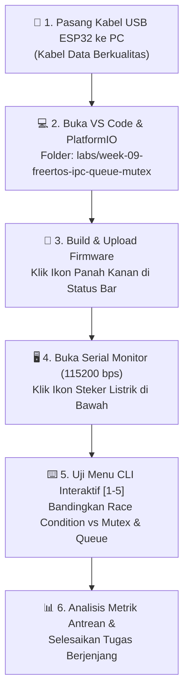
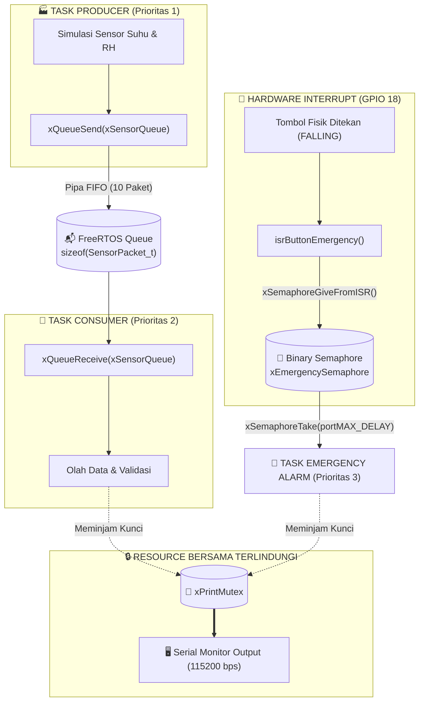

# 📂 MINGGU 09: KOMUNIKASI ANTAR-TASK (IPC) & SINKRONISASI AMAN FREERTOS
### Laboratorium Sistem Tertanam (Embedded Systems) — Program Studi Sarjana (S1) Teknik Elektro

---

## 🎯 TUJUAN PEMBELAJARAN
Setelah menyelesaikan modul praktikum minggu ini, mahasiswa diharapkan mampu:
1. **Mendiagnosis Bahaya Variabel Global Bersama (*Race Condition*):** Menjelaskan bagaimana akses tidak sinkron oleh dua task independen dapat memicu korupsi data memori dan teks output yang saling tumpang tindih (*interleaved output*).
2. **Menguasai FreeRTOS Queue (Antrean Data Thread-Safe):** Mengimplementasikan antrean FIFO berprinsip *pass-by-copy* (`xQueueCreate`, `xQueueSend`, `xQueueReceive`) untuk membangun arsitektur pipa data *Producer-Consumer*.
3. **Menerapkan Proteksi Sumber Daya Bersama Menggunakan Mutex:** Menggunakan *Mutual Exclusion* (`xSemaphoreCreateMutex`, `xSemaphoreTake`, `xSemaphoreGive`) untuk menjamin kepemilikan eksklusif (*ownership*) pada periferal fisik (Serial Monitor, bus I2C, display OLED).
4. **Sinkronisasi Kejadian Berbasis Binary Semaphore:** Menghubungkan interupsi perangkat keras (ISR) tombol fisik ke Task pemrosesan darurat menggunakan *Direct Semaphore Notification* (`xSemaphoreGiveFromISR`).
5. **Menganalisis & Mengatasi Fenomena Konkurensi Kritis:** Memahami mekanisme pencegahan *Priority Inversion* (melalui *Priority Inheritance* bawaan Mutex FreeRTOS) serta mengimplementasikan teknik pemulihan berbasis batas waktu (*Lock Timeout*) untuk meloloskan sistem dari jebakan **Deadlock**.

---

## 🛠️ 1. PANDUAN PERSIAPAN TOOLS & LINGKUNGAN PRAKTIKUM (RAMAH AWAM)

Selamat datang di materi tingkat lanjut **FreeRTOS Inter-Process Communication (IPC)**! Jika pada Minggu 07 Anda telah belajar bagaimana CPU ESP32 membagi waktu antar-task (*time-slicing*) dan mencegah *watchdog crash*, minggu ini kita melangkah ke fondasi sistem operasi yang sesungguhnya: **bagaimana task-task yang berjalan mandiri dapat bertukar data dan bekerja sama secara harmonis tanpa saling merusak memori**.

Ikuti alur persiapan terpandu di bawah ini:



### Checklist Kesiapan Praktikan (Cek Sebelum Mulai):
* [ ] Board ESP32 (WROOM-32 / ESP32-S3) terhubung ke port USB komputer via kabel data.
* [ ] Ekstensi **PlatformIO IDE** pada Visual Studio Code sudah berstatus *Ready*.
* [ ] Folder kerja `labs/week-09-freertos-ipc-queue-mutex` telah dibuka di VS Code.
* [ ] Terminal Serial Monitor telah diatur pada kecepatan **`115200 baud`** (terkonfigurasi otomatis di `platformio.ini`).
* [ ] *(Opsional)* Satu buah tombol push button terpasang antara **GPIO 18** dan **GND** untuk uji coba interupsi semafor manual (jika tombol belum dipasang, Anda tetap bisa mengujinya lewat Menu CLI `[3]`).

---

## 🧠 2. FONDASI TEORI: DARI VARIABEL BERSAMA MENUJU THREAD-SAFE IPC

### A. Tragedi Variabel Global Bersama: *Race Condition*
Banyak pemrogram pemula tergoda untuk bertukar data antar-task menggunakan variabel global biasa:
```c
volatile int g_suhu = 0; // Variabel global tanpa proteksi!
```
Perhatikan bencana enjiniring yang terjadi saat dua task mengakses variabel atau periferal yang sama:

1. **Operasi Baca-Modifikasi-Tulis (*Read-Modify-Write*) Tidaklah Atomik:**  
   Instruksi sederhana seperti `counter++` di tingkat bahasa C sebenarnya dipecah oleh prosesor Xtensa menjadi **3 instruksi mesin terpisah**:
   * Ambil data dari RAM ke Register CPU (`L32I`).
   * Tambahkan angka 1 di ALU (`ADDI`).
   * Tulis kembali nilai baru dari Register ke RAM (`S32I`).
2. Jika tepat di tengah-tengah eksekusi (misal setelah langkah 1), sistem operasi melakukan **Preemptive Context Switch** ke task lain yang juga mengubah variabel tersebut, maka nilai kalkulasi task pertama akan menimpa data task kedua! Data menjadi korup secara senyap (*Silent Data Corruption*).
3. **Benturan Serial Output:** Jika dua task mencoba mengeksekusi `Serial.print()` pada waktu yang bersamaan, huruf-huruf teks dari kedua task akan saling tercampur membentuk karakter sampah yang tidak terbaca!

---

### B. Tiga Instrumen Penyelamat FreeRTOS IPC

Untuk mencegah bencana di atas, FreeRTOS menyediakan 3 instrumen resmi:

| Instrumen IPC | Karakteristik Utama | Analogi Nyata | Fungsi Utama di Lab Ini |
| :--- | :--- | :--- | :--- |
| **FreeRTOS Queue** | FIFO Buffer, *Pass-by-Copy*, Thread-Safe | Pipa saluran ban berjalan pabrik | Mengalirkan paket data telemetri dari Producer ke Consumer |
| **Mutex** | *Mutual Exclusion*, Memiliki Pemilik (*Ownership*), *Priority Inheritance* | Kunci pintu toilet kabin kereta | Mengunci hak cetak Serial Monitor agar teks tidak bertumpuk |
| **Binary Semaphore** | Bendera Sinyal (*Flag*), Tanpa Pemilik, Aman dari ISR | Lonceng alarm kebakaran darurat | Membangunkan Task Penanganan Darurat saat tombol ditekan |

---

## 🔌 3. ARSITEKTUR SISTEM & DIAGRAM ALIR DATA (SETUP PRAKTIKUM)

Perhatikan bagaimana data dan sinyal mengalir di dalam prosesor ESP32 pada modul ini:



### Penjelasan Arsitektur:
1. **Pipa Producer-Consumer:**
   * `TaskProducer` memproduksi paket data `SensorPacket_t` setiap 500 ms dan memasukkannya ke dalam `xSensorQueue`.
   * `TaskConsumer` berada dalam kondisi **Blocked** (hemat daya 0% CPU) saat antrean kosong. Begitu ada paket masuk, kernel seketika membangunkannya untuk memproses paket.
2. **Proteksi Serial dengan Mutex:**
   * Setiap kali sebuah task ingin mencetak teks panjang, task tersebut wajib mengambil kunci `xPrintMutex` via `xSemaphoreTake()`. Task lain yang ingin mencetak harus mengantre hingga kunci dikembalikan via `xSemaphoreGive()`.
3. **Pemicu Darurat Event-Driven:**
   * Penekanan tombol di GPIO 18 memicu interupsi hardware. Fungsi ISR tidak boleh menjalankan delay atau print, melainkan hanya menyentil `xSemaphoreGiveFromISR()`.
   * `TaskEmergencyHandler` (prioritas tertinggi: 3) langsung menyela seluruh task lain untuk mengeksekusi prosedur penyelamatan sistem.

---

## 💻 4. PANDUAN PRAKTIKUM INTERAKTIF STEP-BY-STEP

Firmware praktikum pada file [`src/main.cpp`](file:///c:/Users/anton/vibecoding/EmbeddedSystem/labs/week-09-freertos-ipc-queue-mutex/src/main.cpp) telah dilengkapi antarmuka CLI interaktif melalui Serial Monitor.

### Langkah 1: Buka Proyek & Buka Serial Monitor
1. Buka folder kerja `labs/week-09-freertos-ipc-queue-mutex` di VS Code.
2. Hubungkan board ESP32 ke laptop Anda.
3. Klik ikon panah kanan **`→` (PlatformIO: Upload)** pada bilah status bawah VS Code.
4. Klik ikon steker listrik **`🔌` (PlatformIO: Serial Monitor)** (kecepatan baud: `115200`).
5. Layar terminal akan menampilkan sambutan pembuka dan menu CLI interaktif:

```text
===============================================================
🎉 FREERTOS IPC ENGINE BERHASIL DIINISIALISASI
   Laboratorium Sistem Tertanam - S1 Teknik Elektro
===============================================================
[INIT OK] Mutex Print       : READY
[INIT OK] Binary Semaphore  : READY (Pin GPIO 18)
[INIT OK] FreeRTOS Queue    : READY (10 slots x 16 bytes)

+-------------------------------------------------------------+
|   MENU INTERAKTIF LAB WEEK 09: FREERTOS IPC & SINKRONISASI  |
+-------------------------------------------------------------+
| [1] Toggle Producer Queue (Aktifkan / Nonaktifkan Sensor)   |
| [2] Demo Race Condition vs Mutex (Uji Benturan Output Teks) |
| [3] Trigger Event Semaphore (Kirim Sinyal Alarm Darurat)    |
| [4] Demo Simulasi Deadlock & Pemulihan Timeout              |
| [5] Status & Diagnostik Antrean (Queue Metrics & Mutex)     |
| [m] Cetak Ulang Menu Bantuan Ini                            |
+-------------------------------------------------------------+
Ketik angka pilihan Anda [1-5 / m]: 
```

---

### Langkah 2: Eksperimen Menu [1] — Mengamati Aliran Antrean Queue
* **Cara Menguji:** Ketik angka **`1`** pada kolom input Serial Monitor lalu tekan **Enter**.
* **Pengamatan:**
  * Saat Producer aktif, Anda akan melihat log Consumer mengambil paket data dari Queue secara kontinu:
    ```text
    [CONSUMER <- QUEUE] ID: #12 | Suhu: 27.4 C | RH: 65.2 % | Delay Antrean: 0 ms | Slot Antrean Sisa: 9
    ```
  * Ketik angka `1` kembali untuk menjeda Producer. Amati bahwa Consumer seketika berhenti mencetak log dan tertidur pulas (*Blocked*) tanpa membuang siklus clock CPU!

---

### Langkah 3: Eksperimen Menu [2] — Benturan Akses (Race Condition) vs Mutex
* **Cara Menguji:** Ketik angka **`2`** pada Serial Monitor lalu tekan **Enter**.
* **Analisis Enjiniring:**
  * **Uji 1 (Tanpa Mutex):** Dua task mencoba mencetak deretan huruf `A B C D E` secara serentak tanpa perlindungan. Perhatikan bagaimana huruf-huruf dari Task 1 dan Task 2 tercetak bersilangan dan berantakan:
    ```text
    [UNSAFE Task-1] Huruf: A[UNSAFE Task-2] Huruf: AB B C C D D E E -> Selesai!
    ```
  * **Uji 2 (Dengan Mutex):** Dua task menggunakan `xPrintMutex`. Perhatikan bahwa setiap task menunggu gilirannya dengan tertib sehingga setiap baris tercetak utuh dan bersih sempurna!

---

### Langkah 4: Eksperimen Menu [3] — Sinyal Darurat Binary Semaphore
* **Cara Menguji:**
  * Tekan tombol fisik push button yang terhubung ke pin **GPIO 18** dan **GND**, atau ketik angka **`3`** pada Serial Monitor lalu tekan **Enter**.
* **Pengamatan:**
  * `TaskEmergencyHandler` (prioritas 3) langsung menyela antrean Consumer.
  * Teks peringatan darurat merah tercetak di Serial Monitor.
  * LED onboard (GPIO 2) berkedip cepat (*strobe*) 5 kali sebagai sinyal visual bahaya.

---

### Langkah 5: Eksperimen Menu [4] — Menghadapi Kebuntuan (*Deadlock*) & Pemulihan Timeout
* **Cara Menguji:** Ketik angka **`4`** pada Serial Monitor lalu tekan **Enter**.
* **Fenomena Deadlock:**
  * Task 1 memegang Mutex A dan ingin mengambil Mutex B.
  * Task 2 memegang Mutex B dan ingin mengambil Mutex A.
  * Jika menggunakan timeout tak terhingga (`portMAX_DELAY`), kedua task akan saling menunggu selamanya (**Deadlock Fatal!** Sistem macet total).
* **Solusi Enjiniring:**
  * Program menggunakan timeout `pdMS_TO_TICKS(1000)`. Setelah 1 detik gagal mendapatkan Mutex B, Task 1 dengan cerdas melepaskan Mutex A secara sukarela (*Back-off Protocol*), sehingga kebuntuan terurai dan sistem kembali normal!

---

### Langkah 6: Eksperimen Menu [5] — Status Metrik Antrean IPC
* **Cara Menguji:** Ketik angka **`5`** pada Serial Monitor lalu tekan **Enter**.
* Sistem akan menampilkan laporan kapasitas antrean, jumlah pesan yang sedang menunggu, dan sisa slot kosong.

---

## 🎯 5. TUGAS PRAKTIKUM BERJENJANG (*TIERED ASSIGNMENTS*)

### 🟢 Level 1: Eksplorasi Ukuran Payload Queue (Wajib - Skor: 70)
1. Buka file [`src/main.cpp`](file:///c:/Users/anton/vibecoding/EmbeddedSystem/labs/week-09-freertos-ipc-queue-mutex/src/main.cpp).
2. Perluas struktur `SensorPacket_t` dengan menambahkan field baru:
   ```cpp
   float battery_voltage; // Tegangan baterai (misal: 3.7V - 4.2V)
   ```
3. Modifikasi `TaskProducer` agar mengisi nilai `battery_voltage` dan modifikasi `TaskConsumer` agar mencetak nilai tegangan baterai tersebut di Serial Monitor.
4. Pastikan sistem dapat meng-compile dan mengunggah kode baru tanpa error!

---

### 🟡 Level 2: Buffer Penuh & Deteksi Data Drop (Wajib - Skor: 85)
1. Modifikasi periodisitas kerja di dalam `TaskConsumer`:
   * Ubah jeda Consumer menjadi lebih lambat dari Producer (misalnya Consumer membaca antrean setiap 2.000 ms, sedangkan Producer tetap memproduksi data setiap 500 ms).
2. Amati fenomena yang terjadi pada Serial Monitor:
   * **Berapa lama waktu yang dibutuhkan hingga antrean Queue terisi penuh (10/10 paket)?**
   * Catat pesan peringatan `[QUEUE FULL]` yang muncul saat Producer gagal memasukkan data baru ke antrean.
3. Tuliskan analisis pada laporan praktikum Anda: Mengapa kapasitas buffer antrean dan kecepatan pemrosesan Consumer harus diperhitungkan secara cermat dalam perancangan sistem tertanam?

---

### 🔴 Level 3: Dual-Producer Single-Consumer Architecture (Tantangan Ekstra - Skor: 100)
1. Rancang arsitektur di mana terdapat **dua task Producer independen**:
   * **Producer A (Sensor Lingkungan):** Mengirim paket suhu & kelembaban setiap 600 ms.
   * **Producer B (Sensor Daya):** Mengirim paket tegangan & arus setiap 1.000 ms.
2. Tambahkan identifier sumber data pada `SensorPacket_t`:
   ```cpp
   char source_name[12]; // "ENV_SENSOR" atau "PWR_SENSOR"
   ```
3. Buktikan bahwa sebuah **Queue tunggal dapat menerima data secara thread-safe dari banyak Producer sekaligus (*Many-to-One IPC Pipeline*)** tanpa terjadi tabrakan data!

---

## ❓ 6. PANDUAN PEMECAHAN MASALAH (*TROUBLESHOOTING*)

| Gejala Masalah | Kemungkinan Penyebab | Solusi Tindakan Enjiniring |
| :--- | :--- | :--- |
| **Serial Monitor menampilkan karakter aneh / gibberish** | Baud rate terminal tidak sesuai dengan instruksi `Serial.begin(115200)`. | Pastikan terminal Serial Monitor disetel pada kecepatan **115200 baud** (sudah disetel di `platformio.ini`). |
| **ESP32 mengalami Crash saat menekan tombol darurat** | Fungsi penanganan tombol memanggil API standar di dalam ISR. | Di dalam ISR, Anda **DILARANG** memanggil `xSemaphoreGive()`. Anda **WAJIB** menggunakan fungsi khusus ISR: `xSemaphoreGiveFromISR()`. |
| **Pesan `[QUEUE FULL]` terus bermunculan** | Kecepatan konsumsi data lebih lambat dari produksi, atau kapasitas antrean terlalu kecil. | Naikkan prioritas `TaskConsumer`, percepat pemrosesan consumer, atau perbesar konstanta `QUEUE_LENGTH`. |
| **Program berhenti total dan tidak merespons perintah** | Terjadi Deadlock akibat dua task saling memegang Mutex tanpa batas waktu. | Jangan gunakan `portMAX_DELAY` jika task memegang lebih dari satu Mutex! Selalu gunakan batas waktu (timeout) terukur seperti `pdMS_TO_TICKS(1000)`. |

---

## 📋 7. METODE ASESMEN DI LAB (*LIVE CODE MUTATION*)

Pada sesi tatap muka laboratorium, Asisten Lab / Dosen akan menguji penguasaan Anda secara langsung:
1. **Verifikasi Output:** Mahasiswa mendemonstrasikan berjalannya Producer-Consumer Queue dan membuktikan efektivitas Mutex pada Menu CLI `[2]`.
2. **Tantangan Mutasi Singkat:**
   * *"Coba ubah kapasitas antrean xSensorQueue dari 10 menjadi 3 slot, dan tunjukkan kapan antrean mulai penuh!"*
   * *"Jelaskan mengapa Mutex memiliki fitur Priority Inheritance sedangkan Binary Semaphore tidak memilikinya!"*
   * *"Apa perbedaan fundamental antara metode pass-by-copy FreeRTOS Queue dengan variabel pointer global?"*
3. Mahasiswa yang mampu menjawab dan mendemonstrasikan perubahan kode dalam waktu **< 2 menit** berhak mendapatkan skor maksimal!

---

## 📤 8. PANDUAN PENGUMPULAN & GIT WORKFLOW

Setelah seluruh tugas selesai dikerjakan:
1. Bersihkan file kompilasi cache:
   ```bash
   & "C:\Users\anton\.platformio\penv\Scripts\pio.exe" run -d labs/week-09-freertos-ipc-queue-mutex -t clean
   ```
2. Commit dan push pekerjaan Anda ke repositori GitHub:
   ```bash
   git add labs/week-09-freertos-ipc-queue-mutex/
   git commit -m "feat(week-09): implement FreeRTOS IPC with Queue, Mutex, and Binary Semaphore"
   git push origin main
   ```

---
*Modul Praktikum Sistem Tertanam | Program Studi S1 Teknik Elektro*
