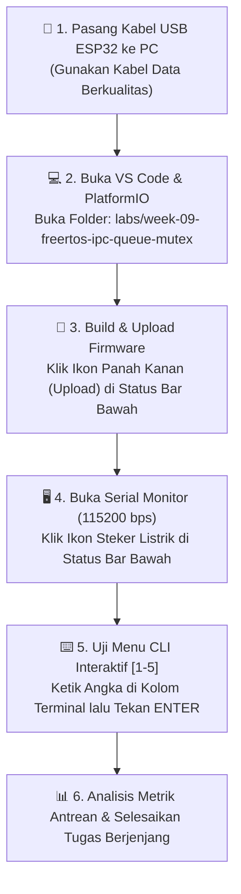
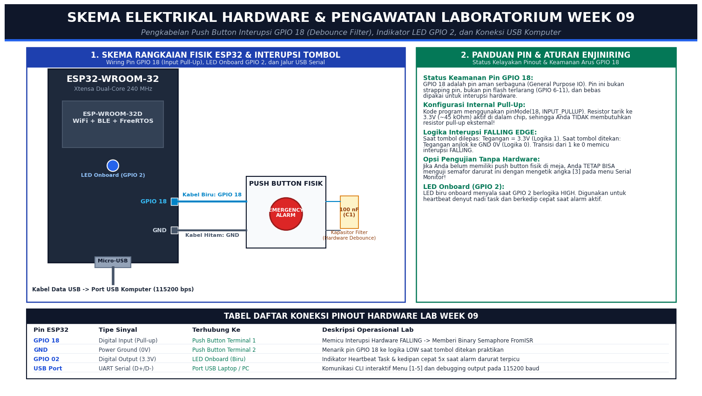
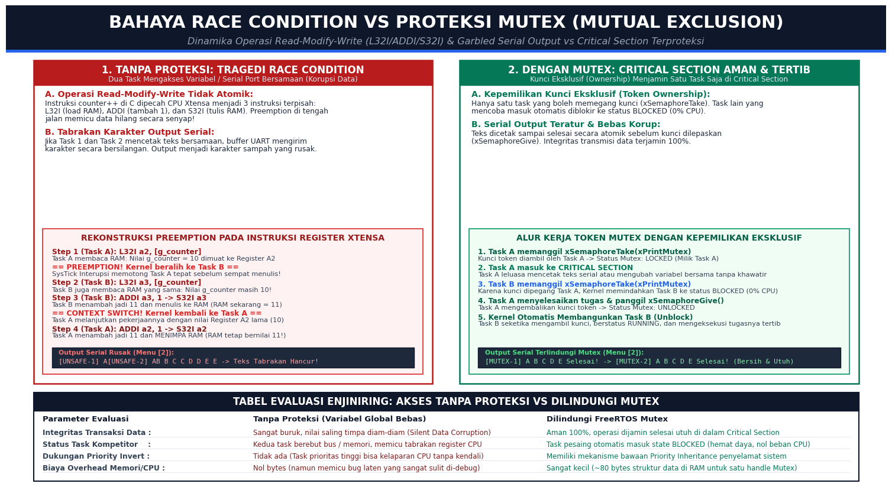
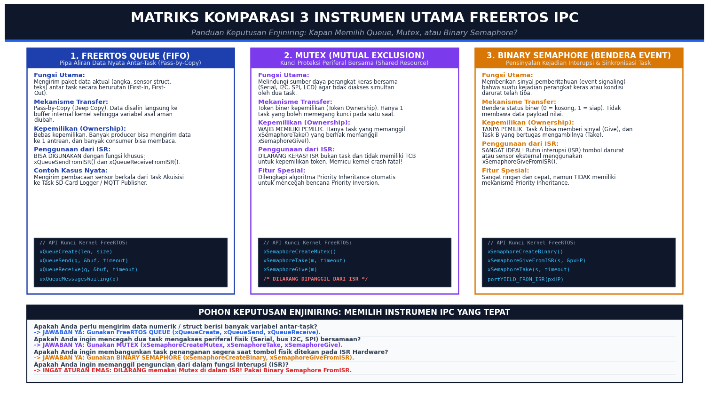
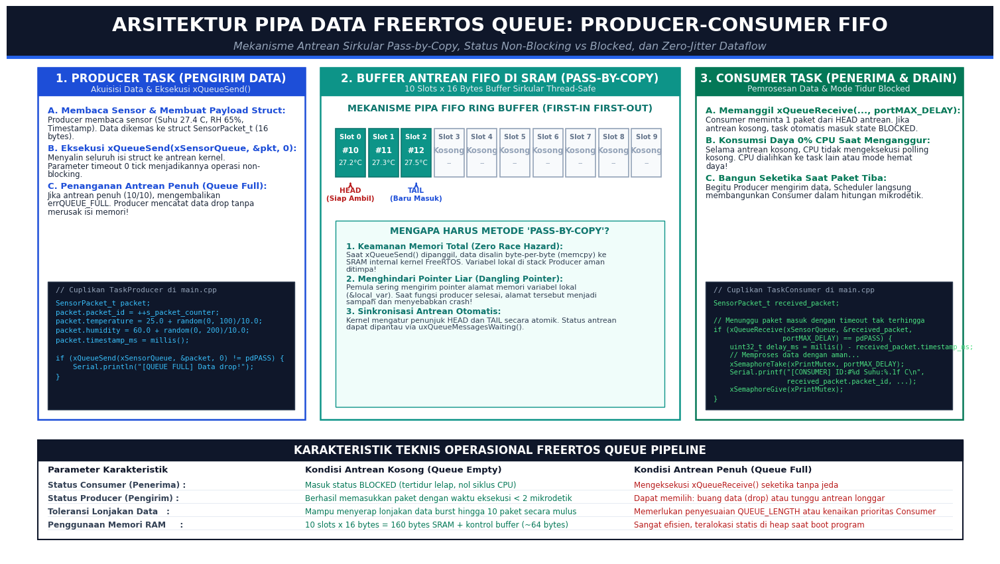
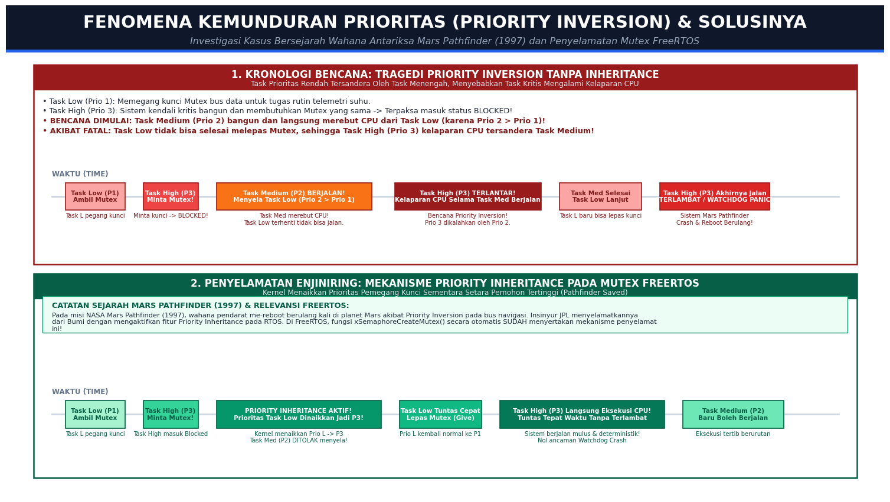
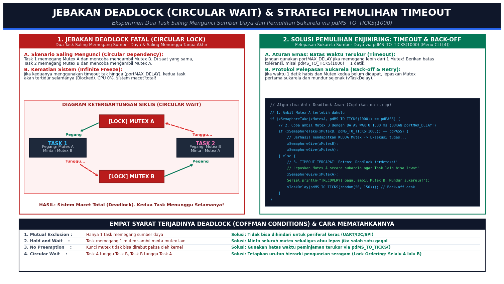
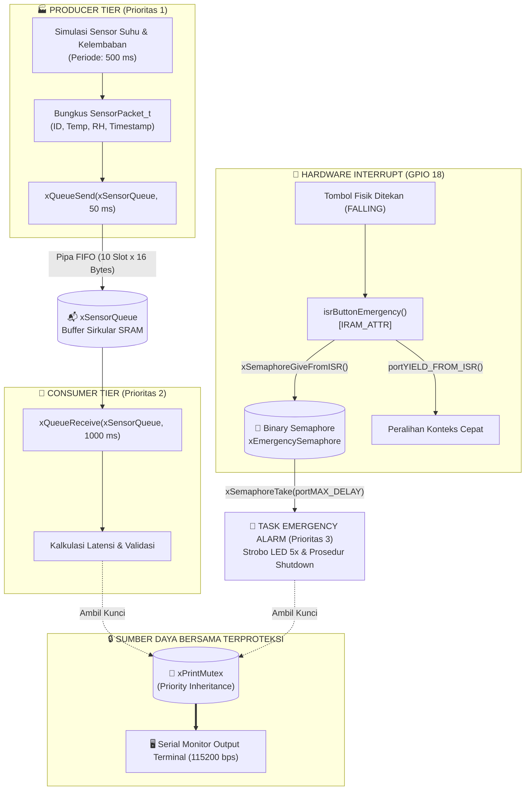

# 📂 MINGGU 09: KOMUNIKASI ANTAR-TASK (IPC) & SINKRONISASI AMAN FREERTOS
### Laboratorium Sistem Tertanam (Embedded Systems) — Program Studi Sarjana (S1) Teknik Elektro

---

## 🎯 TUJUAN PEMBELAJARAN
Setelah menyelesaikan modul praktikum minggu ini, mahasiswa diharapkan mampu:
1. **Mendiagnosis Bahaya Variabel Global Bersama (*Race Condition*):** Menjelaskan secara mekanistik bagaimana instruksi *Read-Modify-Write* tingkat register CPU Xtensa (`L32I`, `ADDI`, `S32I`) yang disela oleh pergantian konteks (*Context Switch*) dapat memicu korupsi data memori dan teks serial yang saling bertabrakan (*garbled output*).
2. **Menguasai FreeRTOS Queue (Antrean Data Thread-Safe):** Mengimplementasikan antrean FIFO berprinsip salin memori (*Pass-by-Copy*) menggunakan fungsi `xQueueCreate()`, `xQueueSend()`, dan `xQueueReceive()` untuk membangun arsitektur pipa data *Producer-Consumer* yang hemat daya (*Zero CPU consumption when blocked*).
3. **Menerapkan Proteksi Sumber Daya Bersama Menggunakan Mutex:** Menggunakan mekanisme *Mutual Exclusion* (`xSemaphoreCreateMutex()`, `xSemaphoreTake()`, `xSemaphoreGive()`) untuk menjamin hak kepemilikan eksklusif (*Token Ownership*) pada periferal fisik (Serial Monitor, bus I2C, dan display).
4. **Sinkronisasi Kejadian Berbasis Binary Semaphore:** Menghubungkan interupsi perangkat keras (*Hardware Interrupt ISR*) dari tombol fisik ke Task pemrosesan darurat menggunakan pensinyalan non-blocking `xSemaphoreGiveFromISR()` dan peralihan konteks instan `portYIELD_FROM_ISR()`.
5. **Menganalisis & Mengatasi Fenomena Konkurensi Kritis:** Memahami fenomena kemunduran prioritas (*Priority Inversion*) pada kasus bersejarah misi antariksa NASA Mars Pathfinder (1997) dan pencegahannya via algoritma *Priority Inheritance* pada Mutex, serta memecahkan kebuntuan sistem (*Deadlock*) menggunakan strategi batas waktu terukur (*Lock Timeout*) `pdMS_TO_TICKS(1000)` dan *Back-off Retry*.

---

## 🛠️ 1. PANDUAN PERSIAPAN TOOLS & LINGKUNGAN PRAKTIKUM (RAMAH AWAM)

Selamat datang di modul lanjutan **FreeRTOS Inter-Process Communication (IPC)**! Jika pada modul Minggu 07 Anda telah berhasil menjadwalkan task mandiri dan mencegah ESP32 me-restart sendiri akibat *Watchdog Timer*, minggu ini kita melangkah ke jantung arsitektur sistem operasi waktu nyata modern: **bagaimana task-task yang berjalan paralel dapat bertukar data dan bekerja sama secara harmonis tanpa saling merusak memori**.

Bagi rekan-rekan mahasiswa yang baru pertama kali mendengar istilah *Queue*, *Mutex*, *Semaphore*, atau *Race Condition*, **jangan merasa cemas!** Modul ini telah disusun dengan bahasa yang komunikatif, analogi kehidupan nyata yang santai dan mudah dibayangkan, serta dilengkapi menu interaktif CLI (*Command Line Interface*). Anda cukup mengetik angka pada keyboard komputer untuk melihat langsung pembuktian teorinya di layar!

Ikuti diagram alur persiapan terpandu di bawah ini:



---

### Checklist Kesiapan Praktikan (Cek Sebelum Mulai):
* [ ] Board ESP32 (WROOM-32 / ESP32-S3) terhubung ke port USB komputer via kabel data asli (bukan kabel charger ponsel murah yang tidak memiliki jalur kabel data D+/D-).
* [ ] Ekstensi **PlatformIO IDE** pada Visual Studio Code sudah terpasang dan berstatus *Ready*.
* [ ] Folder kerja `labs/week-09-freertos-ipc-queue-mutex` telah dibuka di VS Code (`File` ➔ `Open Folder...`).
* [ ] Terminal Serial Monitor telah disetel pada kecepatan **`115200 baud`** (sudah terkonfigurasi otomatis di berkas `platformio.ini`).
* [ ] Anda mengetahui letak kotak input Serial Monitor di VS Code (tempat mengetik angka `1`, `2`, `3`, `4`, `5`, lalu menekan **Enter**).
* [ ] *(Opsional namun Disarankan)* Satu buah push button fisik terhubung antara pin **GPIO 18** dan pin **GND**. Jika belum sempat memasang tombol, Anda tetap dapat mengujinya lewat Menu CLI `[3]`.

---

### A. Perangkat Keras (Hardware) yang Digunakan:

| No | Nama Perangkat | Jumlah | Keterangan & Alternatif Praktikum |
|:---|:---|:---:|:---|
| 1 | **ESP32 Development Board** | 1 unit | ESP32-WROOM-32 / ESP32-S3 (30 pin atau 38 pin). Memiliki prosesor Dual-Core Xtensa 240 MHz dan SRAM internal 520 KB. |
| 2 | **Kabel Data USB** | 1 unit | Micro-USB atau USB Type-C (pastikan kabel mendukung transfer data untuk komunikasi serial). |
| 3 | **Push Button Switch (Tactile)** | 1 unit | Dihubungkan antara pin **GPIO 18** dan **GND** sebagai pemicu interupsi darurat perangkat keras. |
| 4 | *(Opsional)* **Kapasitor Keramik 100 nF** | 1 unit | Dipasang paralel dengan tombol push button sebagai penyaring derau kontak mekanis (*hardware debounce*). |
| 5 | **LED Onboard (GPIO 2)** | Terpasang | Sudah tertanam langsung di papan ESP32 (LED biru). Digunakan sebagai indikator detak jantung (*Heartbeat*) dan alarm darurat (*Strobe*). |

---

### B. Skema Pengawatan Hardware & Rangkaian Laboratorium:

Perhatikan diagram pengawatan resmi di bawah ini sebelum menghubungkan komponen:


*Gambar 1: Skema Pengawatan Push Button Interupsi GPIO 18, Indikator LED Onboard GPIO 2, dan Jalur USB Serial ke Komputer.*

> [!TIP]
> **Mengapa Kita Tidak Membutuhkan Resistor Eksternal?**  
> Di dalam chip ESP32, setiap pin GPIO modern telah dilengkapi rangkaian resistor *Pull-Up* internal sebesar $\approx 45\ \text{k}\Omega$. Dalam kode firmware [`src/main.cpp`](file:///c:/Users/anton/vibecoding/EmbeddedSystem/labs/week-09-freertos-ipc-queue-mutex/src/main.cpp), pin diinisialisasi dengan perintah:
> ```cpp
> pinMode(PIN_BUTTON_EMERGENCY, INPUT_PULLUP);
> ```
> Ini berarti saat tombol terbuka (tidak ditekan), pin membaca tegangan **HIGH (3.3V)**. Saat tombol ditekan, jalur pin langsung ditarik ke **GND (0V / LOW)**. Transisi jatuh dari 3.3V ke 0V ini disebut **FALLING EDGE**, yang seketika memicu fungsi interupsi `isrButtonEmergency()`. Sangat praktis, hemat kabel, dan rapi!

---

### C. Panduan Alat Perangkat Lunak (Software Tools & Cara Menguji Sintaks):

Untuk menguji seluruh perintah dan fitur interaktif pada modul ini, Anda **TIDAK PERLU** menginstal software terminal pihak ketiga yang rumit. Semuanya terintegrasi langsung di dalam Visual Studio Code dan PlatformIO:

1. **Buka Proyek di Visual Studio Code:**
   * Jalankan VS Code, pilih menu `File` ➔ `Open Folder...`.
   * Arahkan ke direktori: `labs/week-09-freertos-ipc-queue-mutex`.
2. **Kompilasi & Unggah Firmware ke ESP32:**
   * Di bilah status paling bawah (*Status Bar*) VS Code, cari deretan tombol PlatformIO:
     * Klik ikon tanda centang **`✓` (PlatformIO: Build)** untuk memverifikasi kode.
     * Klik ikon panah kanan **`→` (PlatformIO: Upload)** untuk mengunggah program ke ESP32.
   * *Alternatif Shortcut:* Tekan tombol `Ctrl + Alt + U` pada keyboard Anda.
3. **Membuka Terminal Serial Monitor:**
   * Klik ikon steker colokan listrik **`🔌` (PlatformIO: Serial Monitor)** di bilah status bawah, atau tekan shortcut `Ctrl + Alt + S`.
   * Layar terminal terminal akan terbuka di jendela bawah dengan kecepatan `115200 baud`.
4. **Cara Berinteraksi dengan Menu CLI:**
   * Perhatikan bahwa terminal memiliki **kolom input teks** (di bagian paling atas panel terminal atau langsung di kursor terminal).
   * Klik pada terminal tersebut, **ketik angka menu** (misal ketik `1`, `2`, `3`, `4`, atau `5`), kemudian **tekan tombol ENTER**.
   * ESP32 akan seketika merespons dan menampilkan hasil pengujian secara waktu nyata (*real-time*)!

> [!NOTE]
> **Klinik Driver USB (Jika Port COM Tidak Dikenali):**  
> Jika saat menekan tombol Upload muncul pesan error `Could not open port COMx`, pastikan driver USB UART board Anda telah terinstal di Windows:
> * Board dengan chip **CP2102:** Unduh driver Silicon Labs CP210x VCP.
> * Board dengan chip **CH340 / CH341:** Unduh driver WCH CH340 USB-to-Serial.
> Buka *Device Manager* di Windows untuk memastikan port muncul pada kategori *Ports (COM & LPT)*.

---

## 🧠 2. FONDASI TEORI: DARI VARIABEL BERSAMA MENUJU THREAD-SAFE IPC

### A. Tragedi Variabel Global Bersama: *Race Condition*

Pada pemrograman dasar Arduino sekuensial (`void loop()`), pemula terbiasa bertukar informasi antar-fungsi menggunakan variabel global sederhana:
```c
volatile int g_counter = 0; // Tampak tidak berbahaya, namun berbahaya di RTOS!
```

Di dalam lingkungan sistem operasi waktu nyata (*Preemptive RTOS*) di mana banyak task berjalan saling memotong, menggunakan variabel global bersama tanpa mekanisme proteksi adalah **sumber bencana nomor satu (*Race Condition*)**.

Perhatikan mengapa bencana ini terjadi pada tingkat arsitektur prosesor:


*Gambar 2: Analisis Rekonstruksi Instruksi Mesin Xtensa (L32I/ADDI/S32I) pada Bencana Race Condition vs Proteksi Eksekusi Atomik Menggunakan Mutex.*

#### 1. Operasi Baca-Modifikasi-Tulis (*Read-Modify-Write*) Tidaklah Atomik:
Instruksi sederhana seperti `counter++` di bahasa C bukanlah satu instruksi tunggal di perangkat keras. Arsitektur prosesor Xtensa Dual-Core 32-bit memecahnya menjadi **3 instruksi mesin terpisah**:
* `L32I a2, [mem]` : **Read** — Ambil nilai dari RAM dan muat ke Register CPU A2.
* `ADDI a2, a2, 1`  : **Modify** — Tambahkan angka 1 di dalam ALU (*Arithmetic Logic Unit*).
* `S32I a2, [mem]` : **Write** — Tuliskan nilai baru dari Register CPU kembali ke alamat RAM.

Bayangkan jika Task A baru saja menyelesaikan langkah *Read* (Register A2 bernilai 10). Tepat sebelum Task A sempat menulis ke RAM, *SysTick Timer Interrupt* memicu **Preemptive Context Switch** ke Task B!  
Task B yang memiliki tugas sama juga membaca RAM (nilainya masih 10), menambahkannya menjadi 11, dan menyimpannya ke RAM.  
Ketika giliran CPU dikembalikan ke Task A, Task A melanjutkan instruksinya yang tertunda dengan data lama di registernya: menambahkan 10 menjadi 11, lalu menulisnya ke RAM.  
**Hasil Bencana:** Dua operasi penambahan telah dieksekusi, namun nilai counter di RAM hanya bertambah 1! Satu transaksi data hilang tanpa jejak (*Silent Data Corruption*).

#### 2. Tabrakan Karakter Output Serial (*Garbled Output*):
Port serial (`Serial.print()`) memiliki buffer perangkat keras fisik UART yang dipakai bersama. Jika Task 1 sedang mencetak teks `"SUHU_RUANGAN_NORMAL"` dan di tengah-tengah transmisi disela oleh Task 2 yang mencetak `"TEGANGAN_DROP"`, karakter-karakter teks dari kedua task akan terkirim bercampur baur:
```text
[UNSAFE Task-1] Huruf: A[UNSAFE Task-2] Huruf: AB B C C D D E E -> Selesai!
```
Output serial menjadi karakter sampah yang tidak dapat didekode oleh parser komputer.

---

### B. Tiga Instrumen Penyelamat FreeRTOS IPC & Matriks Komparasi

Untuk menjamin komunikasi antar-task yang aman, stabil, dan deterministik, FreeRTOS menyediakan tiga instrumen resmi:


*Gambar 3: Matriks Keputusan Enjiniring dan Perbandingan Fitur Utama FreeRTOS Queue, Mutex, dan Binary Semaphore.*

Mari kita pahami perbedaannya menggunakan analogi kehidupan sehari-hari:

| Instrumen IPC | Karakteristik Utama | Analogi Nyata Ramah Awam | Kapan Wajib Digunakan? |
| :--- | :--- | :--- | :--- |
| **FreeRTOS Queue** | Antrean FIFO, *Pass-by-Copy*, Bebas Kepemilikan, *Thread-Safe* | **Pipa Ban Berjalan / Conveyor Belt Restoran:** Koki menaruh piring makanan, pelayan mengambil satu per satu urut dari yang paling awal ditaruh. | Mengalirkan nilai data aktual (angka float, integer, struct sensor) dari task pengirim ke task pengolah. |
| **Mutex** | *Mutual Exclusion*, Memiliki Pemilik (*Ownership*), Dilengkapi *Priority Inheritance* | **Kunci Pintu Toilet Kabin Kereta Api:** Hanya 1 orang yang boleh memegang kunci dan masuk ke dalam. Orang lain harus menunggu di luar sampai kunci dikembalikan. | Melindungi akses periferal fisik bersama (Port Serial, bus I2C display OLED, akses memori Flash) agar tidak dipakai bersamaan. |
| **Binary Semaphore** | Bendera Status Sinyal (0 atau 1), Tanpa Pemilik, Aman dari ISR | **Lonceng Alarm Pemadam Kebakaran:** Siapa pun (bahkan orang dari luar gedung / sensor interupsi hardware) dapat menarik tuas alarm untuk memberi sinyal bahaya. | Sinkronisasi kejadian darurat (*Event Signaling*) dari fungsi interupsi hardware (ISR) ke task penyelamat sistem. |

---

### C. Bedah Arsitektur FreeRTOS Queue (Producer-Consumer FIFO Pipeline)

Instrumen antrean (*Queue*) adalah tulang punggung arsitektur perangkat lunak modular modern:


*Gambar 4: Arsitektur Pipa Aliran Data Producer-Consumer Queue dengan Mekanisme Antrean Sirkular Pass-by-Copy dan Status Blocked.*

#### Mengapa FreeRTOS Menggunakan Metode *Pass-by-Copy* (Bukan Pointer)?
Banyak pemrogram pemula membuat kesalahan fatal dengan mengirimkan alamat pointer variabel lokal (`&local_var`) ke dalam antrean:
* Variabel lokal dialokasikan di dalam memori *Stack* milik Task Producer.
* Begitu fungsi Producer selesai atau keluar dari blok scope kurung kurawal, ruang memori stack tersebut akan ditimpa oleh data fungsi lain.
* Ketika Task Consumer mencoba membaca alamat pointer tersebut di kemudian waktu, Consumer akan membaca data sampah (*Dangling Pointer*) yang memicu crash prosesor (*Guru Meditation Error: IllegalInstruction / LoadProhibited*)!
* **Solusi Enjiniring FreeRTOS:** Saat Anda memanggil `xQueueSend()`, kernel FreeRTOS menyalin seluruh isi data biner struct byte-per-byte (*deep copy*) ke dalam buffer memori internal Queue di SRAM. Dengan demikian, Task Producer bebas membuang, mengubah, atau memakai ulang variabel asalnya seketika setelah pengiriman berhasil!

#### Keajaiban Status *Blocked* (0% Beban CPU):
Saat antrean kosong, Task Consumer yang memanggil `xQueueReceive(..., portMAX_DELAY)` otomatis dipindahkan oleh kernel ke status **BLOCKED**:
* Task Consumer **tidak memakan siklus clock CPU sama sekali (0% CPU)**. Bandingkan dengan teknik polling Arduino `while(!dataReady)` yang membakar energi baterai dan membuang jutaan siklus CPU secara sia-sia.
* Begitu Task Producer memasukkan 1 paket data ke dalam antrean, penjadwal kernel FreeRTOS seketika membangunkan Task Consumer dalam waktu kurang dari **2 mikrodetik**!

---

### D. Fenomena Kritis 1: Kemunduran Prioritas (*Priority Inversion*) & Kasus Mars Pathfinder

Salah satu kasus kegagalan software paling terkenal dalam sejarah teknologi antariksa terjadi pada wahana pendarat **NASA Mars Pathfinder** pada bulan Juli 1997 di planet Mars:


*Gambar 5: Kronologi Bencana Kemunduran Prioritas (Priority Inversion) Kasus Mars Pathfinder 1997 vs Penyelamatan Otomatis via Algoritma Priority Inheritance Mutex FreeRTOS.*

#### Kronologi Masalah (Tanpa Priority Inheritance):
Bayangkan di sebuah kantor terdapat 3 orang dengan jabatan berbeda:
1. **Task Rendah / Low (Prio 1 - Staf Magang):** Mengambil kunci dokumen (Mutex) bus data untuk mencatat suhu berkala.
2. **Task Tinggi / High (Prio 3 - Bos Besar / Sistem Navigasi Kritis):** Tiba-tiba bangun dan membutuhkan dokumen tersebut. Karena dokumen sedang dipegang Staf Magang, Bos Besar dengan sabar mengantre dan masuk status **BLOCKED**.
3. **BENCANA DIMULAI — Task Menengah / Medium (Prio 2 - Manajer yang Tidak Berkepentingan):** Tiba-tiba bangun untuk mengerjakan tugas komunikasi biasa yang tidak membutuhkan dokumen sama sekali.  
   Karena prioritas Manajer (2) lebih tinggi dari Staf Magang (1), prosesor langsung **merebut kendali CPU dari Staf Magang (Preempt)**!
4. **Akibat Fatal:** Staf Magang tidak pernah mendapatkan waktu CPU untuk menyelesaikan tugasnya dan melepaskan dokumen. Akibatnya, **Bos Besar (Prioritas 3) tersandera dan kelaparan CPU (*Starved*) gara-gara Manajer (Prioritas 2) yang tidak bersalah sama sekali!**
5. Pada wahana Mars Pathfinder, sistem pengawas waktu (*Watchdog Timer*) mendeteksi task navigasi kritis macet, mengira komputer rusak, lalu me-reboot pesawat antariksa tersebut berulang kali di permukaan Mars!

#### Penyelamatan Enjiniring: Algoritma *Priority Inheritance*
FreeRTOS Mutex (`xSemaphoreCreateMutex()`) telah dilengkapi fitur penyelamat otomatis:
* Begitu Task High terblokir menunggu Mutex yang sedang dipegang oleh Task Low, **kernel FreeRTOS seketika menaikkan prioritas Task Low sementara waktu setara dengan Task High (Prioritas 1 naik ke 3)!**
* Ketika Task Medium (Prioritas 2) mencoba menyela, kernel menolaknya mentah-mentah karena Task Low saat ini menyandang prioritas 3.
* Task Low menyelesaikan tugasnya secepat kilat, melepaskan Mutex, dan prioritasnya dikembalikan normal ke 1.
* Task High langsung mengambil alih CPU tepat waktu. Sistem berjalan mulus, selamat, dan bebas dari *Watchdog Panic*!

---

### E. Fenomena Kritis 2: Jebakan Kebuntuan (*Deadlock*) & Strategi Pemulihan Timeout

Deadlock adalah kondisi di mana dua atau lebih task saling mengunci sumber daya dan saling menunggu giliran satu sama lain tanpa akhir:


*Gambar 6: Dinamika Jebakan Siklis (Circular Wait) pada Deadlock dan Protokol Pemulihan Sukarela Menggunakan Batas Waktu Terukur pdMS_TO_TICKS(1000).*

#### Analogi Dua Mobil di Gang Sempit:
Dua buah mobil saling berpapasan di sebuah jalan sempit satu arah. Mobil 1 menolak mundur sebelum Mobil 2 mundur, sedangkan Mobil 2 menolak mundur sebelum Mobil 1 mundur. Tidak ada pengemudi yang mau mengalah! Jalanan macet total selamanya.

Di sistem tertanam:
* Task 1 memegang **Mutex A**, lalu meminta **Mutex B**.
* Task 2 memegang **Mutex B**, lalu meminta **Mutex A**.
* Jika keduanya menggunakan batas waktu tak hingga (`portMAX_DELAY`), kedua task akan tidur selamanya (*Permanent Freeze*).

#### Aturan Emas Anti-Deadlock:
1. **DILARANG KERAS** menggunakan `portMAX_DELAY` jika sebuah task memegang lebih dari satu Mutex!
2. **Gunakan Batas Waktu Terukur (*Timeout*):** Selalu berikan batas waktu, misalnya `xSemaphoreTake(xMutexB, pdMS_TO_TICKS(1000))`.
3. **Protokol Mundur Sukarela (*Back-off Protocol*):** Jika dalam 1 detik Mutex kedua gagal didapat, task harus dengan cerdas dan sukarela **melepaskan Mutex pertama**, lalu mundur sejenak (`vTaskDelay`) untuk memberikan kesempatan bagi task lain lewat terlebih dahulu.

---

## 🔌 3. ARSITEKTUR FIRMWARE & ALIRAN DATA SISTEM

Kode program pada [`src/main.cpp`](file:///c:/Users/anton/vibecoding/EmbeddedSystem/labs/week-09-freertos-ipc-queue-mutex/src/main.cpp) dirancang dengan memadukan seluruh instrumen FreeRTOS IPC ke dalam arsitektur terpadu:



### Tabel Rincian Task & Skala Prioritas:

| Nama Task | Prioritas | Ukuran Stack | Inti CPU | Tugas Utama | Status Saat Idle |
|:---|:---:|:---:|:---:|:---|:---|
| **TaskProducer** | 1 (Rendah) | 2048 bytes | Bebas | Membaca sensor setiap 500 ms dan mengirim struct ke Queue | `Blocked` via `vTaskDelay(500)` |
| **TaskConsumer** | 2 (Menengah) | 2048 bytes | Bebas | Mengambil paket data dari Queue, menghitung latensi, cetak log | `Blocked` menunggu Queue diisi |
| **TaskEmergency** | 3 (Tinggi) | 2048 bytes | Bebas | Menangani alarm darurat, menyela task lain, kedip LED 5x | `Blocked` menunggu Semaphore |
| **InteractiveLoop** | 1 (Rendah) | 3072 bytes | Bebas | Membaca input karakter keyboard serial untuk menu CLI `[1-5]` | `Blocked` via `vTaskDelay(100)` |

---

## 💻 4. PANDUAN PRAKTIKUM INTERAKTIF STEP-BY-STEP

Firmware praktikum pada file [`src/main.cpp`](file:///c:/Users/anton/vibecoding/EmbeddedSystem/labs/week-09-freertos-ipc-queue-mutex/src/main.cpp) telah dilengkapi antarmuka CLI interaktif melalui Serial Monitor komputer.

### Langkah 1: Buka Proyek & Buka Serial Monitor
1. Buka folder `labs/week-09-freertos-ipc-queue-mutex` di VS Code.
2. Pasang kabel USB ESP32 ke komputer Anda.
3. Klik ikon panah kanan **`→` (PlatformIO: Upload)** di bilah status bawah.
4. Tunggu terminal menampilkan teks:
   ```text
   [SUCCESS] Took 27.35 seconds
   ```
5. Klik ikon steker listrik **`🔌` (PlatformIO: Serial Monitor)** (115200 baud).
6. Tekan tombol fisik **EN / RST** pada board ESP32 Anda. Layar terminal akan menampilkan banner sambutan resmi:

```text
===============================================================
🎉 FREERTOS IPC ENGINE BERHASIL DIINISIALISASI
   Laboratorium Sistem Tertanam - S1 Teknik Elektro
===============================================================
[INIT OK] Mutex Print       : READY (Priority Inheritance Enabled)
[INIT OK] Binary Semaphore  : READY (Pin Interupsi GPIO 18)
[INIT OK] FreeRTOS Queue    : READY (10 slots x 16 bytes payload)

+-------------------------------------------------------------+
|   MENU INTERAKTIF LAB WEEK 09: FREERTOS IPC & SINKRONISASI  |
+-------------------------------------------------------------+
| [1] Toggle Producer Queue (Aktifkan / Nonaktifkan Sensor)   |
| [2] Demo Race Condition vs Mutex (Uji Benturan Output Teks) |
| [3] Trigger Event Semaphore (Kirim Sinyal Alarm Darurat)    |
| [4] Demo Simulasi Deadlock & Pemulihan Timeout              |
| [5] Status & Diagnostik Antrean (Queue Metrics & Mutex)     |
| [m] Cetak Ulang Menu Bantuan Ini                            |
+-------------------------------------------------------------+
Ketik angka pilihan Anda [1-5 / m]: 
```

---

### Langkah 2: Eksperimen Menu [1] — Mengamati Aliran Antrean FIFO Queue
* **Tujuan:** Membuktikan bagaimana data sensor dialirkan dari Producer ke Consumer tanpa saling bertabrakan, serta melihat Consumer tertidur saat Producer dijeda.
* **Cara Menguji:** Ketik angka **`1`** pada kolom input Serial Monitor, lalu tekan tombol **Enter**.
* **Tampilan Log Output:**
  ```text
  1
  [PRODUCER STATUS] Task Sensor sekarang: AKTIF (Mengirim paket ke Queue)
  [CONSUMER <- QUEUE] ID: #1 | Suhu: 27.4 C | RH: 65.2 % | Delay Antrean: 0 ms | Slot Antrean Sisa: 9
  [CONSUMER <- QUEUE] ID: #2 | Suhu: 28.1 C | RH: 66.0 % | Delay Antrean: 0 ms | Slot Antrean Sisa: 9
  [CONSUMER <- QUEUE] ID: #3 | Suhu: 26.8 C | RH: 64.7 % | Delay Antrean: 0 ms | Slot Antrean Sisa: 9
  ```
* **Pelajaran Enjiniring:**  
  Ketik angka **`1`** sekali lagi untuk menonaktifkan Producer. Perhatikan bahwa Task Consumer seketika berhenti mencetak log dan tertidur pulas (*Blocked*) tanpa membuang daya CPU! Begitu Anda mengetik `1` kembali, Consumer seketika bangun dan melanjutkan pemrosesan data secara deterministik.

---

### Langkah 3: Eksperimen Menu [2] — Uji Tabrakan Akses (Race Condition) vs Mutex
* **Tujuan:** Menyaksikan secara visual fenomena kehancuran teks output serial saat dua task berebut port UART tanpa proteksi, dibandingkan saat dilindungi oleh Mutex.
* **Cara Menguji:** Ketik angka **`2`** pada Serial Monitor, lalu tekan **Enter**.
* **Tampilan Log Output:**
  ```text
  2
  =======================================================
  🔬 EKSPERIMEN: BENTURAN AKSES (RACE CONDITION) VS MUTEX
  =======================================================

  [UJI 1]: Tanpa Mutex (Perhatikan teks yang saling tumpang tindih!)...
  [UNSAFE Task-1] Huruf: A[UNSAFE Task-2] Huruf: AB B C C D D E E -> Selesai!
   -> Selesai!
  [UNSAFE Task-1] Huruf: A[UNSAFE Task-2] Huruf: AB B C C D D E E -> Selesai!
   -> Selesai!

  [UJI 2]: Dengan Mutex (Perhatikan setiap baris tercetak utuh & rapi!)...
  [SAFE Mutex Task-1] Huruf: A B C D E -> Selesai!
  [SAFE Mutex Task-2] Huruf: A B C D E -> Selesai!
  [SAFE Mutex Task-1] Huruf: A B C D E -> Selesai!
  [SAFE Mutex Task-2] Huruf: A B C D E -> Selesai!
  =======================================================
  ```
* **Pelajaran Enjiniring:**  
  Pada Uji 1, kedua task mengirim karakter secara serentak sehingga teks tercampur berantakan (*garbled*). Pada Uji 2, `xSemaphoreTake(xPrintMutex)` memaksa task kedua mengantre hingga task pertama selesai mencetak seluruh baris. Output menjadi rapi, profesional, dan utuh!

---

### Langkah 4: Eksperimen Menu [3] — Sinyal Interupsi Darurat Binary Semaphore
* **Tujuan:** Menguji respons kejadian waktu nyata (*Event-Driven*) dari perangkat keras luar menggunakan Binary Semaphore dari ISR.
* **Cara Menguji:**  
  * **Metode Fisik:** Tekan tombol push button yang terhubung ke pin **GPIO 18** dan **GND**.
  * **Metode CLI:** Ketik angka **`3`** pada Serial Monitor, lalu tekan **Enter**.
* **Tampilan Log Output:**
  ```text
  🚨 =========================================================
  🚨 [ALARM EVENT]: Sinyal Darurat Terdeteksi via Semaphore!
  🚨 Pemicu: Tombol GPIO 18 / Perintah CLI | Waktu: 45210 ms
  🚨 Melakukan penanganan darurat (Emergency Shutdown Procedure)...
  🚨 =========================================================
  ```
* **Pengamatan Fisik pada Board ESP32:**  
  Perhatikan LED onboard biru (GPIO 2). LED akan berkedip cepat (*stroboskopik*) sebanyak 5 kali sebagai sinyal visual tanda bahaya!
* **Pelajaran Enjiniring:**  
  Di dalam fungsi `isrButtonEmergency()`, kita **DILARANG KERAS** memanggil `Serial.println()` atau `delay()` karena fungsi ISR harus selesai dalam hitungan mikrodetik. ISR hanya bertugas memberikan bendera sinyal (`xSemaphoreGiveFromISR`), dan membiarkan `TaskEmergencyHandler` (prioritas 3) yang menangani prosedur cetak dan kedipan LED.

---

### Langkah 5: Eksperimen Menu [4] — Menghadapi Kebuntuan (Deadlock) & Pemulihan Timeout
* **Tujuan:** Membuktikan bagaimana strategi batas waktu (*Lock Timeout*) dapat memulihkan sistem dari kondisi macet total akibat dua task saling memegang Mutex.
* **Cara Menguji:** Ketik angka **`4`** pada Serial Monitor, lalu tekan **Enter**.
* **Tampilan Log Output:**
  ```text
  4
  =======================================================
  ⚠️ EKSPERIMEN: SKENARIO DEADLOCK & PENCEGAHAN TIMEOUT
  =======================================================
  Skenario: Task 1 memegang Mutex A dan mencoba mengambil Mutex B.
            Task 2 memegang Mutex B dan mencoba mengambil Mutex A.
  Solusi Enjiniring: Menggunakan batas timeout (1000 ms) agar tidak terkunci selamanya!

  [Task 1] Berhasil mengunci Mutex A.
  [Task 2] Berhasil mengunci Mutex B.

  [KONFLIK]: Task 1 sekarang mencoba mengambil Mutex B...
  💥 [TIMEOUT TERCAPAI]: Task 1 gagal mengambil Mutex B setelah 1000 ms!
  🛡️ [RECOVERY]: Task 1 melepaskan Mutex A secara sukarela untuk mencegah Deadlock!
  ✅ [SISTEM PULIH]: Semua Mutex berhasil dinetralkan kembali.
  =======================================================
  ```
* **Pelajaran Enjiniring:**  
  Jika program menggunakan `portMAX_DELAY`, mikrokontroler ESP32 akan membeku (*freeze*) total dan hanya bisa pulih jika tombol reset fisik ditekan. Dengan timeout `pdMS_TO_TICKS(1000)`, Task 1 dengan cerdas mengalah melepaskan Mutex A, sehingga sistem terbebas dari jebakan kebuntuan!

---

### Langkah 6: Eksperimen Menu [5] — Memantau Status & Diagnostik Antrean
* **Tujuan:** Melakukan inspeksi kesehatan antrean (*Queue Health Check*) secara waktu nyata.
* **Cara Menguji:** Ketik angka **`5`** pada Serial Monitor, lalu tekan **Enter**.
* **Tampilan Log Output:**
  ```text
  5
  =======================================================
  📊 STATUS METRIK FREERTOS IPC
  =======================================================
    • Kapasitas Queue        : 10 paket
    • Paket Menunggu di Queue: 0 paket
    • Ruang Kosong Tersisa   : 10 slot
    • Status Producer Sensor : AKTIF
    • Mutex Print Pelindung  : TERPASANG (OK)
  =======================================================
  ```

---

## 🎯 5. TUGAS PRAKTIKUM BERJENJANG (*TIERED ASSIGNMENTS*)

### 🟢 Level 1: Eksplorasi Payload Struct Queue (Wajib - Skor: 70)
1. Buka file [`src/main.cpp`](file:///c:/Users/anton/vibecoding/EmbeddedSystem/labs/week-09-freertos-ipc-queue-mutex/src/main.cpp).
2. Tambahkan kolom variabel tegangan baterai pada struktur `SensorPacket_t`:
   ```cpp
   typedef struct {
       uint32_t packet_id;
       float    temperature;
       float    humidity;
       float    battery_voltage; // Tambahan: Tegangan baterai (3.3V - 4.2V)
       uint32_t timestamp_ms;
   } SensorPacket_t;
   ```
3. Di dalam `TaskProducer`, buat simulasi nilai acak tegangan baterai antara 3.5V hingga 4.2V:
   ```cpp
   packet.battery_voltage = 3.5f + (float)(rand() % 70) / 100.0f;
   ```
4. Di dalam `TaskConsumer`, modifikasi `Serial.printf` agar mencetak nilai tegangan baterai tersebut di Serial Monitor.
5. Unggah program ke ESP32 dan tunjukkan log barunya ke asisten laboratorium!

---

### 🟡 Level 2: Buffer Penuh & Deteksi Data Drop (Wajib - Skor: 85)
1. Modifikasi periodisitas di dalam `TaskConsumer`:
   * Ubah jeda TaskConsumer menjadi lambat, misalnya membaca antrean setiap **2.000 ms** (`vTaskDelay(pdMS_TO_TICKS(2000))`), sedangkan `TaskProducer` tetap memproduksi data cepat setiap **500 ms**.
2. Amati fenomena yang terjadi pada Serial Monitor:
   * **Berapa detik waktu yang dibutuhkan hingga antrean Queue terisi penuh (10/10 paket)?**
   * Amati pesan peringatan `[QUEUE FULL] Antrean sensor penuh, paket dibuang!` yang mulai bermunculan.
3. Tuliskan analisis di laporan praktikum Anda: Mengapa kapasitas buffer dan kecepatan pemrosesan Consumer harus seimbang dalam sistem kendali industri?

---

### 🔴 Level 3: Dual-Producer Single-Consumer Pipeline (Tantangan Ekstra - Skor: 100)
1. Rancang arsitektur sistem di mana terdapat **dua task Producer independen yang mengirim data ke SATU Queue yang sama**:
   * **Producer A (Sensor Lingkungan):** Mengirim paket suhu dan kelembaban setiap 600 ms.
   * **Producer B (Sensor Daya):** Mengirim paket tegangan dan arus listrik setiap 1.000 ms.
2. Tambahkan identifier pengenal sumber data pada struct `SensorPacket_t`:
   ```cpp
   char source_name[12]; // "ENV_SENSOR" atau "PWR_SENSOR"
   ```
3. Buktikan secara nyata bahwa sebuah **Queue tunggal dapat menerima paket data dari banyak Producer sekaligus (*Many-to-One IPC Pipeline*)** secara *thread-safe* tanpa terjadi benturan data memori!

---

## ❓ 6. PANDUAN PEMECAHAN MASALAH (*TROUBLESHOOTING*)

| Gejala Masalah | Kemungkinan Akar Penyebab | Solusi Tindakan Enjiniring |
| :--- | :--- | :--- |
| **Serial Monitor menampilkan karakter aneh / kotak tanda tanya** | Baud rate terminal komputer tidak cocok dengan setting ESP32. | Pastikan terminal Serial Monitor disetel pada kecepatan **`115200 baud`**. Periksa kembali baris `monitor_speed = 115200` pada `platformio.ini`. |
| **ESP32 mendadak Crash (*Guru Meditation Error*) saat menekan tombol** | Memanggil fungsi API biasa di dalam Interrupt Service Routine (ISR). | Di dalam fungsi ISR, Anda **DILARANG** memanggil `xSemaphoreGive()`. Anda **WAJIB** menggunakan fungsi khusus ISR: `xSemaphoreGiveFromISR()`! |
| **Pesan `[QUEUE FULL]` terus menerus bermunculan** | Laju konsumsi Consumer lebih lambat daripada produksi data Sensor. | Naikkan prioritas `TaskConsumer`, kurangi beban komputasi di Consumer, atau perbesar nilai konstanta `QUEUE_LENGTH` di awal kode. |
| **Program berhenti total dan tidak merespons perintah menu apa pun** | Terjadi Deadlock akibat dua task saling memegang Mutex tanpa timeout. | Jangan gunakan `portMAX_DELAY` jika sebuah task memegang lebih dari satu Mutex! Selalu gunakan batas waktu terukur seperti `pdMS_TO_TICKS(1000)`. |
| **Port COM tidak muncul di Device Manager Windows** | Kabel USB hanya kabel daya (*charger only*) atau driver belum terinstal. | Ganti dengan kabel data micro-USB yang memiliki 4 jalur kawat, dan instal driver CH340 atau Silicon Labs CP2102. |

---

## 📋 7. RUBRIK ASESMEN TATAP MUKA LAB (*LIVE CODE MUTATION*)

Pada sesi evaluasi laboratorium, Dosen Pengampu / Asisten Lab akan menguji pemahaman konsep Anda secara langsung melalui uji mutasi kode singkat (< 2 menit):

1. **Uji Demonstrasi Antarmuka:** Mahasiswa mendemonstrasikan eksekusi Menu CLI `[1]` hingga `[5]` dan menjelaskan arti dari setiap keluaran serial.
2. **Pertanyaan Uji Konseptual:**
   * *"Mengapa fungsi Mutex FreeRTOS dilarang keras dipanggil dari dalam rutin Interupsi (ISR)?"*  
     *(Jawaban: Karena ISR tidak memiliki Task Control Block / TCB, sehingga konsep kepemilikan token Mutex dan Priority Inheritance tidak terdefinisi).*
   * *"Apa perbedaan fundamental antara metode pass-by-copy pada FreeRTOS Queue dengan variabel pointer global?"*  
     *(Jawaban: Pass-by-copy menyalin data langsung ke buffer kernel di SRAM sehingga variabel lokal asal aman ditimpa tanpa memicu pointer liar/dangling pointer).*
   * *"Bagaimana algoritma Priority Inheritance pada Mutex menyelamatkan misi antariksa Mars Pathfinder?"*  
     *(Jawaban: Kernel menaikkan prioritas task pemegang kunci sementara setara dengan task prioritas tertinggi yang sedang menunggu, sehingga task menengah tidak bisa menyela).*
3. **Tantangan Mutasi Langsung di Tempat:**
   * *"Coba ubah kapasitas antrean xSensorQueue dari 10 menjadi 3 slot, dan tunjukkan pada Serial Monitor kapan peringatan queue full mulai terjadi!"*

---

## 📤 8. PANDUAN PENGUMPULAN & GIT WORKFLOW

Setelah menyelesaikan eksperimen dan modul tantangan berjenjang:
1. Bersihkan berkas kompilasi cache agar repositori tetap ringan:
   ```bash
   & "C:\Users\anton\.platformio\penv\Scripts\pio.exe" run -d labs/week-09-freertos-ipc-queue-mutex -t clean
   ```
2. Tambahkan dan simpan seluruh berkas ke sistem kontrol versi Git:
   ```bash
   git add labs/week-09-freertos-ipc-queue-mutex/
   git commit -m "feat(week-09): complete FreeRTOS IPC lab with Queue, Mutex, and Semaphore"
   git push origin main
   ```

---

## 📚 9. REFERENSI & SITASI SUMBER RESMI

Materi praktikum dan visualisasi teknik pada modul ini disusun dengan merujuk pada standar industri dan literatur ilmiah resmi:
1. **Barry, Richard.** (2016). *Mastering the FreeRTOS Real Time Kernel – A Hands-On Tutorial Guide*. Real Time Engineers Ltd. [freertos.org](https://www.freertos.org/Documentation/RTOS_book.html). *(Rujukan resmi mekanisme Queue FIFO Pass-by-Copy, Semaphore, dan Mutex API).*
2. **Espressif Systems.** (2024). *ESP-IDF FreeRTOS (SMP) Documentation & API Reference*. Espressif Documentation Portal. [docs.espressif.com](https://docs.espressif.com/projects/esp-idf/en/stable/esp32/api-reference/system/freertos.html). *(Rujukan implementasi Dual-Core SMP FreeRTOS dan proteksi ISR pada prosesor Xtensa).*
3. **Jones, Mike.** (1997). *What Really Happened on Mars? The Mars Pathfinder Priority Inversion Problem*. ACM SIGOPS Operating Systems Review & IEEE Real-Time Systems Symposium. [cs.unc.edu](https://www.cs.unc.edu/~anderson/teach/comp737/mars.html). *(Studi kasus bersejarah fenomena kemunduran prioritas wahana antariksa NASA).*
4. **Silabus & Kurikulum OBE Program Studi Sarjana (S1) Teknik Elektro.** (2026). *Rencana Pembelajaran Semester (RPS) Sistem Tertanam: SoC ESP32 Dual-Core Architecture*. Universitas Mulawarman.

---
*Portal Resmi Laboratorium Sistem Tertanam | Pengembang Kurikulum: Anton Prafanto*
