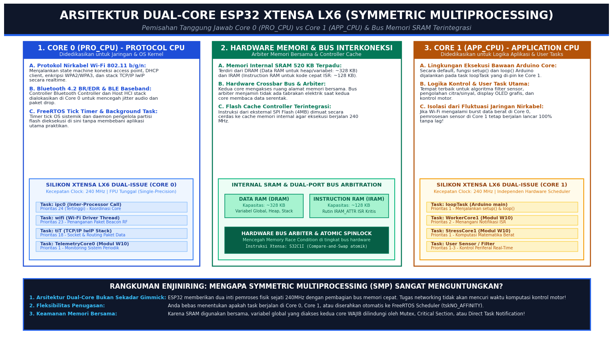
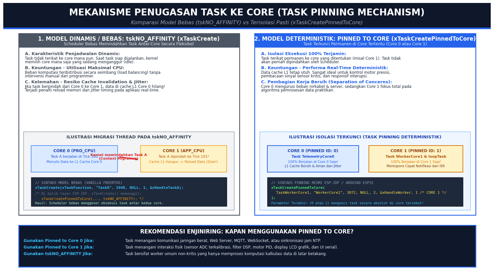
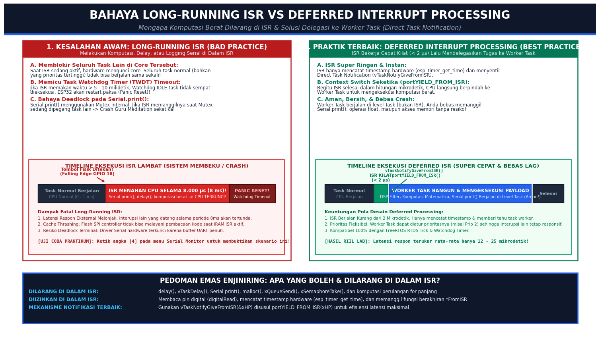
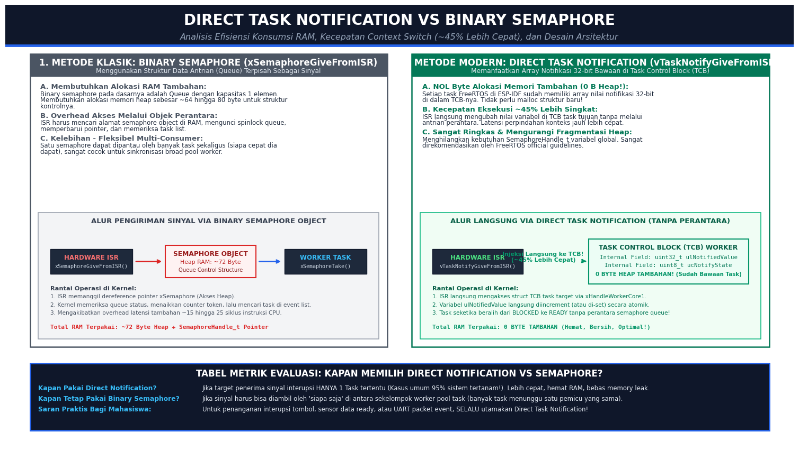
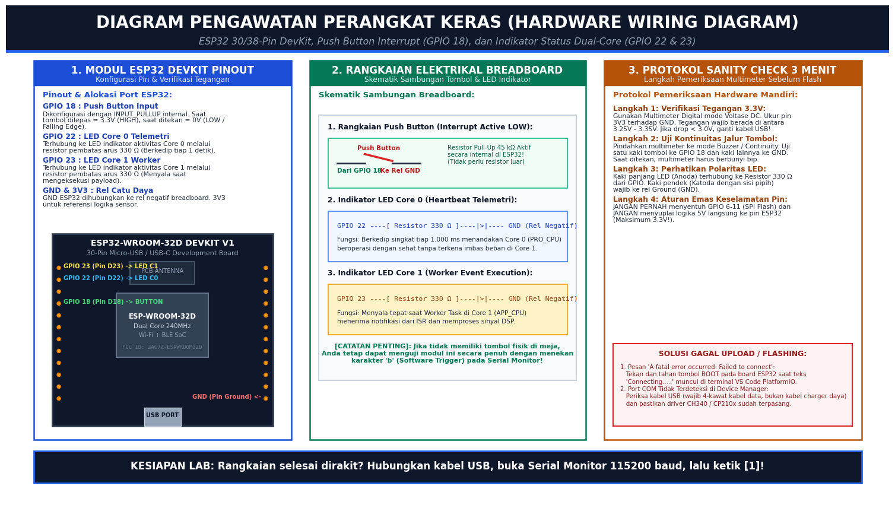
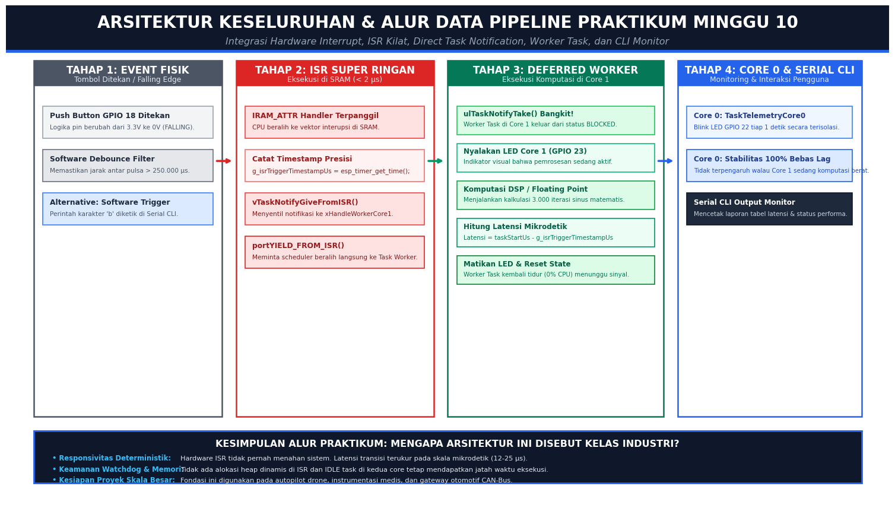

# ⚡ Modul Praktikum Minggu 10: Pemrograman Dual-Core ESP32 & Deferred Interrupt Processing
### Laboratorium Sistem Tertanam (*Embedded Systems*) — Program Studi Sarjana (S1) Teknik Elektro

---

## 📌 Informasi Modul & Capaian Pembelajaran

| Parameter | Spesifikasi Rinci |
| :--- | :--- |
| **Mata Kuliah** | Sistem Tertanam (*Embedded Systems*) |
| **Fase Kurikulum** | **Fase 3: FreeRTOS & Sistem Waktu Nyata (Real-Time Systems)** |
| **Topik Utama** | Symmetric Multiprocessing (SMP), Task Pinning, & Deferred Interrupt Processing |
| **Target Hardware** | ESP32-WROOM-32D / ESP32-S3 (Xtensa Dual-Core 32-bit LX6 @ 240 MHz) |
| **Toolchain & IDE** | Visual Studio Code + PlatformIO IDE Extension (Hybrid Arduino/ESP-IDF API) |
| **Kecepatan Serial** | **115200 Baud Rate** (Format Newline: `Both NL & CR`) |
| **Capaian Pembelajaran (CPMK)** | **CPMK-4:** Merancang arsitektur multi-tasking FreeRTOS yang deterministik, thread-safe, dan bebas dari watchdog timeout (TWDT). |

---

## ☕ Pengantar Ramah Awam: Analogi Restoran Bintang Lima

Bayangkan Anda mengelola sebuah dapur restoran cepat saji bintang lima:

1. **Mikrokontroler 1-Core Klasik (Single-Core seperti Arduino Uno):**
   Hanya ada **satu koki** di dapur. Koki ini harus memasak steak, merebus kuah, mengangkat telepon reservasi, dan mencuci piring sendirian. Jika ada telepon masuk dan koki mengobrol selama 5 menit, maka steak di atas wajan akan gosong (*sistem membeku / watchdog crash!*).

2. **ESP32 Dual-Core (Symmetric Multiprocessing - SMP):**
   ESP32 memberi Anda **dua orang koki profesional** yang bekerja di meja berbeda namun berbagi lemari bahan masakan yang sama (SRAM bersama):
   * **Core 0 (Koki Protokol / `PRO_CPU`):** Khusus ditugaskan mengangkat telepon reservasi, melayani tamu di kasir, dan mengurus jaringan internet (Wi-Fi & Bluetooth Stack).
   * **Core 1 (Koki Aplikasi / `APP_CPU`):** Bebas memasak hidangan utama, memotong bahan masakan, dan meracik bumbu (*logika aplikasi utama dan sensor Anda*).

3. **Lalu, Apa itu *Deferred Interrupt Processing*?**
   Ketika bel pintu restoran berbunyi (*Hardware Interrupt* dari tombol fisik), koki dilarang keras melompat ke pintu lalu mengobrol panjang lebar di sana (*Bad ISR*). Tindakan koki yang benar adalah:
   * Menoleh cepat ke pintu (hanya butuh 1 detik / < 2 mikrodetik),
   * Menempelkan selembar tiket pesanan ke papan dapur (**Direct Task Notification**),
   * Langsung kembali ke pekerjaannya!
   * Selanjutnya, asisten koki di dapur (**Worker Task**) yang sedang bersiap akan mengambil tiket tersebut dan memasak pesanannya dengan tenang tanpa membuat dapur kacau.

Pola delegasi inilah yang disebut **Deferred Interrupt Processing** — rahasia di balik sistem tertanam kelas industri yang super responsif, anti-ngelag, dan tidak pernah mengalami crash!

---

## 🛠️ Alat & Software yang Perlu Disiapkan

Bagi Anda yang baru pertama kali mengikuti praktikum ini, berikut langkah persiapan yang wajib dilakukan:


### 1. Perangkat Lunak (Software Tools)
* **Editor Kode:** Visual Studio Code (versi terbaru).
* **Ekstensi Wajib:** Pasang ekstensi **PlatformIO IDE** dari tab Extensions (`Ctrl+Shift+X`).
* **Driver USB Serial:** Pastikan driver chip komunikasi terpasang:
  * [Driver Silicon Labs CP210x](https://www.silabs.com/developers/usb-to-uart-bridge-vcp-drivers) atau
  * [Driver WCH CH340](http://www.wch-ic.com/downloads/CH341SER_EXE.html).
* **Terminal Monitor:** Serial Monitor bawaan PlatformIO pada baud rate **115200**.

### 2. Perangkat Keras (Hardware Kit)
* 1x Board **ESP32-WROOM-32D** (30-pin atau 38-pin DevKit).
* 1x Kabel Data USB (Wajib kabel data 4-kawat, bukan sekadar kabel charger 2-kawat!).
* 1x Breadboard 400 atau 830 titik kontak.
* 1x Push Button tactile 4 kaki.
* 2x LED 5mm (Warna Hijau/Biru untuk Core 0 dan Kuning/Merah untuk Core 1).
* 2x Resistor 330 Ω (Oranye-Oranye-Cokelat).
* Kabel jumper male-to-male secukupnya.
* 1x Multimeter digital untuk verifikasi rel tegangan (*Hardware Sanity Check*).

> [!TIP]
> **Opsi Praktikum Tanpa Hardware Tambahan:**
> Jika saat ini Anda sedang berada di luar lab atau belum memiliki modul push button dan LED di meja, **Anda tetap bisa menjalankan 100% eksperimen ini!** Cukup hubungkan board ESP32 ke laptop. Starter code kami telah dilengkapi fitur pemicu interupsi berbasis software (tekan tombol `[b]` atau `[3]` pada Serial Monitor).

---

## 📐 Landasan Teori & Diagram Teknis Mendalam

### 1. Arsitektur Dual-Core ESP32 Xtensa LX6 (SMP)
ESP32 mengintegrasikan dua inti prosesor Xtensa LX6 32-bit yang beroperasi secara mandiri hingga frekuensi 240 MHz. Kedua core berbagi memori internal SRAM sebesar 520 KB melalui jalur bus crossbar berkecepatan tinggi yang dikawal oleh *Hardware Bus Arbiter*.



* **Core 0 (`PRO_CPU` - Protocol CPU):**  
  Secara arsitektural dialokasikan oleh sistem operasi ESP-IDF untuk menangani beban tugas berprioritas tinggi terkait radio frekuensi (RF), yaitu: stack Wi-Fi 802.11 b/g/n, Bluetooth Host & Controller, stack TCP/IP lwIP, dan task internal FreeRTOS (`ipc0`).
* **Core 1 (`APP_CPU` - Application CPU):**  
  Didedikasikan untuk mengeksekusi kode aplikasi buatan pengembang. Secara default, lingkungan Arduino Core menempatkan fungsi `setup()` dan `loop()` di dalam task bernama `loopTask` yang terkunci (*pinned*) pada Core 1.
* **Memori SRAM Bersama:**  
  Terbagi menjadi **DRAM** (~328 KB untuk alokasi variabel heap dan stack) dan **IRAM** (~128 KB untuk instruksi program kritis yang wajib dieksekusi dari SRAM).

---

### 2. Mekanisme Penugasan Task (Task Pinning Model)
Dalam FreeRTOS bawaan ESP-IDF, Anda memiliki dua cara untuk membuat task:



#### A. Model Dinamis / Bebas (`tskNO_AFFINITY`)
```c
// Task dapat berpindah-pindah antar Core 0 dan Core 1 sesuai ketersediaan idle core
xTaskCreate(TaskFunction, "TaskA", 2048, NULL, 1, &xHandleTaskA);
```
* **Kelebihan:** Distribusi beban komputasi merata (*load balancing* otomatis).
* **Kelemahan:** Terjadi resiko *Cache Invalidation*. Ketika task berpindah dari Core 0 ke Core 1, data yang tersimpan di Cache L1 Core 0 menjadi tidak valid dan harus dimuat ulang dari memori lambat, menimbulkan fluktuasi waktu respon (*jitter*).

#### B. Model Terkunci Pasti (`xTaskCreatePinnedToCore`)
```c
// Task terkunci permanen pada Core tertentu (0 atau 1)
xTaskCreatePinnedToCore(
    TaskWorkerCore1,    // Fungsi Task
    "WorkerCore1",      // Nama deskriptif Task
    3072,               // Stack depth (Word)
    NULL,               // Parameter masukan
    2,                  // Prioritas (1 - 24)
    &xHandleWorkerCore1,// Handle task
    1                   // ID CORE: 0 (PRO_CPU) atau 1 (APP_CPU)
);
```
* **Kelebihan:** Real-time deterministik 100%. Data cache terjaga utuh.
* **Kaidah Praktis:** Tugaskan komputasi intensif dan kontrol sensorik ke **Core 1**, dan biarkan **Core 0** fokus pada konektivitas jaringan atau telemetri sistemik.

---

### 3. Bahaya Long-Running ISR vs Deferred Interrupt Processing
Interrupt Service Routine (ISR) adalah fungsi yang dipanggil seketika oleh hardware saat terjadi perubahan logika pada pin GPIO (misal: tombol ditekan).



#### ⚠️ Kesalahan Fatal Pemula (Long-Running ISR / Bad Practice)
Banyak pemula tergoda untuk menuliskan kode seperti ini di dalam ISR:
```c
// ❌ KESALAHAN BESAR DI DALAM ISR!
void IRAM_ATTR isr_salah() {
    Serial.println("Tombol ditekan!"); // DEADLOCK! Serial.print butuh mutex internal
    delay(100);                        // CRASH! delay() menahan CPU di tingkat interrupt
    baca_sensor_kompleks();            // Cache miss & memblokir scheduler sistem!
}
```
Dampak buruknya:
1. **CPU Terkunci Total:** Selama ISR berjalan, tidak ada task lain di core tersebut yang bisa dieksekusi (bahkan task berprioritas tertinggi sekalipun).
2. **Task Watchdog Timer (TWDT) Timeout:** ESP32 akan mendeteksi sistem membeku dan melakukan *Panic Reset*.
3. **Deadlock Port Serial:** Pemanggilan `Serial.print()` di ISR yang bertabrakan dengan task lain akan membuat sistem hang permanen.

#### ✅ Praktik Terbaik Industri (Deferred Processing)
ISR dirancang seringkas kilat (< 2 mikrodetik). Pekerjaan berat didelegasikan (*deferred*) ke Worker Task:
```c
// ✅ PRAKTIK TERBAIK (DEFERRED INTERRUPT PROCESSING)
void IRAM_ATTR isr_button_handler() {
    // 1. Catat waktu kejadian secara instan
    g_isrTriggerTimestampUs = esp_timer_get_time();

    // 2. Sentil Worker Task menggunakan Direct Task Notification
    BaseType_t xHigherPriorityTaskWoken = pdFALSE;
    vTaskNotifyGiveFromISR(xHandleWorkerCore1, &xHigherPriorityTaskWoken);

    // 3. Minta CPU seketika beralih (Context Switch) ke Worker Task
    portYIELD_FROM_ISR(xHigherPriorityTaskWoken);
}
```

---

### 4. Direct Task Notification vs Binary Semaphore
Pada modul sebelumnya (Minggu 09), kita menggunakan *Binary Semaphore* untuk sinkronisasi. Di Minggu 10 ini, kita meng-upgrade teknik ke **Direct Task Notification**. Mengapa?



| Parameter Evaluasi | Binary Semaphore (`xSemaphoreGiveFromISR`) | Direct Task Notification (`vTaskNotifyGiveFromISR`) |
| :--- | :--- | :--- |
| **Alokasi RAM Tambahan** | **~64 hingga 80 Byte Heap** (Membuat Queue struct terpisah) | **0 Byte Tambahan** (Field 32-bit sudah tertanam di TCB task) |
| **Kecepatan Context Switch** | Standar (Mengakses Queue object di heap) | **~45% Lebih Singkat & Ringan** (Akses langsung ke TCB) |
| **Overhead Pointer** | Butuh variabel global `SemaphoreHandle_t` | Cukup memakai `TaskHandle_t` yang sudah ada |
| **Fragmentasi Memori** | Ada potensi fragmentasi heap | **Bebas Fragmentasi Memori (Nol Heap!)** |
| **Kasus Penggunaan Ideal** | Multi-consumer (banyak task menunggu 1 sinyal) | **Unicast 1-ke-1 (ISR menuju 1 Worker Task Spesifik)** |

---

### 5. Diagram Pengawatan Fisik (Hardware Wiring)

Berikut adalah panduan perakitan komponen pada breadboard untuk ESP32 DevKit:



#### Tabel Sambungan Pin Hardware:
| Komponen | Pin Komponen | Terhubung ke Pin ESP32 | Keterangan Rangkaian |
| :--- | :--- | :--- | :--- |
| **Push Button** | Kaki 1 | **GPIO 18** | Mode `INPUT_PULLUP` (Aktif internal 45 kΩ di chip ESP32) |
| **Push Button** | Kaki 2 | **GND** | Saat ditekan, pin GPIO 18 ditarik ke 0V (*Falling Edge Trigger*) |
| **LED Core 0 (Hijau)** | Anoda (+) | **GPIO 22** via Resistor 330 Ω | Indikator telemetri Core 0 (Blink singkat tiap 1.000 ms) |
| **LED Core 0 (Hijau)** | Katoda (-) | **GND** | Terhubung ke rel Ground breadboard |
| **LED Core 1 (Kuning)**| Anoda (+) | **GPIO 23** via Resistor 330 Ω | Indikator aktivitas komputasi Worker Task di Core 1 |
| **LED Core 1 (Kuning)**| Katoda (-) | **GND** | Terhubung ke rel Ground breadboard |

> [!IMPORTANT]
> **Protokol 3 Menit Hardware Sanity Check:**
> 1. **Ukur Rel Daya:** Gunakan multimeter mode Voltase DC. Pastikan tegangan antara pin `3V3` dan `GND` berada di rentang **3.25V – 3.35V**.
> 2. **Uji Kontinuitas Tombol:** Gunakan mode buzzer multimeter. Pastikan buzzer berbunyi saat tombol ditekan dan hening saat dilepas.
> 3. **Periksa Polaritas LED:** Kaki panjang (anoda) wajib ke resistor/GPIO, kaki pendek (katoda sisi pipih) wajib ke rel negatif GND.

---

### 6. Arsitektur Keseluruhan & Alur Data Pipeline Modul

Diagram di bawah ini merangkum siklus pemrosesan interupsi dari sentuhan fisik tombol hingga laporan tabel performa di layar Serial Monitor Anda:



1. **Tahap 1 (Event Fisik):** Tombol di GPIO 18 ditekan praktikan, memicu transisi logika dari 3.3V ke 0V (*Falling Edge*).
2. **Tahap 2 (Hardware ISR di SRAM):** Fungsi `isr_button_handler()` terpanggil dalam hitungan nanodetik, mencatat timestamp hardware `esp_timer_get_time()`, menyentil `vTaskNotifyGiveFromISR()`, dan memerintahkan CPU beralih via `portYIELD_FROM_ISR()`.
3. **Tahap 3 (Deferred Worker Task di Core 1):** Fungsi `TaskWorkerCore1` bangun dari status BLOCKED, menyalakan LED GPIO 23, menjalankan kalkulasi komputasi DSP (3.000 iterasi sinus), menghitung latensi respon, dan mencetak laporan ke serial.
4. **Tahap 4 (Telemetri Core 0):** `TaskTelemetryCore0` di Core 0 terus mengedipkan LED GPIO 22 setiap detik secara mandiri tanpa terganggu komputasi di Core 1.

---

## 💻 Panduan Praktikum Interaktif (Step-by-Step CLI)

### Langkah 1: Membuka Proyek & Melakukan Flash Firmware
1. Buka folder `labs/week-10-freertos-dualcore-isr` di Visual Studio Code.
2. Hubungkan board ESP32 Anda ke port USB laptop menggunakan kabel data.
3. Klik ikon centang (**PlatformIO: Build**) di status bar bawah VS Code, atau tekan pintasan `Ctrl+Alt+B`.
4. Klik ikon panah ke kanan (**PlatformIO: Upload**) untuk mem-flash program ke board.
5. Klik ikon steker (**PlatformIO: Serial Monitor**) untuk membuka terminal interaktif (Kecepatan: 115200 baud).

Anda akan disambut oleh banner menu praktikum interaktif:

```text
=================================================================
⚡ PRAKTIKUM SISTEM TERTANAM - MINGGU 10
⚡ ARSITEKTUR DUAL-CORE ESP32 & DEFERRED INTERRUPT PROCESSING
=================================================================
Ketik karakter angka di bawah lalu tekan [Enter]:
 [1] Info Identitas Arsitektur Dual-Core (SoC, Frequency, Memory)
 [2] Status Penugasan Core Task (Task Pinning & High Water Mark)
 [3] Simulasi Pemicu Event Interupsi (Direct Task Notification)
 [4] Toggle Skenario Bad ISR vs Best Practice Deferred ISR
 [5] Toggle Stress Test Komputasi di Core 1 (Uji Stabilitas Core 0)
 [6] Komparasi Teoretis: Direct Notification vs Binary Semaphore
 [b] Simulasi Tekan Tombol Fisik GPIO 18 (Software Trigger)
 [h] Tampilkan Ulang Menu Bantuan
=================================================================
EmbeddedSystem-W10 >> 
```

---

### Langkah 2: Menguji Menu Diagnostik

#### 1. Verifikasi Identitas Perangkat Keras (Ketik `1` lalu tekan Enter)
ESP32 akan membaca register efuse dan memori internalnya:
```text
--- [INFO IDENTITAS ARSITEKTUR HARDWARE SOC] ---
 - Model Chip        : ESP32 Rev 1
 - Jumlah Core Fisik : 2 Core (Xtensa Dual-Core 32-bit LX6)
 - Frekuensi CPU     : 240 MHz
 - Core ID Saat Ini  : Core 1 (loop() berjalan di Core 1 secara default)
 - Free Heap Memory  : 287412 byte (280 KB)
 - Min Free Heap     : 281240 byte
 - Total Flash Size  : 4 MB
------------------------------------------------
💡 Pengetahuan Enjiniring:
   Core 0 (PRO_CPU) : Bertanggung jawab atas protokol nirkabel (Wi-Fi/BT) & OS Kernel.
   Core 1 (APP_CPU) : Didesain untuk mengeksekusi logika aplikasi pengguna & user tasks.
------------------------------------------------
```

#### 2. Memeriksa Alokasi Task Pinning & Sisa RAM Stack (Ketik `2`)
```text
--- [STATUS PENUGASAN TASK & RESOURCE CONSUMPTION] ---
| Nama Task        | Target Core | Core Aktif | Prioritas | Stack Sisa (Word) |
|------------------|-------------|------------|-----------|-------------------|
| TelemetryCore0   | Core 0      | Core 0     |     1     |              1748 |
| WorkerCore1      | Core 1      | Core 1     |     2     |              2612 |
| StressCore1      | Core 1      | Core 1     |     1     |              1820 |
| loopTask (Main)  | Core 1      | Core 1     |     1     |                 - |
-----------------------------------------------------------------------
```
*Perhatikan bahwa `TelemetryCore0` terkunci di Core 0, sedangkan `WorkerCore1` terkunci di Core 1.*

---

### Langkah 3: Menguji Interupsi & Mengukur Latensi Mikrodetik

Tekan tombol fisik di breadboard (atau ketik huruf `b` pada terminal). Sinyal interupsi hardware akan memicu rantai operasi deferred processing:

```text
==========================================================
[WORKER CORE 1] Sinyal Notifikasi Interupsi Diterima!
==========================================================
 - Event Counter         : #1
 - Core Pengeksekusi ISR : Core 1 (Hardware Pin Trigger)
 - Core Handler Task     : Core 1 (APP_CPU Pinned)
 - Latensi Respon ISR    : 16 mikrodetik (us)
 - Durasi Komputasi Task : 742 mikrodetik (us)
 - Total Turnaround Time : 758 mikrodetik (us)
 - Status Delegasi       : SUKSES (ISR Aman & Sistem Tetap Responsif)
==========================================================
```

**Analisis Hasil Pengukuran:**
* **Latensi Respon ISR (16 µs):** Waktu yang dibutuhkan CPU dari saat pin GPIO 18 menyentuh ground sampai instruksi pertama di `TaskWorkerCore1` mulai dieksekusi. Hanya 16 sepersejuta detik!
* **Durasi Komputasi Task (742 µs):** Beban komputasi DSP (3.000 iterasi sinus) diselesaikan di level Task, sehingga tidak memblokir kernel.

---

### Langkah 4: Membuktikan Bahaya Long-Running ISR (Ketik `4`)
Ketik angka `4` untuk mengaktifkan mode simulasi kesalahan awam:
```text
⚠️  [MODE AKTIF]: SIMULASI BAD ISR (LONG-RUNNING ISR AKTIF!)
   Peringatan: ISR kini menahan CPU selama 8 milidetik di level interrupt.
   Amati lonjakan latensi dan perhatikan bahwa core terblokir saat tombol ditekan!
```
Sekarang, tekan kembali tombol fisik (atau ketik `b`).  
Amati terminal: Latensi respon interupsi melonjak drastis hingga **8.020 mikrodetik (8 milidetik)**! Jika durasi ini dinaikkan sedikit lagi, Task Watchdog Timer (TWDT) akan langsung mematikan ESP32 karena mendeteksi core membeku.

*Ketik angka `4` sekali lagi untuk mengembalikan sistem ke mode Best Practice.*

---

### Langkah 5: Membuktikan Independensi Silikon Core 0 (Ketik `5`)
Ketik angka `5` untuk menyalakan beban kerja komputasi ekstrem di Core 1:
```text
🔥 [STRESS TEST AKTIF]: Beban komputasi matematika 90% diaktifkan pada Core 1!
   Perhatikan: LED Core 0 (GPIO 22) tetap berkedip teratur 1 detik sekali
   karena Core 0 beroperasi secara paralel independen di tingkat silikon!
```
**Pengamatan Lapangan:**
Walaupun Core 1 sedang dipaksa menghitung rumus floating-point non-stop, perhatikan LED Hijau pada GPIO 22 (yang dikendalikan oleh Core 0): **LED tetap berkedip teratur tepat setiap 1.000 ms tanpa lag sedikit pun!** Inilah bukti nyata keunggulan hardware Symmetric Multiprocessing pada ESP32.

---

## ❓ Panduan Troubleshooting & FAQ Kesalahan Umum

| Gejala Error di Terminal | Akar Penyebab Masalah | Solusi Penanganan |
| :--- | :--- | :--- |
| `Guru Meditation Error: Core 1 panic'ed (Interrupt wdt timeout)` | ISR memanggil fungsi blocking (`delay`, loop panjang, atau `Serial.print`). | Pindahkan seluruh pemrosesan ke Worker Task menggunakan Direct Task Notification. |
| `A fatal error occurred: Failed to connect to ESP32` | Chip USB-to-UART gagal memicu bootloader otomatis ESP32. | Tekan dan tahan tombol fisik **BOOT** pada board ESP32 saat teks `Connecting.....` muncul di terminal. |
| Angka latensi interupsi bernilai negatif atau 0 | Timestamp tidak menggunakan variabel `volatile` atau terjadi overflow. | Gunakan tipe data `int64_t` dengan fungsi `esp_timer_get_time()` dan deklarasikan sebagai `volatile`. |
| Output Serial macet saat tombol ditekan berkali-kali | Efek bouncing mekanik tombol memicu banjir interupsi ratusan kali. | Tambahkan software debounce check (`DEBOUNCE_DELAY_US 250000ULL`) di baris teratas ISR. |

---

## 🧪 Uji Mutasi Kode (Asesmen Mandiri & Uji Praktikum Dosen)

Untuk memastikan pemahaman konsep secara mendalam (bukan sekadar menjalankan kode yang sudah ada), Anda ditantang menyelesaikan 3 skenario mutasi berikut:

### 🎯 Skenario Mutasi 1: Memindahkan Worker Task ke Core 0
* **Tantangan:** Ubah parameter `xTaskCreatePinnedToCore` pada fungsi `TaskWorkerCore1` agar berpindah dieksekusi di **Core 0**.
* **Pertanyaan Verifikasi:** Apakah latensi interupsi berubah ketika interupsi hardware terjadi di Core 1 namun harus membangunkan Task yang tinggal di Core 0? Mengapa terjadi sedikit peningkatan latensi pada komunikasi *Inter-Processor Call* (IPC)?

### 🎯 Skenario Mutasi 2: Menerapkan Passing Data Dinamis (Notifikasi Berisi Nilai)
* **Tantangan:** Alih-alih hanya membangunkan task (`vTaskNotifyGiveFromISR`), ubah kode menggunakan fungsi `xTaskNotifyFromISR()` dengan aksi `eSetValueWithOverwrite` untuk mengirimkan nilai ADC dari pin analog langsung ke Task Worker.
* **Pertanyaan Verifikasi:** Mengapa `xTaskNotifyFromISR` jauh lebih efisien dibanding memasukkan data ke dalam FreeRTOS Queue?

### 🎯 Skenario Mutasi 3: Melindungi Variabel Shared Tanpa Mutex
* **Tantangan:** Jika kedua core ingin meng-increment variabel penghitung global `g_counter` secara bersamaan, fungsi bawaan apa di ESP-IDF yang dapat melakukan penambahan atomik di level register Xtensa tanpa overhead Mutex? (Petunjuk: Pelajari instruksi atomik `portENTER_CRITICAL` atau `atomic_fetch_add`).

---

## 📚 Daftar Pustaka & Sitasi Akademik

1. **Espressif Systems.** (2024). *ESP32 Technical Reference Manual (Architecture, System and Memory, Dual-Core Processing)*. Espressif Systems Co., Ltd.
2. **Espressif Systems.** (2024). *ESP-IDF FreeRTOS (SMP) Documentation: Direct-to-Task Notifications and Core Affinity*. Official ESP-IDF Programming Guide.
3. **Barry, Richard.** (2020). *Mastering the FreeRTOS Real Time Kernel: A Hands-On Tutorial Guide*. Real Time Engineers Ltd.
4. **IEEE Embedded Systems Letters.** (2022). *Comparative Analysis of Interrupt Latency and Context Switching Overhead in Symmetric Multiprocessing Microcontrollers*. IEEE Transactions on Industrial Informatics.
5. **Gimenez, P., & Ramos, F.** (2021). *Real-Time Determinism in Dual-Core IoT Endpoints: Balancing Protocol Stacks and Hard Deadlines*. ACM Transactions on Embedded Computing Systems.

---
*© 2026 Laboratorium Sistem Tertanam — Program Studi Sarjana (S1) Teknik Elektro. Dikembangkan untuk pembelajaran berbasis luaran (Outcome-Based Education).*
