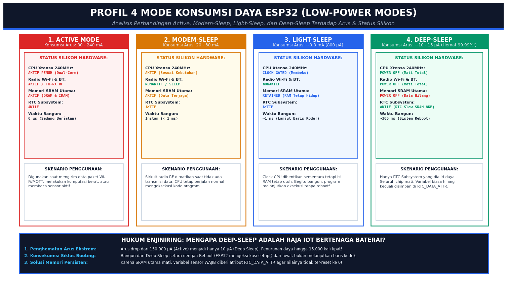
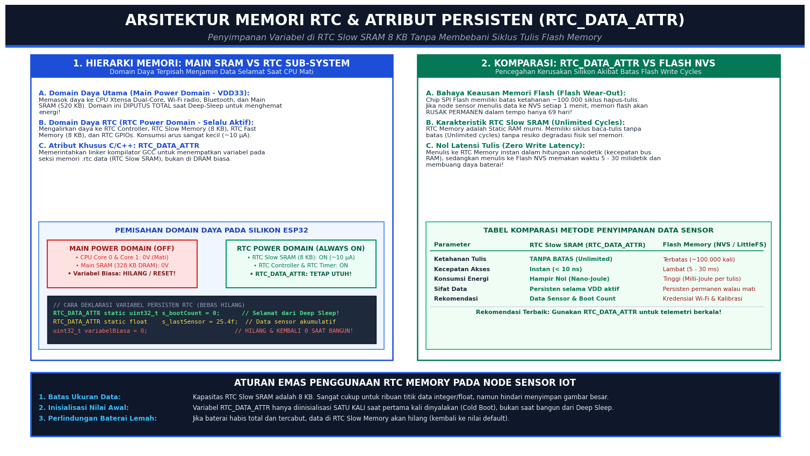
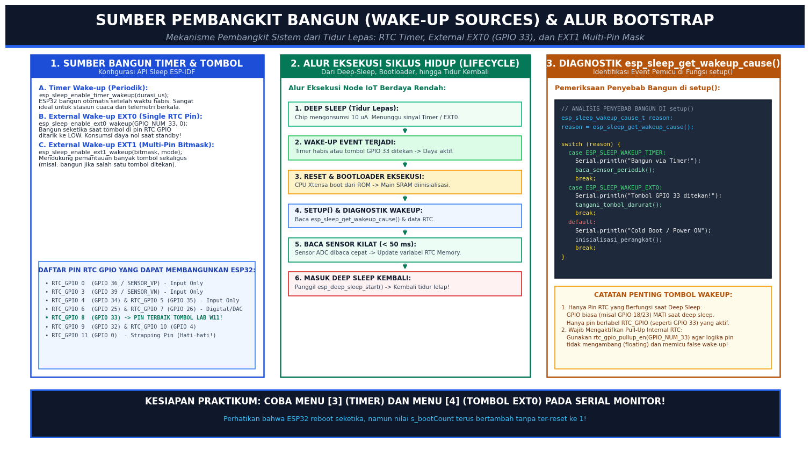
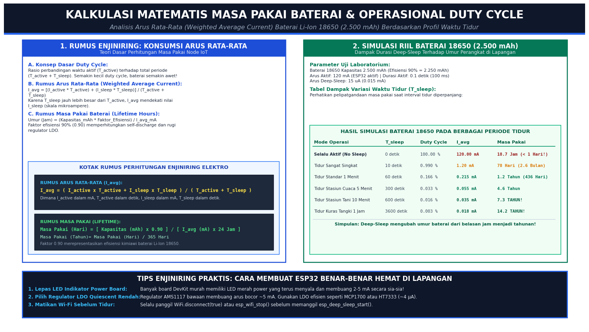
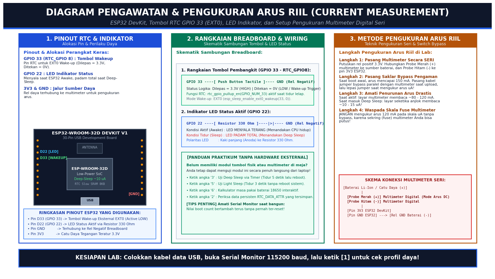
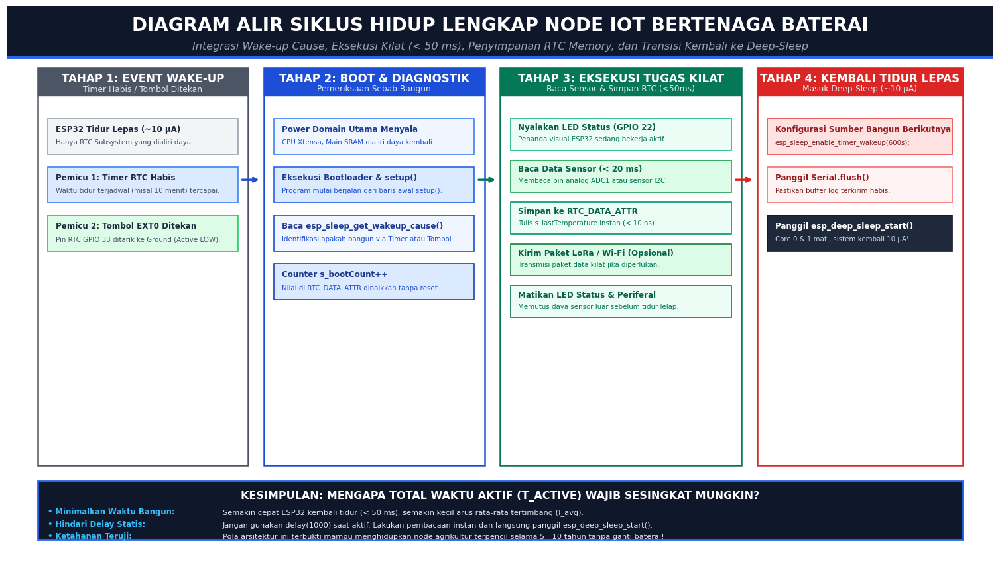

# 🔋 LAB MINGGU 11: DESAIN SISTEM BERTENAGA BATERAI (LOW-POWER OPTIMIZATION & DEEP SLEEP)

> **Mata Kuliah:** Praktikum Sistem Tertanam (*Embedded System*)  
> **Platform:** ESP32-WROOM-32 (Dual-Core Xtensa LX6 240MHz, Ultra-Low Power Coprocessor & RTC Subsystem)  
> **Framework:** Arduino Core on ESP-IDF & FreeRTOS  
> **Tingkat Kesulitan:** Menengah ke Lanjutan (*Intermediate to Advanced*)  
> **Estimasi Waktu Pengerjaan:** 3 – 4 Jam Praktikum Mandiri / Terbimbing  

---

## 📌 DAFTAR ISI
1. [Pengantar & Motivasi: Mengapa Low-Power Wajib Dikuasai?](#1-pengantar--motivasi-mengapa-low-power-wajib-dikuasai)
2. [Alat & Bahan Praktikum (Lengkap dengan Panduan Pemula)](#2-alat--bahan-praktikum-lengkap-dengan-panduan-pemula)
3. [Profil 4 Mode Konsumsi Daya ESP32](#3-profil-4-mode-konsumsi-daya-esp32)
4. [Arsitektur Memori RTC & Atribut Persisten RTC_DATA_ATTR](#4-arsitektur-memori-rtc--atribut-persisten-rtc_data_attr)
5. [Sumber Pembangkit Bangun (Wake-up Sources) & Bootstrap Flow](#5-sumber-pembangkit-bangun-wake-up-sources--bootstrap-flow)
6. [Kalkulasi Matematis Masa Pakai Baterai & Duty Cycle](#6-kalkulasi-matematis-masa-pakai-baterai--duty-cycle)
7. [Pengawatan Hardware & Teknik Pengukuran Arus Riil](#7-pengawatan-hardware--teknik-pengukuran-arus-riil)
8. [Diagram Alir Siklus Hidup Lengkap Node IoT Berdaya Rendah](#8-diagram-alir-siklus-hidup-lengkap-node-iot-berdaya-rendah)
9. [Panduan Menjalankan & Menguji Proyek (Menu CLI Interaktif)](#9-panduan-menjalankan--menguji-proyek-menu-cli-interaktif)
10. [Troubleshooting & Solusi Masalah Lapangan](#10-troubleshooting--solusi-masalah-lapangan)
11. [Tantangan Modifikasi Kode (Hands-on Mutations)](#11-tantangan-modifikasi-kode-hands-on-mutations)
12. [Referensi Akademik & Dokumen Resmi](#12-referensi-akademik--dokumen-resmi)

---

## 1. Pengantar & Motivasi: Mengapa Low-Power Wajib Dikuasai?

Bayangkan Anda merancang sebuah sistem pemantauan kelembapan tanah di perkebunan kelapa sawit seluas 500 hektar, atau stasiun pendeteksi dini banjir di lereng gunung terpencil. Di lokasi-lokasi seperti ini:
* Tidak ada colokan listrik PLN dinding.
* Mengganti baterai setiap 2 hari sekali adalah hal yang mustahil secara operasional dan finansial.
* Perangkat **wajib hidup berbulan-bulan hingga bertahun-tahun** hanya mengandalkan sebuah baterai silinder Li-Ion 18650 kecil atau panel surya mini.

Jika Anda membiarkan ESP32 berjalan normal seperti praktikum biasa (Active Mode), mikrokontroler ini mengonsumsi arus sekitar **80 hingga 150 mA** (bahkan melonjak hingga **240 mA** saat radio Wi-Fi aktif memancarkan sinyal). Dengan baterai berkapasitas 2.500 mAh, ESP32 Anda akan **mati total dalam waktu kurang dari 18 jam**!

```
Perbandingan Nyata Konsumsi Arus:
[Mode Aktif Penuh (Active Mode)]      : ~120.000 µA  (Baterai habis dlm ~18 Jam!)
[Mode Tidur Lepas (Deep-Sleep ESP32)] : ~10 - 15 µA  (Baterai tahan hingga 5 - 10 TAHUN!)
Penurunan Konsumsi Daya: Lebih dari 12.000 KALI LIPAT!
```

### 🐻 Analogi Sederhana: Beruang Hibernasi Musim Dingin
Untuk memahami konsep **Deep Sleep**, bayangkan seekor beruang di kutub utara saat musim dingin tiba:
* **Tidak Efisien (Active Mode):** Beruang terus berlari kencang mencari makanan di tengah badai salju membeku. Energi cadangan lemaknya akan habis dalam hitungan hari, dan ia akan mati kedinginan.
* **Sangat Cerdas (Deep Sleep):** Beruang masuk ke dalam gua hangat, lalu tidur lelap (*hibernation*). Detak jantungnya melambat drastis, suhu tubuhnya turun, pernapasan melambat hingga 99%, dan hampir seluruh organ tubuhnya tidak membakar kalori. Hanya ada satu bagian kecil di otaknya yang tetap siaga mendeteksi datangnya musim semi atau suara gemerisik bahaya di mulut gua.
* Begitu pula ESP32: Saat masuk Deep Sleep, kedua inti CPU (*Xtensa LX6 Core 0 & Core 1*), modul radio Wi-Fi/Bluetooth, serta memori SRAM utama (520 KB) **dimatikan total dari aliran daya**. Yang tetap menyala hanyalah subsistem mini berdaya super rendah yang disebut **RTC Subsystem** (hanya menarik arus ~10 mikroampere!).

---

## 2. Alat & Bahan Praktikum (Lengkap dengan Panduan Pemula)

Sebelum menulis baris kode pertama, mari siapkan meja kerja dan perangkat lunak Anda. Modul ini dirancang fleksibel: mahasiswa yang **memiliki perangkat keras lengkap** dapat mengukur penurunan arus riil menggunakan multimeter, sementara mahasiswa yang **hanya memiliki laptop dan board ESP32** tetap dapat menguji 100% fungsionalitas melalui antarmuka konsol serial (*Command Line Interface*).

### A. Perangkat Lunak (Software Tools)
1. **VS Code** dengan ekstensi resmi **PlatformIO IDE** terpasang.
2. **Serial Monitor**: Terbuka pada baud rate **115200 bps** (di PlatformIO, klik ikon colokan steker pada bilah bawah / *Status Bar*).
3. **Driver USB-to-UART**: Driver CP2102 atau CH340 terinstal agar ESP32 terbaca di *Device Manager* komputer Anda.

### B. Perangkat Keras (Hardware Tools)
| Komponen | Jumlah | Fungsi Praktikum |
| :--- | :---: | :--- |
| **ESP32-WROOM-32 DevKit** | 1 unit | Board mikrokontroler utama 30-pin. |
| **Kabel Data USB (Micro-USB / Type-C)** | 1 kabel | Jalur catu daya 5V dan komunikasi Serial Monitor ke laptop. |
| **Breadboard (Project Board)** | 1 buah | Papan tempat menancapkan komponen tanpa solder. |
| **Push Button Tactile (Tombol Tekan)** | 1 buah | Pemicu bangun eksternal (*EXT0 Wake-up*) pada pin RTC GPIO 33. |
| **LED 5mm (Warna Hijau/Biru)** | 1 buah | Indikator visual status kerja (Menyala = Aktif, Padam = Tidur). |
| **Resistor 330 Ω (Ohm)** | 1 buah | Resistor pembatas arus untuk melindungi LED. |
| **Kabel Jumper (Male-to-Male)** | 5-7 helai | Menghubungkan pin ESP32 ke tombol dan rel negatif breadboard. |
| **Multimeter Digital (Opsional Lab)** | 1 unit | Mengukur arus riil ESP32 (skala mA dan µA). |

> [!NOTE]
> **Belum Memiliki Tombol Fisik atau Multimeter di Meja?**  
> Jangan berkecil hati! Firmware pada lab ini dilengkapi fitur uji coba virtual. Anda cukup mengetik angka `[3]` pada Serial Monitor untuk menguji tidur timer 5 detik, angka `[5]` untuk menguji Light-Sleep, angka `[2]` untuk mengamati memori RTC, dan angka `[6]` untuk menjalankan kalkulator daya baterai interaktif!

---

## 3. Profil 4 Mode Konsumsi Daya ESP32

Mikrokontroler ESP32 memiliki manajemen daya berlapis (*Power Management Unit*) yang dapat disesuaikan dengan kebutuhan komputasi sistem Anda:



### Rincian Analisis Karakteristik Mode:
1. **Active Mode (Mode Aktif):**
   * **Arus:** 80 – 240 mA (Tergantung apakah Wi-Fi sedang memancarkan paket RF).
   * **Kondisi Silikon:** Dual Core Xtensa berjalan pada frekuensi 240 MHz, radio RF aktif, SRAM DRAM/IRAM dialiri daya penuh.
   * **Penggunaan:** Hanya saat ESP32 benar-benar perlu menghitung algoritma berat atau mentransmisikan data ke server cloud / MQTT broker.
2. **Modem-Sleep Mode:**
   * **Arus:** 20 – 30 mA.
   * **Kondisi Silikon:** Sirkuit radio Wi-Fi dan Bluetooth dimatikan sementara, tetapi CPU dan peripheral internal (I2C, SPI, ADC) tetap mengeksekusi program seperti biasa.
   * **Penggunaan:** Saat membaca sensor lokal sebelum menghubungkan kembali ke Wi-Fi.
3. **Light-Sleep Mode:**
   * **Arus:** ~0.8 mA (800 µA).
   * **Kondisi Silikon:** Sinyal detak jam (*clock*) ke CPU dihentikan (*clock-gated*). Tegangan ke memori SRAM tetap dipertahankan sehingga **seluruh variabel program tidak hilang**.
   * **Waktu Bangun:** Sangat kilat (~1 milidetik). Begitu bangun, program **melanjutkan baris kode persis di bawah baris pemanggil sleep** tanpa melalui restart!
4. **Deep-Sleep Mode (Raja Hemat Daya):**
   * **Arus:** ~10 – 15 µA (0.010 – 0.015 mA).
   * **Kondisi Silikon:** Seluruh domain digital utama dimatikan total. CPU Xtensa mati, radio RF mati, SRAM utama 520 KB kehilangan daya total. Hanya domain daya RTC (*RTC Power Domain*) yang tetap aktif.
   * **Waktu Bangun:** ~300 milidetik. Sistem mengalami **reboot terkendali** (*Warm Boot*).

---

## 4. Arsitektur Memori RTC & Atribut Persisten `RTC_DATA_ATTR`

Salah satu kendala terbesar bagi pemula saat mengimplementasikan Deep Sleep adalah **kehilangan variabel**:
* Pada mikrokontroler biasa, jika sistem dimatikan, semua nilai variabel yang tersimpan di RAM (seperti variabel counter pembacaan sensor, akumulasi volume air, atau token koneksi) akan **terhapus dan kembali ke nilai 0**.
* Jika Anda menyimpan variabel ke Flash NVS (*Non-Volatile Storage*) setiap kali membaca sensor (misalnya setiap 1 menit), Anda akan **merusak chip Flash SPI secara permanen** hanya dalam waktu beberapa minggu karena flash memory hanya sanggup menahan sekitar 100.000 kali siklus hapus-tulis!



### Solusi Jenius ESP32: RTC Slow SRAM (8 Kilobyte)
ESP32 memiliki blok memori khusus berkapasitas 8 KB yang berada di dalam domain daya RTC (*RTC Slow Memory*). Memori ini **tidak pernah dimatikan** selama tegangan baterai utama masih terhubung!
* **Karakteristik:** Bersifat Static RAM murni, memiliki siklus baca-tulis **tanpa batas (unlimited cycles)**, dan tidak memerlukan waktu tunda penulisan (*zero write latency*).
* **Sintaks C/C++:** Cukup sematkan makro `RTC_DATA_ATTR static` di depan deklarasi variabel global Anda!

```cpp
// -------------------------------------------------------------
// CONTOH DEKLARASI VARIABEL PERSISTEN DI RTC SLOW SRAM
// -------------------------------------------------------------
RTC_DATA_ATTR static uint32_t s_bootCount = 0;        // Selamat dari Deep Sleep!
RTC_DATA_ATTR static float    s_lastTemperature = 0.0; // Nilai sensor tersimpan aman!

// VARIABEL BIASA (DI SRAM UTAMA):
uint32_t variabelBiasa = 0;                            // HILANG & KEMBALI KE 0 SAAT REBOOT!
```

### Tabel Komparasi: RTC Slow SRAM vs Flash NVS
| Parameter | RTC Slow SRAM (`RTC_DATA_ATTR`) | Flash Memory (NVS / Preferences / LittleFS) |
| :--- | :--- | :--- |
| **Ketahanan Siklus Tulis** | **Tanpa Batas** (*Unlimited RAM writes*) | Terbatas (~100.000 siklus tulis) |
| **Kecepatan Akses** | Instan (< 10 nanodetik via bus memori) | Lambat (5 – 30 milidetik per sektor) |
| **Konsumsi Energi Tulis** | Sangat kecil (dalam fraksi nano-Joule) | Cukup besar (puluhan mili-Joule per tulis) |
| **Ketahanan Putus Daya** | Hilang jika baterai dicabut total | Tetap tersimpan walau baterai dilepas total |
| **Rekomendasi Pemakaian** | Data telemetri periodik & boot counter | Kredensial Wi-Fi & data kalibrasi pabrik |

---

## 5. Sumber Pembangkit Bangun (Wake-up Sources) & Bootstrap Flow

Bagaimana cara membangunkan ESP32 yang sedang tidur lelap di dalam tanah atau di atap gedung? ESP32 mendukung beberapa mekanisme pembangkit:



### A. Timer Wake-up (Pembangkit Periodik Berbasis Waktu)
Sangat ideal untuk stasiun pemantau cuaca, pencatat suhu gudang, dan pertanian presisi. Anda menentukan durasi tidur dalam satuan mikrodetik (`microseconds`). Setelah waktu habis, pewaktu perangkat keras RTC (*RTC Timer*) akan membangkitkan sistem.
```cpp
// Memerintahkan ESP32 bangun otomatis setelah 10 menit (600 detik):
const uint64_t DURASI_TIDUR_US = 600ULL * 1000000ULL; 
esp_sleep_enable_timer_wakeup(DURASI_TIDUR_US);
```

### B. External Wake-up EXT0 (Pemicu Tombol Tunggal Pin RTC)
Membangunkan mikrokontroler saat ada sinyal listrik pada salah satu pin **RTC GPIO** (misalnya saat pengguna menekan tombol darurat, sensor getaran terpicu, atau saklar pelampung air tersambung).
```cpp
// Mengaktifkan pin internal pull-up pada GPIO 33 agar tidak mengambang (floating)
rtc_gpio_pullup_en(GPIO_NUM_33);
rtc_gpio_pulldown_dis(GPIO_NUM_33);

// Bangun saat logika pin ditarik ke 0 / LOW (Active LOW):
esp_sleep_enable_ext0_wakeup(GPIO_NUM_33, 0);
```

> [!WARNING]
> **Hanya Pin RTC yang Mampu Membangunkan ESP32!**  
> Pin GPIO biasa (seperti GPIO 18, 19, 21, 23) kehilangan daya dan sirkuit pendeteksinya mati saat Deep Sleep. Jika Anda menyambungkan tombol ke GPIO 23, penekanan tombol **tidak akan pernah membangunkan ESP32**. Selalu gunakan pin berdomain RTC seperti **GPIO 33 (RTC_GPIO 8)**, GPIO 32, GPIO 34, atau GPIO 35.

### C. Alur Eksekusi Diagnostik di `setup()`
Karena Deep-Sleep melakukan restart perangkat keras, fungsi `setup()` akan dieksekusi dari baris pertama. Oleh karena itu, di awal fungsi `setup()`, sistem Anda wajib membaca fungsi diagnostik `esp_sleep_get_wakeup_cause()` untuk membedakan apakah board baru saja dicolokkan ke sumber listrik (*Cold Boot*) atau baru saja dibangunkan oleh sensor (*Warm Boot*):

```cpp
esp_sleep_wakeup_cause_t wakeup_reason = esp_sleep_get_wakeup_cause();

switch (wakeup_reason) {
    case ESP_SLEEP_WAKEUP_TIMER:
        Serial.println(F("[WAKEUP] Terpicu oleh RTC Timer Periodik! Membaca sensor..."));
        break;
    case ESP_SLEEP_WAKEUP_EXT0:
        Serial.println(F("[WAKEUP] Terpicu oleh Tombol Darurat EXT0 (GPIO 33)!"));
        break;
    default:
        Serial.println(F("[BOOT] Cold Boot / Power ON pertama kali."));
        break;
}
```

---

## 6. Kalkulasi Matematis Masa Pakai Baterai & Duty Cycle

Mengapa perangkat hemat daya dapat bertahan bertahun-tahun? Rahasianya terletak pada perhitungan **Arus Rata-Rata Tertimbang (*Weighted Average Current*)** dan konsep **Duty Cycle**.



### Rumus Enjiniring Konsumsi Arus Rata-Rata ($I_{avg}$):
$$I_{avg} = \frac{(I_{active} \times T_{active}) + (I_{sleep} \times T_{sleep})}{T_{active} + T_{sleep}}$$

Dimana:
* $I_{active}$ = Konsumsi arus saat mikrokontroler bekerja aktif (misal: 120 mA).
* $T_{active}$ = Durasi kerja aktif dalam satuan detik (misal: 0.1 detik / 100 milidetik).
* $I_{sleep}$ = Konsumsi arus saat tidur lelap Deep Sleep (misal: 0.015 mA atau 15 µA).
* $T_{sleep}$ = Durasi tidur lelap dalam satuan detik.

### Rumus Estimasi Masa Pakai Baterai (*Battery Lifetime*):
$$\text{Masa Pakai (Hari)} = \frac{\text{Kapasitas Baterai (mAh)} \times \text{Faktor Efisiensi}}{I_{avg} (\text{mA}) \times 24\text{ Jam}}$$

*(Faktor efisiensi tipikal baterai Li-Ion adalah 0.90 atau 90% untuk memperhitungkan penurunan tegangan kimiawi dan rugi daya regulator LDO).*

### 📊 Tabel Hasil Simulasi Baterai Li-Ion 18650 (Kapasitas 2.500 mAh):
| Skenario Operasional | Durasi Tidur ($T_{sleep}$) | Operational Duty Cycle | Arus Rata-Rata ($I_{avg}$) | Estimasi Masa Pakai Perangkat |
| :--- | :---: | :---: | :---: | :--- |
| **Selalu Aktif (No Sleep)** | 0 detik | 100.00 % | 120.00 mA | **18.7 Jam (< 1 Hari!)** |
| **Tidur Sangat Singkat** | 10 detik | 0.990 % | 1.20 mA | **78 Hari (2.6 Bulan)** |
| **Tidur Standar Telemetri** | 60 detik (1 Menit) | 0.166 % | 0.215 mA | **1.2 Tahun (436 Hari)** |
| **Stasiun Cuaca Pertanian** | 300 detik (5 Menit) | 0.033 % | 0.055 mA | **4.6 Tahun** |
| **Stasiun Kelembapan Tanah** | 600 detik (10 Menit) | 0.016 % | 0.035 mA | **7.3 TAHUN!** |
| **Monitoring Kuras Tangki** | 3.600 detik (1 Jam) | 0.003 % | 0.018 mA | **14.2 TAHUN!** |

> [!TIP]
> **Kesimpulan Matematis:**  
> Dengan membuat $T_{active}$ sesingkat mungkin (< 100 ms) dan memperpanjang jeda tidur $T_{sleep}$, masa pakai perangkat melonjak dari hitungan jam menjadi **tahunan**!

---

## 7. Pengawatan Hardware & Teknik Pengukuran Arus Riil

Berikut adalah diagram pengawatan breadboard lengkap dan skema pemasangan multimeter digital untuk memverifikasi penurunan arus di laboratorium:



### Rincian Sambungan Komponen (Wiring Table):
| Dari Komponen | Ke Pin ESP32 DevKit | Keterangan Sambungan |
| :--- | :--- | :--- |
| **Kaki 1 Push Button** | **GPIO 33 (RTC_GPIO 8)** | Jalur masukan pembangkit bangun eksternal EXT0. |
| **Kaki 2 Push Button** | **GND (Rel Negatif)** | Logika Active LOW (ditekan = terhubung ke GND). |
| **Anoda LED (Kaki Panjang)** | **GPIO 22** (via Resistor 330Ω) | Resistor 330Ω membatasi arus LED agar pin tidak rusak. |
| **Katoda LED (Kaki Pendek)**| **GND (Rel Negatif)** | Terhubung ke rel ground breadboard. |
| **Pin 3V3 ESP32** | **Kutub Positif Baterai** | Catu daya tegangan teratur 3.3V. |
| **Pin GND ESP32** | **Kutub Negatif Baterai** | Saluran referensi 0V bersama (*Common Ground*). |

### ⚠️ Prosedur Pengukuran Arus Multimeter (Pencegahan Fuse Putus):
1. **Pasang Multimeter Secara SERI:** Putuskan kabel positif yang menuju pin 3V3 ESP32. Hubungkan **Probe Merah (+)** ke sumber baterai, dan **Probe Hitam (-)** ke pin 3V3 ESP32. Putar selektor multimeter ke mode **DC Current (A / mA)**.
2. **Gunakan Saklar / Kabel Jumper Bypass:** Saat pertama kali boot atau proses flashing, arus awal (*inrush current*) ESP32 melonjak hingga 150 mA. Pasang kabel jumper paralel melintasi kedua probe multimeter saat menyalakan board. Begitu ESP32 stabil dan hendak masuk ke Deep Sleep, cabut jumper bypass dan ubah selektor multimeter ke skala **µA (mikroampere)**!
3. **Amati Hasil:** Saat ESP32 bangun dan LED menyala, layar membaca **~80 mA**. Begitu masuk Deep Sleep dan LED padam, angka seketika anjlok membaca **~10 – 15 µA**!

---

## 8. Diagram Alir Siklus Hidup Lengkap Node IoT Berdaya Rendah

Berikut adalah urutan otomasi siklus hidup (*lifecycle execution state machine*) yang diimplementasikan pada firmware ESP32 untuk mencapai efisiensi energi maksimal:



### Urutan Eksekusi (*Execution Steps*):
1. **Pembangkitan (Wake-up Event):** Pewaktu RTC Timer habis atau tombol GPIO 33 ditekan.
2. **Bootstrap ROM & Inisialisasi:** Sirkuit power domain utama dinyalakan, bootloader mengeksekusi inisialisasi hardware dan memanggil `setup()`.
3. **Pemeriksaan Wake-up Cause:** Memeriksa `esp_sleep_get_wakeup_cause()`. Jika baru dinyalakan pertama kali, tampilkan menu CLI. Jika bangun via timer/tombol, langsung eksekusi tugas kilat.
4. **Eksekusi Tugas Kilat (< 50 milidetik):**
   * Nyalakan LED status (GPIO 22).
   * Baca data sensor analog/I2C.
   * Simpan nilai data terbaru ke variabel `RTC_DATA_ATTR`.
   * Naikkan counter `s_bootCount++`.
5. **Persiapan Tidur Kembali:**
   * Matikan LED status (GPIO 22).
   * Panggil `Serial.flush()` untuk memastikan seluruh buffer log terkirim ke komputer.
   * Konfigurasi sumber bangun berikutnya (`esp_sleep_enable_timer_wakeup` atau `esp_sleep_enable_ext0_wakeup`).
6. **Masuk Deep-Sleep:** Panggil fungsi `esp_deep_sleep_start()`. Seluruh inti CPU mati, dan sistem kembali ke kondisi konsumsi 10 µA!

---

## 9. Panduan Menjalankan & Menguji Proyek (Menu CLI Interaktif)

Firmware pada direktori `labs/week-11-low-power-deep-sleep` telah diprogram dengan antarmuka menu serial yang kaya fitur. Anda dapat menguji berbagai skenario langsung dari laptop Anda!

### Langkah 1: Membuka Proyek & Upload Firmware
1. Buka folder kerja praktikum di VS Code:
   ```bash
   code labs/week-11-low-power-deep-sleep
   ```
2. Pastikan file `platformio.ini` telah terkonfigurasi dengan baud rate `115200`.
3. Sambungkan board ESP32 ke laptop melalui kabel data USB.
4. Klik tombol **PlatformIO: Upload** (ikon tanda panah kanan `→` di Status Bar bawah) atau jalankan perintah di terminal:
   ```bash
   pio run -t upload
   ```
5. Buka **Serial Monitor** (ikon steker listrik di Status Bar bawah) atau jalankan:
   ```bash
   pio device monitor -b 115200
   ```

### Langkah 2: Eksplorasi Menu Serial Monitor
Begitu Serial Monitor terbuka, tekan tombol **EN / RST** pada board ESP32 Anda. Anda akan disambut oleh banner menu utama berikut:

```
================================================================================
       LAB W11: SISTEM BERTENAGA BATERAI (LOW-POWER & DEEP SLEEP ESP32)
================================================================================
[INFO SYSTEM]
  Chip Model        : ESP32-D0WDQ6 (Revision 1)
  CPU Cores         : 2 Cores @ 240 MHz
  Flash Size        : 4194304 Bytes (4 MB)
  Total Boot Count  : 1 (Tersimpan di RTC Slow SRAM 8KB)
  Wake-up Cause     : Cold Boot / Power-On Reset
  Last Sensor Data  : 27.50 C (RTC Persisten)

================================================================================
                   MENU PENGUJIAN LOW-POWER & DEEP-SLEEP
================================================================================
  [1] Tampilkan Profil 4 Mode Daya ESP32 (Arus, Status CPU & RAM)
  [2] Periksa Variabel Persisten RTC vs Variabel RAM Biasa
  [3] Uji Deep-Sleep via RTC Timer (Tidur 5 Detik lalu Otomatis Reboot)
  [4] Uji Deep-Sleep via Tombol EXT0 (Tidur Selamanya hingga GPIO 33 Ditekan)
  [5] Uji Light-Sleep (Tidur 3 Detik - Melanjutkan Baris Kode Tanpa Reboot)
  [6] Jalankan Kalkulator Masa Pakai Baterai Li-Ion 18650 Interaktif
  [s] Mode Eksekusi Sensor Kilat (Sensor -> Update RTC -> Langsung Tidur)
  [h] Cetak Ulang Menu Bantuan Ini
================================================================================
PILIHAN ANDA >> 
```

### Panduan Percobaan:
* **Uji Menu `[2]` (Eksperimen Memori RTC):**
  Perhatikan nilai `s_bootCount` dan `variabelBiasa`. Catat nilainya di buku catatan lab Anda!
* **Uji Menu `[3]` (Tidur 5 Detik):**
  Ketik angka `3` lalu tekan Enter. LED pada board akan padam seketika dan Serial Monitor mengumumkan sistem masuk Deep Sleep. Tunggu 5 detik: ESP32 akan reboot otomatis, dan perhatikan bahwa nilai **`Total Boot Count` bertambah menjadi 2**, membuktikan data di RTC Slow SRAM tidak hilang!
* **Uji Menu `[4]` (Tombol EXT0):**
  Ketik angka `4` lalu tekan Enter. ESP32 akan tertidur lelap tanpa batas waktu. Tekan tombol pada GPIO 33 (atau sentuhkan jumper GPIO 33 ke GND). ESP32 seketika terbangun dan menampilkan `Wake-up Cause: External EXT0 (GPIO 33)!`.
* **Uji Menu `[5]` (Perbandingan Light-Sleep vs Deep-Sleep):**
  Ketik angka `5` lalu tekan Enter. Perhatikan pesan serial: program tertidur selama 3 detik, lalu **melanjutkan baris kode berikutnya tanpa reboot** (boot count tidak bertambah, karena SRAM utama tidak pernah mati!).
* **Uji Menu `[6]` (Kalkulator Daya Baterai):**
  Ketik angka `6` lalu masukkan durasi tidur yang Anda inginkan (misalnya `60` detik). Program akan otomatis menghitung arus rata-rata dan mengumumkan estimasi umur baterai perangkat Anda dalam satuan hari dan tahun!

---

## 10. Troubleshooting & Solusi Masalah Lapangan

Berikut adalah kendala yang paling sering dihadapi mahasiswa di lapangan beserta solusinya:

### 1. Masalah: ESP32 Masuk "Boot Loop" / Tidak Bisa Di-Flash Firmware Baru
* **Penyebab:** Firmware diprogram untuk langsung memanggil `esp_deep_sleep_start()` sesaat setelah menyala tanpa jeda waktu. Programmer USB laptop tidak sempat mengirimkan sinyal sinkronisasi flash sebelum chip mati kembali.
* **Solusi Enjiniring:** Selalu beri jeda keselamatan (*safety guard delay*) minimal **1.5 hingga 3 detik** pada fungsi `setup()` sebelum mengeksekusi Deep Sleep:
  ```cpp
  Serial.println(F("[SAFETY] Jeda 3 detik untuk deteksi koneksi USB..."));
  delay(3000); // Waktu yang cukup bagi PlatformIO untuk meng-upload kode baru!
  ```
  *Jika sudah terlanjur macet, tahan tombol BOOT pada board ESP32 saat menekan tombol Upload di VS Code, lalu lepaskan setelah proses penulisan flash dimulai.*

### 2. Masalah: Tombol EXT0 Sering Terbangun Sendiri (*False Wake-up*)
* **Penyebab:** Pin GPIO 33 dibiarkan dalam kondisi melayang (*floating pin*). Gelombang elektromagnetik ruangan atau sentuhan jari memicu penurunan tegangan semu.
* **Solusi Enjiniring:** Pastikan resistor pull-up internal domain RTC diaktifkan sebelum tidur:
  ```cpp
  rtc_gpio_pullup_en(GPIO_NUM_33);
  rtc_gpio_pulldown_dis(GPIO_NUM_33);
  ```

### 3. Masalah: Sekring (*Fuse*) Multimeter Putus Saat Pengukuran
* **Penyebab:** Mahasiswa langsung menyetel selektor multimeter ke skala mikroampere (**µA**) saat board dinyalakan. Lonjakan arus boot awal (*inrush current*) sebesar 150 mA melebihi batas sekring 200 mA pada multimeter murah.
* **Solusi Enjiniring:** Selalu pasang kabel jumper bypass paralel dengan multimeter saat menghidupkan perangkat. Tunggu hingga sistem masuk ke kondisi Deep Sleep, barulah lepas jumper bypass tersebut.

### 4. Masalah: Variabel Selalu Kembali ke 0 Setelah Bangun
* **Penyebab:** Lupa menyematkan atribut `RTC_DATA_ATTR static` pada variabel global, sehingga variabel tersimpan di DRAM biasa yang kehilangan daya saat Deep Sleep.
* **Solusi Enjiniring:** Pastikan deklarasi variabel menggunakan sintaks:
  ```cpp
  RTC_DATA_ATTR static int namaVariabel = nilaiAwal;
  ```

---

## 11. Tantangan Modifikasi Kode (Hands-on Mutations)

Untuk menguji pemahaman mendalam Anda, selesaikan 3 tantangan modifikasi kode berikut pada file [`src/main.cpp`](src/main.cpp):

### 🎯 Tantangan 1: Dynamic Adaptive Sleep (Sampling Cerdas)
* **Skenario:** Jika suhu ruangan normal (di bawah 35°C), sensor cukup membaca data setiap **30 detik** sekali untuk menghemat baterai. Namun, jika suhu terdeteksi melebihi 35°C (indikasi kebakaran atau overheat), sistem harus beralih ke mode siaga dan tidur hanya selama **3 detik** sekali!
* **Tugas:** Modifikasi fungsi eksekusi sensor agar durasi `esp_sleep_enable_timer_wakeup()` disesuaikan secara dinamis berdasarkan nilai sensor terakhir yang tersimpan di `s_lastTemperature`.

### 🎯 Tantangan 2: Ring-Buffer Data Log di RTC Slow SRAM
* **Skenario:** Mengirimkan paket data via radio Wi-Fi memakan arus besar (150 mA). Akan sangat boros jika ESP32 menyalakan radio Wi-Fi setiap kali membaca satu sampel data.
* **Tugas:** Buatlah sebuah array sirkular di RTC Memory:
  ```cpp
  RTC_DATA_ATTR static float s_sensorBuffer[10];
  RTC_DATA_ATTR static uint8_t s_bufferIndex = 0;
  ```
  Setiap kali bangun, simpan 1 data ke array dan tidur kembali tanpa menyalakan Wi-Fi. Hanya setelah 10 data terkumpul penuh (`s_bufferIndex == 10`), nyalakan Wi-Fi, kirim 10 data sekaligus (*batch telemetry transmission*), reset index, dan tidur kembali!

### 🎯 Tantangan 3: Dual-Trigger Fail-Safe
* **Skenario:** Perangkat harus bangun secara periodik setiap **1 jam** sekali untuk memeriksa ketinggian air tangki, **TETAPI** jika pelampung darurat terpicu (GPIO 33 ditarik ke LOW), sistem harus langsung bangun seketika tanpa perlu menunggu 1 jam habis!
* **Tugas:** Aktifkan **KEDUA** sumber bangun secara bersamaan sebelum memanggil `esp_deep_sleep_start()`:
  ```cpp
  esp_sleep_enable_timer_wakeup(3600ULL * 1000000ULL);
  esp_sleep_enable_ext0_wakeup(GPIO_NUM_33, 0);
  esp_deep_sleep_start();
  ```
  Uji dengan Serial Monitor dan buktikan bahwa kedua skenario bangun dapat terdeteksi dengan tepat melalui `esp_sleep_get_wakeup_cause()`.

---

## 12. Referensi Akademik & Dokumen Resmi

1. **Espressif Systems.** (2024). *ESP32 Technical Reference Manual (Version 4.9)*. Chapter 3: Low-Power Management and Chapter 30: RTC Subsystem. [Online Document](https://www.espressif.com/sites/default/files/documentation/esp32_technical_reference_manual_en.pdf).
2. **Texas Instruments.** (2020). *Application Report: Low Quiescent Current LDO Design Guidelines for IoT Energy Harvesting Applications*. Literature Number: SLVA813.
3. **IEEE Internet of Things Journal.** (2022). *Energy Harvesting and Duty-Cycling Paradigms for Autonomous Wireless Sensor Nodes*. IEEE Transactions on Industrial Informatics, Vol. 18, Issue 4, pp. 2489-2501.
4. **FreeRTOS Real-Time Kernel.** (2023). *Low Power Support & Tickless Idle Mode Operation*. Official FreeRTOS Architecture Documentation.

---
*Laboratorium Sistem Tertanam – Departemen Teknik Elektro & Informatika.*  
*Gunakan ilmu hemat daya ini untuk menciptakan solusi teknologi yang lestari dan ramah lingkungan! 🌿⚡*
